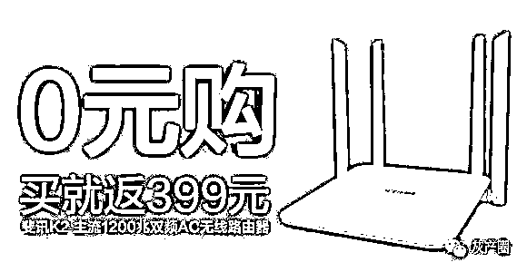
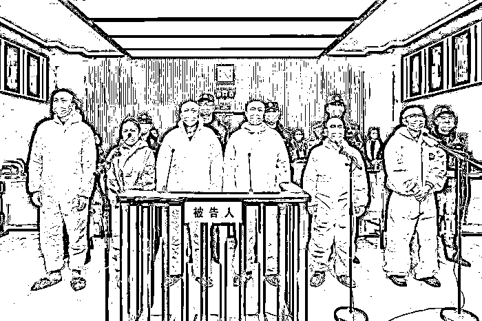

# 斐讯“0 元购”骗局致 110 万人损失 120 多亿！实控人被判无期！

> 原文：[`mp.weixin.qq.com/s?__biz=MzIyMDYwMTk0Mw==&mid=2247525492&idx=7&sn=73862376bb411acb9877ef11206d7411&chksm=97cbaf4ca0bc265a10e1850560f2ee401cf0c59c2425b8c8960cd7f751c85511bcdc2fccf530&scene=27#wechat_redirect`](http://mp.weixin.qq.com/s?__biz=MzIyMDYwMTk0Mw==&mid=2247525492&idx=7&sn=73862376bb411acb9877ef11206d7411&chksm=97cbaf4ca0bc265a10e1850560f2ee401cf0c59c2425b8c8960cd7f751c85511bcdc2fccf530&scene=27#wechat_redirect)

2021 年 12 月 8 日上午，上海市第一中级人民法院（下称上海一中院）依法公开宣判被告人顾国平、侬锦、陈雨、朱军、王晶晶、张冀敏集资诈骗一案，对顾国平以集资诈骗罪判处无期徒刑，剥夺政治权利终身，并处没收个人全部财产；对侬锦、陈雨、朱军、王晶晶、张冀敏以集资诈骗罪分别判处有期徒刑十五年至十年不等的刑罚，并处没收个人财产人民币（以下币种相同）五百万元至六十万元。

图片来源：上海一中院

上海一中院经审理查明：2015 年 1 月，被告人顾国平实际控制上海联璧电子科技（集团）有限公司（以下简称联璧公司）。同年 7 月，顾国平要求被告人侬锦在联璧公司组建金融团队、开发联璧金融 APP 线上平台等进行非法集资。

之后，为扩大联璧金融 APP 客户数量，顾国平利用其实际经营的上海斐讯数据通信技术有限公司（以下简称上海斐讯公司）与联璧公司推出购买上海斐讯公司路由器等电子产品并在线注册联璧金融 APP 会员，可获联璧公司全额返还购买款的“0 元购”营销活动，吸引社会公众注册，并在联璧金融 APP 线上平台发布以顾国平实际控制的空壳公司的虚假资产包、定向委托投资项目为标的的各类理财产品，以高额利息回报及承诺保本付息为诱饵，诱骗社会公众投资购买。

被告人侬锦、陈雨、朱军、王晶晶、张冀敏分别参与了公司管理、产品设计、资金调配、系统维护等行为。至案发，共造成 90.86 万余名被害人实际经济损失 99.71 亿余元。

2017 年 9 月起，被告人顾国平擅自以上海斐讯公司的名义，与顾国平实际控制的华夏万家（北京）金融服务外包有限公司合作推出购买上海斐讯公司体脂秤等产品，并在线注册华夏万家金服 APP 可获全额返还购买款的“0 元购”营销活动。

同期，顾国平等人采用前述类似手段诱骗社会公众在华夏万家金服 APP 上购买理财产品，非法募集资金，并指使被告人朱军套取、占用。至案发，共造成 19.42 万余名被害人实际经济损失 26.02 亿余元。

上海一中院认为，被告人顾国平、侬锦、陈雨、朱军、王晶晶、张冀敏以非法占有为目的，共同使用诈骗方法非法集资，数额巨大，其行为均已构成集资诈骗罪。上述被告人的集资诈骗行为给被害人造成特别重大的经济损失，严重破坏国家金融秩序，结合本案事实、性质、情节和社会危害程度，依法作出上述判决。

据了解，“联壁金融”是最高检会同公安部挂牌督办的 36 起重大案件之一。

今年 3 月 8 日，第十三届全国人民代表大会第四次会议举行全体会议，最高人民检察院检察长张军作最高检工作报告，这份工作报告点名的重点案例涉及非法集资类有三个，分别为“联璧金融”、“通金所”、“卓达系”。

上海一中院表示，上海市司法机关将继续加强对涉案资产的追赃挽损工作。

来源：界面新闻

← 向右滑动与灰产圈互动交流 →

