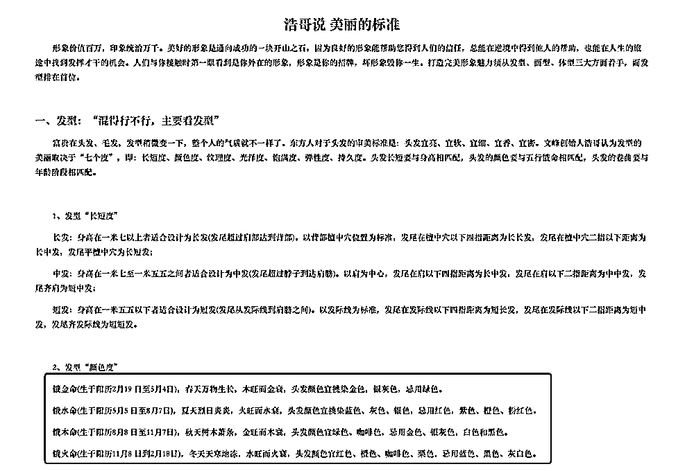
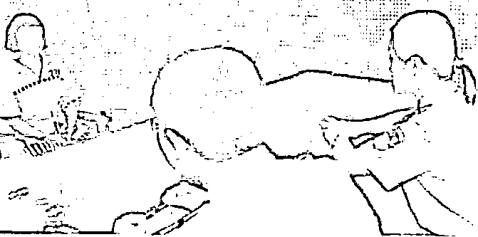

# 起底文峰：洗头变洗脑

> 原文：[`mp.weixin.qq.com/s?__biz=MzIyMDYwMTk0Mw==&mid=2247525492&idx=8&sn=649ac8b83c62f4177cdea15e85f4c6a3&chksm=97cbaf4ca0bc265a6c47da411f32943303a61c4d003c13d0e856df16dda954188468ec8cc9a0&scene=27#wechat_redirect`](http://mp.weixin.qq.com/s?__biz=MzIyMDYwMTk0Mw==&mid=2247525492&idx=8&sn=649ac8b83c62f4177cdea15e85f4c6a3&chksm=97cbaf4ca0bc265a6c47da411f32943303a61c4d003c13d0e856df16dda954188468ec8cc9a0&scene=27#wechat_redirect)

12 月 6 日傍晚，位于上海市普陀区的世界美容师大厦里，还有几盏灯亮着。

这里是上海文峰美发美容有限公司（以下称上海文峰集团）的总部。经历了 12 月 5 日董事长“开天眼”舆论风波后，这里的进出检查更为严格。

雕梁画柱的门楼搭配高层办公楼，建筑风格显得与周围建筑格格不入。在这处“混搭”风建筑中，上海文峰集团董事长陈浩，正在搭建他的商业帝国。

12 月 6 日，位于上海市普陀区的世界美容师大厦，系上海文峰集团总部。本文图片 上游新闻

上海文峰集团官方自称是集美发、美容、科研、生产、教学、服务、推广为一体的集团化企业，在全国已有 400 多家门店。上游新闻记者梳理和采访发现，董事长陈浩从小懂命理，靠看手相、面相起家的发家史早已成为该集团人尽皆知的“励志”故事。因此，该集团信奉的“销售话术”，也均以风水和命理有关。

 熟悉上海文峰集团的多名知情人士称，在文峰集团内部，陈浩被塑造成“神”一样的存在。但实际上，其被指虚假宣传、“套路”营销等违规行为早已在业内传开。近年来，因销售高额预售卡产生的纠纷，也引起业内人士的猜测：靠“风水”盈利的上海文峰集团在为踏足金融圈做资金池积累。

12 月 6 日，上游新闻记者在门卫处被告知不得进入后，拨打了上海文峰集团对外公开电话，表明采访意图后，对方挂断电话。此后多次拨打，均无人接听。

上海文峰集团董事长陈浩曾在内部会议称，面对媒体曝光要心态好、有格局。

● 陈浩其人

从小爱美 书包里总藏着一把小圆镜

在上海文峰集团，董事长陈浩就是“神”。曾在上海文峰集团工作过的员工称，陈浩的话，就是上海文峰集团的“指示”。其集团公众号“今日文峰”，就是“面向文峰内部员工，用于浩哥思想、浩哥政令、文峰资讯”的发布平台。

陈浩的发家史，成为造“神”第一步。据上海文峰集团官网及“今日文峰”描述，出生于 1961 年的陈浩是湖南省常德市人，自称年幼家贫，儿时以放牛为生，还要照顾几个弟弟妹妹，从小就担负着家庭的责任。读书的时候一直当班长，当学校学生会会长。

陈浩称，他从小爱美，才两三岁的时候，洗澡之前都要跟她妈妈谈条件，洗完澡必须穿新衣服，结果妈妈帮他洗完澡后拿出来的是旧衣服，心里就非常不开心。小时候，他常常偷偷拿着妈妈那把只剩三根齿的梳子，把头发梳得光光的。在他的书包里，总是藏着一把摔碎了的小圆镜，上课前都要拿出来照一照，看一看脸上有没有不干净。这样的经历，被描述为“成功人身上与生俱来的天赋”。

高中毕业后，陈浩开始学习摄影，并承揽了当地学校拍升学照和学生证照片的业务。拿下全乡身份证拍摄的权利后，陈浩开始拓展业务，收获了第一桶金。

 上游新闻记者注意到，在多篇关于陈浩创业的文章中，陈浩的成功被认定为“命中注定”。

“今日文峰”发布的一篇《浩哥创业故事：命中注定，与美同行》中提到：“浩哥属牛，性格天生勤奋执着，而且是腊月十二月初四的牛人，命中注定一辈子不但不干重体力活，而且受人供养。浩哥落地的时辰是早上五点，此时紫气东来，漫天飘雪，大地银装素裹，父母给取名为陈章雪，小名‘雪儿’。古话说：居家风水住得好，子女吃喝不用愁；祖坟葬得好，儿孙一生富贵到老。浩哥小时候的家，前有灶后有靠，左青龙，右白虎。浩哥家的祖坟就是处于当地龙头，而且高高在上。因此，无论是生肖、落地的时辰，还是居家和墓葬风水都很好，种种因素加起来，就为浩哥后面的成功打好了基础。”

上海文峰集团门店均以陈浩头像作为显著标志。

在官网的创始人思想中，陈浩自称，从小就研究美，从小就研究生命学，只要看到丑的人、有病的人，总是要主动上去跟他讲一讲。陈浩说，他身上有着一种与生俱来的天赋，对美丽健康长寿的灵感智慧远超常人，对宇宙之间的阳气、阴气的判断异常精准。这种超能量来自于对人与自然规律每天用心的观察、用心的判断、用心的思考，用心的总结。其博览天下关于美丽、健康、长寿、阴阳、中医中药之书，游走各名山大川，结识许多在这些方面研究精深的高人。而在照相时，还要给人看看手相和面相。

 这样的描述，在上海文峰集团官网和“今日文峰”公众号中屡见不鲜。

 在上海文峰集团公开发布的文章中，无一例外地都会加入对陈浩的赞美和鼓吹辞藻。今年 12 月 5 日，上海文峰集团陈浩的秘书白寅称赞陈浩“开天眼”后，此类文章被相继删除。“今日文峰”公众号也仅保留了今年 7 月之前的文章，但仍能找到将陈浩奉为“神人”的描述。

 上海文峰的前员工称，从入职培训到后期营销，“陈浩至上”，已成为上海文峰集团的企业文化。

《浩哥说美丽标准》的内容，成为上海文峰门店奉行的话术之一。

● 营销话术

发色配五行 来个洗剪吹就能“逆天改命”

1996 年，陈浩来到上海，踏入美发行业，并将自己的头像作为“商标”制成门头。
上海文峰集团官网称，1996 年至今，上海文峰集团已在上海、北京、长沙、武汉、南昌、厦门、成都、重庆、西安、昆明、郑州、太原、济南、青岛、天津、南京、苏州、宁波等城市，投资门店 400 多家。

 12 月 6 日，上海市多名市民向上游新闻记者表示，尽管门店多，但去消费的多以老年人为主。“推销的套路很多，剪头发都能被美发师说成改命，以此推销产品。虽然其它品牌店也推荐办卡，但没有文峰这样不靠谱的。”市民王先生说。
来个“洗剪吹”，就能逆天改命?

 这样的销售话术，来源于上海文峰集团公布的《浩哥说美丽标准》。陈浩称，“富贵在头发、毛发，头发长短要与身高相匹配，头发的颜色要与五行相匹配，头发的卷曲要与年龄阶段相匹配。如饿水命(生于阳历 5 月 5 日至 8 月 7 日)，夏天烈日炎炎，火旺而水衰，头发颜色宜挑染蓝色、灰色、银色，忌用红色，紫色、橙色、粉红色。”

此外，在陈浩看来，人的脸型、体型也与命运息息相关。

记者注意到，关于上海文峰集团的公开报道中，多家文峰美发门店诱导消费者大额充值的“话术”中，“改命”是其中一种。

今年 7 月有媒体报道称，上海一位 7 旬老人，2016 年到 2019 年 3 年间，在上海长寿路文峰理发店充值 235 万元，其中仅 2019 年一笔消费，就高达 28 万元。

一家理发店为何能诱导老人不断充值？

2021 年 6 月 10 日，上海文峰集团官网上一篇《学习美容总管，用浩哥思想和浩哥功夫突破百∆（∆系企业内部考核指标）业绩大关！》的文章，自我揭开了其中的销售套路。

这名美容总管姓刘，在合肥一家文峰门店工作。刘总管表示，某天，门店顾客不多，她看到一位顾客坐在二楼美容间沙发上，主动上前打招呼。她问顾客，是不是要做养生？顾客回答：是。她立马安排美容师做准备工作，自己带顾客进房间。

刘总管称，这名顾客约五十岁左右，年龄比陈浩要小很多，但肤色比较暗淡，面部气色非常憔悴。于是，她把顾客带到美容间陈浩的图像面前对向顾客称，陈浩每周都由自己的学生给他做养生护理。当天她为顾客做了一次背部理疗，成交了一个和腰部套盒菜单，5∆/2 个套盒。当这位顾客第二次来店的时候，刘总管和其他员工一起铺垫，由区域总管给顾客做六合还阳术护理，介绍称，一张好面孔，一生好运道；五官连五脏，五脏连百脉。并且结合陈浩说身体，帮顾客做了六合还阳术护理。最后在区域总管和美容总管的共同商议下，顾客点了 10∆/2 套六合还阳术护理，20∆/2 套十四经络养生打包的菜单。

上海文峰集团前员工称，根据内部计算规则，该顾客两次进店消费金额在 4 万元左右，推销的均为上海文峰集团自己研发的产品套盒，但功效和手法效果仅是暂时的，并没有太大作用。

刘姓总管的上述销售经验，曾被陈浩作为学习榜样在上海文峰集团内宣传。该刘姓总管还称，“顾客当时就感觉神清气爽，而且心明眼亮，之前黄黑的皮肤变得亮丽了很多，觉得效果非常好。”

上游新闻记者在多个团购和美妆网站上看到，上海文峰集团旗下的美容美发店，评分仅在 3 分左右（总分 5 分）。上海一家门店的 56 个评价中就有 38 个低分评价，主要涉及推销、夸大宣传、技术差等问题。

工商登记信息显示，上海文峰集团已涉及美发、美容、科研、生产、教学、服务、推广等多个产业。

● 商业版图

多个产业被指无资质 曾把顾客按摩至脑干出血

25 年的经营，陈浩在上海文峰集团，打造出了自己的商业版图。

工商登记信息显示，陈浩任职企业达 128 家，包括美容美发、网络科技、健康咨询、中医药开发、企业管理、化妆品研发、生物制药等多个领域。

依托上述企业，上海文峰集团的门店，逐渐形成了自产自销的“销售闭环”。从居家和院用，从头发、脸部到身体，门店员工需要对照脾胃套盒、肾水套盒、肝胆套盒等 10 余种文峰产品给顾客定制套盒，十次为一个护理周期。

近年来，因美容、美发产品虚假宣传、在广告中涉及疾病治疗功能，以及使用医疗用语或者易使推销的商品与药品、医疗器械相混淆的用语等行为，已相继被执法部门行政处罚近 90 万元。仅 2020 年 3 月 16 日，就因发布虚假广告，被上海市杨浦区市场监督管理局处罚 50 万元。

相关部门工作人员透露，上海文峰集团多家店铺，还存在无资质从事医学诊疗类服务行为，多次被举报处罚。

公开报道称，2009 年，上海市一名壮年男子在文峰美容洗澡按摩时死亡。

2009 年，湖南长沙文峰美发美容店，曾让顾客误喝了 84 消毒液。

2017 年 12 月，浙江嘉兴市上海文峰美容美发店，42 岁男子吴某给妻子留下一句“舌头麻，腿伸不直了，快打 120”后，就陷入昏迷状态。吴某被送入医院重症监护室后，诊断为脑干大出血。

公安、卫生等部门调查发现，当事人吴某事发当晚在涉事美容美发店分别接受由两名女性服务员实施的“肩颈推拿按摩”和“微针针刺”项目。其中“微针针刺”属于诊疗行为，必须在取得《医疗机构执业许可证》的医疗机构进行，操作人员也必须为取得《医师执业证书》的卫技人员。但这两名女服务员并不具备从医资格。

除不具备医疗资质为顾客提供诊疗服务外，上海文峰集团各地的预售卡服务，也屡次被曝光起诉。2016 年到 2021 年，仅上海文峰集团相关诉讼就达 40 余起，涉案金额上百万元。

上游新闻记者注意到，在诸多法律诉讼和投诉中有消费者称，被诱导消费后，他们曾多次与该公司沟通要求退款，但一直无结果。此外，因不执行判决，上海文峰集团还先后被上海市黄浦区法院、虹口区法院、青浦区法院列为被执行人。

上游新闻记者注意到，对于媒体的多次曝光和消费者提起的多起诉讼，上海文峰集团均未作出过官方回应。

今年 11 月底，对于媒体的曝光，陈浩曾在内部会议上称：“我们心态好，有格局，不抱怨猜疑、生气撒野，所以我们会做得更好，更完美，会经得起消费者考验，会经得起相关部门检查，因为有浩哥思想扎根在门店里。”

上述文峰集团前员工称，在文峰集团工作，每一次会议都像是被洗脑，所以门店销售也多采用洗脑套路，门店销售业绩不好，店员会把责任归结为自身原因，从不怀疑其经营策略，这就是“洗脑”的效果。

2020 年 3 月 16 日，因发布虚假广告，上海文峰被罚款 50 万元。

● 背后危机

涉嫌虚假宣传强制消费 顾客投诉量居高不下

投诉率居高不下，门店却消极应对。上海文峰集团在屡次被投诉、处罚后，在今年 6 月，还被上海市消保委第一次约谈。

上海市消保委表示，今年上半年，上海市消费者权益保护委员会共受理文峰美发美容相关投诉 201 件（截至 6 月 3 日），较去年同期增长 1.2 倍。
消费者投诉反映的突出问题有：一是诱导大额消费且拒不退款；二是售后服务拖延推诿；三是以“加盟店”为由，怠于承担企业责任。为此，上海市消保委会同市单用途预付卡协会和市美发美容行业协会，于 6 月 4 日约谈了上海文峰美发美容有限公司。

上海文峰美发美容门店多为“加盟”模式。上海市消保委要求上海文峰公司，在门店内显著标明特许人和被特许人的真实名称和标记，切实保障消费者的知情权；严格依照国家规定限额发卡，即单张记名卡限额不得超过 5000 元，单张不记名卡限额不得超过 1000 元，并依法依规落实发卡备案，与上海市单用途卡协同监管服务平台实现信息对接；依法诚信经营、采取切实措施，杜绝诱导消费者，特别是老年消费者大额充值消费情况的发生；建立健全售后服务机制，依法妥善解决消费者投诉。

6 月 4 日，上海文峰集团向上海市消保委递交整改书，并表示已成立专项客服小组。

5 个月后的 11 月 3 日，针对大额消费拒不退款、售后服务缺位、价格不透明、虚假宣传、强制消费等问题，上海市消保委再次约谈上海文峰公司。上海市消保委发布数据显示，6 月 4 日至 11 月 3 日，全市消保委共受理文峰美发美容相关投诉 193 件，投诉量仍居高不下。

11 月 17 日，上海市消保委再次针对上海文峰发布商业模式或暗藏重大风险的提示。不到半年针对同一企业连发 3 个文件，此举在上海企业界并不多见。

 在相关提示中，上海文峰集团主要存在以“产品+服务”的套餐预售规避预付卡监管，以套路营销行为逃避政府部门相关监管，以类医疗养生伪闭环，骗取消费者信任等问题。

上海市消保委称，根据消费者反映，上海文峰集团在美容美发业务中通过层层深入的诱导手法，如从头皮屑多到“头部发痒症状改善”再到“全身气血养护”，多是由店员向消费者口头推销。同时，在购买“产品+服务”的套餐以后，按照店方要求产品放在门店，消费者无法深入了解产品功效合规性。店员的口头推销和非公开售卖产品的做法，既造成消费者维权困难，又逃避了政府部门的日常监管。

另外，上海文峰从门店推销，到售卖自述有养生功能的产品服务套餐，再到“文峰医院”（实为上海美妍康医疗美容门诊部有限公司）形成了伪闭环，让众多消费者特别是老年消费者对其各种“调理方案”和“效果保证”深信不疑。而文峰通过层层导流使众多老年消费者深陷其中。

面对多起法律诉讼、消保委约谈，面对法律和行政监督，上海文峰集团为何屡教不改？接近上海文峰集团的知情人士称，大额销售预收卡的目的，无疑是在扩充资金池。目前，上海文峰集团已涉及投资管理，或许后期将涉足金融，为从事相关金融业务做功课。

曾因偷税近 800 万 24 岁老板娘被刑拘

近日，上海文峰美发美容公司（以下简称：上海文峰）总裁秘书发文猛夸老板陈浩，称其有天眼、掌握万物规律的文章冲上热搜。

对于上海文峰来说，这不是它第一次“火”上新闻。

2003 年，时任公司财务负责人的陈浩之妻许娇春因偷税近 800 万元，被警方刑事拘留。

12 月 6 日，上游新闻记者拨通了上海文峰注册登记时的电话，接电话的女士以“打错了”为由迅速挂掉电话。

18 年前偷税近 800 万

《检察风云》期刊杂志 2003 年曾以《流光溢彩的税耗子》为题发表了一篇文章，文中提到，1997 年 12 月，上海文峰在上海开业。来自湖南的陈浩，从一家名不见经传的小美容店做起，逐渐名声鹊起。2003 年上海文峰巨额偷税案由上海市公安局经侦总队侦破，为国家挽回税款损失近 800 万元。

 许娇春 1997 年 10 月就进入文峰美发美容公司工作，2000 年 1 月至案发任文峰美发美容公司副总经理、财务负责人，专职负责公司的财务工作。2003 年，因涉嫌偷税犯罪，许娇春和公司另外 3 名骨干被警方刑事拘留，当年许娇春 24 岁。

警方审讯徐娇春（报道截图）

文中提到，根据警方调查，上海文峰属下的美容美发学校全称是“上海浦东文峰职业技能培训学校”，2002 年 1 月至 8 月间，该校在未办理税务登记的情况下，取得 358 万余元招生收入，同年 9 月，被税务机关查获，补税 15 万元。随后，该校虽办理了税务登记，在缴纳税款上，设置了两套税簿，一套记载真实开支，一套隐匿收入。麾下的美发美容公司是文峰的主业。为了少缴税款，偷逃国家税款 297.8 万元。文峰麾下还有制药公司。文峰美发美容和文峰制药是关联企业，两家之间的销售行为应当属于应纳税行为。但 2002 年 8 月至 2003 年 3 月，他们通过隐匿出库单、编制两套库存商品明细账的手法，偷逃税额 227.2 万元。

18 年后引网友质疑

2003 年《新民周刊》曾报道，在许娇春被拘押 4 天后，陈浩将其个人不动产向银行抵押贷款 800 万元。陈浩对媒体说，这是他第一次向银行贷款，“我不是骗子！我犯的只是许多民营企业在从小到大的过程中都会犯的错误！”

2021 年 12 月，一篇名为《秘书眼中的上海文峰美容美发集团总裁陈浩》的文章，让这名企业家火遍全国。

陈浩在公司内的种种个人崇拜行为引发了巨大争议

《新民周刊》报道中称，陈浩在自己的企业里办起了 “报纸”“杂志”“广播电台”，用以“报道”他的行踪和他在各种场合的讲话。其官网还能听到上海文峰美容美发集团 3 首企业歌曲《颂浩哥》《文峰校歌》《歌唱我们的文峰》，在“今日文峰”公众号里，更是充满“歌颂文峰，敬仰浩哥”的言论。

对于上海文峰的质疑，网上还在不断发酵，有网友评论称：“绝对大骗子”。你认为呢？

● 走访重庆文峰门店

经理主管、洗头小妹轮番推荐办卡

洗头变洗脑

上海文峰公司总裁秘书在公司官号发文狂赞老板陈浩（“浩哥”），夸老板有天眼，掌握万物之规律，是首屈一指的三百六十行状元大满贯。而该公司因为消费者投诉较多，上海消保委已两次约谈上海文峰公司，并向社会警示，该公司商业模式或暗藏重大风险。

 6 日，上游新闻记者走访了上海文峰位于重庆中心城区的两家门店，发现“浩哥”无所不在，而且，屡次暗示、明示办会员卡。

文峰位于金龙路的一家门店

**洗头区、剪头区“浩哥”形象无所不在**

6 日中午，上游新闻记者来到上海文峰位于渝北区金龙路的一家门店，门店入口处的装饰广告牌上，印着陈浩的头像，旁边醒目地写着：“美丽、健康、长寿”，以及“陈浩亲自主管上海文峰全国连锁经营管理”等字样。江北区洋河东路一家门店也有这样的字样。

江北区洋河东路的一家文峰门店

走进金龙路这家门店，记者看到，中午时分，店里顾客并不多，除了两位等待的顾客，还有一位顾客正在理发。理发顾客面前，电子显示屏上播放着陈浩的会议讲话视频。江北区洋河东路的门店也播放着同样的视频。

两家门店的工作人员见记者来到，都上前进行了询问。其中，金龙路门店工作人员表示，现在洗剪吹+按摩为 60 元，中药汉方洗头 50 分钟 198 元，舒缓 SPA60 分钟 198 元，当然，这只是非会员价，如果办理了会员，还会有折扣优惠，最大折扣可以 3.8 折。

江北区洋河东路门店表示，现在有优惠，洗剪吹+按摩为 40 元，办卡还能享受更多优惠。

在金龙路门店，记者环顾店里发现，除了洗剪吹头发和按摩，店里还提供纹眉、头皮培植、头皮调理等服务，店里右侧过道，还摆放着宣传广告，是关于“浩哥说眉眼唇”的，写着“快乐看眉型，幸福看唇形”等字样。

在洗头的区域，记者同样看到关于“浩哥”的图片和文字，还有关于养生理疗的一些宣传语。在精剪室，同样有关于“浩哥”对产品的详细介绍。

接待记者时，一位女性工作人员也反复提到了“浩哥”，她表示：“浩哥现在身价都是多少亿。”虽然总部在上海，但他们也会去到上海学习培训。

工作人员正在理发 镜子旁的显示器播放着“浩哥”相关视频

**中药洗头 198 元一次 店员：千值万值**

记者以洗头为由，进行了体验。

本想着体验洗剪吹+按摩为 60 元的产品，但在洗头时，女性工作人员表示，如果存在头皮痒、头屑多，还有轻微脱发现象的话，可以尝试中药汉方洗头 50 分钟 198 元的套餐，并多次表示“很有效”，还有“四星洗 380 元、五星洗 580 元”等，这些都是针对头皮抗衰的。为了打消记者顾虑，工作人员还提到：“平时洗一次都是 280 元，198 元都是体验价了，你说我们给没给你优惠，现在是千值万值！”

记者拗不过轮番轰炸，选择了 198 元的体验套餐。体验下来发现，中药汉方洗头，先会有一个药包放入水池，再加入温水，药包味道闻上去有艾草等药物味道。之后，工作人员用浸入药包的温水反复浇灌头皮，也会对头皮、颈部进行按摩。体验过程中，工作人员反复表示，中药汉方，包含艾草、何首乌等药物，最好是做疗程，建议一个礼拜一次。

“如果只是洗剪吹头发，那就只能办单项卡，最好办综合卡，综合卡最便宜也要充值 5000 元，可以打 3.8 折，如果不办综合卡，也可以按照次数来办次卡，有 10 次、20 次的，现在可以办 20 次的，算下来 3800 多元。”该工作人员表示。

当记者询问，价格能不能少时，工作人员有所松口，并试探：“你能少多少？可以给店长进行申请。”

洗头结束，工作人员让店内一位陈姓（音）男性店长过来，为记者查看头皮情况。该店长查看后表示，头皮有轻微的细菌感染，需要专门护理，为此，他们有单次的也有疗程类的，一般的疗程是几千块钱。当记者询问会不会有效果。对方表示：“问题多余，肯定是有效的，反正我们帮你弄好。”

“浩哥说”字样在店内多处能看到

**不识“黄芪”谈药效**

为此，这位陈姓店长还展示了多个用疗程之后成功的案例，并反复问记者：要不要做疗程。店长科普：“头皮保养需要 4 个步骤，清调补养，头皮清洁是第 1 步……”说到这里，这位店长又指了指墙上的“浩哥说”，“你自己看，头发出现脱落现象，文峰通过洗透、按透……7 个步骤，并结合三星清爽去油套装、四星头油养护套装等，你的情况要用到两种，一个三星清爽去油套装一个四星养发套装，算下来一套 3000 多，洗 4 次。”

对于女性工作人员之前宣称的洗 20 次 3800 元，陈姓店长表示，这是在做活动，很划算的。平时单独洗一次就是 745 元，“而且只是洗是不够的，还要配上巩固产品。”

看到记者迟迟不肯充值办理会员，陈姓店长开始了劝说，还声称：“我平时给顾客吹一次头发收费都是 188 元，给顾客剪头发是 288 元，染头发是 2280 元，烫头发是 2880 元。”

在给记者解释中药汉方的时候，该店长说，药方包括何首乌、黄 zhi 还是黄 qi（指黄芪），反正 20 多味中药，不然为什么这么贵。

对于洗 20 次 3800 元的价格，该店长表示已经是特价，活动马上就要结束了。过了一会儿，又改口道：“如果觉得贵了，可以整一个 1980 元洗 10 次，现在不办下次来就没有了，好不划算嘛！”之后，又做出让步：“这样，这一次算送你了，如果办 20 次的，就送你两次。”

听说记者要根据效果再决定是否办理会员卡，该店长有些沮丧，等来到前台，另一位自称美容主管的女性向记者表示，198 元是特惠，现在可以充个会员卡，按照会员卡打折，就 100 元 1 次，充值之后，这次体验还可以免费送，相当于 1000 元 11 次，不过要 2000 元起充，可以充三五千。

见记者仍无办卡意愿，这位美容主管也沉默了下来，放下了热情，让记者结账了之。

来源：澎湃新闻，上游新闻

← 向右滑动与灰产圈互动交流 →

