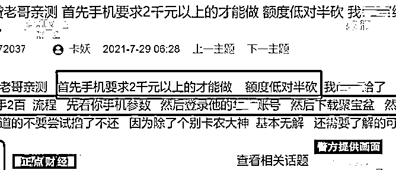
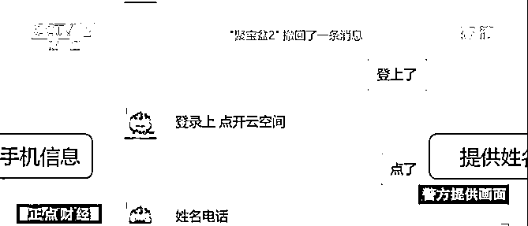
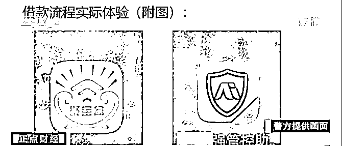
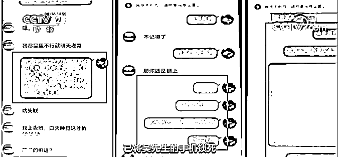
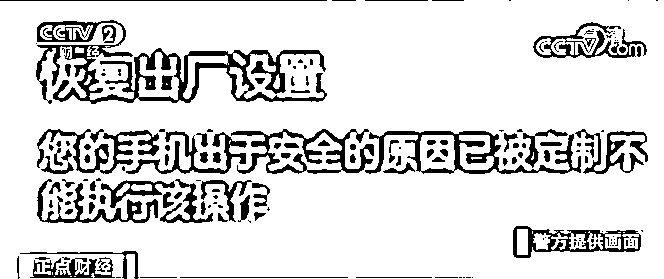

# 远程锁死手机？新型非法放贷更缺德了

> 原文：[`mp.weixin.qq.com/s?__biz=MzIyMDYwMTk0Mw==&mid=2247525611&idx=5&sn=a47d35e059c9382b2446422c35893dca&chksm=97cbafd3a0bc26c500cc92b01866a00e7472625caf42b9695bb23b85c1b6d41e6ea04fb8f76c&scene=27#wechat_redirect`](http://mp.weixin.qq.com/s?__biz=MzIyMDYwMTk0Mw==&mid=2247525611&idx=5&sn=a47d35e059c9382b2446422c35893dca&chksm=97cbafd3a0bc26c500cc92b01866a00e7472625caf42b9695bb23b85c1b6d41e6ea04fb8f76c&scene=27#wechat_redirect)

***“无需抵押”*** 

***“免查征信”***

***“快速放款”*** 

只需安装特定手机软件，

就能获得贷款？

近日，

上海警方破获一种新型网络非法放贷案，

在全国多地先后抓获犯罪嫌疑人 13 名，

涉案金额逾 50 万元。

[`mp.weixin.qq.com/mp/readtemplate?t=pages/video_player_tmpl&action=mpvideo&auto=0&vid=wxv_2171363136862289927`](https://mp.weixin.qq.com/mp/readtemplate?t=pages/video_player_tmpl&action=mpvideo&auto=0&vid=wxv_2171363136862289927)

今年 8 月， 

在网上冲浪的吴先生

看到了一则小额贷款广告，

广告上友善的放贷条件，

令他心动不已。

吴先生根据对方要求

提供了自己手机的参数以及登录账号，

并点击客服发来的链接，

下载安装贷款软件。

客服向吴先生确认，

**放款额度根据手机回购价值进行评估，**

**一般为 20%。**

随后吴先生获得了 200 元贷款，

并承诺三天后还款 400 元，

否则每逾期一天，

缴纳 100 元逾期费。

3 天后，

没有按期还款的吴先生

发现自己价值 2000 元的手机

不能正常使用了。

吴先生设法联系了客服。

客服表示因为其未按时还款，

已将吴先生的手机锁死，

随后开始了辱骂、威胁等方式，

进行催促还款。 

吴先生随后向警方求助。

警方综合各方信息，

很快挖掘出一个非法网络放贷团伙。

经查，

该团伙在网上以某品牌手机贷的名义，

利用一款名为“聚宝盆”的所谓贷款软件，

获得被害人手机的远程控制权。

9 月，

警方在江苏、辽宁、

上海、北京等地收网，

分别抓获主犯朱某，

捣毁负责放贷催收

和负责软件开发的两个团伙。

**自今年 7 月起，**

**该案涉案流水金额超过 50 万元，**

**非法获利逾 26 万元，**

**主要犯罪对象为在校学生和低收入人群。**

****

目前，

**主要嫌疑人朱某等 5 人**

**因涉嫌非法经营罪被逮捕，**

**其余 8 名嫌疑人被采取刑事强制措施。**

 **小贴士** 

信用贷款为部分群体实现自我提升、消费和创业等需求提供了资金便利，但一些非正规网贷平台的进入，使得这一市场乱象丛生、备受诟病。与此同时，甚至有个别网贷平台，仍采取骚扰、恐吓等手段催债，严重侵害借款人的正常生活。

**增强风险防范意识和自我保护意识的第一步，就是看清各类不良网贷的套路：**

*   **诱惑借款：**为诱骗借款，很多网贷放贷金额起初只有三五千元，这样短期内利息不会高。但若加上手续费和各类费用，实际贷款利息非常高。

*   **合同埋坑：**借款人签贷款合同前，以为只是还本金，签合同后又被追加利息、手续费等内容。一旦超过还款能力，借款人就会被“合同”把控，不得不拆东墙补西墙。

*   **平账危机：**许多非法网贷“逾期还款”时限按小时甚至分钟计算，债务会翻着倍往上涨。当借贷人还不上钱，就被要求“平账”，即去别的“贷款公司”借款还钱，欠下更高额的债务。

*   **规避监管：**法律不保护高利贷，因此非法网贷从业人员会陪借款人去银行取钱，通过现金转账，留下银行流水凭据。有些网贷会先将借贷全部金额打入银行卡，借款人取出后，却因各种名目得不到全部款项，但还款时仍得全额还款。

    

**熟记防骗提醒，向不良网贷说“不”：**

*   如需贷款，请到银行或正规信贷机构办理，不要轻信陌生来电和短信推销。

*   不要以为所有 95 号码来电及 1069 短信都是正规公司发送，要谨慎甄别。

*   不轻信打着“无抵押”“无担保”“当天放贷”等幌子的网贷服务广告。

*   不随意点击陌生网址链接、扫描不知名二维码、在来源不明网址进行注册，谨慎提交个人信息。

*   所谓的“测试信用额度”等贷款网站广告都是收集个人信息的，切勿向他人提供自身银行卡号、身份证号、手机号及短信验证码。

*   请在正规平台下载贷款软件，未收到贷款前索要保证金、手续费的，都是贷款诈骗，谨防上当受骗。

*   遇到疑问时，应当及时拨打 96110 咨询或向官方客服核实，避免自身财产受到损失。

来源：央视网综合央视财经、人民日报

← 向右滑动与灰产圈互动交流 →

