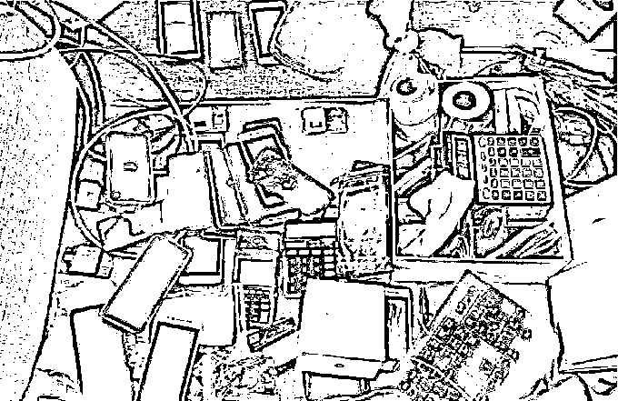

# 一句气话牵出涉 5700 万电信诈骗案！还牵扯了 5 个学生……

> 原文：[`mp.weixin.qq.com/s?__biz=MzIyMDYwMTk0Mw==&mid=2247525611&idx=6&sn=239c4ea8ee03a507125ab7d780fff8cb&chksm=97cbafd3a0bc26c5fa335f1195ee124d2cc35b9cac99372cede4a2f93fe2d7ccc1fec45b2a50&scene=27#wechat_redirect`](http://mp.weixin.qq.com/s?__biz=MzIyMDYwMTk0Mw==&mid=2247525611&idx=6&sn=239c4ea8ee03a507125ab7d780fff8cb&chksm=97cbafd3a0bc26c5fa335f1195ee124d2cc35b9cac99372cede4a2f93fe2d7ccc1fec45b2a50&scene=27#wechat_redirect)

**“这次我就放你一马，** 

**把你的事都抖露出去你就废了。”**

本溪的王某一句气话，

使得自己和姐夫田某出事了。

要说姐夫和小舅子这关系，

真是说不清道不明。

这不，

本溪的王某一句气话，

姐夫田某就出事了。

当然王某也没跑了，

他这个小舅子

本来就是给姐夫洗钱的。

更神奇的是，

黑龙江一所职校的**5 名学生**

也被牵扯进来，

成了盗窃、帮信罪的嫌疑人。

近日，

本溪明山公安分局金山派出所

接连破获两个为电信诈骗

“吸粉引流”“跑分洗钱”的犯罪团伙，

抓获犯罪嫌疑人 24 人，

**涉案金额 5700 万余元。**

**一句气话牵出千万大案**

今年 10 月的一天晚上，本溪金山派出所接到辖区一家饭店报警：两名男子喝多了发生纠纷，在饭店里吵了起来。值班民警迅速赶到现场。

看到民警，两名男子有些紧张。其中年纪大一点的男子田某说自己是另一名男子王某的姐夫，喝多了因为琐事争吵撕扯，都是一家人，不需要民警处理。

王某没有否认田某的说法，可是在离开现场时却醉醺醺地嘀咕了一句：**“这次我就放你一马，把你的事都抖露出去你就废了。”**

正是王某的这句话引起了警方的重视。经过分析比对，**警方发现这个姐夫田某与不久前上级公安机关下派的一条电诈团伙线索中的嫌疑人相似度很高。**而随着对田某侦查摸排的深入，一个名为**“易迅捷网络拓展”**的公司浮出水面了。

**公司没业务 员工天天上班？**

警方侦查发现，这个“易迅捷网络拓展公司”员工不少，每天也正常上下班，**对外却没有任何业务往来，公司账面上也没有任何的流水。**

这是因为啥呢？

**“因为这个公司就是专门给电信诈骗‘吸粉引流’的犯罪团伙！有 17 名员工，主要负责人就是田某。”**

“吸粉引流”，就是在网上与境外电信网络诈骗团伙勾连，**利用招聘网站、电子邮箱、社交软件等平台向受害者发送兼职刷单、投资理财等虚假信息，诱导受害者与诈骗团伙联系，供诈骗团伙实施诈骗。**

警方介绍，易迅捷网络拓展公司的“业务”就是给受害人“打电话”，**员工手握不同剧本，有冒充客服退货的，有谎称参与活动中奖的。**受害者“上钩”后，他们又根据不同的类型将其转交给“下家”，也就是不同的电信诈骗团伙。

警方收网后田某交代，王某的确是他的小舅子，主要负责帮他将非法所得通过“跑分”的方式洗钱。

不久前，田某查账发现有 6 万元对不上，怀疑是小舅子昧下了，趁喝酒时“敲打”王某，没想到小舅子不认账，二人争吵起来引得旁人报警。

**几个学生“黑吃黑”**

团伙全员落网，案件该结束了吧？

**可小舅子王某却不“同意”：抓我我认，可是那 6 万元钱我没拿，我是被人“黑吃黑”了。**

原来，王某是用在网上从“卡农”手里收购的银行卡转账来帮田某洗钱，在从一名叫“老 Q”的人手里买进一批银行卡后，刚转进 6 万元钱就被取走了。王某说随后“老 Q”就把他拉黑了，一定是“老 Q”拿准了他不敢报警“黑吃黑”。

民警据此深挖，通过流水查到王某转进 6 万元钱的银行卡为黑龙江双鸭山人杨某所有，是杨某通过手机银行把 6 万元钱转出，杨某涉嫌洗钱。

当民警赶到双鸭山抓获杨某时，意外发现**杨某竟是当地一所职校的在校学生。**

杨某到案后立即交代，自己曾办了一张银行卡卖给同寝同学李某的哥哥，卖了 100 元钱。不料有一天手机银行却收到了进账 6 万元钱的通知，原来办卡时他顺手绑定了手机银行，后来也没有解绑。

**面对这“从天而降”的 6 万元钱，杨某动了贪念，寝室的其他人也都说这钱一定“来路不正”，拿了也没人报警，于是杨某通过手机银行将钱转给李某，李某取出来后将钱平分给了寝室的人，他们随后将这笔钱挥霍掉了。**

**24 小时奔袭 跨三省四市抓捕**

抓获杨某后，民警通过学校掌握了其寝室同案人员李某、高某、丁某的具体信息，而李某的哥哥“老 Q”张某也是该学校的学生。因学校放假，李某和张某在河北承德、高某在石家庄、丁某在山东威海。

据杨某交代，分钱后几个人也有些害怕，于是约定每天在群中视频见面“报平安”。为了不打草惊蛇，民警在黑龙江原地分为 4 个工作组，一组人将杨某带回本溪，另外 3 组分别奔赴承德、石家庄、威海一同收网。

经过一昼夜长途奔袭，民警分头到达预定位置，同时动手，3 地 4 名嫌疑人同时落网。到案后，几人对各自的犯罪事实供认不讳。“老 Q”交代，卖卡后拉黑王某纯属“职业习惯”，直到被抓，他也不知道钱被杨某取出分掉的事情。

经审讯，**杨某等人因涉嫌盗窃罪、帮助信息网络犯罪活动罪被公安机关依法处理。田某等人因非法利用信息网络罪被另案处理，**经深挖该案还涉及其他犯罪，目前该案件正在进一步侦办中。

来源：辽沈晚报 沈阳网，利箭在行动

← 向右滑动与灰产圈互动交流 →

