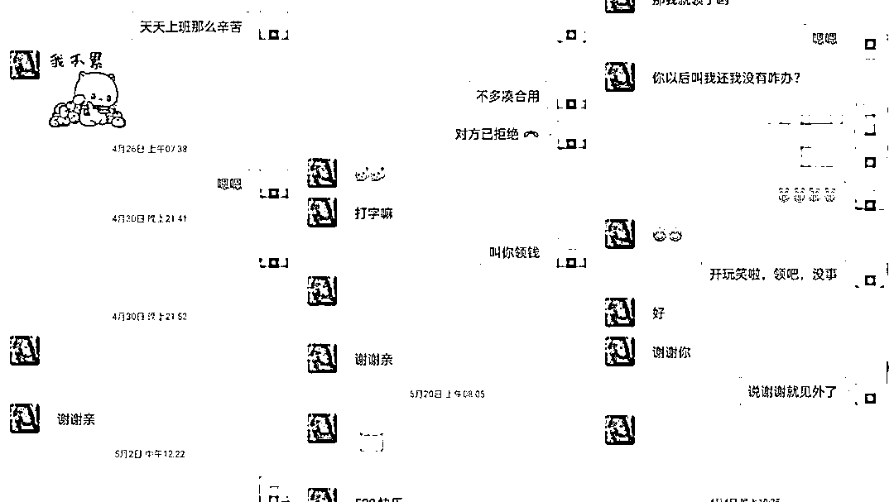
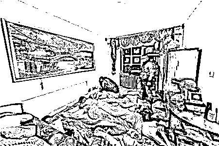
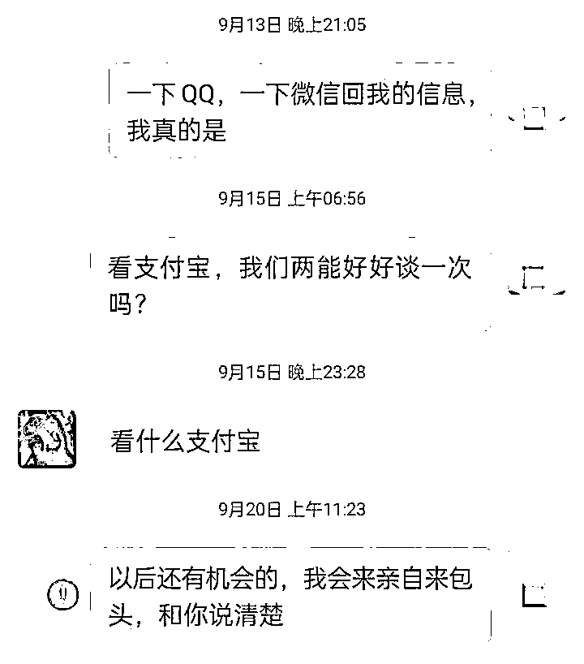
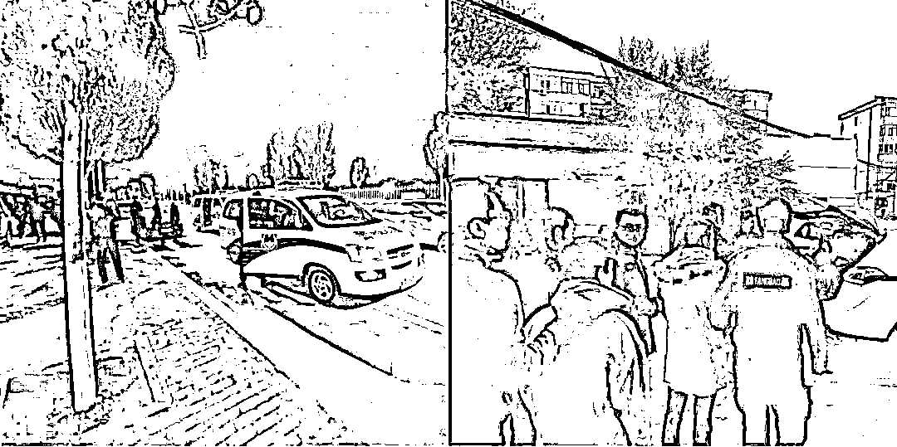

# 史上最牛小哥，竟有 61 个“女朋友”！

> 原文：[`mp.weixin.qq.com/s?__biz=MzIyMDYwMTk0Mw==&mid=2247525611&idx=7&sn=2546aa138082755edc325593e5d7e00b&chksm=97cbafd3a0bc26c5f0812d0731f711c55490b05e11dde242c1fdcfd593b4687ccdae338edbb2&scene=27#wechat_redirect`](http://mp.weixin.qq.com/s?__biz=MzIyMDYwMTk0Mw==&mid=2247525611&idx=7&sn=2546aa138082755edc325593e5d7e00b&chksm=97cbafd3a0bc26c5f0812d0731f711c55490b05e11dde242c1fdcfd593b4687ccdae338edbb2&scene=27#wechat_redirect)

**痴情男子网恋女神**

**表爱给钱毫不吝啬**

**辗转千里为见红颜**

**未料真相扑朔迷离**

“我被她骗了，到现在我都不知道她是不是叫这个名字。我被骗了感情，钱也没了......”                         ——小张在报案时这么说道

[`v.qq.com/iframe/preview.html?width=500&height=375&auto=0&vid=wxv_2138266574951104513`](https://v.qq.com/iframe/preview.html?width=500&height=375&auto=0&vid=wxv_2138266574951104513)

网恋深陷“温柔乡”

2021 年 1 月，小张在网上收到了来自李某的 QQ 申请，一看是个美女，果断结识！网聊一段时间后，李某嘘寒问暖，二人相谈甚欢，李某走入了小张的内心世界，小张也渐渐陷进了李某的“温柔乡”，心中欢喜，终于找到了“意中人”。小张对“女友”节假日的关心、缺钱时的关爱，都体现在了“520、1314”这些特殊的红包之中。 

小张的各种转账截图

千里奔现“却翻车”

李某说自己是四川人，投靠表哥在内蒙古一家公司上班。两人感情持续升温，很快确定了关系。今年 3 月，“女友”邀约小张在内蒙古包头见面一起投靠表哥。小张坐火车赶到包头，却发现事情有些不对劲。

李某很奇怪，和小张的对话前言不搭后语，两个人之间网上的默契到了线下却再难碰撞出火花，小张怀疑自己并不是李某唯一的男友，沮丧低落。李某表哥的公司也很奇怪，“闲人”很多，只会和别人“语音”聊天，根本不像正经营生，公司主管只会画赚大钱的饼，小张觉察不对劲，找到机会赶紧离开了内蒙古。 

在内蒙古和小张一起工作的“同事”

再想相见被拉黑

内蒙古一别，小张放心不下自己的女友，反而担心“女友”是不是上当受骗了，好言相劝“女友”赶紧离开那家公司，不曾想二人却因此大吵一架。说不通归说不通，小张对依然李某情根深种，“女友”爷爷生病住院，手机坏了，小张毫不迟疑转账 8000 多元给“女友”应急。

当小张再次提出想和“女友”见面时，“女友”居然直接将小张拉黑，至此消失在小张的世界里。深陷爱情沼泽的小张痛苦却无处宣泄，直到 9 月下旬，很偶然的一次机会看到手机里网恋诈骗类型的反诈短信提醒，小张才恍然大悟，赶紧到派出所报警求助。

痴情错付“61 人”

如皋警方发现这起交友诈骗并不简单，背后极有可能存在一个以微信、QQ 冒充女性交友实施诈骗的犯罪团伙**。****随着在内蒙古包头市的调查深入，警方摸清了**团伙 6 个窝点的所在地，**于 10 月 23 日凌晨 5 点集中收网，一举捣毁该交友诈骗团伙，抓获团伙成员 61 名，扣押手机 100 余部、银行卡 70 余张。******

小张怎么也没有料到原来自己是在和“61 人”进行团队可复制式恋爱，诈骗团伙中的 61 名成员来自全国各地，他们人手一本“撩汉宝典”，通过打造“美女人设”，利用虚拟网络身份在微信、QQ 等社交软件上以“结婚”、“谈恋爱”为诱饵，吸引单身男子确定关系，以各种理由要钱，事后拉黑。

目前全国各地有 22 名“小张”上当受骗，从 13.14 元到 1314 元，从 5.2 元到 5200 元，涉案金额达 100 余万元。

反诈君想说

隔“网”如隔万重山

前有姑妈“女友”

后有“61 人”团队式恋爱

网恋套路多

最怕真心错付

别轻易拿钱来诉衷肠

来源：南通反诈，阻击诈骗

← 向右滑动与灰产圈互动交流 →

