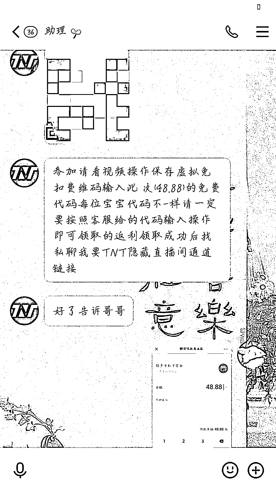
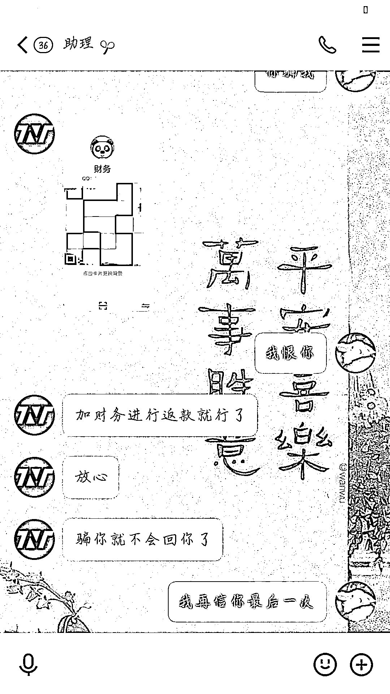
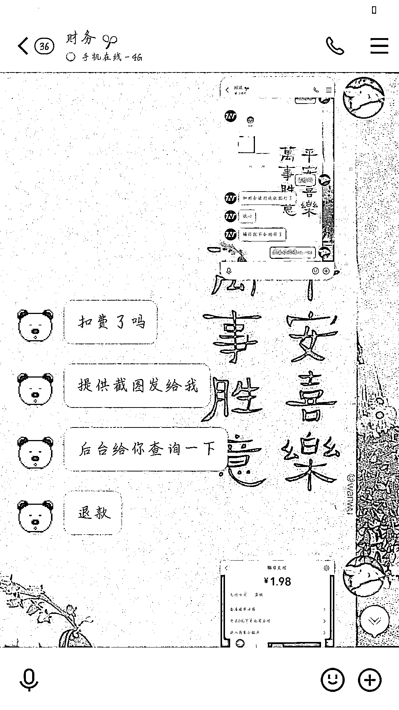
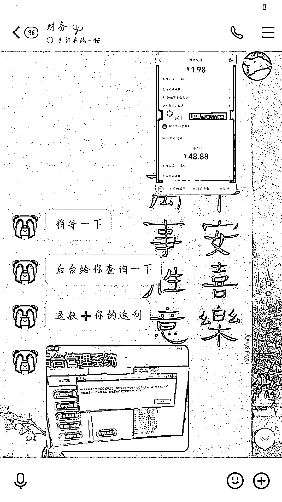
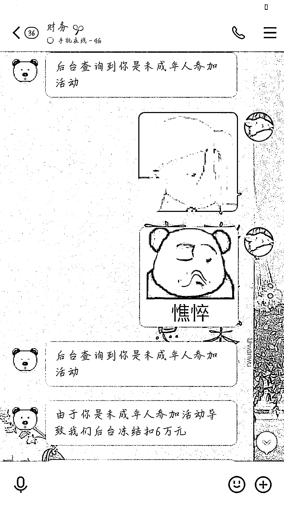
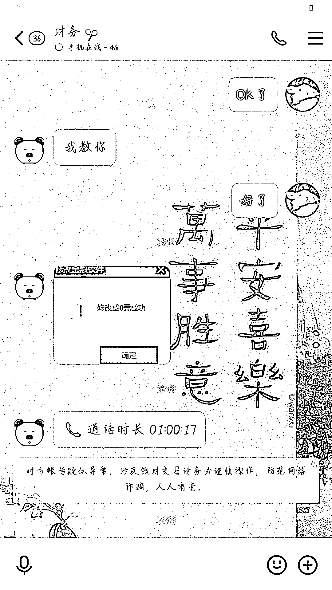
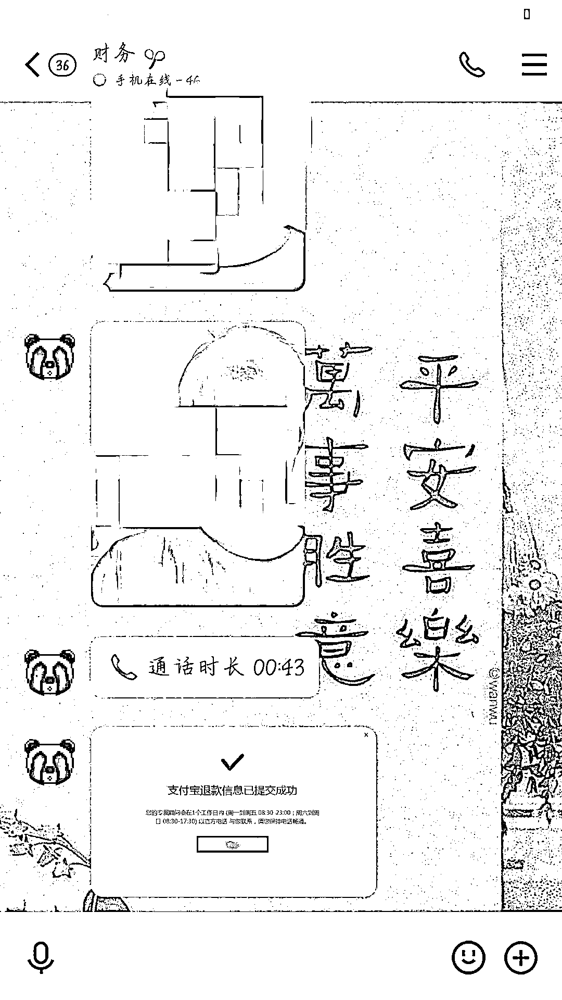
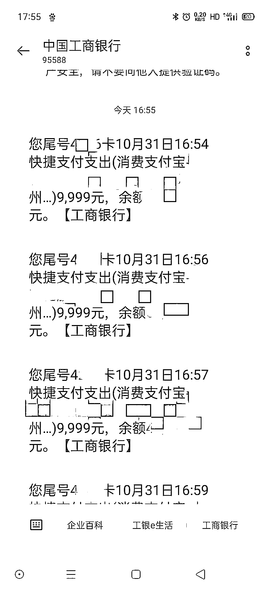
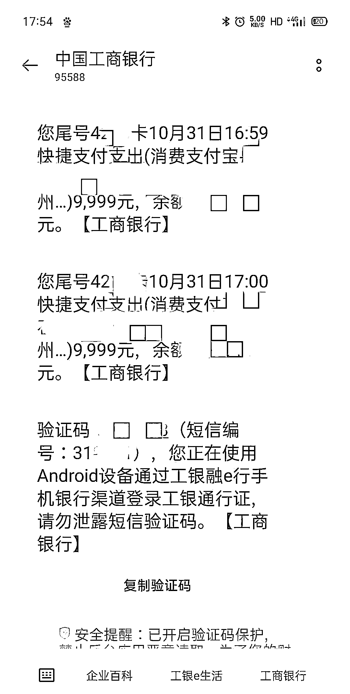

# 截图微信余额即可获得 10 倍返利？初中生走发财“捷径”被骗 5 万余元

> 原文：[`mp.weixin.qq.com/s?__biz=MzIyMDYwMTk0Mw==&mid=2247525611&idx=8&sn=9773fec7db5f0fdbcb4af88cfd192728&chksm=97cbafd3a0bc26c5047ec82781083a5badc95ebae67101be7de198856e17d6c70c95aded95df&scene=27#wechat_redirect`](http://mp.weixin.qq.com/s?__biz=MzIyMDYwMTk0Mw==&mid=2247525611&idx=8&sn=9773fec7db5f0fdbcb4af88cfd192728&chksm=97cbafd3a0bc26c5047ec82781083a5badc95ebae67101be7de198856e17d6c70c95aded95df&scene=27#wechat_redirect)

原以为找到了发财的**“捷径”**

动动手指发发红包，

就可以获得

发出**红包金额 10 倍**的返利。

没想到落入了骗子精心设计的陷阱……

案例分析

11 月初，常州警方接到一起谎称**截图微信余额即可获得 10 倍返利**的诈骗警情。常州一居民戴某（13 岁）在同学**qq 群**中识别二维码加入了这类返利群，后对方称只要把微信余额截图就能获得**余额 10 倍**的奖励。

随后，客服以**未成年人无法享受福利**为由要求戴某**拿家长手机操作**，后对方通过视频聊天让戴某在其母亲手机上操作更改了**微信和支付宝的支付密码**，然后与对方视频聊天扫了其妈妈的**微信及支付宝付款码**。

对方扫完之后让其输了密码，其一共操作了**9 次**，后发现绑定的**工商银行卡、兴业银行卡**共被转了**57376.8 元**，发现被骗。

友情提醒

****红包引你进圈套，坑你钱财才是真！****

骗子往往会在**QQ 群、微信群**内发送**“免费领红包”“红包返利规则”**，然后以虚假的成功领取或返利截图，诱骗受害人参与。

 所谓的**免费领红包、投资返利、红包返利**等活动都是骗局，不要轻易点击或扫描红包群中的**链接、二维码**等。

来源：常州网警、江苏网警，巴蜀反诈

← 向右滑动与灰产圈互动交流 →

