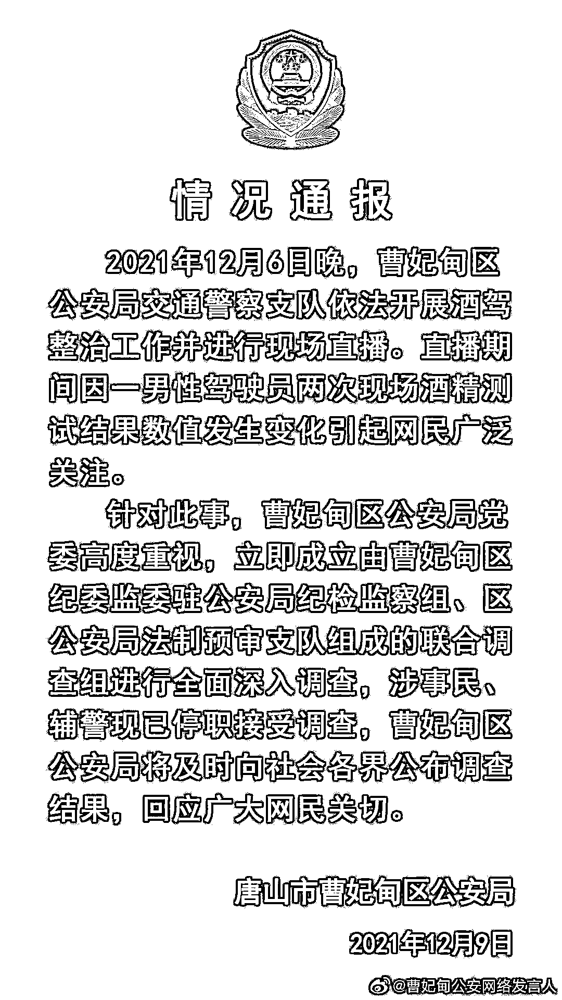
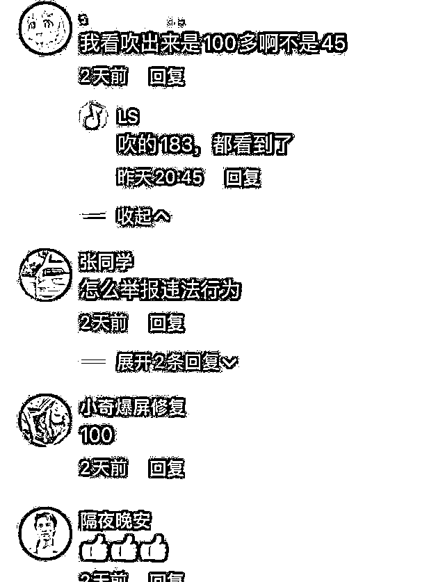
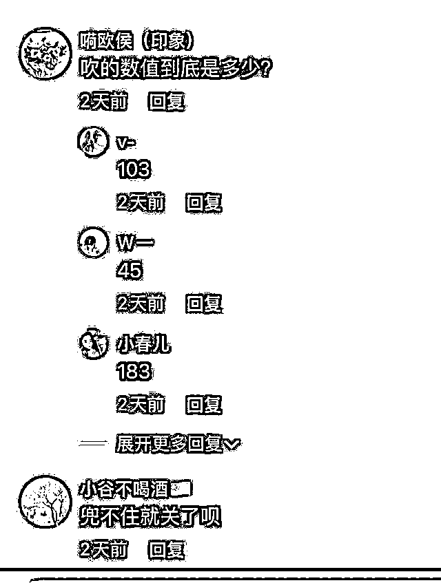
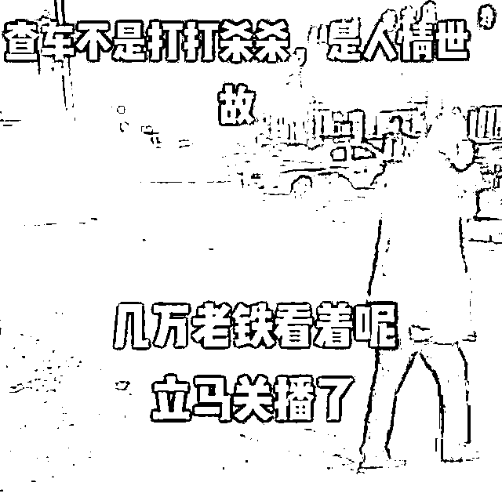
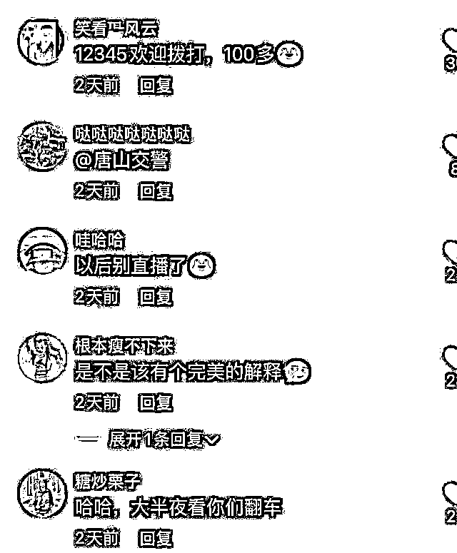

# 交警直播查酒驾"翻车"后停播

> 原文：[`mp.weixin.qq.com/s?__biz=MzIyMDYwMTk0Mw==&mid=2247525664&idx=2&sn=6c2e6cd39b94f6371aab5d2466603c16&chksm=97cbae18a0bc270e915ee0fed6755ce6bcdb21d3ecf320c6f0d5288656d1edda1f396d5a8f8a&scene=27#wechat_redirect`](http://mp.weixin.qq.com/s?__biz=MzIyMDYwMTk0Mw==&mid=2247525664&idx=2&sn=6c2e6cd39b94f6371aab5d2466603c16&chksm=97cbae18a0bc270e915ee0fed6755ce6bcdb21d3ecf320c6f0d5288656d1edda1f396d5a8f8a&scene=27#wechat_redirect)

河北省唐山市唐海公安局官方微博@曹妃甸公安网络发言人 12 月 9 日发布情况通报： 

2021 年 12 月 6 日晚，曹妃甸区公安局交通警察支队依法开展酒驾整治工作并进行现场直播。直播期间因一男性驾驶员两次现场酒精测试结果数值发生变化引起网民广泛关注。

针对此事，曹妃甸区公安局党委高度重视，立即成立由曹妃甸区纪委监委驻公安局纪检监察组、区公安局法制预审支队组成的联合调查组进行全面深入调查，**涉事民、辅警现已停职接受调查**，曹妃甸区公安局将及时向社会各界公布调查结果，回应广大网民关切。

唐山市曹妃甸区公安局

2021 年 12 月 9 日

极目新闻此前报道，近日，有网友称河北唐山曹妃甸区交警直播查酒驾时“翻车”了。**当地交警对一驾驶员进行了两次吹气测试，数值从“103“”降至“45”，之后还中断了直播。**9 日上午，唐山当地交管部门回复极目新闻记者表示，目前正在核实相关情况。

[`mp.weixin.qq.com/mp/readtemplate?t=pages/video_player_tmpl&action=mpvideo&auto=0&vid=wxv_2171999806372495364`](https://mp.weixin.qq.com/mp/readtemplate?t=pages/video_player_tmpl&action=mpvideo&auto=0&vid=wxv_2171999806372495364)

视频自@极目新闻

有网友称，此事发生在前几日晚上。当时，曹妃甸交警正在道路上设卡查酒驾。“曹妃甸交警”抖音号也在进行直播。网友说，晚上八点多，交警对一名驾驶员吹气时，第一次吹出的数值为“103”，再次吹气后，数值显示“45”。网友称，不久后直播被停止。

极目新闻记者看了网友发布的直播录屏，录屏中，**显示直播间内有 4.5 万人次观看**。还用文字写着“查车不是打打杀杀，是人情世故。”“几万老铁看着呢，立马关播”的字样。

不过，该视频内并未录制到上述两次测试的相关过程，也未能看到酒精测试的数值。

极目新闻记者在曹妃甸交警的抖音账号内发现，全国第十个交通安全日的主题视频下方，不少网友对当天晚上的直播情况表示质疑。并写下留言：“为什么要临时关直播？”“还删除了上一个视频”。

极目新闻记者查看了“曹妃甸交警”抖音号的直播记录，显示 12 月 6 日 20 时 17 分-20 时 49 分，该账号进行了一场名为“曹妃甸交警夜查酒驾”的直播。

据了解，根据相关规定，**驾驶人员每 100 毫升血液酒精含量大于或等于 20 毫克小于 80 毫克为饮酒后驾车；每 100 毫升血液酒精含量大于或等于 80 毫克为醉酒驾车。因此酒精测试中，“103”和“45”，两个不同的数字，处罚截然不同。**

根据《道路交通安全法》第九十一条，饮酒后驾驶机动车的，处暂扣六个月机动车驾驶证，并处一千元以上二千元以下罚款；醉酒驾驶机动车的，不仅要吊销机动车驾驶证，还会被依法追究刑事责任。

9 日上午，极目新闻记者致电唐山市曹妃甸区的交警及宣传部门，有工作人员表示，正在调查核实此事，后续有进展情况将由相关部门进行回复。截至记者发稿，目前尚未收到相关回复。

**延伸阅读：**

[交警直播夜查酒驾放行“省公安局人员”？官方通报来了](http://mp.weixin.qq.com/s?__biz=MzIyMDYwMTk0Mw==&mid=2247521161&idx=2&sn=6c59ccc88c5fca846837cd0ed602fff6&chksm=97cb58b1a0bcd1a7592e2b33024b15ea8a151a05eac529bd949b056817833a25046b8314ef74&scene=21#wechat_redirect)

来源：@曹妃甸公安网络发言人；极目新闻 记者/詹钘

← 向右滑动与灰产圈互动交流 →

