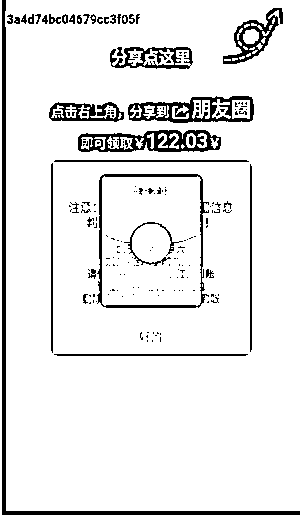
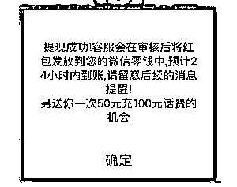

# 各种各样的花式红包，你敢抢吗？

> 原文：[`mp.weixin.qq.com/s?__biz=MzIyMDYwMTk0Mw==&mid=2247525664&idx=5&sn=c9d4fb32242b1a9ac5f1483fb0606ff0&chksm=97cbae18a0bc270ee21790786398830747f45125b395fce7338136982795fcd83dece71c1803&scene=27#wechat_redirect`](http://mp.weixin.qq.com/s?__biz=MzIyMDYwMTk0Mw==&mid=2247525664&idx=5&sn=c9d4fb32242b1a9ac5f1483fb0606ff0&chksm=97cbae18a0bc270ee21790786398830747f45125b395fce7338136982795fcd83dece71c1803&scene=27#wechat_redirect)

“假红包”骗局已在网上流传多年，按理说经过多年经验积累，大家应该都练就了一双火眼金睛，可以一眼识破骗局。

但它却依然是我们日常生活中最容易接触和最容易上当的骗局形式之一，据《中老年人上网状况及风险网络调查报告》显示，在中老年网民极易遭遇的七类网络诈骗中，红包诈骗以 25.1%的比例高居第二位。 

图片：腾讯安全观 

怎么会这样？有两点很重要的原因——

1\. 是因为这些“假红包”链接差不多都是自己的好友转发，大家心里信任对方，觉得“既然是朋友发的，那应该没什么问题”；

2\. 是因为骗子还会把“假红包”链接的封面包装成各种你意想不到的样子，看到一条逼真的语音消息、邀请加群提示……谁能想到它们是骗局呢？

根据用户投诉的链接，我们总结了最常见的 10 种“假红包”诱导分享链接，我们来一起记住这些大骗子！

****1.********十种常见“假红包”诱导分享链接****

怎么样，这些链接是不是都很眼熟？你有没有收到过朋友转发的？下面这个**红包滚动页面**你一定见过：不管标题、封面长什么样，这些“假红包”点开来基本都有几个相同的特征：中奖性质且金额较大、提现要分享、页面有广告。 

**2.****分享假红包有什么影响？**

很多人看到朋友发过来一个链接，下意识就会随手点开看一下，如果自己的中奖金额很大，甚至还会跟着诱导提示，一步步分享给更多朋友。但事实上，就算你分享到 100 个群，这个红包也到不了你的口袋，因为“分享可提现”是一个彻头彻尾的骗局。

可能有人就要抬杠了，“万一这个红包是真的呢？”还有人觉得，“转发一下又没有什么损失，大不了再删掉”。但其实你每操作一个简单的动作背后都藏着陷阱，会对我们造成一些不好的影响。

▬ ▬**被利用发布垃圾广告**

很多“假红包”链接分享到朋友圈以后，会变成垃圾营销广告，点开来看都是一些不堪入目的黄色小说和引导关注付费的二维码。

▬ ▬**被欺诈骗钱**

还有一些“假红包”链接的页面包含着欺诈陷阱，利用优惠充值话费、付运费送手表、送礼物等借口进行骗钱。而这些陷阱都是糖衣炮弹，但凡你有一点“捡到大便宜了”的心想法就会掉进坑里。

▬ ▬**隐私信息泄露**

有一些假红包在“提现”时要求必须填写个人信息：姓名，电话号码，家庭住址，身份证号码，甚至是银行卡号；根据用户的分享，还可以获得用户关系网络等信息。而这些隐私信息的泄露，很可能会带来安全隐患。

▬ ▬**包含"木马"，盗刷钱财**

假红包链接中还可能捆绑恶意软件、木马病毒，点击后会跳转至钓鱼网站，除了窃取个人信息，甚至可能会直接盗取我们的个人资金。

****3.********骗子为什么这样做？****

看到这里，想必大家都知道了，坏人利用热点事件为幌子制作“假红包”，在页面上用醒目的颜色和字体、大额金钱利诱，欺骗大家点击、转发。

当我们分享到更多群和朋友圈时，他们就获得了更多点击量和用户关注，然后再用这些巨大的访问量来获得广告营销机会。

像是一些色情低俗小说网站 、低俗直播平台 、欺诈赌博平台 ……都是需要大量访问量的。假如你不慎跳转到这些网站，那你的钱包将快速被他们掏空，毕竟『色情、赌博』有一万种方法让你深陷旋涡。

此外，“假红包”链接跳转到钓鱼网站，还会有盗号风险、个人隐私泄露风险和资金安全风险。

而这一切的开始都只是因为一时的贪心——“万一这个红包是真的呢？”、“转发一下又没有什么损失，大不了再删掉”。

****4.******如何识破假红包？**

了解了“假红包”背后的陷阱和会造成的不良影响，那么问题来了，“假红包”链接种类那么多，而且大多数都是相识的朋友在转发，你能一眼识破吗？我们准备了几道小题目，大家来测试一下吧~ 

**▬ ▬题目：****微****信红包最大额度是（ ）元。**

**滑动查看答案** 

☟ ☟ ☟

答案：200 元。切记一般单个红包限额为 200 元，一旦遇到 666 或 888 等大额红包链接，要提高警惕。

**▬ ▬题目：****领取微信红包需要输入个人信息吗？**

**滑动查看答案** 

☟ ☟ ☟

答案：不需要。领取红包时，要求输入收款人信息，比如姓名、手机号、银行卡号等行为都是诈骗。真红包拆开后资金会自动进入零钱账户。

**▬ ▬题目：****以下哪个是真的微信红包？**

【1】【2】 【3】 

**滑动查看答案** 

☟ ☟ ☟

答案：第一个。微信红包的金额要点开之后才能看到；微信转账是一眼就能看见金额的；第三个为伪装后的假红包，“提现”要求进一步操作。

**▬ ▬题目：****微信红包没有领取的话钱到哪里去了？**

**滑动查看答案** 

☟ ☟ ☟

答案：微信红包如果没有领取这个红包，系统在 24 小时后会将钱自动退还；微信转账如果不点开不收款，系统也会在 24 小时后自动退款给对方。

**▬ ▬****终极问题，如果自己的亲友转来这些假红包，你应该怎么做？** 

**滑动查看答案** 

☟ ☟ ☟

答案：把这篇文章发给 ta 。

怎么样，你都回答正确了吗？

面对形形色色的假红包陷阱要牢记：

**敏感信息不输入，分享转发不要玩，**

**跳转外链要当心，巨额红包多套路，**

**共抢红包要谨慎，天上不会掉馅饼。**

来源：弘信守诚商务咨询，神奇安全事务所

← 向右滑动与灰产圈互动交流 →

