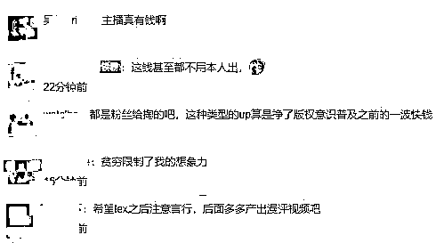
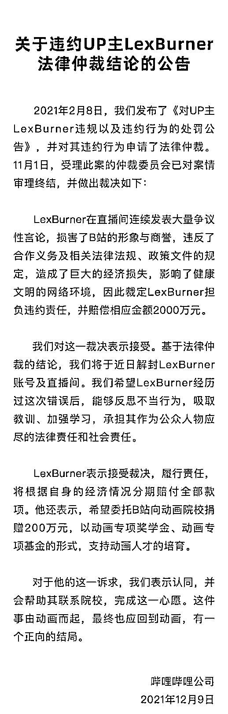
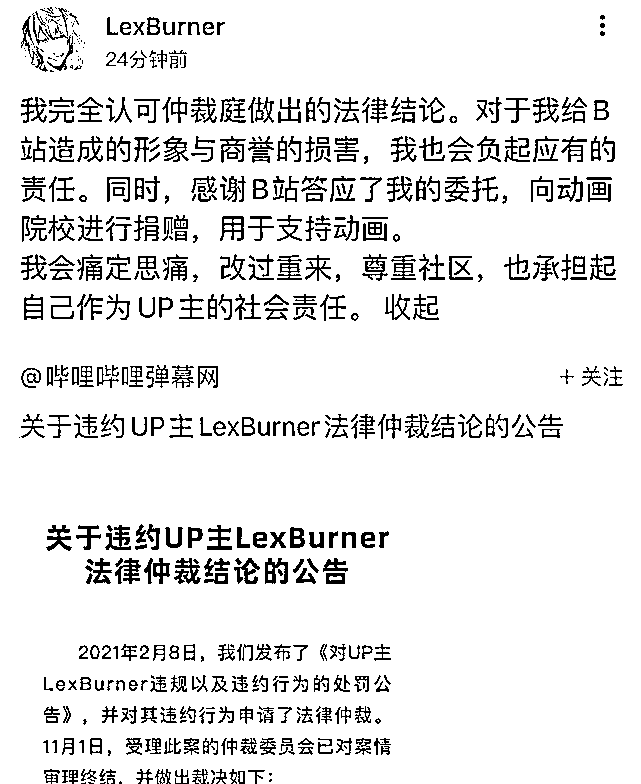
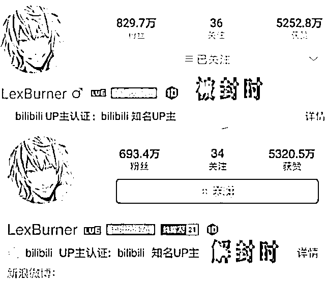
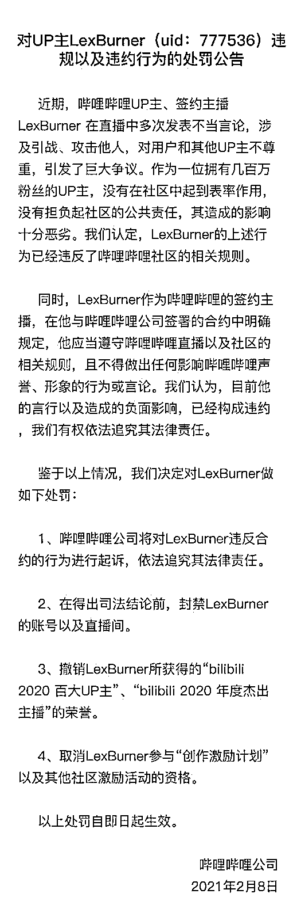

# 知名视频博主因“口嗨”，被裁定赔偿平台 2000 万：损害 B 站形象与商誉！

> 原文：[`mp.weixin.qq.com/s?__biz=MzIyMDYwMTk0Mw==&mid=2247525664&idx=6&sn=eaae35580eba1e59c283179471de0215&chksm=97cbae18a0bc270eab4453bda9839c3990e042d33dfb3938db7b938d0ec7bd4f457136e5ed8c&scene=27#wechat_redirect`](http://mp.weixin.qq.com/s?__biz=MzIyMDYwMTk0Mw==&mid=2247525664&idx=6&sn=eaae35580eba1e59c283179471de0215&chksm=97cbae18a0bc270eab4453bda9839c3990e042d33dfb3938db7b938d0ec7bd4f457136e5ed8c&scene=27#wechat_redirect)

12 月 9 日，B 站发布《关于违约 UP 主 LexBurner 法律仲裁结论的公告》，公告内容表示，LexBurner 在直播间连续发表大量争议性言论，损害了 B 站的形象与商誉，违反了合作义务及相关法律法规、政策文件的规定，造成了巨大的经济损失，影响了健康文明的网络环境，法律仲裁委员会裁定 LexBurner 担负违约责任，并赔偿相应金额 2000 万元。

图片来源：视觉中国

LexBurner 表示接受裁决，履行责任，将根据自身的经济情况分期赔付全部款项。此外，还希望委托 B 站向动画院校捐赠 200 万元。

随后，该话题冲上微博热搜。对此，有网友评论称：“主播真有钱啊！”

B 站头部 UP 主 LexBurner

被裁定赔偿 B 站 2000 万

12 月 9 日，B 站发布了《关于违约 UP 主 LexBurner 法律仲裁结论的公告》。公告显示，今年 2 月 8 日，B 站发布了《对 UP 主 LexBurner 违规以及违约行为的处罚公告》，并对其违约行为申请了法律仲裁。

图片来源：B 站官网

公告显示，11 月 1 日，受理此案的仲裁委员会已对案情审理终结，并做出裁决如下：

“LexBurner 在直播间连续发表大量争议性言论，损害了 B 站的形象与商誉，违反了合作义务及相关法律法规、政策文件的规定，造成了巨大的经济损失，影响了健康文明的网络环境，因此裁定 LexBurner 担负违约责任，并赔偿相应金额 2000 万元。我们对这一裁决表示接受。”

B 站表示，基于法律仲裁的结论，平台将于近日解封 LexBurner 账号及直播间。此前，LexBurner 的账号及直播间已经被封禁了 10 个月。

“我们希望 LexBurner 经历过这次错误后，能够反思不当行为，吸取教训、加强学习，承担其作为公众人物应尽的法律责任和社会责任。”B 站称。

公告显示，LexBurner 希望委托 B 站向动画院校捐赠 200 万元，以动画专项奖学金、动画专项基金的形式，支持动画人才的培育。

而 LexBurner 也在昨日晚间回应称，“我完全认可仲裁庭做出的法律结论。对于我给 B 站造成的形象与商誉的损害，我也会负起应有的责任。同时，感谢 B 站答应了我的委托，向动画院校进行捐赠，用于支持动画。我会痛定思痛，改过重来，尊重社区，也承担起自己作为 UP 主的社会责任。”

曾是 B 站动画区“一哥”

**因“口嗨”被封禁 10 个月，掉粉 130 万**

**LexBurner 是何许人也？**

据悉，LexBurner 是 B 站动画区的顶级 UP 主、主播，曾称得上是 B 站动画区“一哥”，经常发布动漫评论、吐槽等相关视频，播放量动辄数百万，总播放量超过 11 亿，一度坐拥超过 900 万粉丝。即便在此前因引发了很大的争议掉了 70 多万粉，在 2 月 8 日被封之前其也依然保有近 830 万粉丝。

然而在 12 月 9 日解封时，LexBurner 粉丝数已不足 700 万，10 个月的封禁期内掉了超过 130 万粉丝。

说到 LexBurner，就不能不提今年年初导致其被 B 站封禁的“口嗨”事件。

今年初，B 站引进了日本动画《无职转生 ~到了异世界就拿出真本事~》，并在 B 站上迅速爆火，引起广泛关注，迅速拿下超过 6000 万播放量，并在 B 站获得了 9.6 的高分，被不少网友奉为经典。不过，在该动画的前几集剧情中有部分不太符合主流价值观的情节，引发网友争议。

彼时，作为拥有 900 万粉丝的 B 站动画区“一哥”LexBurner 在直播中对这部动画进行评价，在这一过程中对观众及其他 UP 主使用了侮辱性词汇，例如评价观看《无职转生》的人都是底层、臭屌丝，只有底层才会对作品有共鸣，而他自己是成功人士，对其他 UP 主评论称“你也被卡车撞死过？”等等。随后，这番言论引起了轩然大波。

2 月 7 日，仅仅播了 4 集的《无职转生》因“技术原因”被 B 站下架。次日，B 站发布公告，表示因为 UP 主 LexBurner 在直播中不当言论造成的恶劣影响，认为其违反合约并进行起诉。

如今，还保有近 700 万粉丝的 LexBurner“刑满释放”，有网友戏称其“花了 2000 万买一枚‘复活币’”。B 站的网友们是否还会接受这样一位 UP 主和主播？

来源：潇湘晨报，每日经济新闻、界面新闻、B 站官网、公开资料

← 向右滑动与灰产圈互动交流 →

