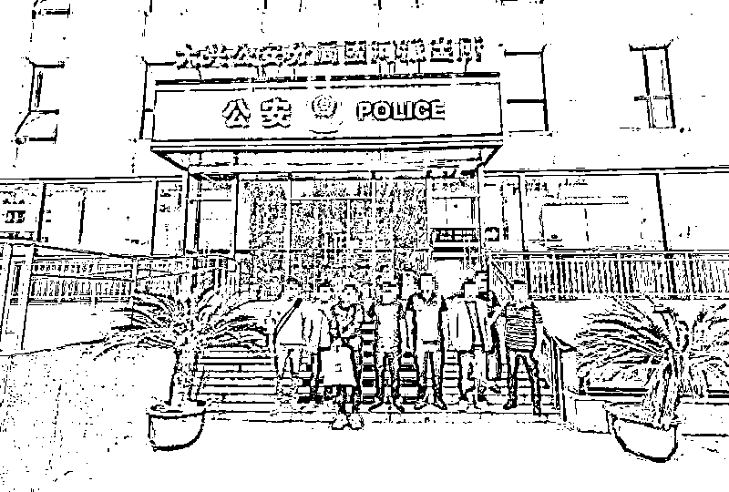
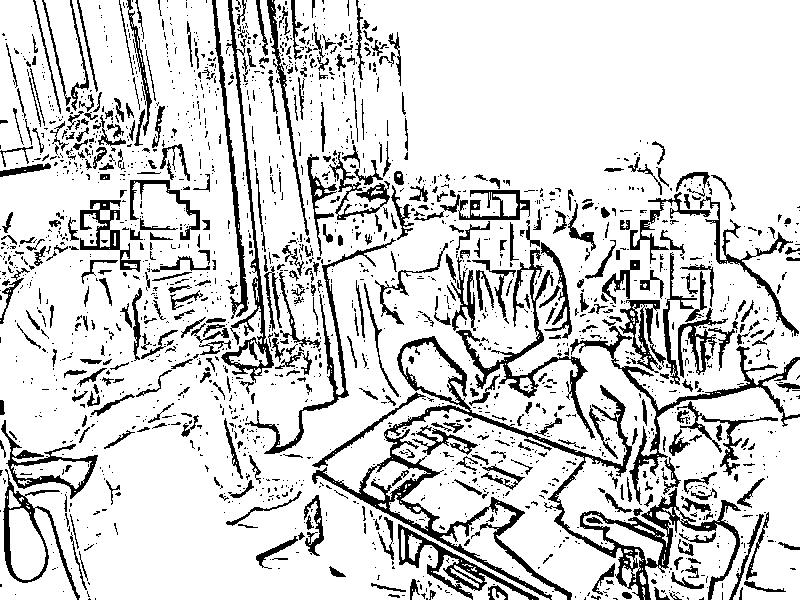
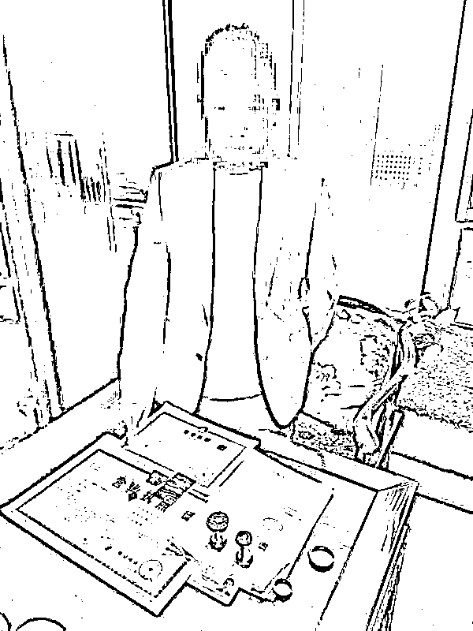
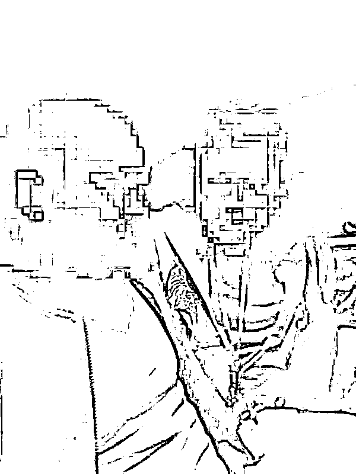

# 全国 1000 余名受害人！涉案金额达 2 千万！

> 原文：[`mp.weixin.qq.com/s?__biz=MzIyMDYwMTk0Mw==&mid=2247525664&idx=7&sn=3142d6ba5bc1aeb88b9d81c7e780d81d&chksm=97cbae18a0bc270e483a0f8900af8b6f3f2ffcfdb121b132733a38806e8bfe9686ab71f4f3b7&scene=27#wechat_redirect`](http://mp.weixin.qq.com/s?__biz=MzIyMDYwMTk0Mw==&mid=2247525664&idx=7&sn=3142d6ba5bc1aeb88b9d81c7e780d81d&chksm=97cbae18a0bc270e483a0f8900af8b6f3f2ffcfdb121b132733a38806e8bfe9686ab71f4f3b7&scene=27#wechat_redirect)

一起案件

牵出一电诈团伙

**全国受害人数达 1000 余名**

从今年 1 月初开始

昆明市公安局盘龙分局反诈中心民警

辗转北京、重庆、湖南、江苏等地

行程数千公里

掌握了一个

**以“代办职称、专业资格证书等”为名**

**的诈骗团伙**

目前已抓获 8 名犯罪嫌疑人

 **案发：** 

**为升高级职称，他俩付费 2.5 万**

张某是昆明市盘龙区某公司员工，去年他接到一个电话，对方称可以代办职称，还可办理提级需要的一系列证书，提供“一条龙服务”。

张某正好需要将自己的中级职称再提一提，便欣然同意，与对方互加了微信。

两人在微信上详谈了证件类别、办证价格等细节。

对方还主动报上公司名称等信息，并告诉张某可在“企查查”“天眼查”上等工商查询软件上查验，让张某深信不疑。

之后，张某就此咨询了老板，老板表示也需要提级，张某便将二人的职称提级事宜“委托”给这家“中介机构”办理。

对方通过微信，发来了一份电子协议，上面注明办证内容、定金、尾款等内容。

对方要求张某将协议打印出来，签字后拍照，用微信发给对方。

张某签订了协议，并于去年 8 月初将自己和老板的定金，共计 7000 多元，转进对方提供的公司对公账户。

去年 12 月，“中介机构”联系人按约发来一个网站链接。

张某**点击链接进入某“官方网站”**，并在上面查到了自己和老板的专业资格证书。

一切看起来都真实无误，于是张某按约付了两人的办证尾款 18200 元。

之后，张某就安心地等待证书寄到手上。

可是一直等到今年 1 月，迟迟不见快递踪影，张某便发微信给联系人，发现微信被拉黑，电话也打不通。

此时，张某意识到被骗了，这才报了警。

 **侦办：** 

**查出一电诈团伙 全国 1000 余名受害人**

盘龙公安分局办案民警顺着张某网站往上倒查，查出一个诈骗团伙，并抓获 8 名嫌疑人（团伙头目仇某、管理员但某、洗钱者曹某、2 名话务员、3 名技术员）。

经查，该团伙从 2018 年便开始诈骗，直到 2020 年才发案，全国受害人数达 1000 余名，涉案金额达 2000 万元。**那骗子到底是怎样一步步实施诈骗的呢？**

**一、打电话询问需求，引诱上钩**

骗子通过非法渠道购买一些有技术职称的人员信息，然后由话务组逐一拨打电话询问是否有办证需求。

“他们办证的类型有很多，只要你想办的证，他都能帮你办理。”盘龙公安分局反诈中心负责人杨沛介绍道。

骗子利用受害人不用培训及考试，花点钱就能办证的心理进行诈骗。

一旦受害人有想要办证的需求，对方会主动要求加微信详谈细节。

经查，该团伙注册了四五家公司做伪装，这些公司在“企查查”“天眼查”等工商查询软件上真实可查，以获取受害人的信任。

**二、签订办证协议，骗取定金**

受害人上钩后，骗子会通过微信发来一份协议，上面注明办证内容、定金、尾款等内容，并要求受害人将协议打印出来签字后，拍照用微信发给对方。

此后骗子提供一个对公账户，并要求受害人将定金打进该账户。

“办理不同的证件，收费情况也不一样。有一名受害人为办理高级工程师证，分两次给对方转账 9 万元。”杨沛介绍道。

**三、制作虚假网页，套取尾款**

骗子会找来技术人员针对受害人的需求设计虚假网页，以供受害人查询证件办理情况。

“他们和正规网站的老板商量好后，将假的二级网站挂在这个正规网站，以增加可信度。受害人张某收到的就是一个叫‘XX 州专业信息技术网’的假网站。”杨沛介绍道。

**四、获取尾款，拉黑消失**

“一是他们设计的网站和一些官方网站相似度很高，一般人难以辨别真假，二是因为受害人不太了解证件所挂靠地区的网页情况，所以很多受害人在网上查询到证件相关信息后就信以为真了。”杨沛介绍道。

当受害人支付尾款后，骗子会在微信好友里将受害人拉黑，并拒接受害人电话。

**五、洗钱分赃**

受害人将尾款转进团伙头目仇某买来的对公账户，仇某再将钱转进洗钱者曹某名下的对公账户，曹某再将钱转到自己的银行卡，然后到银行柜台取现后将钱交仇某。

据调查，仇某手里有 4 个买来的对公账户，每个对公账户里汇集了大量受害人的资金。

“如果他所使用的对公账户被举报就会被封存，他就会去买新的对公账户。”据杨沛介绍，“受害人多、账户多”是这起诈骗案侦破的最大难点，这给办案民警带来了巨大的工作量。

“就目前调查情况来看，仇某已获利数百万。其他成员收入情况不同。话务员拿提成，**每谈成一单领取 30%提成；管理员有一笔管理费，此外他也充当话务员谈单子拿 30%提成；洗钱者领取洗钱金额的 10%作为提成**；技术人员在网页上挂一个职称证书大概在 500 元左右……”杨沛介绍道。

 **抓捕：** 

**端掉一电诈窝点，抓获 8 名嫌疑人**

办案人员锁定嫌疑人曹某后，前往北京实施抓捕。曹某被抓获时，手里提着的超市购物袋里装着 17 万元现金。

据曹某交代，该团伙头目仇某与其相约来拿钱，民警又继续布控将仇某抓获。

警方调查发现，**该团伙将窝点伪装成一个“教育咨询公司”隐藏在商业 CBD 大楼里面。**“公司”内卡座、电脑等办公设备一应俱全，公司名称标牌、营业执照等样样齐备，日常检查很难发现异常。

民警通过大量工作，又将从该窝点逃避隐藏的另 6 名犯罪嫌疑人抓获。

目前，警方通过深挖扩线、持续工作，又掌握了一批涉案嫌疑人线索，案件正在进一步侦办中。

来源：昆明反电信网络诈骗中心

← 向右滑动与灰产圈互动交流 →

