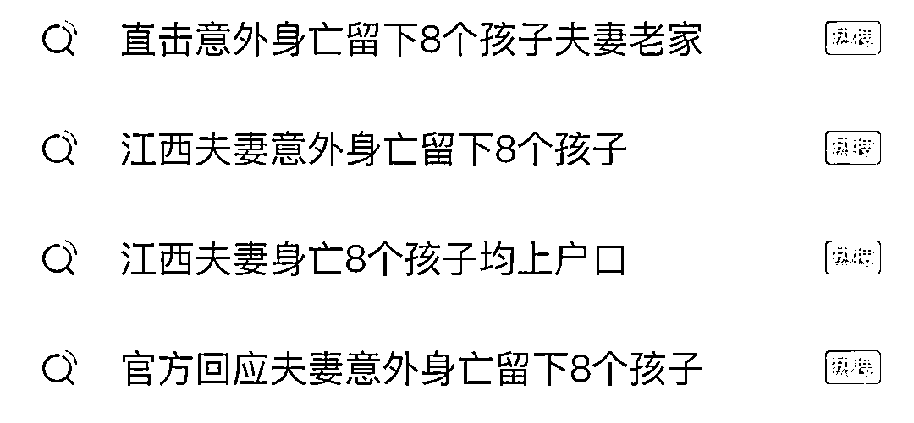
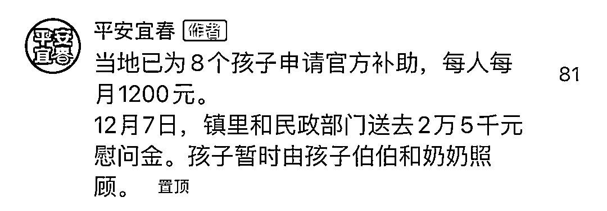
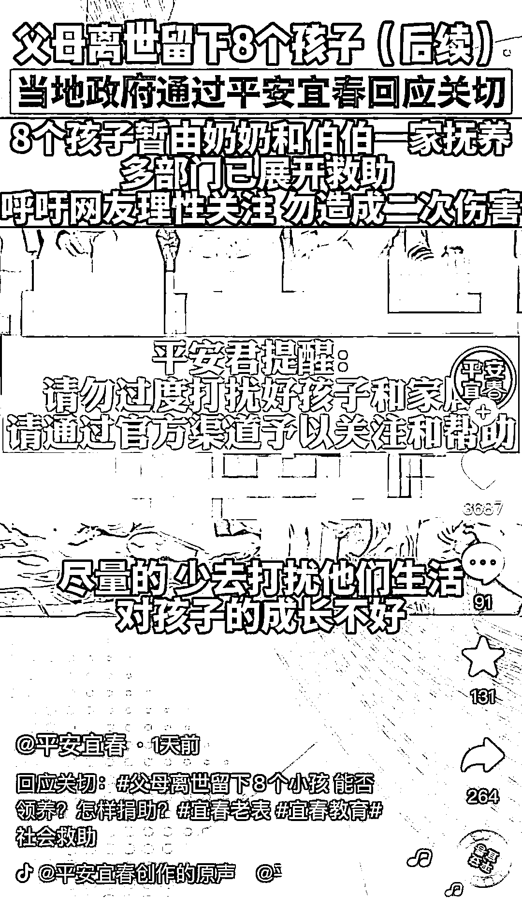
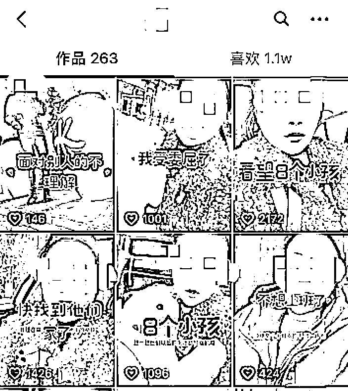
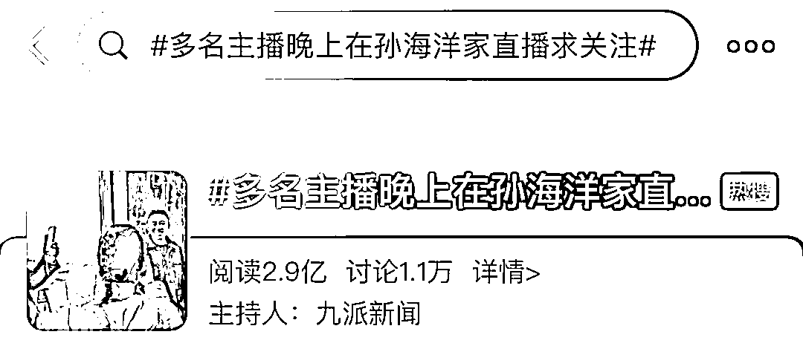
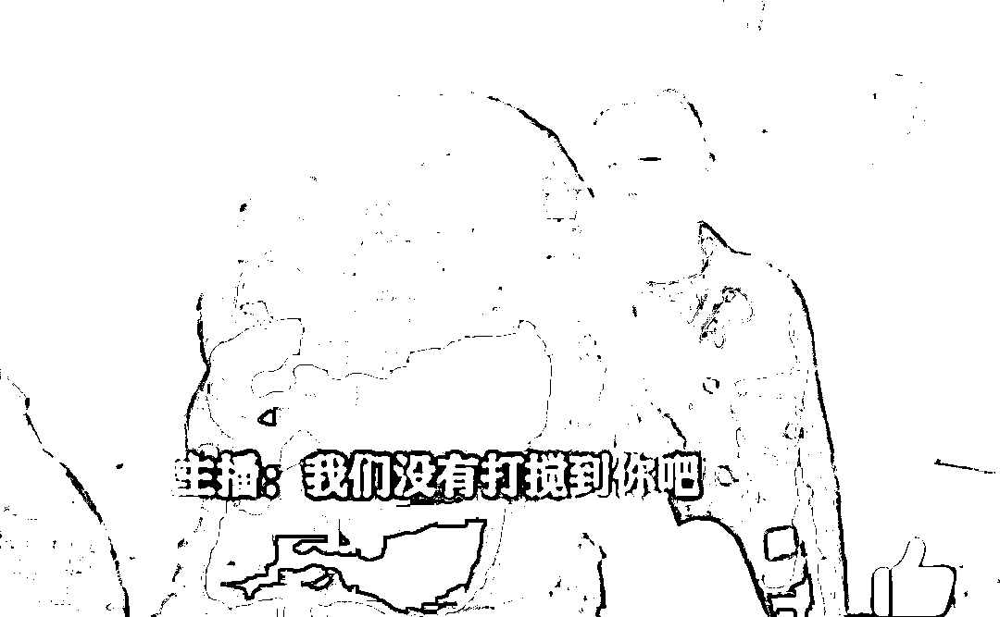

# 犯众怒！网红主播又扎堆了！连这些孩子都不放过

> 原文：[`mp.weixin.qq.com/s?__biz=MzIyMDYwMTk0Mw==&mid=2247525717&idx=1&sn=415f2bbffeb3340e0cfda99f4f1349d1&chksm=97cbae6da0bc277b0e595057880ee54cb2e559c440708d2499c649a6d17db6d4db3f548929bb&scene=27#wechat_redirect`](http://mp.weixin.qq.com/s?__biz=MzIyMDYwMTk0Mw==&mid=2247525717&idx=1&sn=415f2bbffeb3340e0cfda99f4f1349d1&chksm=97cbae6da0bc277b0e595057880ee54cb2e559c440708d2499c649a6d17db6d4db3f548929bb&scene=27#wechat_redirect)

近日，江西宜春一对夫妻意外身亡，留下 8 个尚未成年孩子的消息，引发关注。

据了解，**这 8 个孩子最大 12 岁，最小的只有 9 个月大。**他们何去何从有了最新进展。

但在 12 月 10 日，宜春政法委@平安宜春 发出提醒：**请勿过度打扰！**

据红星新闻报道，当地村民表示，**8 个孩子一家已成“网红地”。**孩子露脸的视频在网上疯传，家属也不堪其扰。

村民称，“现在一家人已经不接受私人捐款，爱心人士只能跟着团体，一批一批进入家中，**且不允许拍照录视频。”**

记者注意到，12 月 9 日，一名江西万载的网红发布视频称，她已经带着**8 个布娃娃**驱车 70 公里赶到竹亭镇罗布村。截图可见，几个视频流量翻番。

结果，这名网红没能如愿见到孩子。她却发视频说，“今天我满怀爱心探望八个小孩，结果他们的亲戚说我蹭流量，让我受尽委屈。我没有想到他们的姑姑还有他们的亲人是这个样子的，我知道我带去的 8 个布娃娃不值钱，**但我的心意却不是每个人都可以做到的。”**

网友评论——

**“讨人嫌的纠缠”**

# 此前，电影《亲爱的》中的人物原型——苦寻儿子 14 年的孙海洋，终于见到了儿子孙卓。媒体报道称，有些网红主播嗅到了“热点”，**竟然来到孙海洋家中“现场直播”，**甚至在入夜后仍未离去。

@中青评论刊文称，每个人都是构建良好网络秩序的参与者。对此，主播更应该从长远考虑。**毫无底线地“蹭流量”，耍小聪明，早晚会被自己的行为反噬。**

来源：中国青年报，红星新闻，红网

← 向右滑动与灰产圈互动交流 →

