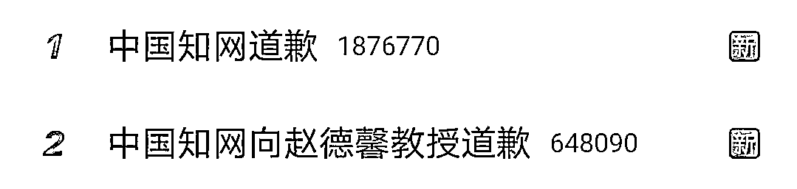
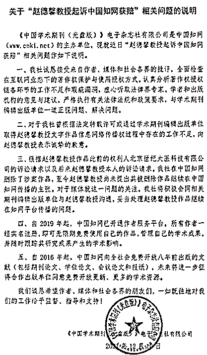
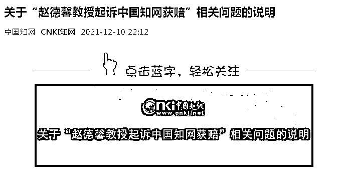
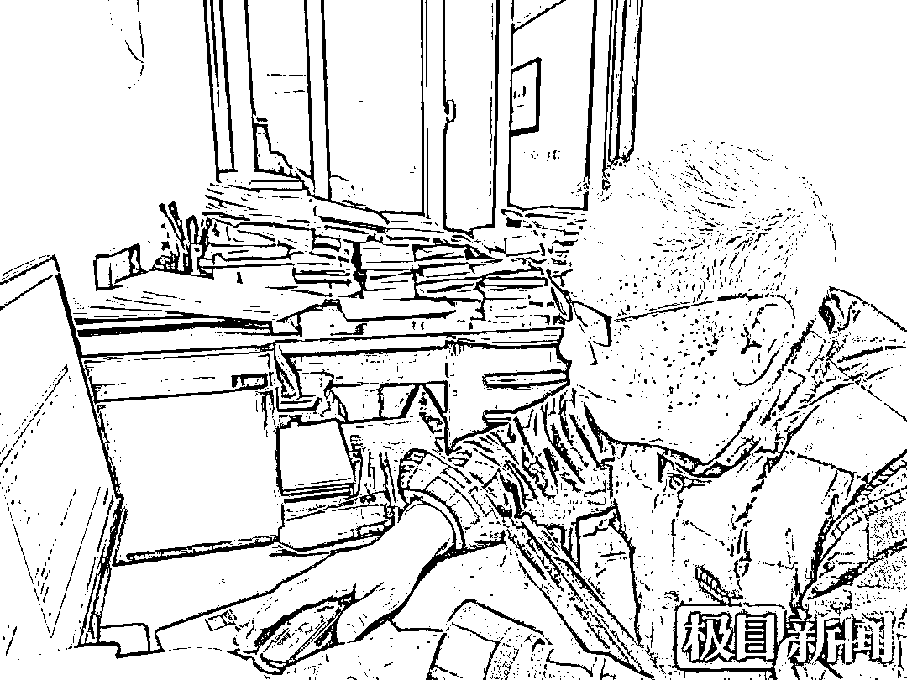
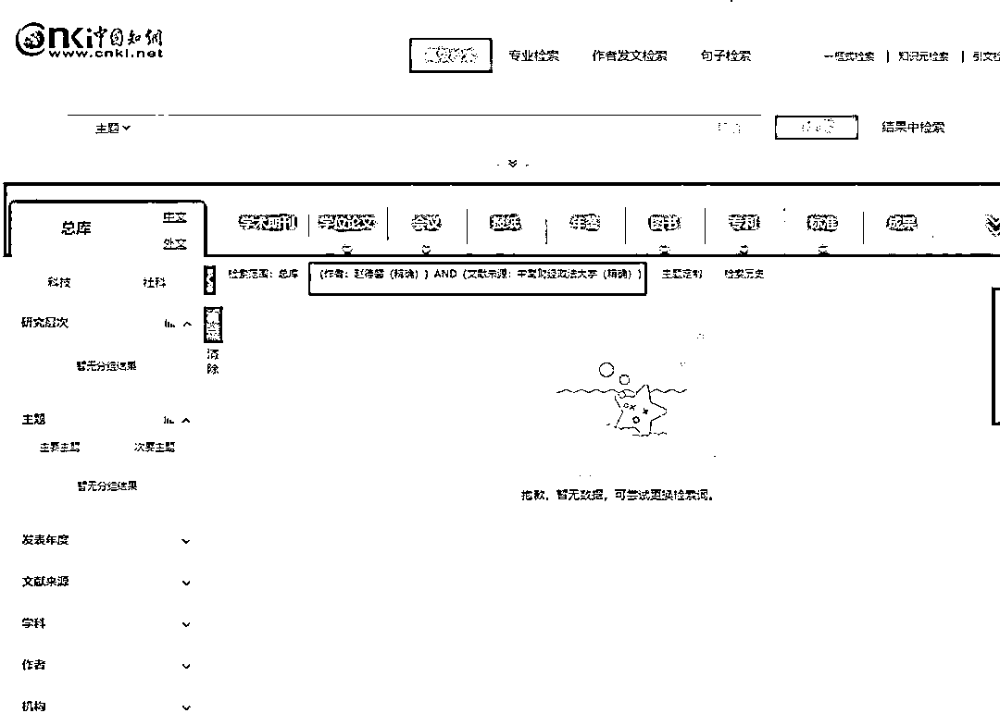
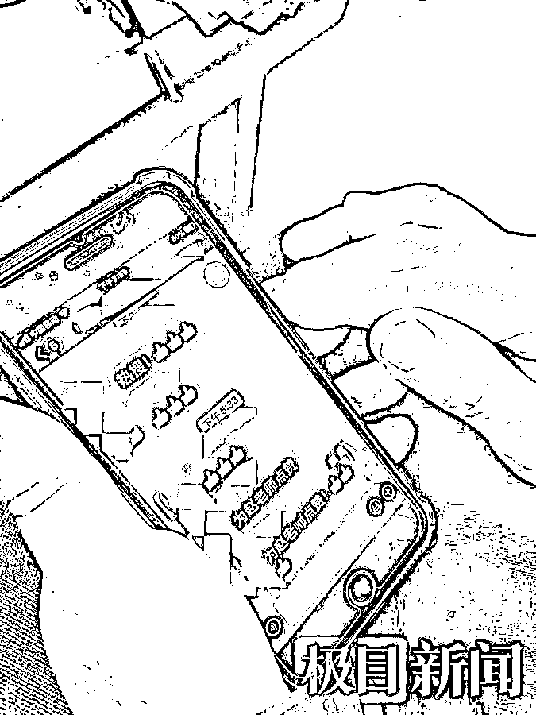
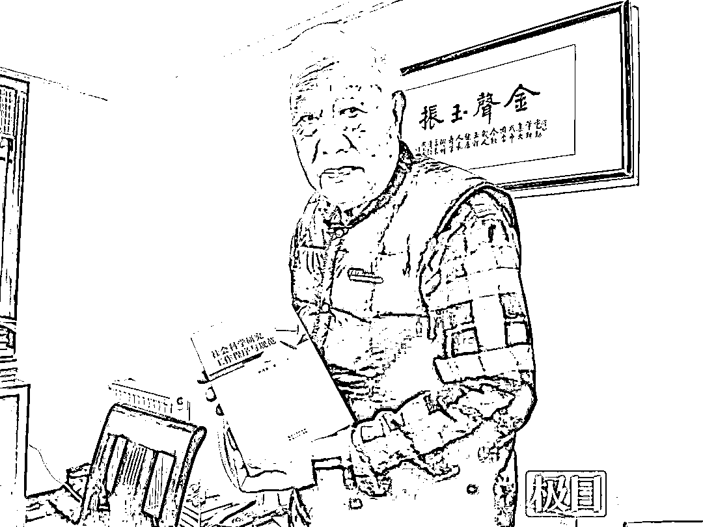

# 热搜第一！终于道歉了

> 原文：[`mp.weixin.qq.com/s?__biz=MzIyMDYwMTk0Mw==&mid=2247525717&idx=2&sn=b15aa8ae53a349d665a6724d348b07d3&chksm=97cbae6da0bc277b095c733ab5ecf3dcb34a32f9d9d186ae5c73f214ad3639fe942818ea5296&scene=27#wechat_redirect`](http://mp.weixin.qq.com/s?__biz=MzIyMDYwMTk0Mw==&mid=2247525717&idx=2&sn=b15aa8ae53a349d665a6724d348b07d3&chksm=97cbae6da0bc277b095c733ab5ecf3dcb34a32f9d9d186ae5c73f214ad3639fe942818ea5296&scene=27#wechat_redirect)

中国知网发布

《关于“赵德馨教授起诉中国知网获赔”相关问题的说明》

表示向赵德馨教授道歉

很快**#中国知网道歉#**和

**#中国知网向赵德馨教授道歉#**

两个话题登上微博热搜榜

第一和第二位

说明全文如下：

## 

《中国学术期刊（光盘版）》电子杂志社有限公司是中国知网（www.cnki.net）的主办单位，现就近日“赵德馨教授起诉中国知网获赔”相关问题作如下说明。

一、我社诚恳接受来自作者、媒体和社会各界的批评，全面检查在互联网业态下的著作权保护与使用授权方式，认真分析著作权授权链各环节的工作不足和瑕疵漏洞，虚心听取法律界专家、学者和出版机构的意见与建议，严格执行有关法律法规和政策要求，与学术期刊编辑出版单位一道正视问题、解决问题。

二、对于我社曾根据法定转载许可或通过学术期刊编辑出版单位取得赵德馨教授文字作品信息网络传播权过程中存在的工作不足，**向赵德馨教授表示诚挚的歉意。**

三、根据赵德馨教授作品此前的权利人北京世纪大医科技有限公司的诉讼请求以及后来赵德馨教授本人的诉讼请求，**我社在中国知网删除了涉案作品，**至今赵德馨教授尚未提出其被删除作品继续在中国知网传播的主张。对于媒体就这一问题的关注，我社将积极会同相关期刊编辑出版单位与赵德馨教授沟通，妥当处理赵德馨教授作品继续在知网平台传播的问题。

四、自 2019 年起，中国知网已开通作者服务平台，所有作者一经实名注册，即可无限期免费使用自己的作品，管理自己的学术成果，并随时跟踪其研究成果产生的学术影响。

五、自 2016 年起，中国知网向全社会免费开放八年前出版的文献（包括期刊论文、学位论文、会议论文和报纸），未来将进一步征得合作出版单位同意免费开放更新、更多的学术资源。

我们诚恳希望作者、媒体和社会各界的朋友们，一如既往地对我们的工作给予监督、指导和支持！

《中国学术期刊（光盘版）》电子杂志社有限公司

2021 年 12 月 10 日

## 

**此前报道**

# **下自己论文也要钱！**

# **武汉 89 岁教授起诉知网获赔 70 余万**

“今天收到了很多电话和短信，大家都很关注我的这个事情，很多人给我点赞。我感到这个事情做得很有价值。”12 月 7 日，中南财经政法大学 89 岁退休教授赵德馨，在南湖畔的家中告诉极目新闻记者。

赵德馨是中国经济史界著名学者，曾获评“荆楚社科名家”荣誉称号。**近日，赵德馨因为起诉“中国知网”擅自收录其 100 多篇论文，且全部胜诉，累计获赔 70 多万元，而引发舆论广泛关注。**

[`mp.weixin.qq.com/mp/readtemplate?t=pages/video_player_tmpl&action=mpvideo&auto=0&vid=wxv_2169958618350010376`](https://mp.weixin.qq.com/mp/readtemplate?t=pages/video_player_tmpl&action=mpvideo&auto=0&vid=wxv_2169958618350010376)

**视频剪辑：李碗容**

****没收到一分钱**** 

****下载自己的著作还要付费****

****“我创作的知识，它不跟我说一下就拿去用了，还去收费。而我一分钱稿费没收到。这是对我们知识分子劳动成果的不尊重。”**谈起维权初衷，赵德馨略微气愤地告知极目新闻记者。**

****

**赵德馨教授工作中**

**维权要从 2016 年说起，当年赵德馨开始写作《社会科学研究工作程序与规范》著作。创作过程中，他学习了著作权法的知识，了解到国家出台了诸多法律保护知识产权。“我那时候就感觉到国家保护我们知识分子的权利，就产生了一些维权的意识。”赵德馨说道。**

**在跟学生聊天中，他偶然得知自己诸多文章被知网收录，且学生下载还要付费。同时，他计划对自己此前出版的著作《中国经济史辞典》进行修订，这本书在知网上有电子资源。赵德馨委托学生以自己的名义联系知网，对方却表示要付费才能提供。赵德馨说：“这是我 2006 年和知网签订的合同，授权他们使用的。当时他们说会支付相关费用。可是我不仅没收到过知网一分钱，后面我自己要用自己的书籍，居然还要收费。”**

**于是，赵德馨开始着手维权。他将自己的著作目录进行整理，发现自己百余篇论文被知网、万方等数据库平台收录。随后，万方和赵德馨达成了和解，知网未达成协商和解。2020 年 8 月开始，赵德馨方面陆续向北京互联网法院起诉知网运营公司“《中国学术期刊（光盘版）》电子杂志社有限公司”，并陆续赢得胜诉，共收到 70 多万的赔偿。**

**赵德馨告诉记者，中国知网已经不再收录他的文章，收录的都下架了。他还告诉记者，就《中国经济史辞典》的合同问题，他还要跟知网继续沟通。**

****

**知网搜索结果**

****用自己的胜利鼓励大家敢于维权****

**今日，赵德馨的手机一直在响，他收到诸多学术界友人的消息。记者从他的手机中看到，有多名老师给他点赞。一名目前在浙江某高校工作的学生给其发消息写道，**“赵公依法维权的精神令人敬佩，是晚辈学习的榜样。”****

****

**赵德馨收到的点赞**

**“赵教授是我们中国经济史界的大家，德高望重，今天看到他的这个事情后，我们都很受鼓舞和激励。”该老师说。早在前几年，赵德馨和知网打官司的事情，他的学生们都有所耳闻，这次看到老师胜诉，大家都很开心，“我们不仅是为赵老师高兴，更是觉得通过这次的事情可以起到一个很好的示范作用，推动在学术界和出版界的良性合作。”**

****“我们国家大力保护知识产权，因为保护的目的就是为了给创新开辟道路。创新是我们国家发展的动力，这个事情很重要。我希望知识分子积极主动的维护自己的知识产权，用法律的武器维护自身的权利。”赵德馨笑着说。****

**长期以来，部分期刊社在版权声明中习惯使用“本刊已被某数据库全文收录，稿件一经录用，视为作者同意文章被收录”“投稿视为许可信息网络传播权及转授权”之类表述，但这样做真的合法么？**

**湖北得伟君尚（湖北自贸区武汉片区）律师事务所周瀛律师认为，赵德馨教授起诉知网的系列案例可以带来一些启示。首先，这类数据库在网络上提供付费浏览和下载的行为，并不属于我国著作权法规定报刊转载法定许可制度。该制度只限于报刊之间的转载，并不适用于网络环境下使用，网络转载还应当按规定向作者付酬。其次，信息网络传播权有别于复制权、发行权，期刊社的单方声明不足以使其从作者处获得作品信息网络传播权等相关权利的授权，而应当与作者签订书面的著作权许可使用合同。**

****每天仍忙于写作****

****获赔经费将用于出书****

**在中国经济史研究中，赵德馨取得了非凡的成就。他 26 岁即主持编撰了向全国高校推荐的第一部中国经济史教材《中国近代国民经济史讲义》。后来，他又主编出版了第一部多卷本《中华人民共和国经济史》，被誉为“规模最大、学术分量最重”，“更符合太史公‘通古今之变’精神”的《中国经济通史》。他还撰写了《楚国的货币》《黄奕住传》以及被学界誉为文献典范的《张之洞全集》等多部专著。**

****

**赵德馨展示所著书籍**

**1998 年退休后，赵德馨笔耕不辍，几乎每天都会进行创作。虽然已年近 90 岁，赵老如今仍会工作 5 小时左右，电脑用得十分熟练。赵老说：“退休后时间更多，更充裕。我退休后出的书，比退休前还多一些。”**

**最近，赵德馨正忙于修订《楚国的货币》一书。12 月 7 日，他刚收到了出版社发来的电子版审阅稿。除了这本书，赵老告诉记者，自己还有六本书在出版社等着出版。同时，他也在着手新书的创作。赵德馨告诉记者，“我研究了中国经济史一辈子，带的学生都有五代了，一直觉得自己要把这些知识留下来传递下去。希望把想写的书都写出来。”他表示，**打官司收到的赔偿款，都将用于今后出版著作。****

**来源： 极目新闻，潇湘晨报**

****

**← 向右滑动与灰产圈互动交流 →**

****