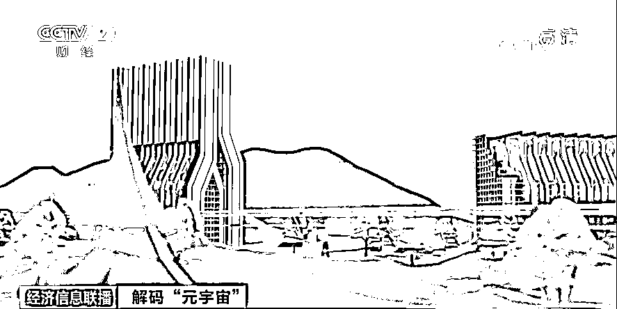
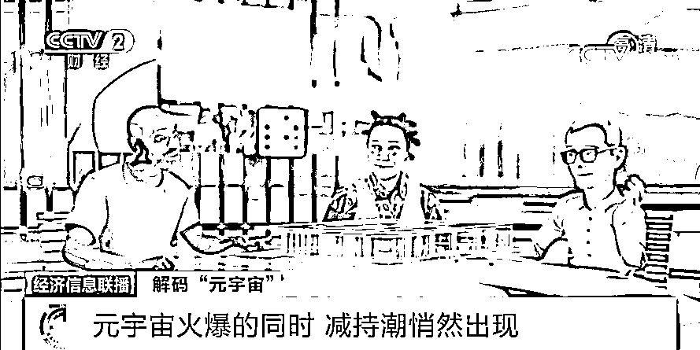

# “元宇宙”刷屏！有人 10 天收入 160 万元！蜜雪冰城、双汇也入局？！是风口还是虎口？

> 原文：[`mp.weixin.qq.com/s?__biz=MzIyMDYwMTk0Mw==&mid=2247525717&idx=3&sn=4fb6e94199d3fc754cbc73262f86fca1&chksm=97cbae6da0bc277b08c21de75919cc6b8c55eca45913a66bdfc4933b1966deb3bd7c234c97d9&scene=27#wechat_redirect`](http://mp.weixin.qq.com/s?__biz=MzIyMDYwMTk0Mw==&mid=2247525717&idx=3&sn=4fb6e94199d3fc754cbc73262f86fca1&chksm=97cbae6da0bc277b08c21de75919cc6b8c55eca45913a66bdfc4933b1966deb3bd7c234c97d9&scene=27#wechat_redirect)

美国 Meta 平台有限公司，也就是原来的脸书公司，9 日宣布，公司旗下的虚拟现实应用《地平线世界》正式向美国和加拿大的 18 岁以上人群开放。这也是目前 Meta 推出的最具象的元宇宙产品。据了解，《地平线世界》是 Meta 的社交/工作平台，供用户在元宇宙中创建内容与互动。

[`mp.weixin.qq.com/mp/readtemplate?t=pages/video_player_tmpl&action=mpvideo&auto=0&vid=wxv_2174998690866724874`](https://mp.weixin.qq.com/mp/readtemplate?t=pages/video_player_tmpl&action=mpvideo&auto=0&vid=wxv_2174998690866724874)

 △央视财经《经济信息联播》栏目视频  

元宇宙概念如龙卷风一般，席卷了整个科技圈，并在资本市场引发一系列连锁反应。甚至众多毫不相关的商家也来蹭元宇宙的热度，企图分一杯羹。元宇宙为何会突然大火？它和我们有什么关系？我们又该如何看待它呢？

“炒房热”刮进元宇宙 2740 万买一块虚拟土地

[`mp.weixin.qq.com/mp/readtemplate?t=pages/video_player_tmpl&action=mpvideo&auto=0&vid=wxv_2175000597161115656`](https://mp.weixin.qq.com/mp/readtemplate?t=pages/video_player_tmpl&action=mpvideo&auto=0&vid=wxv_2175000597161115656)

△央视财经《经济信息联播》栏目视频

近日，在虚拟现实平台“沙盒”上，**一块由程序代码敲出来的数字土地卖出了 430 万美元的天价，约合人民币 2740 万元**。买方自称是一家“元宇宙”世界的房地产公司。

一周前，另一块元宇宙虚拟土地的卖价，仅为“沙盒”这块地皮的 56%。交易价格几天内几乎翻了一番。 

在国内，当绝大多数人还不知道“元宇宙”是什么的时候，有人却已靠这个新概念赚到了第一桶金。一些和元宇宙相关的培训项目，在网课平台上受到追捧。 

《元宇宙第一课》系统后台截图显示，该培训项目上线后仅十天，付费用户便达到了 2673 人，累计收入近 160 万元。目前，众多同类型的课程已占据各大网课平台的主页。   

 网课讲师贩卖概念蹭热度尚能理解，但看似和“元宇宙”不相干的旅游景点，也打起了主意。近日，张家界景区官方宣布，成立全国景区首个元宇宙研究中心。但网友们并不买账，纷纷质疑景区并没有做“元宇宙”研究的资格和实力。对此，该中心负责人承认，机构确有蹭“元宇宙”热度的意图。

近期，“元宇宙”概念呈井喷式爆发。数据显示，截至目前，名称中含“元宇宙”的商标申请总量已超过 7700 条。9 月 22 日之前，参与申请的公司数量仅为 130 余家，一个月后，这一数字增长至 400 家左右。截至目前，参与申请的公司已增至 1000 余家。

近期，国内各领域知名企业纷纷加入申请元宇宙相关商标的行列：9 月发出申请的有腾讯、爱奇艺、理想汽车等企业；10 月则是欢瑞世纪、网易等公司；11 月，小鹏汽车、蔚来汽车等公司也开始“入局”申请行列。这期间，就连卖奶茶的蜜雪冰城、卖火腿的双汇也没有错过这拨申请热潮，尤其上汽集团更是一口气申请注册了近百条包含“车元宇宙”的字样商标。 

元宇宙考古 一千人眼里有一千种元宇宙

事实上，“元宇宙”概念并非横空出世，此说法早在上世纪就已出现，一些企业也早已开始了相关研发，但“元宇宙”为何突然在今年火遍全球呢？

1992 年，“元宇宙”一词首次在科幻小说《雪崩》中出现，书中，人们通过特殊设备，以“虚拟分身”的方式住进与真实世界平行的虚拟空间，这一概念场景被作者称为“元宇宙”。29 年后的今天，人们对“元宇宙”有了更具体的理解。

**中国信通院云计算与大数据研究所所长 何宝宏：**元宇宙本身不是某一种技术，而是一种理念，它需要整合不同的新技术，比如 5G、6G、人工智能、大数据等，更强调了虚实的融合。一千个人眼中就有一千种元宇宙，它的概念内涵也会随着不同技术的发展和相互的融合，而变得更加丰富和清晰起来。

当人们还在试图理解消化这个概念时，一些科技企业早已开始了对元宇宙领域的探索。今年 3 月，作为第一个将“元宇宙”写进招股书的初创企业罗布乐思登陆纽交所，首日股价大涨超 54%，市值突破 400 亿美元，是一年前估值的 10 倍。这成为了“元宇宙”概念在今年爆发的标志性事件。

11 月 23 日，罗布乐思的股价迎来今年高点，触及 141.6 美元/股的价位，较发行价飙升了 219%，市值突破 700 亿美元，约合人民币 4440 亿元。

很快，技术和资金上更具优势的科技巨头们，接力成为“元宇宙”的重要参与者。10 月，美国社交媒体公司脸书的创始人扎克伯格宣布，直接将公司更名为 META，意思就是“元宇宙”的“元”。

11 月，微软则发布了沉浸式在线办公平台“网格”，标志着又一科技巨头进军元宇宙。

方舟投资集团预计，从 2021 年至 2025 年，全球元宇宙市场规模将翻番，达到 3900 亿美元，约合人民币 2.4 万亿元；普华永道则认为，到 2030 年，全球元宇宙市场规模将达到 1.5 万亿美元，约合人民币 9.5 万亿元。

各方对元宇宙褒贬不一

[`mp.weixin.qq.com/mp/readtemplate?t=pages/video_player_tmpl&action=mpvideo&auto=0&vid=wxv_2175004123799027715`](https://mp.weixin.qq.com/mp/readtemplate?t=pages/video_player_tmpl&action=mpvideo&auto=0&vid=wxv_2175004123799027715)

△央视财经《经济信息联播》栏目视频

伴随着元宇宙汹涌的热潮，对其质疑之声也逐渐增多。元宇宙是机会还是陷阱？是风口还是虎口？是互联网的星辰大海，还是高科技的精神鸦片? 我们究竟该如何看待元宇宙呢？如今各方对此褒贬不一。

**携程集团联合创始人 梁建章：**元宇宙越来越能够仿真、乱真，可以低成本创造各种各样的乐趣，甚至可以代替亲情和爱情，这就会产生问题，这会带来各种风险。

苹果公司首席执行官蒂姆·库克曾表示，对“元宇宙”这种流行词汇不感兴趣，更愿意将目前的趋势看作是增强现实（AR）技术的发展。 

今年 4 月，芯片巨头英伟达首席执行官黄仁勋做了一段演讲，直至数个月后，人们才通过英伟达官方知晓，**演讲者并非黄仁勋本人，而是其虚拟人分身**，英伟达已经拥有了强大的图像处理技术。英伟达正利用这项技术，创造能完全复制现实工厂运作的元宇宙场景，来赋能工业制造。

**国盛证券区块链研究院院长 宋嘉吉：**元宇宙走红，本质上体现的还是基础科技进步和发展。未来长期来看，是对生产效率、社会运行效率的提升。它未来会创造一个增量的社会价值。

元宇宙究竟能给我们带来什么？目前这个答案还处在比拼想象力的阶段。然而就在元宇宙概念火爆，大家对其未来众说纷纭之际，很多人已开始悄悄撤出这个市场。 

数据显示，**10 月以来，在万得元宇宙板块的 85 只个股中，至少 17 只，已经发生股东及高管减持的现象，减持总金额超过 12 亿元**。

**中国信通院云计算与大数据研究所所长 何宝宏：**目前，无论是从硬件还是软件、相关的伦理法律法规构建上，我们距离元宇宙的很多设想还有不小的差距。但是我认为，元宇宙的实现是一个过程，我们会不断地取得阶段性的成果，我觉得这是值得期待的。

来源：央视财经（ID：cctvyscj）

← 向右滑动与灰产圈互动交流 →

