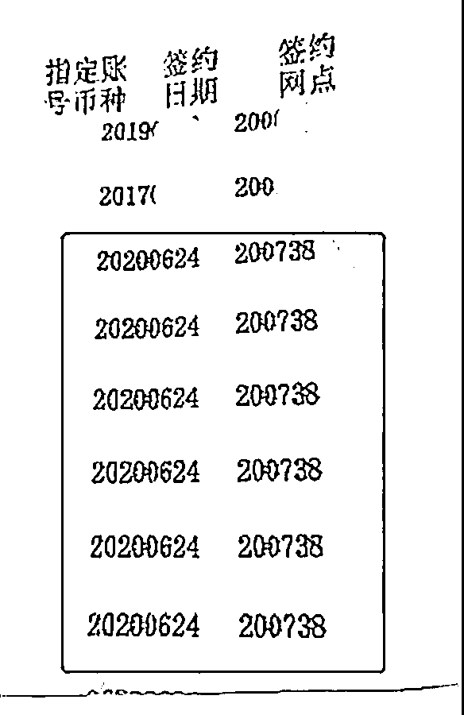
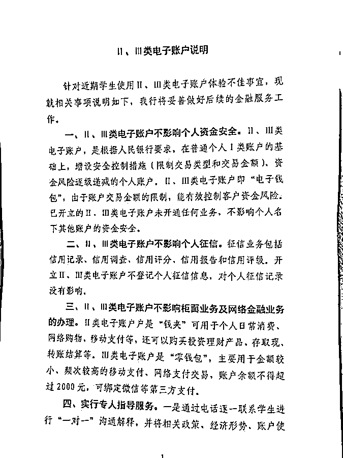
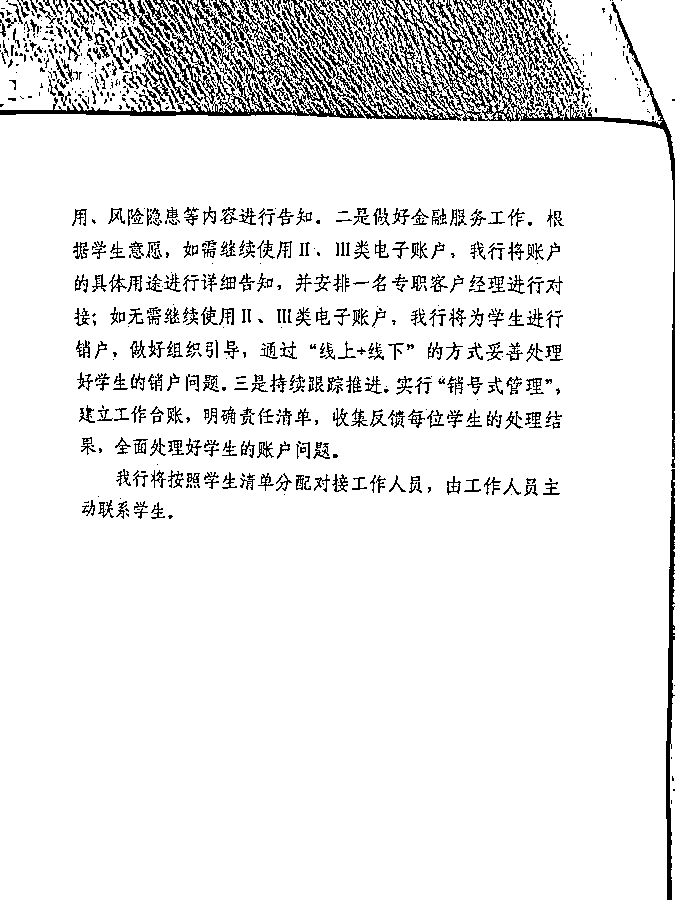
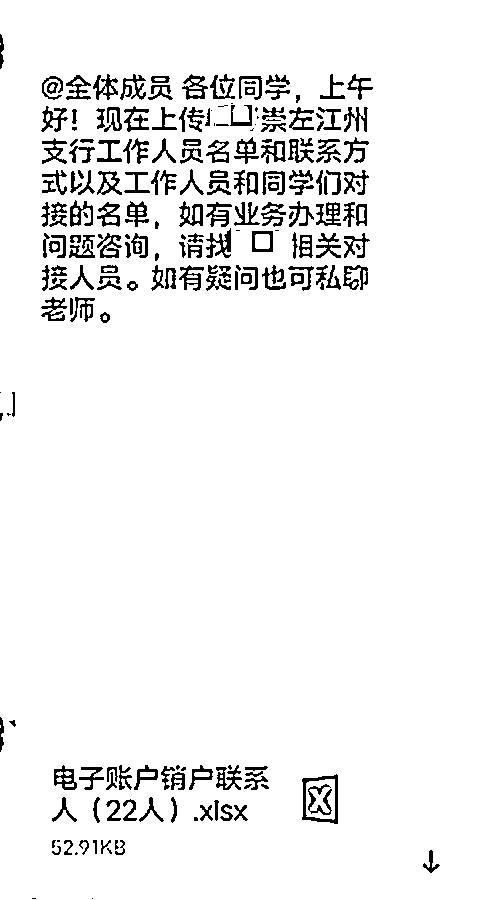
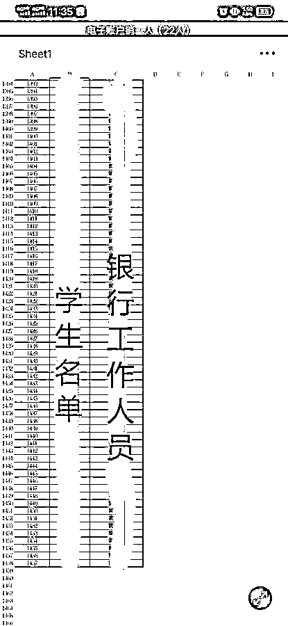
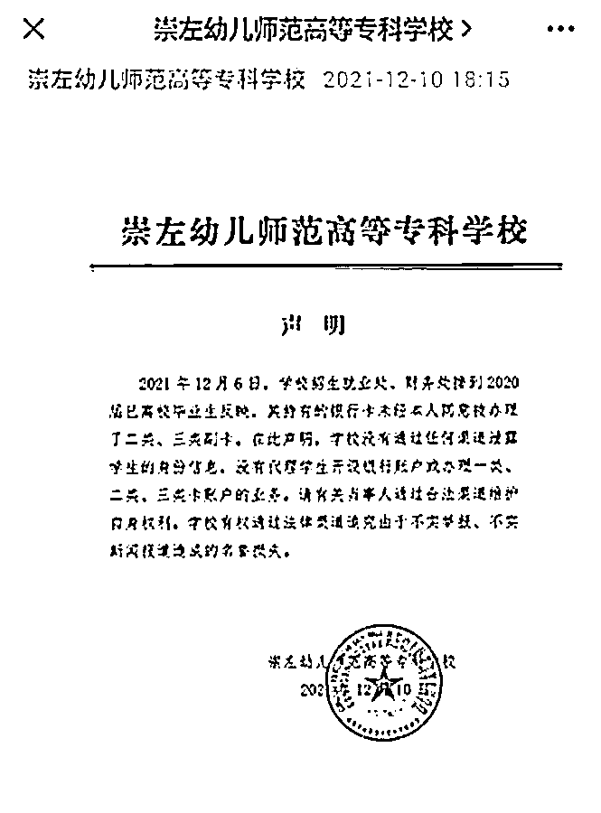

# 高校千余毕业生莫名被开多个银行账户，学校回应：未泄露学生信息

> 原文：[`mp.weixin.qq.com/s?__biz=MzIyMDYwMTk0Mw==&mid=2247525717&idx=4&sn=774bf16d38c014d877a537212d9b67e8&chksm=97cbae6da0bc277b9aae7de39c383287b4ac7833ea9810800d5ca12b4b61175ec093ffe4c5ed&scene=27#wechat_redirect`](http://mp.weixin.qq.com/s?__biz=MzIyMDYwMTk0Mw==&mid=2247525717&idx=4&sn=774bf16d38c014d877a537212d9b67e8&chksm=97cbae6da0bc277b9aae7de39c383287b4ac7833ea9810800d5ca12b4b61175ec093ffe4c5ed&scene=27#wechat_redirect)

12 月 10 日，极目新闻接到爆料称，广西崇左幼儿师范高等专科学校（以下简称“崇左幼专”）千余名毕业生莫名被开了银行电子账户，有人名下的账户多达 10 余个，这些账户的开户行均为某银行崇左江州支行。被开账户的学生表示，自己从未到该银行网点办理过开电子账户服务，怀疑自己的个人信息被泄露。

对此，学校财务处工作人员回应极目新闻记者称，学校此前并不知情，也未向银行提供过学生信息。银行一名工作人员则回复极目新闻记者，不排除有学生此前曾到网点办理或在手机上有过相关操作，具体情况还需核实。

12 月 10 日晚，崇左幼专发布声明，称学校没有通过任何渠道泄露学生的身份信息。

**学生：莫名“被开账户”**

12 月 7 日，崇左幼专 2020 届毕业生的群聊中，一名学生的发言引起了大家的注意：“你们的银行卡名下有没有多出很多银行卡？”

群里不少 2020 届的学生检查发现，账户中确实多出了不少Ⅱ、Ⅲ类电子账户，开户网点均为该行崇左江州支行。而该支行此前曾与崇左幼专有过合作。

**甄女士被开办的卡，均****在 6 月 24 日办理**

甄女士是崇左幼专 2020 届的毕业生。她告诉极目新闻记者，自己的账户中多出了共计 7 个的Ⅱ、Ⅲ类电子账户，办理时间均为今年 6 月 24 日，恰好在 2020 届学生 6 月 30 日毕业的前夕。

另一位“被开账户”的贾女士告诉记者，自己在该银行的Ⅱ、Ⅲ类账户也是在同一时间被办理的，都是电子账户，没有实体卡。银行客服告诉她，销户需要本人到开户网点办理，但她本人现在不在崇左，所以无法销户。

以上两位受访者所持实体卡的开户行均非该支行，且本人都对“被办电子账户”之事毫不知情。甄女士表示，还有同学反映，此前自己并未办理过实体卡，如今名下却出现了一张在该支行开户的Ⅰ类银行卡，账户内同样存在多个Ⅱ、Ⅲ类电子账户。

**《Ⅱ、Ⅲ类电子账户说明》**

接到情况反映后，学校老师在群聊内回复称，学校已组织会议，正在跟进解决此事，并在群内上传了一份疑似由银行发布的《Ⅱ、Ⅲ类电子账户说明》。

**“被开卡”学生名单**

文件对“学生使用Ⅱ、Ⅲ类电子账户体验不佳事宜”作出说明，称Ⅱ、Ⅲ类电子账户不影响个人资金安全和个人征信，也不影响柜面业务及网络金融业务的办理。之后，银行将为“被开账户”的学生提供专人指导服务，“一对一”对接处理账户问题。

**“被开卡”学生名单**

此外，银行还提供了一份对接名单。名单显示，“被开账户”的有 1457 人，均为崇左幼专学生。

**学校：从未泄露学生信息**

甄女士对记者表示，学生们不满的原因并非“使用体验不佳”，而是银行在未经授权的情况下擅自给她们开账户。同时，银行是如何得知她们的账户信息的？学校是否存在信息泄露行为？也需要得到解释。

12 月 10 日，记者致电崇左幼专财务处。工作人员表示，学校已经就此事与银行领导进行了多次交涉，将配合银行做好协调和后续处理。

该工作人员称，学校从未向银行提供过学生信息名单，在学生反映情况之前，学校对此事也毫不知情。且早在 2019 年，学校和该银行的业务合作已经结束，现在合作的是另一家银行。

至于为什么银行能够掌握学生的账户信息？该工作人员表示，银行方面在交涉时称增设Ⅱ、Ⅲ类账户的前提是学生本来已经在该行开了Ⅰ类卡。在 2020 届学生入学时，该支行的工作人员曾上门提供办卡服务，或有学生在当时办了卡。在学生开设Ⅰ类卡时，银行已经掌握了学生的信息。不过，工作人员也强调，当时的上门办卡为自愿业务，学校并未强制学生办过银行卡。

但据甄女士和其他学生回忆，20 届学生入学当年涉事银行并未到学生上门办卡，也没有在校内摆摊。甄女士自己的卡就不是入学时在校内办理的，而是大三时自行在校外办理的。

**崇左幼专声明**

12 月 10 日晚，崇左幼专发布声明，称学校没有通过任何渠道泄露学生的身份信息，没有代理学生开设银行账户或办理一类、二类、三类卡账户的业务。

**银行：原因需核查**

12 月 10 日，记者多次拨打该行崇左江州支行及其上级分行的电话，均未接通。之后，记者辗转联系上一位正在处理学生账户问题的该支行工作人员。他表示，目前已经与“被开账户”的同学取得联系，后续处理方案还需等待领导指示。银行将结合学生的诉求，为他们提供销户或其他服务。

为何银行能够在学生不知情情况下为其开户？该工作人员表示，现暂不能确定开账户业务并非学生本人办理。不排除学生曾在网点或在手机上操作成功却忘记了，这个需要进一步核查清楚。

关于学校是否曾向银行提供学生信息名单，该工作人员表示自己并不清楚，需要进一步核查。

记者进一步提出与该行领导对话，该工作人员婉拒后结束了通话。截至发稿，记者未能与该行负责人取得联系。

12 月 9 日，有学生到当地派出所报警，警方称若确实涉及信息泄露，会立案处理。派出所将研究是否立案。**（文中均为化姓）**

来源：极目新闻，潇湘晨报

← 向右滑动与灰产圈互动交流 →

