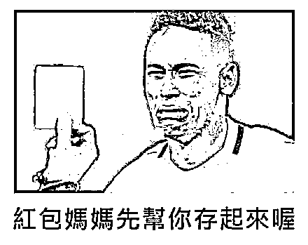
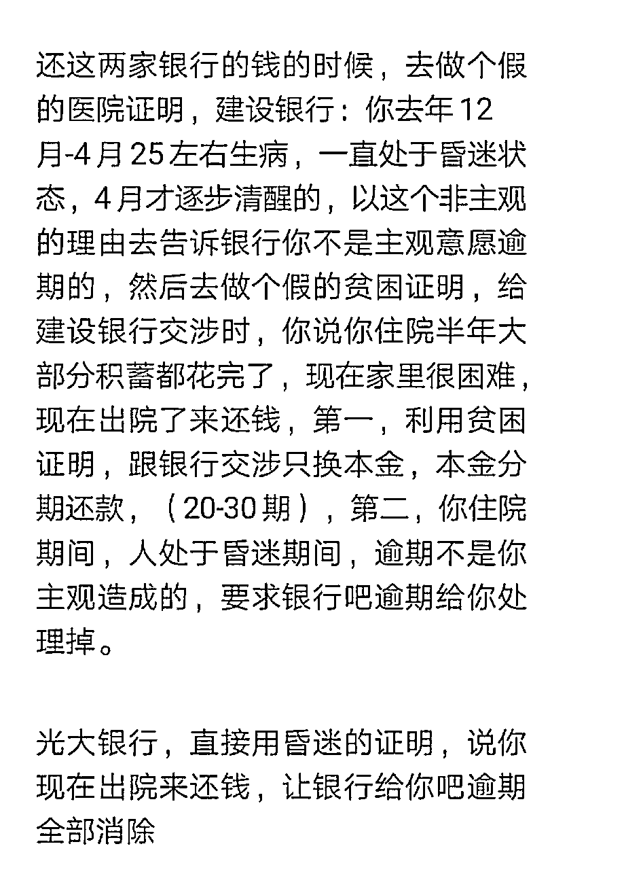

# 假装昏个迷，能修复征信？

> 原文：[`mp.weixin.qq.com/s?__biz=MzIyMDYwMTk0Mw==&mid=2247525717&idx=5&sn=1b90bf76ced57c506173212db16c016c&chksm=97cbae6da0bc277b3eeac981233a486263b27811ad09d9debce2ae5212eb9413937390809534&scene=27#wechat_redirect`](http://mp.weixin.qq.com/s?__biz=MzIyMDYwMTk0Mw==&mid=2247525717&idx=5&sn=1b90bf76ced57c506173212db16c016c&chksm=97cbae6da0bc277b3eeac981233a486263b27811ad09d9debce2ae5212eb9413937390809534&scene=27#wechat_redirect)

> “只要不是老赖，黑户也能洗白！”
> 
> “帮你消除征信污点，还你征信记录清白……”
> 
> “只需 1500 元，帮你修复征信，消除你的人生污点。”
> 
> ……

近期，一种针对网贷老哥的“**征信修复**”生意，在网上兴起。

中介宣传称，可以帮助有征信污点的老哥修复征信，重新做人。而消除每条不良征信，收费**1500 元**起，此外，中介还会在全国招生，进行征信修复培训，报价**数万**不等。

他们自称有一些特殊手段，比如，假装昏迷或者生病，就可以向向银行证明自己是非恶意欠款。

而被他们收割的对象，**正是那些已被盘剥殆尽处境十分凄惨的借贷者……**

在小珊给大家来盘点“征信修复”的套路之前，我们先来聊一聊**个人征信的重要性。**

当今社会，个人信用十分重要，**可以说已经成为我们的第二张“身份证”了，**良好的个人征信可以享受银行信用贷款以及一些其他生活优惠等等。

一旦失信，可能会对我们个人的经济生活带来一定的影响。

最直接影响的就是对信贷业务的影响。

“证信修复”生意流行的很大一个原因，就是**高债务高消费群体变多了，他们迫切想要修复征信，获得借款资格。**

敏锐察觉到“市场需求”的骗子们闻风而动。

而骗子们征信修复的套路其实也并不高明，不过是**先取得信任，然后卷钱跑路**。

他们首先会跟借贷者说：**“想消除一条不良，必须先在账单中，找出与这条不良匹配的时间和金额。”**

但是很多借贷的大哥往往都搞不清楚自己的债务明细，也不知道哪里逾期了。

然后他们就会给你提建议，向银行解释自己不是恶意拖欠贷款。

一般这类理由只有两种，一种是生病住院，一种是遭遇天灾人祸。 

有一些机构甚至会为借贷者开发出各式“奇招”。

比如，去开假的医院证明，证明你逾期是因为生病了，处在**昏迷状态**，无法还钱。

找到理由之后，就要开始准备 5 份材料：**3 到 6 个月持卡消费的发票和小票、近半年内的收入流水、3 到 6 个月欠款结清后的更新征信报告、要求银行协助处理逾期记录的申请书、假的生病住院证明**。

准备好这些材料后，中介会让你主动联系银行，将材料提交到银行那里，同时每天坚持向银行打 2 到 3 次以上的电话催促。

**听起来是不是有点美好？**

事实上，这种方式是很难行得通的，突然发现大量客户陷入长期昏迷，银行也会很快起疑。据了解，目前真实的征信修复成功率，不到 1%。

基本上，在以上任何一个环节中，**你什么时候把“征信恢复”的服务费交给他们，他们什么时候消失****。**

所以，对于这些机构来说，除了骗客户，更集中骗的点是**拉代理和培训**。

一般他们会收取数**万元的代理费**，每拉来一个客户，再**返给对方 1500 元的服务费**。 

然后“课一结束，就把学员拉黑，再去一个新的地方开培训。”

所以，**如果征信有问题，又还想贷款，这个时候要怎么办呢，征信究竟要如何恢复？**

一般来说就是两个方法：

**1、自动消除。**

根据《征信业管理条例》，征信机构对个人不良信息的保存记录是五年内，也就是说，**还清欠款五年后，征信逾期记录会自动消除**。

**2、异议申请。**

有时候，并不是所有逾期都是自己造成的，有时可能是个人信息被冒名顶替，或者确实是银行的失误导致。那可以去放贷机构或者征信中心提出**异议申请，20 天内就会回复处理结果**。

根据人行征信中心后台的设计，甲银行的数据，由甲银行上报，也由甲银行修改，如果甲银行违规修改，征信系统都会有记录。

所以，想要花钱修复征信，完全是不可能的。**所有声称花钱可以修复征信的，都是骗局。**

<mpvideosnap class="js_uneditable custom_select_card channels_iframe" data-pluginname="videosnap" data-id="export/UzFfAgtgekIEAQAAAAAAnhAuezosrgAAAAstQy6ubaLX4KHWvLEZgBPE_YM8UA51Wcr9zNPgMItnE0uEjikqadQTAYdAD2HS" data-url="https://findermp.video.qq.com/251/20304/stodownload?encfilekey=rjD5jyTuFrIpZ2ibE8T7Ym3K77SEULgkiaXu0hpWtJOAT1uYElpFVXq9HBiaWTacnfnctyARVjcNp3ibC4ITx546icevuNHspibqkQc5oc0Vvf6J0&amp;adaptivelytrans=0&amp;bizid=1023&amp;dotrans=0&amp;hy=SZ&amp;idx=1&amp;m=&amp;scene=0&amp;token=AxricY7RBHdVIfycVNgibQdQHiasmALqliaLTVwEnwjp7Z91tok8T3kdaDgDAf5M33zsSO7z29LPHK0" data-headimgurl="http://wx.qlogo.cn/finderhead/icF4iau8Sj7b1JQ3tkAibZQibBmAib3ZhA29I1B8u5qziaN0bx80unqN21Lg/0" data-username="v2_060000231003b20faec8c6e0801ec0d0cd03e832b077a49675aec14a33fa880a460056b33542@finder" data-nickname="大湾楼市情报局" data-desc="“征信修复”都是骗局，一条视频助你防骗！
#房产金融
" data-nonceid="8514592464481147718" data-type="video"></mpvideosnap>该视频号不可引用

最后，小珊提醒一下大家，千万不要相信所谓的“捷径”，骗子正是利用人们急于消除不良征信记录的心理实施诈骗。

**维护征信，在于日常**，如果手头有贷款或者信用卡，一定要**按时还款**。或者记得设置自动还款、最低还款等等，保护好自己的信用。

← 向右滑动与灰产圈互动交流 →

