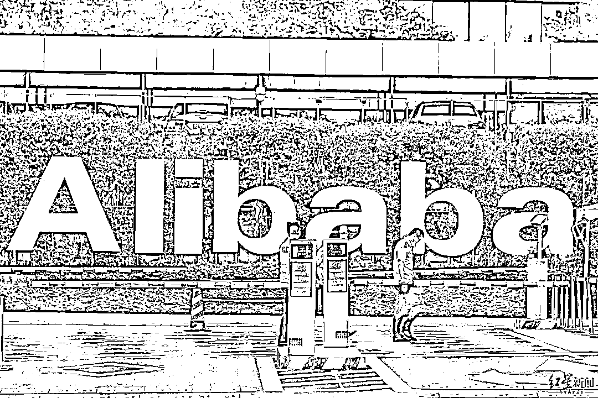
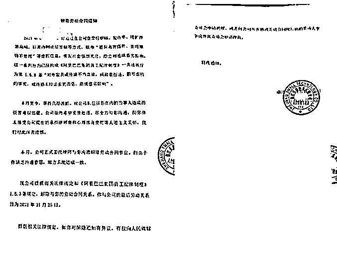

# “阿里女员工”周某被开除

> 原文：[`mp.weixin.qq.com/s?__biz=MzIyMDYwMTk0Mw==&mid=2247525781&idx=2&sn=b5c9fd0f3f2da19126e49e8f49dbba24&chksm=97cbaeada0bc27bb62796d171cc53c67c7361923aa7855c6082ae25c3a0140ed76b4e5aa52e7&scene=27#wechat_redirect`](http://mp.weixin.qq.com/s?__biz=MzIyMDYwMTk0Mw==&mid=2247525781&idx=2&sn=b5c9fd0f3f2da19126e49e8f49dbba24&chksm=97cbaeada0bc27bb62796d171cc53c67c7361923aa7855c6082ae25c3a0140ed76b4e5aa52e7&scene=27#wechat_redirect)

**此前报道：**

[阿里巴巴女员工遭领导性侵及商家猥亵？现场视频冲上热搜！](http://mp.weixin.qq.com/s?__biz=MzIyMDYwMTk0Mw==&mid=2247518670&idx=1&sn=69f5b8ed79fe03065a7d00caeb62dab0&chksm=97cb42f6a0bccbe0bd7aae0613b9fb97367ba5a063e5cc4d173e062c13a32faa15ca0cf097b9&scene=21#wechat_redirect)

[阿里女员工事件王某文妻子：周某主动勾引我丈夫，其酒量极好](http://mp.weixin.qq.com/s?__biz=MzIyMDYwMTk0Mw==&mid=2247519457&idx=4&sn=0e250cbbed0c8f1c20f41553418521f0&chksm=97cb47d9a0bccecfe553cae769749f1fc6a201ba0bff39dd8387b7d88e4501195dd5e42bd5c6&scene=21#wechat_redirect)

[阿里女员工被侵害案：阿里女员工案涉事男领导不构成犯罪，拘留 15 天！](http://mp.weixin.qq.com/s?__biz=MzIyMDYwMTk0Mw==&mid=2247520393&idx=2&sn=173eeea5aaff84b8760647dbb5ddc524&chksm=97cb5bb1a0bcd2a728f83436e690e5868833a9f675c8f0190e4231a9a5d96439de1179ff906b&scene=21#wechat_redirect)

["阿里女员工案张某妻子"再发声，用 4600 余字长文控诉周某诬告陷害](http://mp.weixin.qq.com/s?__biz=MzIyMDYwMTk0Mw==&mid=2247523513&idx=3&sn=22bb3c8bb49acb91afb0130d8a169061&chksm=97cb5781a0bcde97a84b8122d329189e1f212667bfcc06b071e12a4a12a637f84fa9c7ad4002&scene=21#wechat_redirect)

据媒体报道，**阿里已经与自称被“性侵”的女员工周某解除劳动合同**。 

2021 年 8 月初网上曝出“阿里女员工遭性侵案”以来，事件多次登上热搜榜并衍生多起相关诉讼案。12 月 9 日，周某接受采访时表示，已在 11 月底收到了公司寄来的纸质“解除劳动合同通知”。

通知中称：2021 年 8 月 6 日，你通过在公司食堂拉横幅、发传单、用扩音器高喊，以及内网论坛发帖等方式，散布“遭到高管强奸、公司知情不处理”等虚假信息，引发社会强烈关注，给公司造成恶劣影响。

这一系列行为已经构成《阿里巴巴集团员工纪律制度》一类违规行为第 1.5.3 条“对外发表或传播不当言论，或故意捏造、散布虚构的事实，或传播未经证实的消息，造成恶劣影响”的规定。该通知落款为浙江天猫技术有限公司。

12 月 10 日，阿里工作人员表示，查询不到周某及其花名“新月”。

周某之后在接受媒体采访时表示，**案件不应该被娱乐化**。

8 月 14 日，两位涉事男主王某文、张某因涉嫌强制猥亵罪，被济南市公安局槐荫区分局依法采取强制措施，没有证据证明有强奸犯罪事实发生。

9 月 6 日，槐荫警方再次通报称，按照槐荫区人民检察院不批准逮捕决定，依法对王某文**终止侦查**。另一当事人张某则被采取刑事强制措施后被批准逮捕。

12 月 1 日，阿里巴巴原同城零售事业群总裁、本地生活事业群总裁李永和诉请法院判令被告周某在全国性网站首页显著位置连续 15 日书面向原告赔礼道歉，为原告消除影响、恢复名誉并索赔人民币 1 元。

李永和曾因对该事件处理不及时而引咎辞职。

目前，该院对该起诉讼已依法受理立案。目前，被告周某表示代理律师已向余杭法院递交答辩状和中止审理申请。

以下为周某接受大河报采访时的书面回复：

**记者：此案是最近几年来影响最大的公共事件之一，发酵以来，对你的个人生活和工作造成了哪些影响？**

> **周：说句实话，我不太想对外讲这些，因为总会给人一种在卖惨博可怜的感觉。我确实很惨，先是被侵犯，然后是自己和家人被网暴，每天都能接到大量侮辱谩骂的电话和短信，崩溃到多次割腕、跳河自杀，到后来患上严重心理疾病。可是即使如此，我也不想大家从这个角度来关注这件事情。这个案子，是涉嫌刑事犯罪的案子，我不想大众把它娱乐化，如果有人关注，我希望大家关注的是女性身体权益和女性劳动者权益遭受侵犯后相关部门的处理及最终的结果。**

**记者：有消息说，阿里已经将你除名，具体情况是怎么样的？公司是以什么方式通知这个结果的？解除劳动合同的理由是什么？**

> **周：双十一前，我多次向公司追问我的休假安排，公司表示后续会安排，让我等待即可。双十一后，公司短信告知我会有律师联系我处理相关事宜。**
> 
> **11 月 15 日和 23 日律师约我面谈，面谈时没有收到任何纸质的委托书和书面材料，再次向律师及公司领导重申请假诉求及递交请假材料。11 月 25 日我收到公司邮件，宣布与我解除劳动合同，11 月 28 日收到纸质解除劳动合同文件。**
> 
> **薪资发放至 11 月 25 日，没有收到任何补偿或赔偿。公司与我解除劳动合同的理由是说我违反了《阿里巴巴集团员工纪律制度》中的“对外发表或传播不当言论，或故意捏造、散布虚构的事实，或传播未经证实的消息，造成恶劣影响”的规定。**

> **对此我想说，不管是我私下找领导处理，还是投诉无果在饭堂维权，或是在阿里内网发文章，均是在阿里内部反馈问题，从未对外传播。在事情发酵后，我也从未接受过任何媒体采访，没有“对外发表不当言论”。**
> 
> **两个案件当事人，一个被公安机关处以最高行政处罚，一个涉嫌刑事犯罪被移送起诉，司法机关的处理证明我反馈的问题并非“虚构”的事实。并且，问题之所以发酵，造成了“恶劣影响”，是犯罪者的恶劣行径，是公司相关人员的不作为导致，并不是受害者的过错。**

**记者：你有什么样的诉求？**

> **周：员工因为工作遭受到侵犯，没有等到公司的关怀，反而却等到了一纸辞退书，真是让人心凉又心寒。我工作上没有犯任何错误，公司无权开除我，作为国内互联网企业的引领者，其在劳动法的落地和实施上竟是如此可笑，让人不得不瞠目咋舌。作为案子的受害人，尚且没有得到应有的关怀和帮助，却宣称成立了各种所谓的组织来维护女性和员工的权益？是真的关心关怀女性，还是在作秀？让人不得不深思。我没有犯任何错，肯定是不接受这个结果的，后续会用法律手段维护自己的权益。**

**记者：根据之前媒体报道，你近来的身体和精神状况不是很好，能否介绍一下具体情况？是否就医？**

> **周：这个事情对我的身心造成了极大的伤害，9 月份开始已经就医治疗，先是诊断为重度抑郁，后确诊为双向情感障碍，目前已遵循医嘱从综合医院转至精神专科医院治疗。由于个人原因，未接受医嘱住院，采取在家药物治疗。**

**记者：事件一波三折，相关方不断在公共领域发声，你只有一则律师声明，后来很少公开发声，是什么原因？**

> **周：一是案子涉及刑事案件，相关机关希望各方可以尊重并配合司法机关的调查，所以我一直在积极配合，并耐心等待最终结果。二是截至目前，此案件两个当事人，一个被公安机关处最高行政处罚，一个涉嫌刑事犯罪被移送检察院起诉，我相信法律不会冤枉一个好人，司法机关的处理结果，是对一切谣言的最好回复，没必再要去争论。三是有些人不断散播不实信息，对我进行中伤和污名化，无非是想将刑事案件娱乐化，偷换概念变成“男女情事”，以图达到减轻处罚的目的，简直荒唐可笑，无回复必要。**

**记者：原阿里副总裁李永和公开发声称起诉你以后，你选择了发声回应，为什么？**

> **周：之前的案子涉及刑事案件，由于案子尚未审理完毕，为了配合相关司法机关的工作，所以一直并未发声。但是在这段时间，对方家属和一些网友一直在恶意抹黑和中伤我，说我是商业间谍，说我职业就是陪酒女，说我是销售为了业绩自导自演，说我和王某文与张某有不正当关系等等，这些毫无依据张嘴就来的谣言对我造成了极大伤害。没想到刑事案件尚未完结，又跳出来一个起诉我名誉侵权的人，而且还是一个我向他反馈完问题他已读不回消息，完全没有跟我有过任何沟通和交流，在公司调查后主动引咎辞职的人。**

> **有第一个就可能有第二个、第三个…… 我不知道未来，还会有多少可笑荒唐的人和事，面对这种种伤害，我决定不再沉默，勇敢发声。**

**记者：怎么看待事件中王某妻子和张某妻子对事件以及你本人的一些质疑？是否关注几个月以来事件的新闻报道？你希望对这些质疑做一下澄清或者给予回应吗？**

> **周：首先，同样身为女性，这两位让我觉得可怜又可悲。可怜是因为某种程度上她们也是受害者，可悲是面对司法机关的处理，她们仍然还不愿相信事实，试图以污蔑中伤另一个可怜的女性来为自己的丈夫来洗白。事发之时，两位“妻子”均不在现场，对当时情况均不了解，却能夸夸其谈，大讲特讲自己的丈夫有多正义多善良多冤枉，而两位“妻子”甚至在事发前都不认识我，却也能洋洋洒洒写上 N 条我的罪名。**

> **如果真的冤枉，两位“丈夫”为何不出面澄清？为什么要让“妻子”来代劳？我理解她们的救夫心切，但是我理解不了她们的三观。面对这些无稽之谈，我觉得没有任何回复的必要。但是这些谣言的账号和文章，我们均已保存证据，后续会用法律手段维护合法权益。**

**记者：如今回头看，最初的 8000 字长文有没有可能需要修正的地方？比如关于强迫出差、劝酒、酒局后发生的事等等环节。**

> **周：由于案件还在审理阶段，所以针对细节，我暂时不方便讲太多，只简单讲几点：关于王某文案：王某文是在取消打车软件返回酒店之后才接到同事电话的，并且我当天从未电话联系过他，不存在因为接到我或者同事的电话，出于关心才返回去的。并且，当时他返回酒店办理的是同住，如果只是关心醉酒女同事，并无不良居心，其大可与工作人员一起或者办张房卡，为何要办理同住？其次，其有确凿的犯罪行为（记者注：部分文字作隐藏）。**

> **最后并不是像其妻子所言突然良心发现才选择离开，而是接到同事电话，由于害怕才慌忙离开。**

> **关于张某的案子：**
> 
> **我从未主动邀请张某来酒店找我，而且也不知道其在没有登记和房卡的情况下是怎么来到我酒店房间门口的 (希望酒店可以给予回复)。此外，在酒店房间张某偷拍我被我发现，我在张某手机上还发现有其他女性照片。目前关于王某文的案件，我已授权律师向检察院提出申诉，关于张某的案子，等待检察机关的处理。其他有关案件的细节，在案子处理结束后，会根据情况再做回复。**

**记者：这些信息是怎么掌握的？之前的 8000 字文为什么没有？有没有向警方反映或者提交证据？**

> **周：我看到张某拿着手机似在偷拍我，于是从他手里抢过手机查看，这件事情在警方问询时已全部告知，所有细节均已记录在案。之前的文章发布的主要目的是向公司内部领导反馈问题，希望公司高层看到后可以出面解决问题，所以重点讲述了王某文的事情。事发时我处于醉酒状态，很多详细信息都是在后续调查中知道的，因此像以上两点信息之前的文章里才没有提到。**

**记者：你跟警方是否一直保持沟通？对警方目前处理的情况持什么样的态度？期许是什么？**

> **周：目前和案件相关的事宜均由律师在帮忙对接，对此大家如有问题，可以咨询我的律师。警方办案有其规章制度和流程，我相信肯定会秉公处理的。一起期待最终的结果。记者：回过头来看此事，在后续处理上，你认为自己存在过激行为吗？周：事情发生后，我第一时间报警，在配合完警方的工作后，我又顾及公司形象小范围多次向公司领导反馈。我觉得作为一个女性受害者，能够勇敢站出来，且能够如此理智客观的去处理事情，已经是很值得肯定的了。**

> **然而正是由于有关人员不作为，在一次次投诉无果后，事情才扩大发酵成现在的局面，问题出在哪里可想而知。我的诉求从来没有改变，一是坏人得到相应处罚，二是公司给一个长假好休息调养。然而目前案件还在审理中，我却等来了公司的一纸辞退书。大家不去谴责犯罪者的无耻，不去质疑相关人员的不作为，却要给受害者扣一个“过激”的帽子，真是太可笑了。**

**记者：你还有什么想对家人和公众说的吗？**

周：

> **对公众：事情发酵后，我收到过很多女性的留言，说曾在职场遭受过性侵和灌酒，但是却没有勇气站出来，最后大多以忍气吞声和离职处理。对她们的遭遇，我感到很心疼，但对她们的处理方式，我也感到理解。**

> **遭受侵犯已经对受害者造成了很大的伤害，后续处理时也会遭受很多二次伤害，所以我不呼吁这些受害者有多勇敢，可以大胆站出来，我只希望你们可以早日走出阴影，过普通平凡的生活。但是我的性格就是如此，或许是年轻，仍然觉得这个世界就是一个非黑即白的世界，如果那些坏人没有得到惩罚，我可能一生都走不出这个阴影，甚至可能不会过完这一生，所以我选择坚持到底。但是我更希望有一天，这个社会在面对性侵案件时，不再有对被害者的侮辱和谩骂，而是有更多呵护和关怀。**

> **对家人：感谢一直陪在我身边的老公，想对他说，不管多久，我仍然记得第一次见你时的怦然心动，未来我会好好的，我们也会好好的。同时也感谢杜鹏律师和裴杰律师，这几个月他们像家人一样陪伴我，他们既有专业性，也富有同理心，没有他们的付出和帮助，我可能坚持不到现在，谢谢你们。我更要感谢在这个事情上给予我关心和帮助的公众，是你们的关心和帮助让我有继续坚持下去的勇气，衷心感谢你们。**

来源：IT 之家

← 向右滑动与灰产圈互动交流 →

