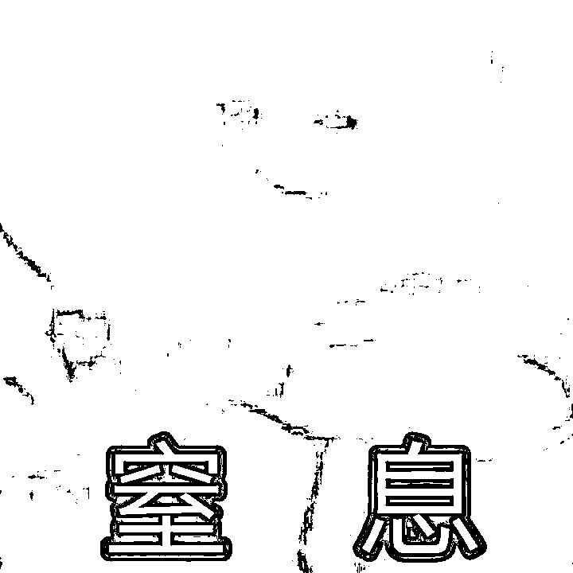
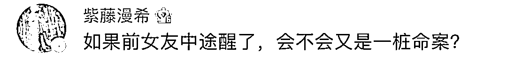
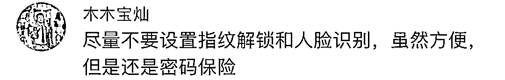

# 热搜第一！趁女子熟睡，前男友竟翻开她眼皮，刷脸转走 15 万…

> 原文：[`mp.weixin.qq.com/s?__biz=MzIyMDYwMTk0Mw==&mid=2247525781&idx=3&sn=20d08ab40a652fa88b65bbc06c9eb5cd&chksm=97cbaeada0bc27bbfda8739fb49a5eea6c582eb2cc757b87c41a6563db7e097837000040e4ab&scene=27#wechat_redirect`](http://mp.weixin.qq.com/s?__biz=MzIyMDYwMTk0Mw==&mid=2247525781&idx=3&sn=20d08ab40a652fa88b65bbc06c9eb5cd&chksm=97cbaeada0bc27bbfda8739fb49a5eea6c582eb2cc757b87c41a6563db7e097837000040e4ab&scene=27#wechat_redirect)

从指纹到刷脸 

现在支付解锁越来越便捷

很多人也不免担心其中的安全性 

最近，有人就在熟睡中 

被人“刷脸”盗走了十几万

事件回顾

黄某辉是广西合浦人 

因赌博欠下债务

便产生了从前女友那弄钱的念头

2020 年 12 月 26 日上午，他打电话给前女友董某，说要当面商量偿还恋爱期间自己借的 6 万多元的事情。 

当天下午，黄某辉提着菜来到董某家中，**殷勤地主动做起了饭。看到董某正在生病，他还“贴心”地送药给董某吃。董某喝了冲泡的感冒冲剂，加上生病，便渐渐昏睡过去。**

**令人窒息的操作开始了！**

黄某辉看到董某昏睡过去，

**用董某的指纹解锁了她的手机，**

**然后翻开董某的眼皮，**

用人脸识别功能进入支付。

然后分多次从董某的花呗、借呗、支付宝余额和银行卡转走人民币共 15.41 万元，最后通过套现将这些钱转到自己的支付宝上。

离开时，黄某辉还带走了董某的另一部手机和一件外套。随后，黄某辉将这些钱用于生活开销、赌博和还债。次日凌晨，董某醒来后发现手机有转账信息，打电话给自己的另一部手机和黄某辉的电话均无人接听，便向公安机关报案。

今年 4 月 23 日，逃到外地的黄某辉被公安机关抓获。

**据了解，黄某辉 2016 年**

**因犯诈骗罪曾被判处**

**有期徒刑三年，缓刑三年**

近日，广西南宁市兴宁区人民法院对该案作出一审判决，认定黄某辉以非法占有为目的，采用秘密手段窃取他人财物，数额巨大，构成盗窃罪，依法对被告人黄某辉判处有期徒刑三年六个月，并处罚金人民币 2 万元。

有网友好奇

**这么翻眼皮也不会醒吗？**

有网友则后怕

‍‍‍‍

**万一中途醒过来**

**是不是就变成一桩命案了**

也有“单身狗”忿忿不平

**怎么什么样的人都有女朋友？**

大多数网友还是在感叹

**看来还是数字密码靠谱！**

你对刷脸支付放心吗？

大家可以留言区讨论观点～

来源：长沙晚报、齐鲁晚报、南宁晚报、网友评论

← 向右滑动与灰产圈互动交流 →

