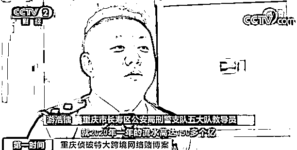
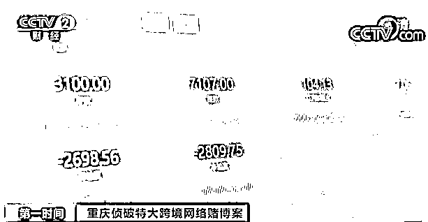
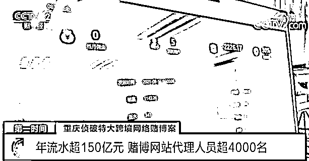
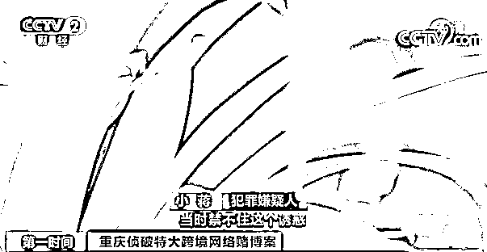
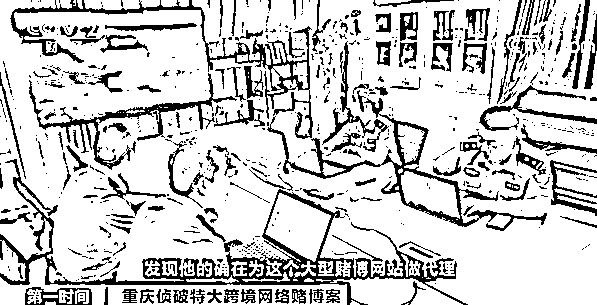
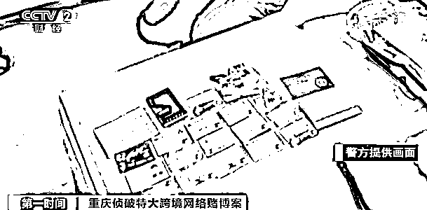

# 惊天大案！年流水超 150 亿元！特大跨境网络赌博案侦破，170 人已被抓

> 原文：[`mp.weixin.qq.com/s?__biz=MzIyMDYwMTk0Mw==&mid=2247525781&idx=4&sn=e721ff644bf78913ef1f011cca72e9a7&chksm=97cbaeada0bc27bb3b3edafa90a5e8a80900de0eac8dc6987711149effdeec62344c50774145&scene=27#wechat_redirect`](http://mp.weixin.qq.com/s?__biz=MzIyMDYwMTk0Mw==&mid=2247525781&idx=4&sn=e721ff644bf78913ef1f011cca72e9a7&chksm=97cbaeada0bc27bb3b3edafa90a5e8a80900de0eac8dc6987711149effdeec62344c50774145&scene=27#wechat_redirect)

前不久，重庆市公安局侦破了一起特大跨境网络赌博案件，抓获犯罪嫌疑人 170 余名，大批涉案资金被冻结。

年流水超 150 亿元
赌博网站代理人员超 4000 名

[`mp.weixin.qq.com/mp/readtemplate?t=pages/video_player_tmpl&action=mpvideo&auto=0&vid=wxv_2176208746228547589`](https://mp.weixin.qq.com/mp/readtemplate?t=pages/video_player_tmpl&action=mpvideo&auto=0&vid=wxv_2176208746228547589)

△央视财经《第一时间》栏目视频

2020 年 10 月，重庆市长寿区公安分局在工作中发现，东南亚某国的一款网络赌博软件在我国境内大肆发展线上代理推广人员，并通过代理推广人员招揽参赌人员，涉案流水特别庞大。

**重庆市长寿区公安局刑警支队五大队教导员 游浩镭：**2020 年一年的流水高达**150 多亿**，后来经过我们研判、分析梳理，一共掌握了全国近 4000 多名大型赌博网站的代理人员相关身份信息以及证据。

经调查，该犯罪团伙职责分工明确，在境外架设服务器，开设专用的赌博 App，上面有体育赛事（如赌球）、百家乐、德州扑克、斗牛、赛车等多种形式的赌博活动**。该团伙在国内发展多级代理人，由各级代理人负责引诱、招揽赌博者参与。**  

比如，**参赌人员有 1 万元的亏损，赌博网站就会将这 1 万元的 30%到 55%，**按照代理的等级**，转给代理。**但是也有**很多人在盈利的同时参与赌博，把这些钱也输进去了，甚至倾家荡产。** 

赌博网站设套
参赌人员先赢后输倾家荡产

[`mp.weixin.qq.com/mp/readtemplate?t=pages/video_player_tmpl&action=mpvideo&auto=0&vid=wxv_2176209269728018433`](https://mp.weixin.qq.com/mp/readtemplate?t=pages/video_player_tmpl&action=mpvideo&auto=0&vid=wxv_2176209269728018433)

△央视财经《第一时间》栏目视频

小蒋就是这 4000 多个赌博网站代理人中的一员。2014 年，他刚满 18 岁，中专毕业，无意中接触到了网络赌博。

起初，小蒋和大多数人想法一样，先观察观察，赚点钱就退出。不过，刚进群的时候小蒋运气特别好，连续投注半个月，他就赚了一两万元，被冲昏头脑的小蒋，就这样陷入了网络赌博的深渊。很快，他就开始从赢钱变成输钱，为了想赢回输掉的钱，他开始借钱赌博。

六年里，小蒋都沉迷于网络赌博，深陷无底泥潭，不仅没有赚到钱，欠的债还越来越多。**为了赚钱翻本，他最后参与了境外赌博网站的代理。**  

警方对蒋某进行了大量的调查工作，发现他的确在为这个大型赌博网站做代理，并且也在警方负责的辖区内招揽了十多名参赌人员，甚至还有学生。就在对警方蒋某抓捕的前一天晚上，发现他还在这个网站参与赌博，一共输掉了 20 多万元。

沉浸在网络赌博中的小蒋，不仅没有赚到钱，**还拖累父母为他还债 100 多万元，直到因涉嫌开设赌场罪被警方抓获，如今他后悔不已。**

全国收网
警方抓获犯罪嫌疑人 170 余名

[`mp.weixin.qq.com/mp/readtemplate?t=pages/video_player_tmpl&action=mpvideo&auto=0&vid=wxv_2176209796163502081`](https://mp.weixin.qq.com/mp/readtemplate?t=pages/video_player_tmpl&action=mpvideo&auto=0&vid=wxv_2176209796163502081)

△央视财经《第一时间》栏目视频

在这个犯罪团伙里，像小蒋这样，深知网络赌博的危害，但为了高额回报，把更多人拉进深渊的人，并不在少数。

其中，有一个犯罪嫌疑人，也是这个赌博网站的代理。他专门做足球解说的主播，粉丝有几十万人，他在平台上发了推广链接，很多粉丝成为他的下线参赌人员，开始赌球。  

警方介绍，网络赌博靠虚假宣传诱导公众参与，导致受害者深陷泥潭，遭受巨大的资金财产损失，甚至家破人亡，具有严重的社会危害性。今年以来，重庆警方开展收网行动，出动上百警力，辗转海南、广东、四川、湖南、山东、福建等地，**截至目前，已抓获犯罪嫌疑人 170 余名，均为赌博网站代理人员，查证涉案资金流水 156 亿元**，查扣冻结一大批资金。目前案件仍在继续侦办中。

警方表示，以营利为目的、聚众赌博或者以赌博为业的，无论线上线下，均构成犯罪。同时提醒广大群众，一定要认清网络赌博的骗人本质及严重危害性，切勿泥足深陷。

来源：央视财经（ID：cctvyscj）

← 向右滑动与灰产圈互动交流 →

