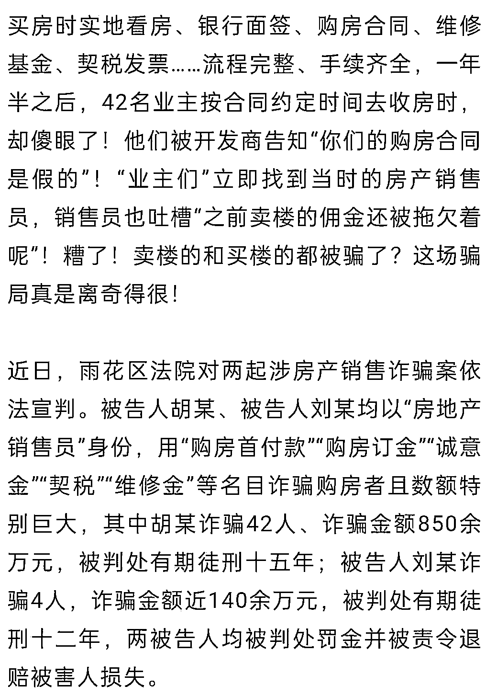
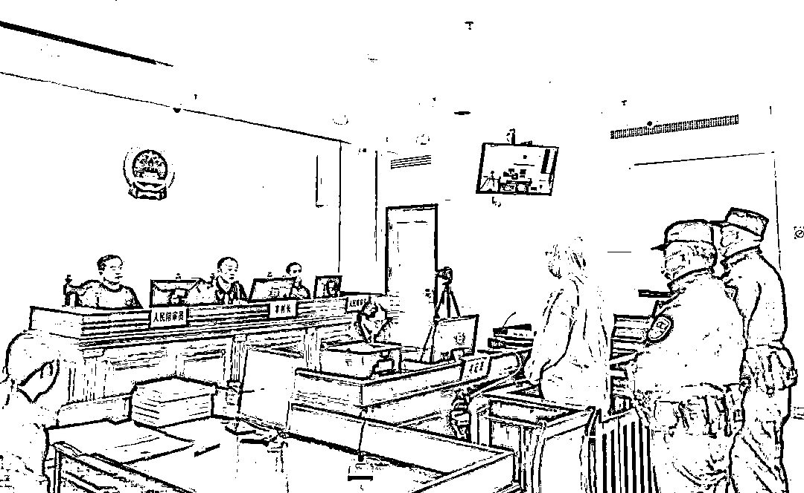
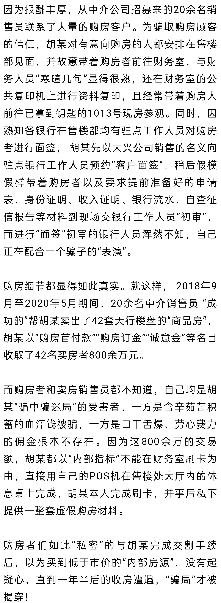
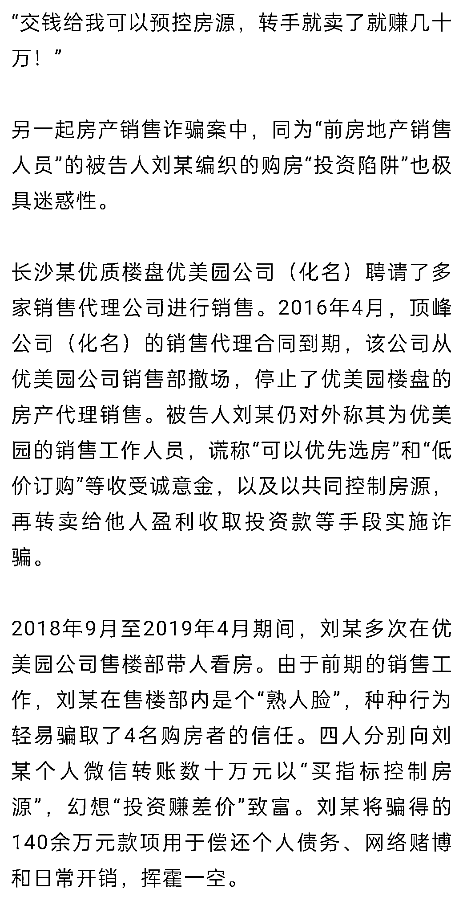

# “骗中骗迷局”，他们首付 856 万在长沙买了 42 套假房！

> 原文：[`mp.weixin.qq.com/s?__biz=MzIyMDYwMTk0Mw==&mid=2247525781&idx=5&sn=18fa8c34f03126471cabbc7c24fab94a&chksm=97cbaeada0bc27bb4c3c3296e92cdfdb44d639f41a242dc61f27eb20a8dc9c1e947fccc40485&scene=27#wechat_redirect`](http://mp.weixin.qq.com/s?__biz=MzIyMDYwMTk0Mw==&mid=2247525781&idx=5&sn=18fa8c34f03126471cabbc7c24fab94a&chksm=97cbaeada0bc27bb4c3c3296e92cdfdb44d639f41a242dc61f27eb20a8dc9c1e947fccc40485&scene=27#wechat_redirect)

**  买房遭遇离奇诈骗  **  

[`mp.weixin.qq.com/mp/readtemplate?t=pages/video_player_tmpl&action=mpvideo&auto=0&vid=wxv_2173262824100167681`](https://mp.weixin.qq.com/mp/readtemplate?t=pages/video_player_tmpl&action=mpvideo&auto=0&vid=wxv_2173262824100167681)

**  售楼部里的“骗中骗”迷局  **

胡某原是某房产开发商天行公司（化名）合作销售方大兴地产（化名）公司的销售人员，2017 年 5 月开盘的天行楼盘销售异常火爆，“一房难求”的市场行情与多年的工作经验，让售楼部里的胡某动起了歪脑筋，开始“酝酿”诈骗的“完美计划”。

**  迷局的前期细节准备  **

2017 年 7 月，胡某从大兴公司辞职，开始忽悠大兴的前同事们：自己搞了个装修公司，想提前获得购房业主们信息。骗取了前同事们的信任后，胡某每天继续“活跃”在售楼部，尤其是在公司财务室和银行驻点面签站两个重点岗位混个脸熟，他还以“装修便利”名义从物业处骗得天行楼盘 1013 号现房钥匙。然后，胡某开始了魔幻操作——

**  魔幻操作四步走  **

第一步，私刻了开发商“天行公司”的假冒公章，将自己原来作为销售员留存在手机内的天行公司购房合同、认购书、收据、交房通知书等电子文档修改后，找到打印店打印，加盖私刻的“天行公司”的假冒公章，做成逼真的“购房合同”；第二步，自己注册了一家“皮包”公司，办理“POS”机，并通过“APP”将收款商户修改为“天行公司”；第三步，在网上找人办理假的维修基金、契税单等；第四步，从房产中介公司招募了一批销售员，向他们谎称自己可以通过天行公司高层关系拿到低于市场价格的内部房源，并承诺成功卖一套房报酬 1 至 2 万元。 

**  做戏做全套：都是受害者  **

**  买指标赚差价”：诱人的投资陷阱  **

法

**法官提醒** 

**购房者警醒：“天降馅饼”，定有大坑！**

在以上两案中，被告人胡某和刘某均以认识开发商高层有“内部指标”为诱饵，骗得想获得“价格优惠”“选房优惠”的购房者信任。为此，法官警示，购房前可通过网络查询拟购楼盘的基本情况，购房时走正常途径和交易程序，知晓一般市场规律、保持头脑清醒，务必警惕购房款须打入个人账户或非售房单位银行账户的情况。同时，银行的房贷程序，需要提供收款收据、增值税专用发票等付款凭证，购房资格确认书、认购书及正式的房屋买卖合同，以及后续贷款材料，才能够申报贷款。银行“房贷”审批的同时，也是有效的监管，不可掉以轻心，可以通过银行审批程序进行核实、佐证。

**开发商、代销公司警惕：“外包销售”，严格管理！**

开发商找销售代理公司进行楼盘销售，比较常见。法官在案件审理实践中发现，代销公司对销售员、营销中心的管理比较松散。以上两案的被告人均为代销公司的前销售员，他们熟知行业术语、操作流程，并且掌握了交易合同与文书的电子文本，以及他们在行内的“熟人脸”为犯罪提供了便利条件。开发商和代销公司一定要加强人员和财务方面的管理，尤其是销售现场的规范管理，可以在销售场所公示销售人员的照片和相关工作信息、设置对购房者的相关提醒信息等，严格把关，杜绝类似诈骗案件发生。

来源： 长沙市雨花区人民法院，潇湘晨报

← 向右滑动与灰产圈互动交流 →

