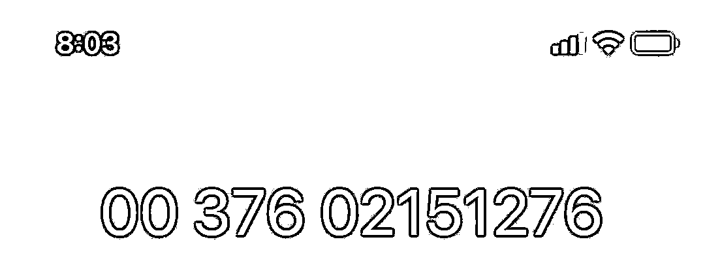
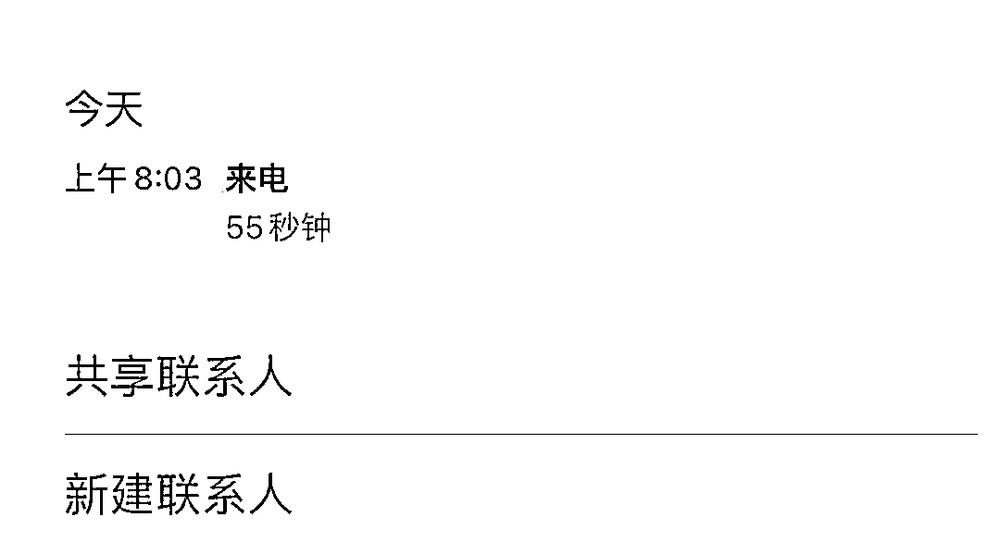

# 太嚣张了！诈骗分子竟然想过来抓民警……

> 原文：[`mp.weixin.qq.com/s?__biz=MzIyMDYwMTk0Mw==&mid=2247525781&idx=6&sn=d1e3587bbeb0b7f2bf5badabb1934de5&chksm=97cbaeada0bc27bb2aff1c273a9554960b05563f2a826e619b76cd557f3ed01c5e8f86d65c86&scene=27#wechat_redirect`](http://mp.weixin.qq.com/s?__biz=MzIyMDYwMTk0Mw==&mid=2247525781&idx=6&sn=d1e3587bbeb0b7f2bf5badabb1934de5&chksm=97cbaeada0bc27bb2aff1c273a9554960b05563f2a826e619b76cd557f3ed01c5e8f86d65c86&scene=27#wechat_redirect)

一定是特别的“缘分”

冒充警察的电诈骗子

居然把电话打到了民警的手机上

**1**

* * *

**第一轮** 

**“我是河池市公安局民警”**

****“你已涉嫌违法犯罪”****

近日，民警小李的手机接到一个

以 00376 开头的电话 

同时手机上的**国家反诈中心 APP**

也弹出**“疑似诈骗号码”**的相关提示

小李本想第一时间挂断电话

转念一想决定将计就计

看看骗子的“演技”如何

起初骗子“胸有成竹”

**自称是“河池市公安局民警”**

**称小李涉嫌违法犯罪，**

**为了让小李信服，**

**诈骗分子说出了民警的真实姓名和住址。**

接着骗子一本正经地表示

可以在电话里录音做笔录，

还提出加好友发送警官证照片来证明身份，

“贴心”地说可以帮小李处理好这个事情，

**但要小李交手续费到安全账户上，**

**并警告小李一定要全程保密，**

**不然就对小李进行逮捕。**

****

**2**

* * *

**第二轮** 

**“你如此不配合那就等着我们去抓你吧”**

骗子按照剧本念完台词后

告诉小李可以到“河池市公安局”（说出具体地址）

当面办理相关手续，

小李回答说自己就在公安局附近，

请对方等一下。

感觉到事情暴露，

诈骗分子突然语气暴躁，

告诉小李“你如此不配合那就等着我们去抓你吧”，

说完匆忙挂断了电话。

警方提醒广大群众，电信网络诈骗花样翻新，层出不穷，很多招式令群众防不胜防，面对“冒充公检法”一类的电信网络诈骗，群众朋友们一定要提高警惕，多了解一些防诈知识，下载“国家反诈中心”APP 可以很大程度上避免上当受骗。

值得一提的是

APP 虽好，但也别着了骗子的道

千万不要随意点击**陌生链接**进行下载

因为假的“国家反诈中心 APP”已出现！！！

近日，事主廖女士接到一个自称是“某公安局民警”的电话，说她涉嫌洗钱。

随后，对方让她把微信、支付宝中所有资金全部提现到她名下某银行卡内，并发来一个陌生链接，让她点击链接下载“国家反诈中心（诈骗网站）APP”。**在对方的“指导”下，廖女士银行卡内的三千元“不翼而飞”。**

发现自己被骗后，廖女士随即向公安机关报警。

该类诈骗案件中，诈骗分子通过假冒公检法人员身份及伪造相关证件，按精心设计的“剧本”，**利用受害人害怕心理，对其施压，环环相扣、虚情假意，**从而消除受害人疑虑，达到诈骗目的。

**民警提醒广大市民****：**** 公安局、检察院、法院不会通过电话、网络让嫌疑人输入银行卡账号和密码，也不会设置“安全账户”让嫌疑人转账验资。******切记，碰到自称警察、检察官、法官让你转钱验资的，都是诈骗。****

**来源：罗城警务在线、鹿寨警方、南天一剑、阻击诈骗**

****

**← 向右滑动与灰产圈互动交流 →**

****