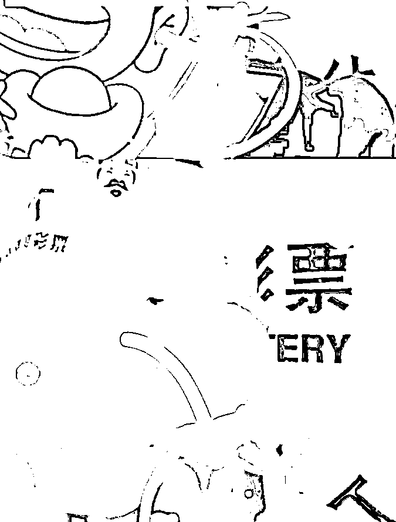
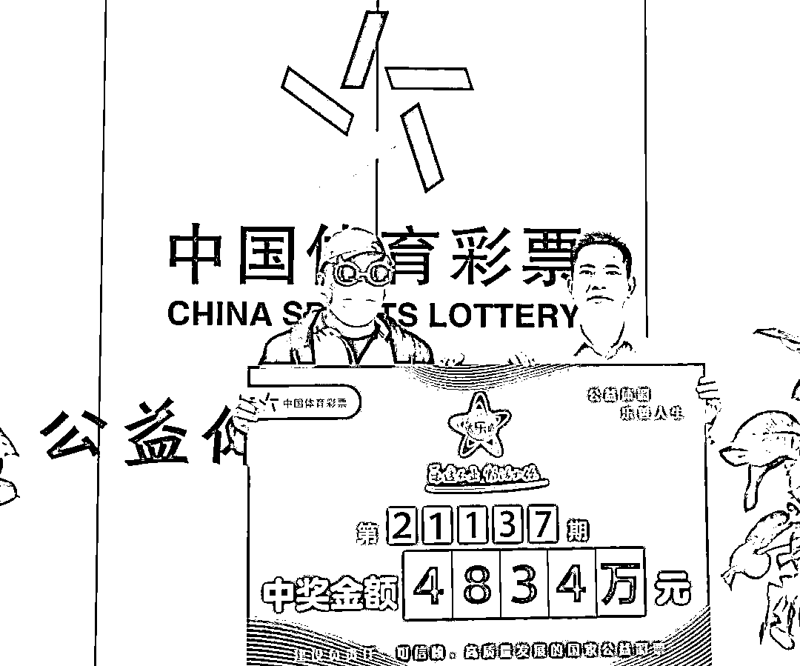

# 两位千万彩票大奖得主黑痣在同一地方，海南体彩回应了

> 原文：[`mp.weixin.qq.com/s?__biz=MzIyMDYwMTk0Mw==&mid=2247525833&idx=3&sn=eb40838f7576fed2283e398c3464c05a&chksm=97cbaef1a0bc27e7764aa468f70a662972d912263d5fdaa61cb9cfff23f0fcb5bb51c18184c7&scene=27#wechat_redirect`](http://mp.weixin.qq.com/s?__biz=MzIyMDYwMTk0Mw==&mid=2247525833&idx=3&sn=eb40838f7576fed2283e398c3464c05a&chksm=97cbaef1a0bc27e7764aa468f70a662972d912263d5fdaa61cb9cfff23f0fcb5bb51c18184c7&scene=27#wechat_redirect)

[`v.qq.com/iframe/preview.html?width=500&height=375&auto=0&vid=f3313azz2nj`](https://v.qq.com/iframe/preview.html?width=500&height=375&auto=0&vid=f3313azz2nj)

12 月 1 日，海南体彩曾经因为在 11 月 30 日大奖领奖现场，领奖人外套里的 T 恤上露出“中国体育彩票”的 LOGO 和部分字样而受到网友的质疑。

近日，“穿工作服领奖”事件刚刚平息，海南体彩再起波澜。

有网友发现，11 月 30 日领奖现场和今年 2 月 1 日领奖现场的领奖人脖子左侧都有一颗黑痣，被网友质疑：“老演员了，原来是同一个人。”也有网友调侃道：“痣同道合”。

从网传的视频截图可以看出，两名领奖者的脖子左侧都有一颗黑痣，但由于视频清晰度和面部遮挡的问题，仅从视频截图上无法确认其位置和大小是否一致，难以判定是否为同一人。但也正因这种巧合，让不少网友“浮想联翩”，嘲讽海南体彩“肥水不流外人田”。

**回应：经核实，并不是同一个人**

12 月 13 日上午，潇湘晨报记者拨打了海南省体彩中心的客服电话，客服工作人员回应记者称，中奖彩票是唯一的领奖凭证，经向财务和开发部门核实，11 月 30 日大乐透 4834 万和 2 月 1 日七星彩 2500 万的中奖者并非同一个人。

来源 ： 潇湘晨报、晨视频

← 向右滑动与灰产圈互动交流 →

