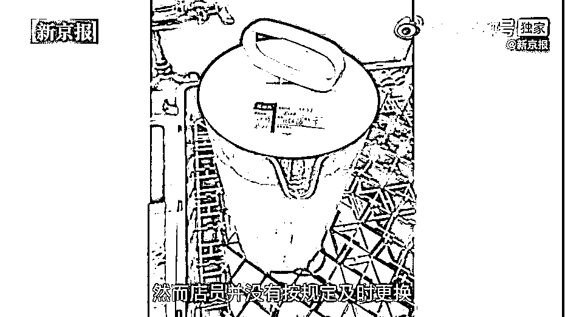

# 星巴克被曝擦垃圾桶抹布擦咖啡机，店员“言传身教”篡改保质期……官方回应：关店！

> 原文：[`mp.weixin.qq.com/s?__biz=MzIyMDYwMTk0Mw==&mid=2247525833&idx=4&sn=c23723a3da0a903e01f1481cecf8d8fa&chksm=97cbaef1a0bc27e72423fdd4b27f9518f2676faa2c2c2103fe7925260b11ee852c081beffbc0&scene=27#wechat_redirect`](http://mp.weixin.qq.com/s?__biz=MzIyMDYwMTk0Mw==&mid=2247525833&idx=4&sn=c23723a3da0a903e01f1481cecf8d8fa&chksm=97cbaef1a0bc27e72423fdd4b27f9518f2676faa2c2c2103fe7925260b11ee852c081beffbc0&scene=27#wechat_redirect)

13 日早间，有消息称，有媒体在无锡市两家星巴克门店卧底调查发现，一些门店频繁触碰了食品安全的红线。食材过期后仍继续用，做成多款畅销饮品售出，如果旧料剩的多，店员会直接篡改保质期。

原本保质期只有一天的红茶液和抹茶液，常常到了过期时间还剩下不少，所以篡改保质期的情况也经常发生。而该店主管也知晓这一行为，主管、店员“言传身教”篡改保质期，有的食材被人为“延保”一周。

篡改食材保质期并不是这家星巴克门店的特殊操作。在星巴克的另一家门店，面对过期的食材，他们也是同样的处理方法。

承诺“开封后不过夜”的糕点，第二天偷偷上架。一名主管更是明确表示，把前一天剩下的摆上柜台继续卖，“先卖昨天剩下的，再卖今天新进的。”

此外，上述门店还存在着用擦垃圾桶抹布擦咖啡机、吧台等物品，且未将该毛巾丢弃，而是继续使用等卫生问题，以及提前处理问题食材应付检查等问题。 

对此，星巴克中国向北青-北京头条记者表示，已经了解到该爆料内容，正在进行内部调查。而记者通过星巴克 App 查询发现，截至发稿时，涉事门店之一的无锡星巴克震泽路店已经显示为“结束营业”，另一家涉事门店——星巴克无锡昌兴大厦店仍可点单。

## **两门店被曝篡改原料保质期**

据新京报“重案组 37 号”栏目报道：星巴克，一家全球知名的咖啡品牌，在国内 200 多个城市拥有超过 5100 家直营门店。星巴克在官网上给出承诺：“以行业最高标准为基础，制定并严格执行星巴克食品安全金标准。”

然而，新京报记者近日在无锡市两家星巴克门店卧底调查发现，在所谓的“金标准”下，一些门店触碰了食品安全的红线：食材过期后仍继续用，做成多款畅销饮品售出；主管、店员“言传身教”篡改保质期，有的食材被人为“延保”一周；承诺“开封后不过夜”的糕点，第二天偷偷上架。

记者卧底多日后发现，上述乱象并非偶发，在利益驱使和监管疏漏下，有些门店奉行着食品安全的“潜规则”。

12 月 13 日，星巴克中国官方微博对此事进行了回应。星巴克称：我们已经关注到有关无锡星巴克两家门店的报道。对于报道中所涉及的食品安全问题，我们深感震惊。对此事件，我们高度关注，已于第一时间关闭了这两家门店，并立刻启动深入调查。进入中国市场 22 年来，我们一直致力于执行严格的食品安全标准，对食品安全问题坚决采取零容忍的态度。欢迎社会公众及媒体对我们进行持续监督。

来源 ：新京报(记者 彭镜陶 韩福涛) 、北京青年报、中新经纬

← 向右滑动与灰产圈互动交流 →

