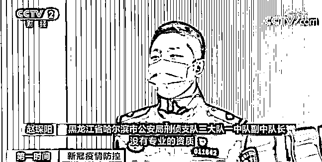

# 小心！骗子盯上了核酸检测→

> 原文：[`mp.weixin.qq.com/s?__biz=MzIyMDYwMTk0Mw==&mid=2247525833&idx=6&sn=7434a9f15a61730a9579ab5b630f7202&chksm=97cbaef1a0bc27e794e1b6d6cc4a212303b33148f06eb15e7cbcf7a8b134944a671411e95931&scene=27#wechat_redirect`](http://mp.weixin.qq.com/s?__biz=MzIyMDYwMTk0Mw==&mid=2247525833&idx=6&sn=7434a9f15a61730a9579ab5b630f7202&chksm=97cbaef1a0bc27e794e1b6d6cc4a212303b33148f06eb15e7cbcf7a8b134944a671411e95931&scene=27#wechat_redirect)

根据目前的疫情防控形势，黑龙江省哈尔滨市要求离哈人员须提供 48 小时内的核酸检测阴性报告。近日，哈尔滨警方在工作中发现了许多伪造的核酸报告。

[`mp.weixin.qq.com/mp/readtemplate?t=pages/video_player_tmpl&action=mpvideo&auto=0&vid=wxv_2177434848175390724`](https://mp.weixin.qq.com/mp/readtemplate?t=pages/video_player_tmpl&action=mpvideo&auto=0&vid=wxv_2177434848175390724)

△央视财经《第一时间》栏目视频

**黑龙江省哈尔滨市公安局刑侦支队三大队一中队副中队长 赵琛阳：通过现场来看，这两张核酸报告，左侧是假核酸报告，右侧是真核酸报告。**

****

****这两张核酸报告，如果不是专业人员，还真分不清哪张是真，哪张是假。**

**

**12 月 8 日，侦查员发现一对夫妻在哈尔滨有个非法采集核酸点，采集之后，这两个人会给被采集人出具一张假的核酸报告。**

****

**黑龙江省哈尔滨市公安局刑侦支队三大队一中队副中队长 赵琛阳：他俩都不是正规的核酸采集员，没有专业的资质，把个人信息、身份证号、手机号一修改，就变成想要核酸报告被采集人的报告。** 

 ****被采集人大多都是学生、商务人士等迫切需要核酸检测阴性报告的人群。**不过想要快速拿到报告，**被采集人要比正常采集核酸多花一到两倍，甚至更多的钱。**** 

****

**两名犯罪分子分工明确，一个负责核酸检测采集，一个负责做假报告，按照被采集人要求的时间内出具。** 

**黑龙江省哈尔滨市公安局刑侦支队三大队一中队副中队长 赵琛阳：会去检验，因为他们也害怕会出现阳性这种情况，虽然采集的手段不是很规范，非法采集，但是他们也要把采集样本，真正送到实验室。**

**这两名犯罪嫌疑人一共非法采集 100 多人，非法获利近万元，目前，两人已被公安机关采取强制措施。**

**来源：央视财经（ID：cctvyscj）**

****

**← 向右滑动与灰产圈互动交流 →**

****