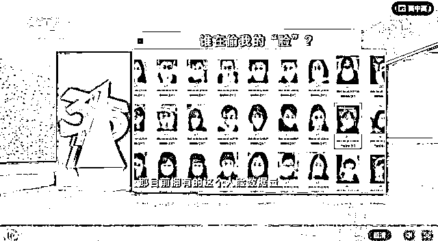

# 采集 43 万张人脸被罚 10 万，一张才 2 毛 3？

> 原文：[`mp.weixin.qq.com/s?__biz=MzIyMDYwMTk0Mw==&mid=2247525910&idx=1&sn=e3d5bd6ba984a6a5f6e2e2a13ded46ef&chksm=97cbad2ea0bc243897aaf6d1517c74a8df81b24800048829840f6632edb49a1c07c4967d68b7&scene=27#wechat_redirect`](http://mp.weixin.qq.com/s?__biz=MzIyMDYwMTk0Mw==&mid=2247525910&idx=1&sn=e3d5bd6ba984a6a5f6e2e2a13ded46ef&chksm=97cbad2ea0bc243897aaf6d1517c74a8df81b24800048829840f6632edb49a1c07c4967d68b7&scene=27#wechat_redirect)

本来在写今天的文章，突然看到一条新闻推送：

**小鹏汽车 6 个月采集 43 万张人脸照片，被罚 10 万**。

我人傻了，必须写写。

**1.**

**具体情况是这样的：**

**近日，上海小鹏汽车销售服务有限公司被徐汇区市场监督管理局罚款 10 万元。**

**处罚事由为——**

**当事人购买具有人脸识别功能的摄像设备 22 台安装在旗下门店，以此统计进店人数并分析男女比例、年龄等。**

**今年**1 月至 6 月，****共采集上传人脸照片 431623 张**。**

**该行为未经得消费者同意，也无明示、告知消费者收集、使用目的，**违反消费者权益保护法**。**

****

**换个角度想，每个月有 7 万人去看车，小鹏的生意好像不错。**

**再安装一个具有采集信息功能的摄像头，把 43 万人的基本情况进行分析比对，精准定位，一举拿下。** 

****也难怪有网友说，被罚 10 万，****真的不亏。****

****

**还记得今年 315 的时候，央视就曝光了商家安装人脸识别摄像头，抓取客户信息的事情。**

**科勒卫浴、宝马 4S 店、MaxMara 等商家纷纷上榜。**

****

**科勒，全球著名的卫浴橱柜品牌。**

**记者暗访时发现，他们在店内安装了具有人脸识别功能的摄像头。**

**在顾客不知情的情况下，进行抓取、识别，**并为每个人形成独特的 ID**。**

**科勒门店的经理说，这个摄像头不仅能识别人脸。**

**更关键的是，**它的供应商，可以根据客户的年龄、性别、衣着等，分析并提出专业的营销互动方案**。** 

**人脸识别率非常高。**

****

**汽车 4S 店也是一样。**

**把数据采集来之后，**和自己超过 100 家门店互通**。**

****

**细思极恐啊，**你以为你是恰好心动的时候接到了销售电话吗**？** 

**不是哦亲，人家早就用大数据把你分析得明明白白了。**

****2.****

**去年，抖音有个特别火的视频。**

**一个男子，**戴着****头盔，在房产销售中心看房**。**

**为的就是防止自己的脸被售楼中心“偷”了。** 

****

**有买房经验的朋友们可能听说过。**

**江湖中有着**“戴头盔买房，少花三十万”**的传说。**

**房企卖房一般有两种情况：**

**1、购房者自己到售楼处来看房，这种叫做“自然到访客户”；**

**2、购房者通过中介带来售楼处，这种叫做“渠道客户”。**

****“渠道客户”，一般就会有一些团购优惠，而房企也需要付给中介一笔提成佣金。****

********

****佣金当然不能瞎给。****

****然而现实中情况总是复杂的。****

****比如老张，自己跑到楼盘看了一次，没相中。****

****但是后来经过房产中介的介绍，又对这个楼盘感兴趣了。****

****这个时候，**老张到底属于“自然客户”还是“渠道客户”呢？******

****中介和房企时常因为这件事扯皮。****

********

****△一位房产中介发布视频称，购房者多掏十几万元****

****于是，“狡猾”的开发商想出了一个主意——一刀切。****

****安装一批人脸识别摄像头，**通过人脸来判客**。**** 

****不管你在谁那里下了单，你第一次是如何踏进售楼处的，就决定了你是哪类客户。**** 

****于是，**为了保留自己的议价权，一些客户开始戴口罩看房了**。**** 

****谁知道疫情爆发以后，人人都戴口罩，房产公司的工程师马上对系统进行了升级。****

****全新的人脸识别系统变成了——**虹膜识别**。****

****戴头盔逛售楼处的情况就出现了。****

********

****当然了，想方设法扒光你的当然不止售楼处。****

****作为一个普通消费者。****

****谁能想到，自己结束了一周的工作，好不容易出去遛个弯。****

****还没踏进店门呢，就被挂在墙上的人脸识别摄像头盯上了……****

****我忍不住想代表广大消费者们问一句：****

******经过我们同意了吗？******

******3.******

****一张脸的背后，是大量的公民信息。****

****包括身份证号、银行卡、手机号等一系列极其敏感的数据。**** 

********

****今年 3 月，新京报记者曾经调查过人脸识别黑灰产。****

****在搜索框中输入“过脸”、“识别技术”等关键词，出现了很多相关 QQ 群。****

****记者随机加入 6 个 QQ 群发现，这些群内的成员从 100 余人到 1700 余人不等。****

****不时有新的成员加入。****

********

****在一些社交平台上，**卖家正在明码标价地售卖人脸识别视频**。**** 

****并且保证，这些视频能通过大多数 app 的验证。****

****一名在暗网中贩卖个人信息的黑产卖家告诉记者：****

****身份证正反面照片、手持身份证照片和人脸点头、摇头视频，**一套 100 元，量大的话可以优惠；******

****如果一次性购买 100 套，价格可压低到 10 元一套。****

****“如果数量少真的便宜不了，我们收集这些信息的成本也高。”****

******看到这里，你还觉得你的脸仅仅是一张普通的脸吗？******

********

****去年 6 月，杭州开庭审理了杭州某大学状告杭州野生动物世界的案例。****

****堪称是**中国人脸识别第一案（）**。****

****因为不愿意刷脸入园，浙江某大学的副教授郭兵被动物园劝退了。****

****于是，一怒之下。****

****教授把动物世界告上了法庭。****

********

****今年 4 月，这个案子迎来了终审判决。****

> ****被告杭州野生动物世界，被判删除原告郭兵办理指纹年卡时提交的包括照片在内的面部特征信息和指纹识别信息，并于判决生效之日起十日内履行完毕。****

******这个案子的意义，远大于****它判决的轻重。****** 

****郭兵在听证会上建议，小区门禁不得强制用生物信息识别。****

****已经被有关方面采纳。**** 

****杭州，也因此成了全国第一个明确禁止物业强制人脸识别的城市。****

****这对于我们所有人来说都应该是一个提醒。****

******我们的脸，真的很“贵”！******

******当然，人脸识别也并非永远方便。****** 

******去年，一位 94 岁的老奶奶行动不便，为了激活她的社保卡，家人将她抬到银行进行人脸识别。******

********“智能”和“智障”，有时候也没有****很明确的界限。********

************

******距离 315 曝光门店采集[人脸数据](http://mp.weixin.qq.com/s?__biz=MzIyMDYwMTk0Mw==&mid=2247512779&idx=4&sn=d85f5383df0f87b0d098811757c37c4b&chksm=97cb79f3a0bcf0e5c353dcfdf35f3989935fce3754b4fcfaaed14aae4796aeb58f877cb39387&scene=21#wechat_redirect)，已经过去了 9 个月。******

******不同的是，9 个月后，我们迎来了《中华人民共和国个人信息保护法》。******

******相信对小鹏汽车的 10 万罚款，只是一个开始。******

******技术本无罪，但是对技术的滥用，可能会让我们的生活面临不必要的风险。******

******说了这么多，道理其实只有一句：******

********我的脸，还****得我自己做主。********

************

******← 向右滑动与灰产圈互动交流 →******

************