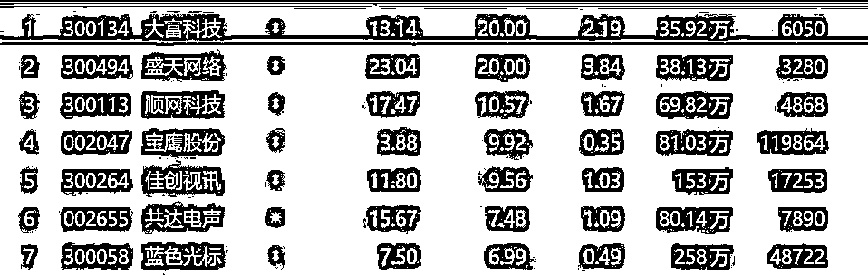

# 6 节元宇宙网课卖出上百万！概念都没弄清楚，卖课的已经赚翻了...

> 原文：[`mp.weixin.qq.com/s?__biz=MzIyMDYwMTk0Mw==&mid=2247525910&idx=2&sn=b0cb01c4428fa5b06b46c970b0fcbf0a&chksm=97cbad2ea0bc2438aa44e8ab9fa17c16756128f2da5316f6cd964187ceb63ac1ded9ab286ee9&scene=27#wechat_redirect`](http://mp.weixin.qq.com/s?__biz=MzIyMDYwMTk0Mw==&mid=2247525910&idx=2&sn=b0cb01c4428fa5b06b46c970b0fcbf0a&chksm=97cbad2ea0bc2438aa44e8ab9fa17c16756128f2da5316f6cd964187ceb63ac1ded9ab286ee9&scene=27#wechat_redirect)

元宇宙是否赚钱还不清楚，**但元宇宙培训已经相当赚钱了。**

近日，一张名为《元宇宙第一课》的网络课程后台截图在社交平台流传。截图信息显示，这门课程**累计收入近 160 万元**，而当时该课程上线仅约 10 天。

网上流传的《元宇宙第一课》后台截图 图片来源：新浪微博@中新经纬

一时间，元宇宙培训课开始“割韭菜”了的声音四起。

**主讲人回应元宇宙网课被质疑**

商品信息显示，《元宇宙第一课》**原价 1888 元，优惠价 688 元**，“一次 688，逐浪元宇宙十年”。不包含书的话，收费 600 元。课程介绍中提到，元宇宙时代赢的人将享受几十倍，甚至上千倍的财富增长，与谁为伍？如何下注？答案就在《元宇宙第一课》。

上述后台截图是 10 日左右在社交平台流传的，一位负责该课程的人士向媒体者介绍，这套课程是 11 月 3 日正式上线的，(截图信息)绝对准确。

截图信息显示，这门课程单日新增用户 370 人，日活跃用户 1175 人，**日收入超 9 万元，累计付费用户 2673 人，累计收入近 160 万元。**

短时间获得巨额收入，有网友质疑，“在概念都没搞清楚的当下，卖这种课不是‘割韭菜’是什么？”

11 月 15 日，《元宇宙第一课》主讲人易欢欢接受媒体采访时回应质疑称，自己没有关注这个课程卖了多少钱，“未来参与元宇宙(发展)的，应该是几千万人，如果拿这个事跟卖的钱相比，就没什么意义。”“我不予理会，理性的人一定会把有品质的东西和哗众取宠的烂品区分开，如果这都区分不开，你干嘛要去跟他讲。”

此外，得到 App 上，一门名为《前沿课·元宇宙 6 讲》的课程价格为 29.9 元，券后 25.9 元。截至 11 月 16 日上午，该课程也**已有 45500 人加入学习**。据得到 App 客服向媒体介绍，这门课程于 10 月 20 日上线。这就意味着，不到一个月时间，在不考虑打折的情况下，**此网课总收入已达 136 万元。**

图片来源：得到 App 截图 

对于这门课的质量以及学习效果，有评论称，“**内容空泛，想了解的话，自己去搜索引擎上完全可以了解**，没必要买这门课”“听完之后，不知道是在讲区块链，还是元宇宙”。

除相关书籍外，近来还有不少 UP 主推出了元宇宙科普视频，在电商平台上，还有元宇宙配件、元宇宙盲盒等热销，可以说现在“万物皆可元宇宙”。还有一些 VR 设备，现在纷纷与元宇宙扯上边，标注为 VR 元宇宙设备。

电商平台在售的元宇宙挂件 图片来源：电商平台截图 

不少购买相关产品的买家评论表示，“一般，概念不错，但是没有太实际的内容，更像是写作文、凑字数”。

图片来源：电商平台截图 

还有网友调侃，“早起的虫儿被鸟吃，只要我反应慢，元宇宙就割不了我，被割‘韭菜’的都是那些敏锐觉察元宇宙趋势并想对此了解的人。”

**10 家公司收函**

**概念股无业绩支撑**

11 月以来，元宇宙概念也迎来新一轮大火。

11 月 16 日，元宇宙概念板块继续走高，大富科技、盛天网络 2 股收获“20cm”涨停，佳创视讯、新国脉等个股股价也涨幅明显。把时间拉长来看，11 月以来，整个板块区间累计涨幅高达 30.49%，12 个交易日间，有 10 个交易日都是呈上涨趋势，仅有 2 个交易日下跌。

11 月 16 日，元宇宙概念股再度上涨

而针对近期元宇宙概念大火的情况，监管也积极采取措施严防概念炒作。据北京商报记者不完全统计，**11 月以来，深交所及上交所向中青宝、易尚展示等 10 家公司下发关注函及监管函。**

在交易所下发的函件中，“蹭热点”多次出现。如深交所要求易尚展示说明公司是否存在通过披露“加大公司对元宇宙行业的投入”进行“蹭热点”，以及相关信息披露行为是否审慎，进而是否存在误导投资者情形。

图片来源：北京商报 

此外，北京商报记者注意到，**部分遭爆炒的元宇宙概念股并不具备业绩支撑。**11 月 16 日大涨的大富科技、佳创视讯等个股今年前三季度业绩呈亏损状态，且扣非后净利润**已连续多年亏损**。此外，据 Wind 数据显示，85 只元宇宙概念股中，有超过三成个股今年前三季度净利同比下滑。

**元宇宙尚无权威定义**

**短期内要保持理性**

元宇宙火出圈，不仅相关概念股收获较大涨幅，资本、巨头更是接连入局。

10 月 29 日，Facebook 官宣正式更名为“Meta”，提出公司重点将是实现元宇宙；11 月 5 日，罗永浩在微博表示，“我们的下一个创业项目是一家所谓的元宇宙公司”。

图片来源：新京报视频截图

微软宣布将为自家会议和视频通话软件添加 3D 虚拟形象与沉浸式会议，打造“企业版元宇宙”；苹果被曝 VR 设备新品已进入测试阶段，预计将在 2022 年发布；华为发布“星光巨塔”布局元宇宙；中国移动旗下咪咕公司公布了元宇宙的 MIGU 演进路线图；小鹏汽车、腾讯、阿里、网易等也纷纷申请注册元宇宙相关商标……

元宇宙被认为是下一个风口，然而截至目前，**市场上并未给出元宇宙的准确定义，其投资前景也尚不明确。**

图片来源：视觉中国 

中国社会科学院数量经济与技术经济研究所信息化与网络经济研究室副主任、中国社会科学院信息化研究中心秘书长左鹏飞接受媒体采访时称，通俗来讲，**元宇宙是一种可以大规模连接的虚拟现实应用场景。**

据报道，复旦大学管理学院信息管理与信息系统系系主任张诚教授指出，当下的元宇宙还未真正出现颠覆性产品和商业模式，相关技术仍处于常规的发展轨道。VR 眼镜和头盔的体验并不完美，游戏所创造的虚拟世界也远远达不到能和现实高度融合的地步。这个领域值得长期看好，但是**在短期内要保持理性。**

图片来源：视觉中国

中信证券则认为，元宇宙没有标准定义。元宇宙是未来 20 年的下一代互联网，是人类未来的数字化生存。终极元宇宙尚需极大的技术进步和产业创新，**可能要到 20-30 年之后才有可能实现。**

此外，中信证券在长达 163 页的报告中所给的投资建议是——当前距离终极元宇宙还有较长的发展路径，**亦具有较多不确定性。当前时间点，很难给出元宇宙的短期受益投资标的。**

来源：北京商报（记者 董亮 丁宁）、中新经纬、中新网、财经网、巴蜀反诈

← 向右滑动与灰产圈互动交流 →

