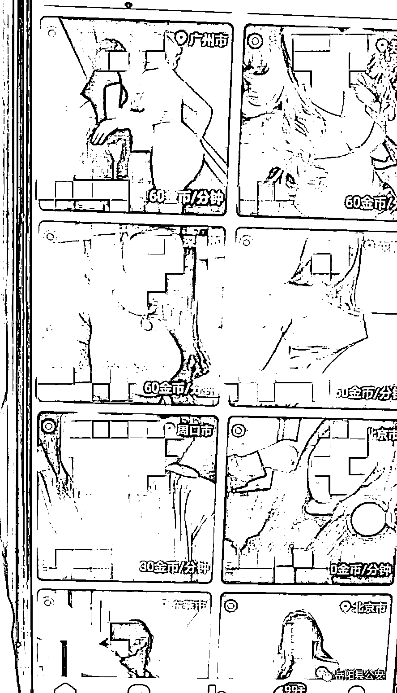

# 涉及女主播 7000 名！湖南破获特大网络组织淫秽表演案

> 原文：[`mp.weixin.qq.com/s?__biz=MzIyMDYwMTk0Mw==&mid=2247525910&idx=3&sn=553c4b8671b4da69bc505b4f9b7baef9&chksm=97cbad2ea0bc2438cd4904f670518a49a58f6b9b21a79cd312b1a264153a2d599ea39f48427f&scene=27#wechat_redirect`](http://mp.weixin.qq.com/s?__biz=MzIyMDYwMTk0Mw==&mid=2247525910&idx=3&sn=553c4b8671b4da69bc505b4f9b7baef9&chksm=97cbad2ea0bc2438cd4904f670518a49a58f6b9b21a79cd312b1a264153a2d599ea39f48427f&scene=27#wechat_redirect)

“小哥哥，你想看什么？” 

“给我点赞，给我打赏，

你想看啥都可以。”

……

她们谈吐直白诱惑 

借着网络直播平台

**表演不堪入目**

**传播淫秽色情内容……**

△图片来源：岳阳县公安

12 月 7 日，

岳阳县公安局通过缜密侦察，

破获一起特大网络组织淫秽表演案。

**涉及超 40 万用户、**

**7000 名女主播的 3 个涉黄 APP 被端，**

**涉案资金高达近 1 亿元。**

[`mp.weixin.qq.com/mp/readtemplate?t=pages/video_player_tmpl&action=mpvideo&auto=0&vid=wxv_2178163500601180160`](https://mp.weixin.qq.com/mp/readtemplate?t=pages/video_player_tmpl&action=mpvideo&auto=0&vid=wxv_2178163500601180160)

今年 10 月 15 日，岳阳县公安局网安大队在网上巡查时发现，某网站内发有弹窗广告，点击该广告下载后，发现一个称为“某火”的 APP 涉嫌黄色直播。岳阳县公安局立即组织专人对该线索进行初查甄别，并开展深度研判。

△图片来源：岳阳县公安

10 月 19 日到 11 月 11 日，民警通过随机对该 APP 内的多名女主播直播间进行抽查，发现被抽查的女主播均为用户提供 6 元钱每分钟的“1 对 1”涉黄直播。

通过对该 APP 资金流水调查，

**发现岳阳县籍人李某笑**

**涉嫌组织建立该涉黄 APP“某火”。**

△图片来源：岳阳县公安

11 月 12 日，岳阳县公安局抽调治安大队、网安大队、张谷英派出所、黄沙街中心派出所等单位民警成立专案组，对该起“组织淫秽表演案”进行立案侦查，专案代号为“11·11”。

通过多种侦查措施，“某火”APP 的组织结构和犯罪事实在专案组面前逐渐显露，同时，专案组成功锁定了该案主要犯罪嫌疑人侯某、李某笑、童某 3 人，其他犯罪嫌疑人若干。

专案组发现，侯某、李某笑、童某等 3 人还同时涉嫌组织运营“某澜”“心某邻”两个涉黄 APP。

△图片来源：岳阳县公安

通过进一步研判分析，专案组发现共有约 7000 名女主播串演于这 3 个 APP 之间，并为用户提供“1 对 1”裸聊类型的视频淫秽表演，用户注册会员后可充值兑换虚拟金币，按照不同的虚拟金币打赏、赠送礼物等方式让主播进行不同裸露尺度的淫秽表演，3 个涉黄 APP 共计注册用户 40 余万人，涉案资金高达近 1 亿元人民币，涉黄主播涉及湖南、湖北、贵州、云南、福建等全国多个省市。

在全面掌握了“11·11”组织淫秽表演案的犯罪事实、犯罪团伙人员结构、分工及成员真实身份后。12 月 7 日，专案组出动 60 人在湖南省内的岳阳市、郴州市、益阳市同时开展收网行动，“某澜”“某火”“心某邻”3 个涉黄手机 APP 被成功打掉，抓获涉案人员 11 人，负责平台经营、管理、技术维护的核心犯罪嫌疑人 5 人全部落网，至此，“11·11”特大网络组织淫秽表演案成功告破。

经审讯，嫌疑人交代，在建立涉黄 APP 后，便以“拉人头”的方式吸引主播和用户注册，每招募 1 名女主播其上线可获得用户对女主播打赏金额的 3%-6%的“赏金”，每拉来 1 名新用户其上线可获得用户打赏金额的 35%-40%的“赏金”，遂在短时间内聚拢起大量女主播和 APP 用户。

△图片来源：岳阳县公安

**目前，5 名主要犯罪嫌疑人**

**已被岳阳县公安局依法刑事拘留，**

**案件正在进一步侦办中。**

**天网恢恢，疏而不漏** 

**互联网不是法外之地**

来源：岳阳晚报、岳阳县公安、央视新闻、红网

← 向右滑动与灰产圈互动交流 →

