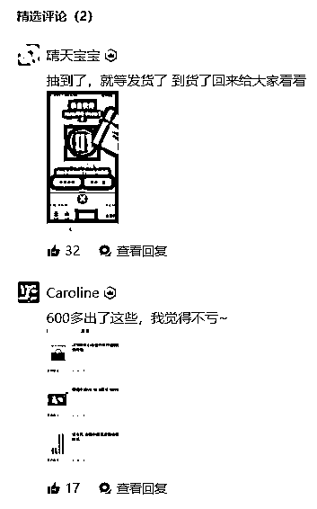
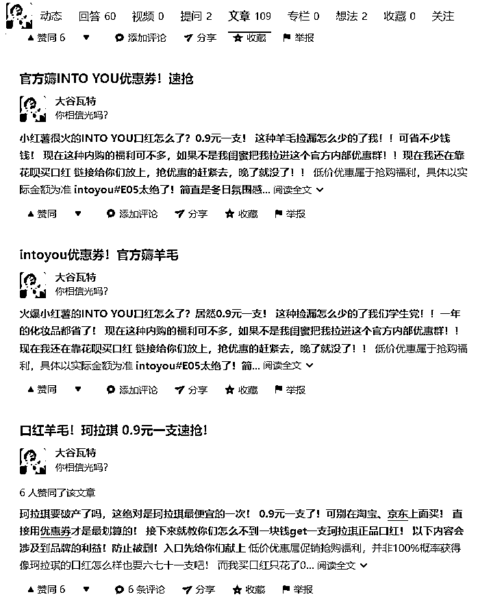
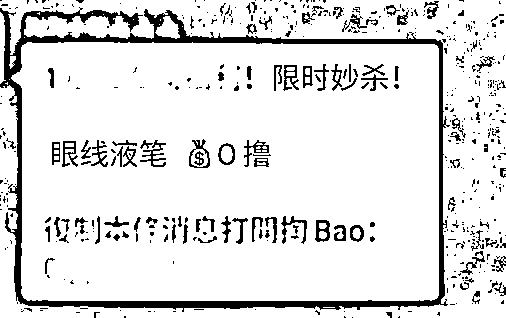
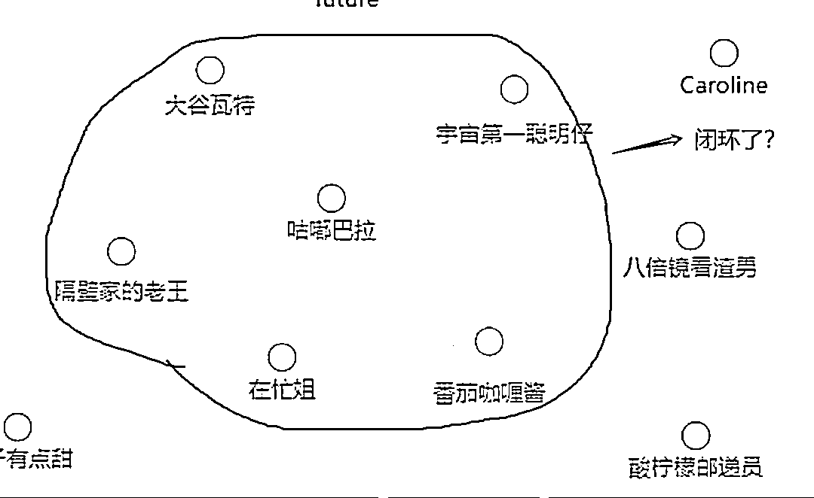

# 从小红书盗图，用知乎引流，在微信小程序收割，“软赌博”套路怎么玩的？

> 原文：[`mp.weixin.qq.com/s?__biz=MzIyMDYwMTk0Mw==&mid=2247525910&idx=4&sn=4d1da596e29bf1b41c0cca1eaaaa21a0&chksm=97cbad2ea0bc2438df7d4b74114d4be1f2fbccffe183cf7d0152bbdd906a205433d14428cacc&scene=27#wechat_redirect`](http://mp.weixin.qq.com/s?__biz=MzIyMDYwMTk0Mw==&mid=2247525910&idx=4&sn=4d1da596e29bf1b41c0cca1eaaaa21a0&chksm=97cbad2ea0bc2438df7d4b74114d4be1f2fbccffe183cf7d0152bbdd906a205433d14428cacc&scene=27#wechat_redirect)

‍

‍前两天刷知乎，看到这么一个帖子：虽然感觉像是个广告帖，但我看到赞同数有 747 个，心想可能有什么料，就点了进去。作者说他是一个十年安卓用户，抽盲盒，没想到居然抽中一个 iPhone 13 ProMax，白嫖的手机就是香！然后他就开始介绍一个抽盲盒的小程序，还说：这个小程序正在测试，为了引流吸引用户，会调高中奖几率，**现在这个时段最能薅羊毛。**说完，还晒了一下自己抽盲盒的战绩，第一次抽中一个蓝牙耳机，说是网上正常卖 120，抽奖只花了 60，净赚了 60 多元 ：第二次抽中个 AirPodsro 耳机： 第三次就抽中的 Apple ，还晒了发货记录，有图有真相。最后还晒了晒照片： 接着，他就开始讲这个抽奖小程序有多好，什么**“采用了区块链技术记录抽奖过程，无法人工干预修改**”之类的。以及，就算你抽不中大奖，也会有小奖品（安慰奖），比如你想抽个 iPhone 13，没抽到，起码也可以抽到一个耳机之类的，总之绝对不吃亏。如果抽到不想要的奖品，还给你在“置换商城”换成你想要的等价商品。 都不喜欢？还可以分解成“贝壳”，也就是兑换成钱，回血。最后，这位作者说：**“悄悄放个链接在这，可别让我朋友看见了！”**这味儿，就跟早年间范伟的那句经典广告词一样： **“一般人我不告诉他。”** 我心想：你都不想让你的朋友看见，那你还发哪门子帖子？**通俗解释一下：软赌博的引流套路** **1** 我心想这也太假了，iPhone 13 这么好中，是抽奖啊还是做慈善呢？而且，这篇文章的作者明明是个男的呀，怎么晒出来的照片里就变成一个穿着蕾丝睡衣的女的了？这是作者的账号信息： 这是前面晒手机的照片： 难道……是传说中的……女装 dalao？？？ 为了确认他的性别，我又翻了翻他以往的文章，有一篇讲自己如何在两个月内狂瘦 50 斤。看到后面，发现这篇是为了卖一个减肥餐： 哦，我懂了，原来他的性别，是可以自由变化的！卖不同的东西，需要什么性别就变成什么性别。**2**评论区也有人怀疑：是不是假的呀？ 很快就冲出来两个人：是真的！我也抽到了，你看，有图有真相！还有网友在评论区揶揄：中国人不骗中国人哦~作者也敢拍着胸脯回复：中国人不骗中国人！
知乎有这么一个好处，跟微信公众号不一样，一个人发过什么，点赞过什么都能看见的，所以我决定去查一查这些人。发帖的这位网友，每过一段时间，就能发现各路羊毛、捡漏、优惠券，发帖招呼网友们赶紧去抢（我心想有这么好的事，干嘛要分享出来，自己独享不是更爽）。我又在评论区挑出几个给他“捧哏”和点赞的人，发现也是一样，经常发一些那味儿十足的帖子，有的点赞量还非常高：各种抽奖，薅羊毛，有的都不是跳楼价了，是根本就不要钱。 最搞笑的是，一篇文章，来来回回就在这么几十个人在那相互评论。仿佛他们都在一个群里，张三写完帖子，往群里一丢，其他人就来评论、点赞、捧哏，李四又在群里丢一个链接，其他人又给评论、点赞、捧哏。你问我怎么看出来的？我用的笔记软件刚好有页面链接功能，可以显示页面和页面之间的联系，我就把他们的 ID 输入进去，再一看关系图，就明白了——全是一伙人。 而且这些人用的文案和图片，很多都是一样的，这意味着，群里有人在为他们统一提供素材弹药。 同样一篇文章，稍微改吧改吧，就在不同的账号上发了。你看，两个人用的收货地址都是一样的（隐隐约约能看到广州天河区），连手机截图的时间和电量都是一样的：有的帖子还卡出 BUG——文字里说的是 iPhone 13 ProMax，但是在发货截图里又是 iPhone 13。型号都对不上，编故事也用点心好不好？ 其中一位网友在帖子最后，还附上自己和女朋友在一家日本手办店的照片。结果我反手一查‍，就‍发现这张图片来自小红书的一个博主，这家所谓的日本手办店，其实在上海。还有一位网友，通过吃一种代餐奶片，成功瘦身，跟暗恋已久的女神告白，现在正在甜甜的热恋！结果我反手又一查，发现是一个小红书的博主在推荐卫衣。难怪很多类似的帖子里图片‍都带有一股浓浓的小红书味道（比如一开始那张身穿蓝色蕾丝睡衣晒手机的），原来就是从小红书盗的图。我忽然想起，前不久一位网友为了满足外公的心愿拍的照片，被造谣说是“73 岁东莞企业家豪取 29 岁广西大美女”，还凭添了很多细节，什么“88 万彩礼+豪车”，说得跟真的似的。 这让我不由感慨：“开局一张图，内容全靠编”——网上的段子，原来说的都是真的。**3** 到这里，事情几乎已经明了了：先从小红书盗图，找一些大家喜欢的东西，比如 iPhone 手机、平板、化妆品之类的。再第一人称代入，一番动情演绎，讲自己如何如何抽中这些东西，花了三四千块钱就抽中了 iPhone 13，简直不要太划算。 再搞一堆知乎账号，相互点赞，评论，再筛选评论，营造出良好氛围。经过一番操作，知乎的推荐算法就被骗了，以为这是一篇很受欢迎的内容（因为点赞、评论数据都很好），推荐分发给更多的人。最后把读者都引流到一个做盲盒抽奖的微信小程序或者公众号，完成收割（开发一个小程序和公众号的成本比 APP 要低，所以现在很多骗子也更倾向于用公众号和小程序）。 怎么收割的呢？ 它会送给你几块钱让你试玩（就像很多赌博网站都会送你几十块钱让你上手），煞有介事地向你展示一串字符，以证明自己真的是用了区块链技术，确保抽奖不能造假，是公平的，而你印象中：“好像区块链确实是‘不可篡改’的”。你不充钱，试着玩的时候，就总是能抽中好东西。等你要正式开始，就再也抽不中了，要么就是抽到一堆垃圾东西。而所谓的“安慰奖”，也只是为了堵住受害者的嘴——我这是盲盒游戏，**抽奖的事，怎么能说是赌博呢？**你看，你这不是抽中一个小奖品呢么？ 这些带着抽奖性质的所谓 0 元购、1 元购，早就被曝光过了，是一种披着电商外衣的软赌博。 但是不知为何，每过一段时间，总是会出现新的局，披着不同的外衣，也总是有新的人去送人头。**5**这个问题怎么解决？我不知道，我能做的只有第一时间写出来，尽量让更多人看到。让更多人知道：**当你盯着别人的羊毛，别人往往盯着你的本金。**也许，能让小红书的管理员知道，“小红薯们”的图片已经成了骗子的御用物料来源（主要是因为小红书上的图确实拍得好看），看看能不能出个什么技术手段来帮网友检索图片的原始出处；也许，能让知乎的管理员知道，梳理清楚这些账号之间的逗哏捧哏关系，把这些骗人的引流账号和内容一网打尽；也许，能让微信的管理员知道，把涉嫌软性赌博的公众号、小程序封掉，并且把线索证据交给执法机关。**6** 但是人心中的恶，要怎么解决？科技永远只能压制人心中的恶，却无法消除， 就像满大街的摄像头，让人不敢当街犯罪，但是无法消除犯罪心理。**这件事最让人气愤的，不止是设局的人，还有那些帮凶。**发帖引流的这些账号，我看了一下，人设大多都是大学生，起初，我以为这些账号是设局的人注册的虚拟账号，打造成大学生的样子，这样知乎的推荐算法就会误以为大学生喜欢这样的内容，从而推给他们。里头抽奖的奖品，也都是一些美妆、手办、球鞋、潮玩，**说明这些局的目标受众，就是大学生，尤其是二次元爱好者、喜欢数码潮玩、鞋，以及喜欢美妆的。**但是后来我发现，这些账号，更像是真实账号，被设局的人以刷评论、发帖“兼职”为幌子，用蝇头小利驱使他们发帖和评论。 其中有一个账号，说自己抽到了很多安卓平板。 我顺着这个人的资料，发现他真的是一个大学生。在他的另一个回答里，他说**自己为了打工挣钱，接各种日结的兼职，各种活儿都接过。**也是很勤奋了。他们可能也没有想到，自己做的有些“兼职”，会害到别人。或者想到了，但选择性无视。 发骗人帖子”时、刷评论和好评时、提供银行卡给别人洗钱时，永远只看到眼前的蝇头小利，却忘了，自己，以及自己的家人朋友，也是潜在受害者之一。**给坏人递刀子，同伴一个个倒下了，那下一个会轮到谁呢？**

← 向右滑动与灰产圈互动交流 →

