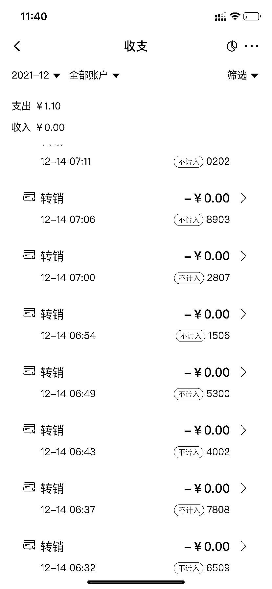
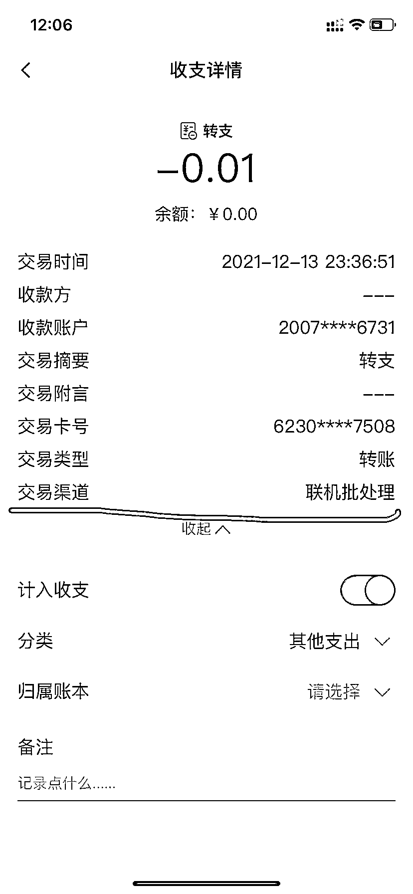

# 千余毕业生莫名被开农行卡，又被跳过密码悄悄销户……

> 原文：[`mp.weixin.qq.com/s?__biz=MzIyMDYwMTk0Mw==&mid=2247525910&idx=5&sn=392b64de7643e6af1cf9d2833ecf0bf0&chksm=97cbad2ea0bc2438366d7eaf206559c55e88e5b1048e3ce2244e72ae646df61d1f0fcfbdaf2f&scene=27#wechat_redirect`](http://mp.weixin.qq.com/s?__biz=MzIyMDYwMTk0Mw==&mid=2247525910&idx=5&sn=392b64de7643e6af1cf9d2833ecf0bf0&chksm=97cbad2ea0bc2438366d7eaf206559c55e88e5b1048e3ce2244e72ae646df61d1f0fcfbdaf2f&scene=27#wechat_redirect)

[`mp.weixin.qq.com/mp/readtemplate?t=pages/video_player_tmpl&action=mpvideo&auto=0&vid=wxv_2174945814232514561`](https://mp.weixin.qq.com/mp/readtemplate?t=pages/video_player_tmpl&action=mpvideo&auto=0&vid=wxv_2174945814232514561)

发生在广西崇左幼儿师范高等专科学校和农业银行的“学生被开银行账户”事件引发人们关注。

媒体报道称，**1400 多名学生莫名被农业银行开了银行账户，每人名下近 10 个账户。（→[高校千余毕业生莫名被开多个银行账户，学校回应：未泄露学生信息](http://mp.weixin.qq.com/s?__biz=MzIyMDYwMTk0Mw==&mid=2247525717&idx=4&sn=774bf16d38c014d877a537212d9b67e8&chksm=97cbae6da0bc277b9aae7de39c383287b4ac7833ea9810800d5ca12b4b61175ec093ffe4c5ed&scene=21#wechat_redirect)）**

当事人银行账户注销记录截图  本文图片均为受访者提供

校方声明称未泄露学生个人身份信息，银行致歉称与客户沟通不充分，却未提及被开账户的学生人数。

**银行开户使用的学生信息从哪儿来的？**

此外，12 月 11 日涉事银行发布说明称，将尽快与相关学生逐一取得联系，销掉多开立的账户。但 14 日上午，**一名崇左幼专毕业生告诉澎湃新闻，在没有人通知的情况下，其名下不知情开通的账户已被注销。**

当事人银行账户余额转出记录截图

13 日晚，该毕业生手机上一直接到农业银行 App 的通知提醒，其查看发现，每个账户中原本显示的 0.01 元已逐个转出，交易渠道为“联机批处理”。14 日早上，该毕业生发现，自己名下不知情被开通的银行账户均被注销。

该毕业生对银行此举表示不满，**“这些操作没有通知我，跳过密码，细思极恐。银行没有人员和我沟通过，也没有任何解释”。该毕业生称，许多其他被开户的学生名下被开账户也已被销户，“希望严查到底，我们需要真相”。**

14 日下午，澎湃新闻记者多次拨打中国农业银行崇左江州支行电话，均无人接听。

据澎湃新闻此前报道，一名崇左幼专毕业生称，“大家在 qq 群讨论的时候说很多同学都被开卡，查下来发现，我的也有，舍友她们也有”。该毕业生发现，自己名下被开了 10 个农行账户，开户行信息皆为中国农业银行崇左江州支行。11 日，从该毕业生提供的账户列表截图中，记者发现，当事人被开账户中每个账户可用余额为 0.01 元。该毕业生称，自己曾在家乡农行办过Ⅰ类卡，但与事发地崇左无关。对于后续处理，该毕业生表示，“希望知道（事情）来龙去脉”。

据极目新闻报道，银行提供的对接名单显示，“被开账户”的有 1457 人，均为崇左幼专学生。

10 日晚，崇左幼专发布声明称，学校没有通过任何渠道泄露学生的身份信息，没有代理学生开设银行账户或办理Ⅰ类、Ⅱ类、Ⅲ类卡账户的业务。

11 日早上，**中国农业银行广西区分行微信公众号发布说明称，此事确系农行辖属江州支行营业室未与客户充分沟通，内部审核把关不严、不规范操作所致。**此说明承诺，将尽快与相关学生逐一取得联系，销掉多开立的账户。同时，将加强内部管理，对相关责任人进行严肃追责。

[`mp.weixin.qq.com/mp/readtemplate?t=pages/video_player_tmpl&action=mpvideo&auto=0&vid=wxv_2174931758381613057`](https://mp.weixin.qq.com/mp/readtemplate?t=pages/video_player_tmpl&action=mpvideo&auto=0&vid=wxv_2174931758381613057)

上海大邦律师事务所律师丁金坤认为，未经学生同意就开户，银行违规操作，侵犯学生的个人隐私与个人信息，须停止侵权、赔礼道歉、赔偿损失、恢复影响。丁金坤认为，如果该批个人信息系来路不正，还涉嫌侵犯公民个人信息罪。

根据刑法第二百五十三条之一，违反国家有关规定，向他人出售或者提供公民个人信息，情节严重的，处三年以下有期徒刑或者拘役，并处或者单处罚金；情节特别严重的，处三年以上七年以下有期徒刑，并处罚金。违反国家有关规定，将在履行职责或者提供服务过程中获得的公民个人信息，出售或者提供给他人的，依照前款的规定从重处罚。

来源：澎湃新闻，新华社

← 向右滑动与灰产圈互动交流 →

