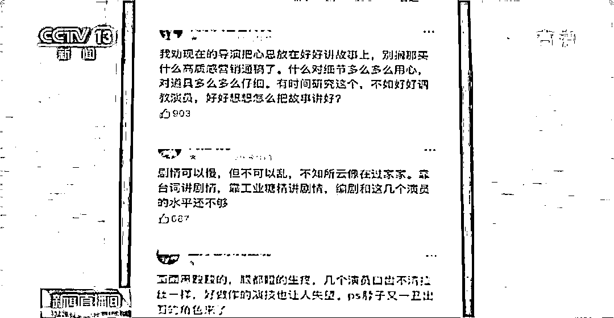
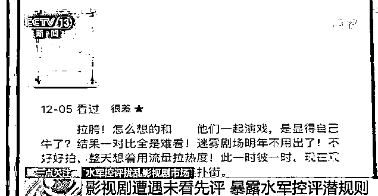
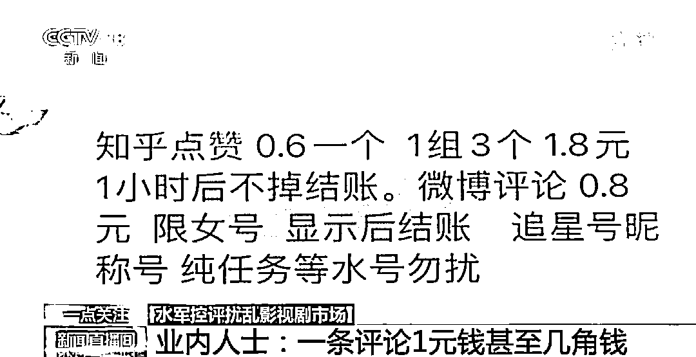

# 影视剧遭遇“未看先评”！水军“控评”潜规则曝光→

> 原文：[`mp.weixin.qq.com/s?__biz=MzIyMDYwMTk0Mw==&mid=2247525910&idx=6&sn=4c39c2e4741b4dbd93559f0c0d6e9e6b&chksm=97cbad2ea0bc243889833bbca229116adb38dc54a847f5363e22ca908893033eb45cdec1ddc1&scene=27#wechat_redirect`](http://mp.weixin.qq.com/s?__biz=MzIyMDYwMTk0Mw==&mid=2247525910&idx=6&sn=4c39c2e4741b4dbd93559f0c0d6e9e6b&chksm=97cbad2ea0bc243889833bbca229116adb38dc54a847f5363e22ca908893033eb45cdec1ddc1&scene=27#wechat_redirect)

如今，很多人习惯在观看影视剧后去网络平台上进行打分和点评，这也为还没有观看的网友们提供参考。然而，日前有两部影视剧却接连出现了“超前点评”的荒诞一幕——影视剧还未播出，网上就已经有大量评分出现。

影视剧遭遇“未看先评”

几角钱就能吸引水军接单“控评”

12 月 1 日，某古装剧在互联网平台上线。由于一些原因，该剧的正式上线时间比原来的“官宣”时间晚了近一个小时。然而，在某知名打分平台的短评打分区，**有大量评分在原定上线时间集中涌入，**这些短评呈现一星和五星两极分化的状态。

无独有偶，在 12 月 5 日首播的某部网剧中，**女主演尚未登场的前两集播出后，网络社交平台上同样准时涌现了大量质疑其演技、台词的论调和一星短评**。

两部影视剧出现的“超前点评”现象被网友和媒体质疑为水军刷分“控评”。记者以粉丝身份进入某水军派单群，发现频繁有人发出招聘兼职刷分“控评”的信息。**一条 1 元钱甚至几角钱的价格，能吸引大量水军接单进行“控评”**。

业内人士指出，水军刷分“控评”打破了“先看作品再打分”的基本规则，不仅会对影视作品的口碑和观看数据产生不利影响，导致制作公司经济受损，也会破坏打分平台的客观性与公信力，甚至影响正常的文艺评论。

 [`v.qq.com/iframe/preview.html?width=500&height=375&auto=0&vid=p3313jjl5dg`](https://v.qq.com/iframe/preview.html?width=500&height=375&auto=0&vid=p3313jjl5dg) 

影视剧“控评”或涉嫌违法

此外，水军对影视剧“控评”的行为还有可能涉嫌违法。 

今年 2 月，有网友在国家市场监督管理总局官网上留言咨询：“电视剧‘控评’是否合法？”对此，官方回应称，**“控评”涉嫌违反《反不正当竞争法》**。可提交充足证据材料，向县级以上市场监督管理部门举报，也可直接拨打 12315 或登录 12315 互联网平台，进行申诉举报。

网信办近年来也出台了多项规定，对网络“水军”的刷帖“控评”行为也都有较为细化的规制。

> **中国政法大学传播法中心研究员、副教授 朱巍：**在“控评”的过程中，水军表面上看是侵害了正常的传播秩序、市场经营秩序，严重的话可能涉及非法经营罪，有刑事法律进行规制。

[`v.qq.com/iframe/preview.html?width=500&height=375&auto=0&vid=m3313bd0inz`](https://v.qq.com/iframe/preview.html?width=500&height=375&auto=0&vid=m3313bd0inz)

多方合力整治

还文艺评论清朗环境

今年 2 月，国家网信办开展了“清朗·春节网络环境”专项行动，其中一项内容就是重点整治刷量“控评”行为。

此外，专家指出，平台方也应加大应对力度。同时，应提高影视机构营销推广行为的透明度，并对网友进行正向引导。

> **中国传媒大学戏剧影视学院教授、中国文艺评论家协会理事 戴清：**我们需要提升主流文化的影响力，**营造健康的文娱环境，要积极引领粉丝文化的良性发展**，包括提升年轻人的审美素养，加大引领力度和影响力度。

[`v.qq.com/iframe/preview.html?width=500&height=375&auto=0&vid=j33136qtubu`](https://v.qq.com/iframe/preview.html?width=500&height=375&auto=0&vid=j33136qtubu)

来源：央视新闻（ID：cctvnewscenter）

← 向右滑动与灰产圈互动交流 →

