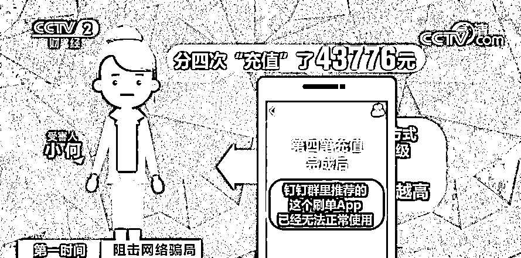

# 陌生人拉你进群，还发红包？小心！有人被骗数万元...

> 原文：[`mp.weixin.qq.com/s?__biz=MzIyMDYwMTk0Mw==&mid=2247525910&idx=7&sn=a40eddceaad88832a3cdb5dc391881dd&chksm=97cbad2ea0bc243811bd3f42445ac637ade4bb4d36351f64b2e4ca6f1b7049da6d1b1b3fcb2e&scene=27#wechat_redirect`](http://mp.weixin.qq.com/s?__biz=MzIyMDYwMTk0Mw==&mid=2247525910&idx=7&sn=a40eddceaad88832a3cdb5dc391881dd&chksm=97cbad2ea0bc243811bd3f42445ac637ade4bb4d36351f64b2e4ca6f1b7049da6d1b1b3fcb2e&scene=27#wechat_redirect)

智能手机时代，网络社交触手可及。“拉群”逐渐成为不少人网络沟通的方式，通常，“拉群”都是在认识的人之间进行，但最近，湖南、山东、北京等地相继出现了**陌生人“拉群”送福利的情况，一些用户真的就在陌生人拉的群里抢到了福利**，可这白来的“福利”背后却暗藏陷阱。

陌生人“拉群”发红包 “福利”背后是陷阱

[`mp.weixin.qq.com/mp/readtemplate?t=pages/video_player_tmpl&action=mpvideo&auto=0&vid=wxv_2178881199534833665`](https://mp.weixin.qq.com/mp/readtemplate?t=pages/video_player_tmpl&action=mpvideo&auto=0&vid=wxv_2178881199534833665)

△央视财经《第一时间》栏目视频

今年 11 月，湖南省新宁县丰田派出所接到了报警，报案人小何称在使用一款名为钉钉的 App 时，被一个陌生人拉进了一个“福利群”，进而受骗。

**受害人 小何：**我莫名其妙就在一个钉钉群里面，没有收到任何他加我好友或者他邀请我进群的信息。那个群里面有一个人在发红包，我点开一看是真的一个红包。

虽然进了不认识的群，可抢到的红包是实打实的，小何就在群里问，这是什么群，很快就有人给了回复。

**受害人 小何：**群里另外一个人就说，可以做刷单的任务，他给我们一个网址，去下载一个叫“信言”的 App，去那里面做任务，一天可以挣 100-300 元不等。

小何下载了钉钉群里别人推荐的 App，经过注册后，很快又有人通过网络找了上来，告诉小何，可以用充值的方式提升自己的等级，等级越高刷单的佣金就越高。**于是小何分四次“充值”了 43776 元，没想到第四笔充值完成后，她发现钉钉群里推荐的这个刷单 App 已经无法正常使用**。 

 山东淄博的李女士也在 11 月份遭遇了和湖南的小何“同款”的骗局。陌生人把李女士拉进了钉钉群，随后便发了红包，李女士点开抢了 3.99 元。接着，这位发红包的人接下来还有很多福利，让大家不要退群。后来，**李女士也被引导下载了一个所谓的刷单 App，进而被怂恿充值**。 

**受害人 李女士：**我按照他的指令开始做任务，看着账户的余额增加了，我记得是 1300 多元，但是没法提现。我一共给对方打了四次款，后来他说最小的任务额度是 28000 多元，我开始觉得不太对劲。

一边是李女士实打实地充值，另一边却是无法提现转出的空头账户，在充值 3.8 万元后，李女士才恍然大悟进而报警，目前，案件正在进一步侦办中。

未经允许被“拉群” 社交 App 存安全风险

[`mp.weixin.qq.com/mp/readtemplate?t=pages/video_player_tmpl&action=mpvideo&auto=0&vid=wxv_2178893535939198981`](https://mp.weixin.qq.com/mp/readtemplate?t=pages/video_player_tmpl&action=mpvideo&auto=0&vid=wxv_2178893535939198981)

△央视财经《第一时间》栏目视频

利用网络刷单可以“躺赚”的心理来实施网络诈骗并不是什么新的套路，但在最近发生的案件中，反映出不法分子利用社交 App 主动“拉群”，受害者被迫进群进而被骗的情况。骗子主动找上门，未经受害者同意就能被拉进群，如此的社交 App 存在什么样的设置问题，被不法分子钻了空子呢？ 

记者搜索钉钉官方网站后，见到了该软件的描述为“5 亿用户，1900 万组织”都在使用的智能移动办公平台。记者下载钉钉 App 并用手机号进行注册，在“钉钉”App 界面中记者见到了“发起群聊”功能，**平台给普通用户提供了通过“手机号添加”“面对面建群”“扫一扫”和“手机联系人”的渠道进行建群**；除此之外，平台还给用户提供了用“新建组织”的方式拉群。 

在钉钉 App 主界面下方的“通讯录”菜单中，记者发现了“创建企业/组织/团队”的选项，记者随机输入信息，创建了一个“企业组织”，随后页面便出现了“添加成员”的选项，记者按照平台推荐的步骤，随机输入两个手机号码，并用字母 VV 和 CC 命名成员姓名后，页面便提示群创建成功。而当记者点击进入该群，**发现刚刚添加的两个成员已经在这个群里，并不需要征求他们的同意**。 

无需用户确认，钉钉 App 提供了陌生人建群、拉群的功能，如此的设置究竟出于什么样的目的，是否又存在安全漏洞呢？记者尝试与钉钉 App 官方进行沟通，但记者拨打其隐私公告 2019 年版中提供的人工客服电话号码后，被提示号码暂停使用。

而记者又按照其隐私公告 2021 年版的要求，通过网络联系了钉钉 App 的在线客服。该客服书面回复，钉钉 App 可以通过搜索手机号码进行添加员工，目的是方便企业和员工之间的添加。如果用户不接受该操作，可以在用户设置中选择打开**“团队添加我时需要验证”**的功能。 

而在记者的进一步询问下了解到，钉钉 App 虽然提供了用户可以选择打开“团队添加我时需要验证”的功能，但该功能默认关闭。对此，记者向钉钉客服表示该设置存在安全隐患，对方却并未给予正面回复。

专家解读：不能为了所谓“便捷”牺牲网络安全防护

[`mp.weixin.qq.com/mp/readtemplate?t=pages/video_player_tmpl&action=mpvideo&auto=0&vid=wxv_2178879558035243012`](https://mp.weixin.qq.com/mp/readtemplate?t=pages/video_player_tmpl&action=mpvideo&auto=0&vid=wxv_2178879558035243012)

△央视财经《第一时间》栏目视频

记者在苹果系统和安卓系统分别下载了钉钉 App，发现“团队添加我时需要验证”的设置功能在不同的操作系统下均为“默认关闭”，也就是说，一旦用户不知道在使用钉钉 App 前，将这个功能打开，就有可能遭遇被陌生人“拉群”的情况。有法律学者表示，**网络社交平台应当视用户信息安全为底线，不能为了所谓的“便捷”而牺牲网络安全防护**。 

记者在网络检索时发现，近段时间以来，一些钉钉的用户在网上留言，表示遭遇了被陌生人“拉群”的经历。四川成都的小陈，前不久被陌生人拉进了一个钉钉群，当见到有人发布刷单广告后，她就有了警觉，并在钉钉群里提醒大家不要上当，可消息一发就被踢出了群。

随后，她通过网络客服向钉钉 App 反映，当她询问客服为何会被陌生人“拉群”时，对方发来一张截图，称小陈可以在设置中打开“团队添加我时需要验证”的功能，从而拒绝被人“拉群”。而当小陈询问这个功能为何没有在 App 中进行提示，并且默认关闭呢？**钉钉 App 客服回复称：“每个人都开启了这个拉群需要验证的功能，将严重增加沟通成本，所以还是不直接默认打开比较好”**。 

而在钉钉的隐私政策中记者也查询到这样的说明——“对于企业组织用户使用钉钉作为在线移动办公、沟通与协同工具，有权作为代表企业组织个人信息处理者，处理您作为最终用户的个人信息，包括委托钉钉限于管理员开通、管理和使用钉钉服务实现在线移动办公”。

以降低沟通成本为由，默认群组管理者可以在未经对方同意的情况下“拉群”，如此的设置是否存在问题呢？有法律学者表示，**该设置有悖《网络安全法》等法律法规要求**。 

在今年实施的《民法典》中也明确规定，任何组织或者个人不得以刺探、侵扰、泄露、公开等方式侵害他人的隐私权；对记者在“钉钉”App 中亲身经历操作检索任意陌生人的手机号码，并未经陌生用户同意，便可以“拉群”的功能，有法律学者指出，**App 的功能设置已经涉嫌违法，需要及时处理，避免造成更多用户利益受损**。

来源：央视财经（ID：cctvyscj）

← 向右滑动与灰产圈互动交流 →

