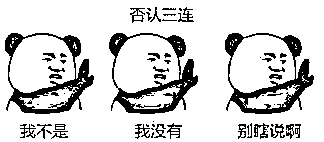
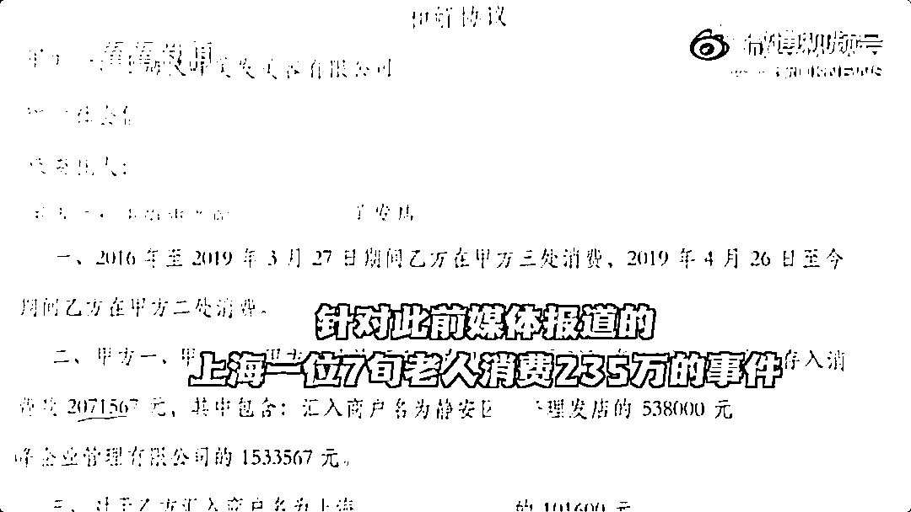

# 文峰老板浩哥出面回应彩虹屁：“你把我害惨了呀”！

> 原文：[`mp.weixin.qq.com/s?__biz=MzIyMDYwMTk0Mw==&mid=2247525966&idx=3&sn=19c3f313a2e66c78a2ff3a8f1e7efb1b&chksm=97cbad76a0bc24602694eb4467cdfe11bf639f01c7d25b63faed71f9eac818838d2244c5f893&scene=27#wechat_redirect`](http://mp.weixin.qq.com/s?__biz=MzIyMDYwMTk0Mw==&mid=2247525966&idx=3&sn=19c3f313a2e66c78a2ff3a8f1e7efb1b&chksm=97cbad76a0bc24602694eb4467cdfe11bf639f01c7d25b63faed71f9eac818838d2244c5f893&scene=27#wechat_redirect)

上海文峰这两天是真的热搜不断，先是有秘书，在公司内部公众号上面吹出彩虹屁天花板。

然后被曝光 2 元护眼液卖 2000 元，以及上海消保委一年收到 476 件投诉。

**滥推销、办卡容易退卡难、乱收费、涉嫌强卖...**

随之就被普陀市场监管局立案调查。

紧接着就是文峰的各种反应：**删除彩虹屁、文峰道歉、老板浩哥说自己被害惨......**

就算不是热搜前排么，连续几天，文峰都在热搜里存在着。

都说黑红也是红，曾经在上海滩叱咤风云的美发帝国，连着几天上热搜之后

大概以为自己把这条路走明白了？

一直以来文峰给人的印象都蛮怪的：**虚假宣传、套路营销、个人崇拜、**

**洗头洗脑傻傻分不清楚...**

然而，面对网络的各种质疑，文峰 12 月 12 日发布致歉声明：**表示愿意接受各位的监督，并坚决整改到位。**

看起来像是要重新做人了？

浩哥接受采访，努力澄清。

处在风口浪尖的文峰是终于坐不住了。

就连那个“最神创始人”浩哥也亲自下场接受采访进行回应了...

在被问及洗脑员工、个人崇拜等问题时，**陈浩表示：没有的事！**

不知道、我没有、别瞎说，素质三连回答溜得飞起。

我们大家所认为的“洗脑”，浩哥解释起来，就非常清奇脱俗了：

**“传播美、发现美、推广美”。**

不愧是拥有“天眼”的男人 。

谈到关于个人头像做店招时，浩哥回答：**“叫文峰的太多，我的头像总不能模仿吧”。**

**而当记者偶遇“彩虹屁”秘书追问起缘由时，浩哥更像是戏精上身，直指下属：“你把我害死了呀你！”**

不过就算如此，浩哥也不会辞退她，甚至还心疼起了秘书：“小姑娘好不容易找到的工作。”

“如果辞退她，她怎么养家糊口呢？”

而这篇彩虹屁的文章，浩哥表示，**自己从不会去审公众号的文章，“都是他们搞的”**，把自己摘得那叫一个干净。

但网友们怎么可能认可这种撇清说辞：**“没有制止，就是默许” 。**

这么猛烈的彩虹屁，都能够火上微博热搜前排，说明这风气可不是一时的，是老传统啦！

当年文峰的企业官网上，还有过《十颂浩哥》这样的神曲。

而且在不少文峰的内部会议，总会有浮夸的“朝鲜风味跳大神”场面——

**浩哥独舞，员工捧场 。**

除去浩哥本人和员工们的浮夸行为，其实更实际一点的问题是：**大家能不能在文峰正常消费？**

没道理的高价消费、烦人的充值推销、开卡花好月好，退卡千难万难....

没有这些问题的话，去文峰理个发什么的也还行的。

可是文峰的情况是，远高于市面产品的价格，然后充值几十万上百万的人也不在少数。

**有上海是一位老人在文峰消费 200 多万，也不知道都消费了点什么。**

**不充值就没有服务态度，充值了，钱不花完，还很难退出来。**

这样子的消费体验，想不糊都难吧 。

不过，浩哥在这两天的采访中非常义正言辞表示坚决整改规范：

**“一定要把属于顾客的钱退回去！”**

并且信誓旦旦地说：请大家期待整改之后的文峰，一定会变得越来越好，要做成百年老店。

目前这个舆论情况之下，浩哥很明显是在搞紧急的危机公关，

但这连着几天的热搜，大概也能够让他稍微醒醒了吧？

做生意、办企业不是看到每个员工“心悦诚服”就万事大吉了，还要让消费者感到满意，才可以真的长久。

**光靠一张嘴来搞员工脑子、来搞媒体公关是没有用的，群众的眼睛可是雪亮的。**

来源：昌南大队长综合奇点视频、看看新闻 KNEWS、脊梁 in 上海 SH

← 向右滑动与灰产圈互动交流 →

