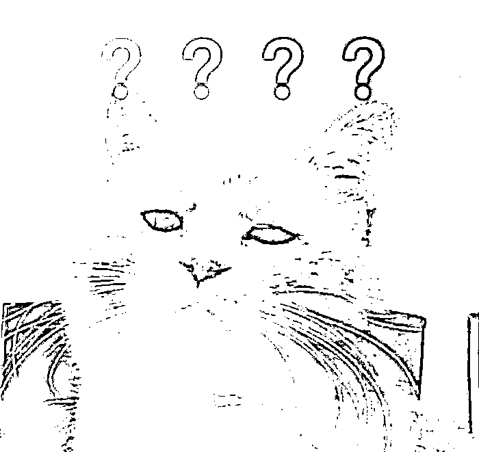
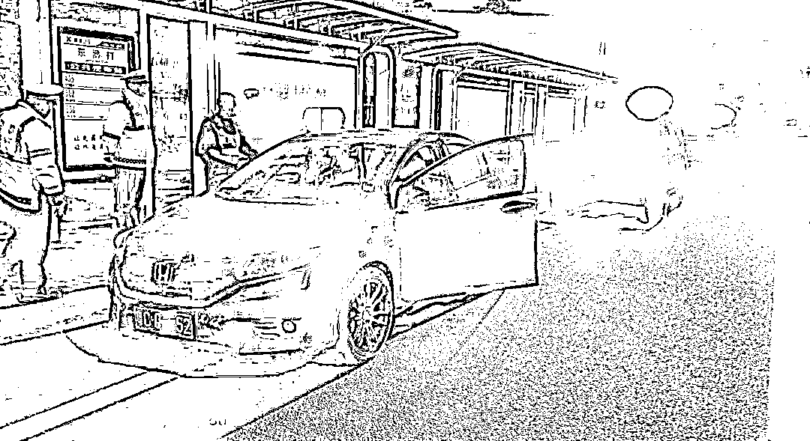
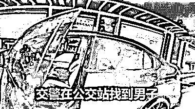
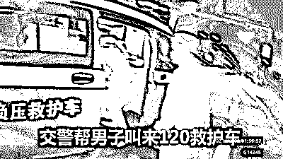
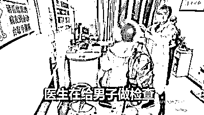
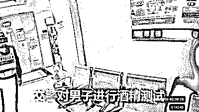
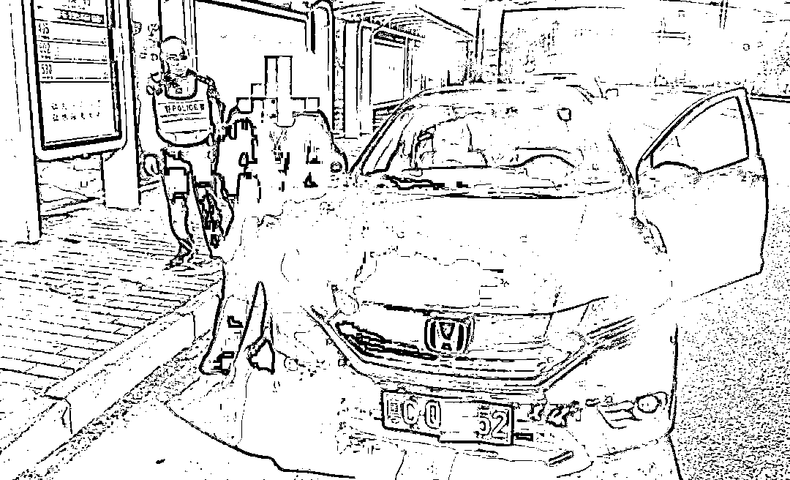
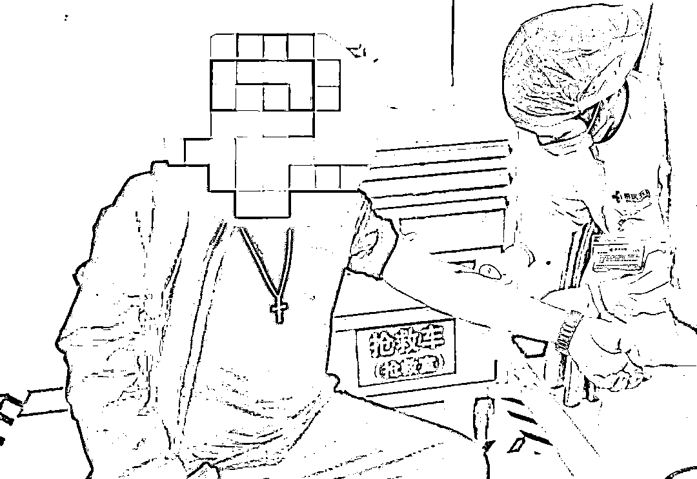

# “只要向交警报备，酒驾就免罚”？

> 原文：[`mp.weixin.qq.com/s?__biz=MzIyMDYwMTk0Mw==&mid=2247525966&idx=5&sn=7f48cfdb814859f15c4993237bd85072&chksm=97cbad76a0bc2460484acce1f51ec2ce5e55b2c87a01ea764025bb5cb277ff162d8051d29fbc&scene=27#wechat_redirect`](http://mp.weixin.qq.com/s?__biz=MzIyMDYwMTk0Mw==&mid=2247525966&idx=5&sn=7f48cfdb814859f15c4993237bd85072&chksm=97cbad76a0bc2460484acce1f51ec2ce5e55b2c87a01ea764025bb5cb277ff162d8051d29fbc&scene=27#wechat_redirect)

开车不喝酒 

喝酒不开车

这个道理小孩子都懂

珠海斗门却有一名男子喝完酒后

**四次打电话给交警“报备”**

**要求酒后开车，让交警不要处罚他？！**

****

**虽然交警反复劝阻、制止，**

**但男子仍坚持开车上路，结果……**

****男子打电话给交警报备要求酒后驾驶****

**12 月 3 日凌晨 0 点 25 分，珠海交警指挥中心报警电话响起，接警员小李刚把电话拿起，那头传来一个焦急的男声：“阿 sir，我向你报备一下，我喝了酒，但是我要开车。”**

**这一出把接警员整懵了，酒后偷偷开车被抓的倒是时有发生，但有人来举报自己酒驾的还是头一回，连忙询问他怎么回事。男子说他眼睛很不舒服，在短视频 APP 上看到了“驾驶新规，喝完酒后如果有紧急情况，想开车就向交警部门报备，可以免罚。”**

**接警员听后哭笑不得，赶紧劝阻司机不能开车，严肃地告诉他酒后开车是违法的，万一发生事故，后果不堪设想，建议他叫代驾或者找朋友帮忙开车。可男子就是不信，他觉得自己没喝多，还能开车去医院。**

**接警员想给男子叫救护车，但男子听后却拒绝了，还把电话挂断。因为没掌握具体车牌号和行车路线，接警员只能通知交警留意，却一时找不到该酒驾男子。**

**半个小时后，男子**又连打了两次报警电话**，说他还是要自己开车。又过多半个小时，男子再来一个电话，**说他已经开到珠峰大道了，想确认一下有没有“报备成功”。**接警员马上通知斗门交警路上拦截，并劝阻男子立即靠边停车，停止违法行为。**

** **

**1 点 50 分，斗门交警发现一辆粤 CQ××52 号本田小车停在珠峰大道东澳村公交站，一名男子坐在驾驶座上。经过询问，正是打电话报警的男子。**

****

**黄警官看到男子表情略显痛苦，帮他叫来 120 救护车。男子说自己眼睛疼想去医院，已经跟交警报备过了，言语间飘出了一股酒味。**

****

**黄警官先把他带去遵医五院检查眼睛，经过医生检查，他的眼睛并没有问题。**

****

**黄警官判断，他可能是喝多了毛细血管扩张，导致面部和眼睛充血，睡眠不足就会眼疼痛，酒醒了就没事。于是在医院对他进行抽血检验，**结果为 133.9mg/100mL，属于醉驾。****

********

******刷短视频误信谣言惹的祸******

****经调查，这名斗门男子梁某 28 岁，当晚参加同村好友的婚宴，推杯换盏中，他不知不觉喝了近 8 两白酒。酒席结束后，梁某回家休息，然而到了凌晨时分，他的右眼突然一阵疼，越揉越难受。他想上医院，可自己又喝了酒不能开车，叫救护车又怕麻烦。**** 

****于是梁某突发奇想打开某短视频 APP，搜了搜“酒驾可不可以报备”，**结果里面弹出了一条短视频，上面写着：“喝酒后只要向交警部门报备，紧急情况下都可以开车，免受处罚。”******

****这下给梁某吃了一颗“定心丸”，于是他打给交警部门报备，也不理会接警员劝说，认为自己打过电话就可以开车。****

********

****梁某不知道，**他短视频里刷出来的根本就是谣言！****喝酒后开车向交警部门报备，非常荒谬，法律上没有这样的规定。**梁某因醉酒驾驶机动车，**将被依法追究刑事责任，吊销驾驶证五年不得重新申领。******

******再次提醒各位司机：******

******开车不喝酒，喝酒不开车******

******驾前一贪杯，驾后必伤悲******

******来源：珠海交警，红网******

************

******← 向右滑动与灰产圈互动交流 →******

************