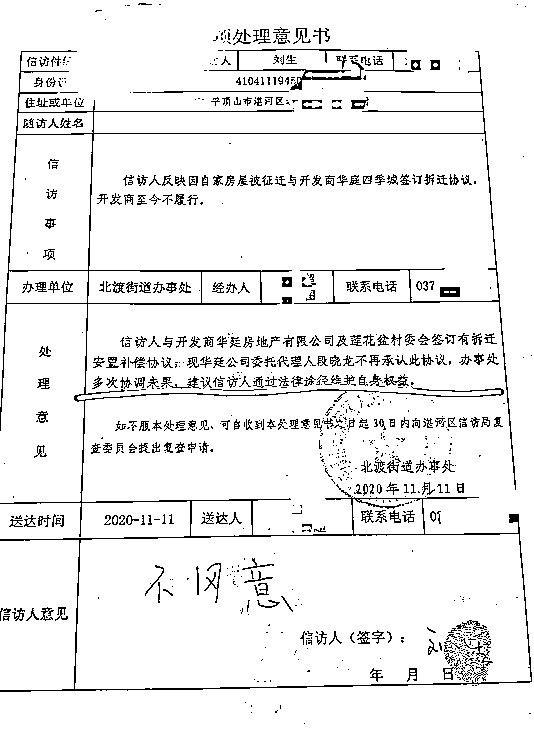
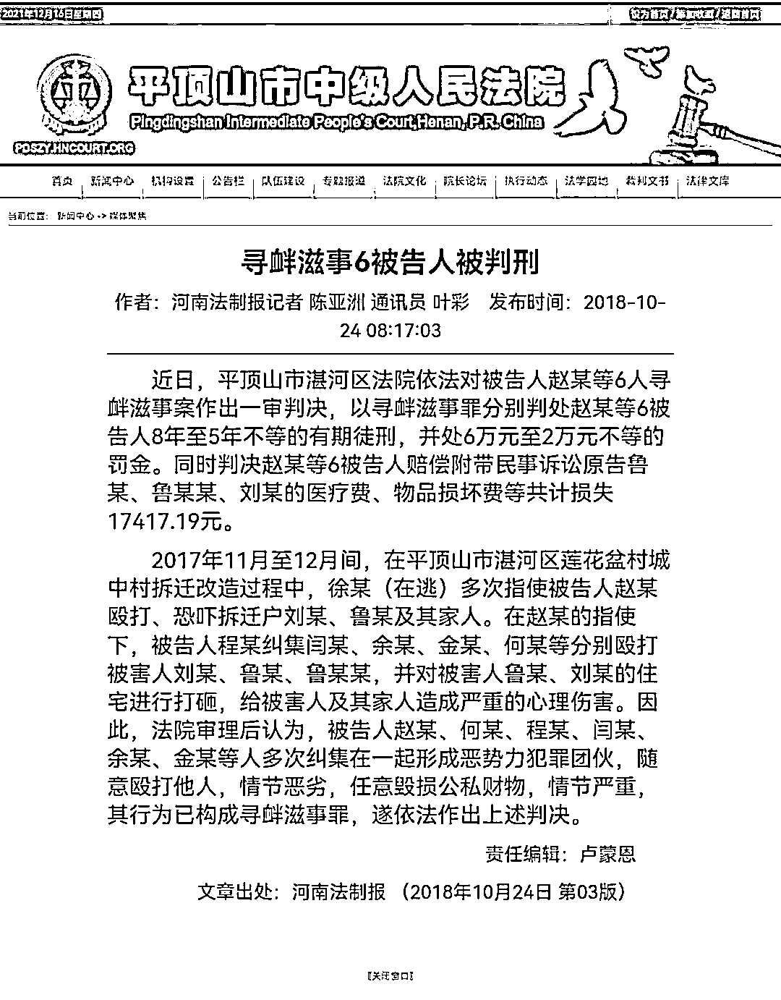

# 平顶山少年网上求助，涉事开发商 1 年内 10 次被列失信被执行人

> 原文：[`mp.weixin.qq.com/s?__biz=MzIyMDYwMTk0Mw==&mid=2247526025&idx=2&sn=c0630f158ba9b3f7c353adb5bffcba7d&chksm=97cbadb1a0bc24a793958c144b621742ac266f0e805e52662007c67f6b139768d6352589224f&scene=27#wechat_redirect`](http://mp.weixin.qq.com/s?__biz=MzIyMDYwMTk0Mw==&mid=2247526025&idx=2&sn=c0630f158ba9b3f7c353adb5bffcba7d&chksm=97cbadb1a0bc24a793958c144b621742ac266f0e805e52662007c67f6b139768d6352589224f&scene=27#wechat_redirect)

河南省平顶山 15 岁少年刘某锟自称家中房屋 2019 年因“城中村”项目开发拆迁，开发商未按约提供新住房，致使其无房可住，目前其父亲因病去世，家中还有两名老人瘫痪在床。 

[`mp.weixin.qq.com/mp/readtemplate?t=pages/video_player_tmpl&action=mpvideo&auto=0&vid=wxv_2183033195053531138`](https://mp.weixin.qq.com/mp/readtemplate?t=pages/video_player_tmpl&action=mpvideo&auto=0&vid=wxv_2183033195053531138)

澎湃新闻记者：高亮 编辑：忻燕 素材来源：大河网 网络 

12 月 16 日，平顶山湛河区委宣传部一名工作人员说，他们已针对这个情况成立舆情小组，该区相关部门正在协调工作。

12 月 17 日，平顶山湛河区政府针对此事发布情况说明称，刘某锟和父亲、乃年及爷爷刘某一同居住，刘某的房子拆迁后领取了 18 万拆迁款，过渡安置费正常发放，拆迁后他们住在自家另一处房屋。开放商因资金链断裂项目停滞，无法按约交付承诺的住房。目前，街道已将刘某夫妇妥善安置，湛河区将加快开发企业依法破产重整，进一步做好刘某夫妇及刘某锟的帮扶、救助工作，并引导其依法维权。

刘某锟则称，情况说明提到的“自家另一处房屋”，实际上是他姑姑的房子，当时约定迁拆一年后开发商给房子，他和爷爷等就暂住在他姑姑家。目前，父亲去世，爷爷奶奶瘫痪，开发商无法交房，他们没钱盖房子，陷入困境。

公开信息显示，今年以来，涉事开发商已十次被列为失信被执行人。

信访意见处理书。受访者提供

**少年称因开放商违约陷入困境，当地回应将做好帮扶** 

平顶山湛河区政府 12 月 17 日发布的情况说明称，针对湛河区北渡街道莲花盆村村民刘某锟的网上求助，湛河区委、区政府高度重视，组织工作专班对其反映问题进行了调查。

情况说明称，2006 年 5 月出生的刘某锟和父亲及爷爷奶奶一起居住。2011 年，莲花盆村城中村改造启动。2019 年 5 月，刘某锟的爷爷刘某与开发商签订其一处房屋（刘某一家在莲花盆村有三处房屋）的拆迁安置补偿协议，约定安置面积并领取开发商给予的 18 万元补偿款后，自行拆除房屋。此后，刘某一家居住在村内自家另一处房屋内。

情况说明称，2020 年 5 月，按相关协议约定开发商应首批交付两套住房，因企业资金链断裂、项目停滞，未能如约交房，过渡安置费正常发放。2021 年 4 月 13 日，刘某一家 4 口搬至项目售楼部居住。经村、街道、项目临时管理人多次沟通，刘某一家不同意搬离售楼部。2021 年 11 月 15 日，刘某锟父亲刘某刚因病去世。

刘某锟称，签订拆迁协议后，他们一家暂住在同村的姑姑家。因搬家后无法继续经营轧面条的生意，失去唯一的经济来源。父亲刘某刚于 2019 年 11 月左右患上脑溢血，已于今年 11 月 15 日去世，至今没有入土。目前，他的爷爷奶奶也患病瘫痪在床。

对于曾住在售楼部，刘某琨说，当时他的爷爷奶奶和爸爸瘫痪，他拉着他们去街道办寻求帮助，得到的回应是“你们去售楼部找开发商”。“我们去售楼部还是村干部们把我一家抬到了三轮车上。”

对于上述情况说明中提到的“刘某一家在莲花盆村有三处房屋”，刘某锟的三姑称，父亲刘某有三个女儿，大姐房子也拆迁了，她和二姐有自己的住房，都是结婚后盖的。目前刘某锟和家里两个老人没有住房。拆迁时，本来想着一年后，开发商会给房，家里经济条件不是很好，这一年为了省钱，就让刘某锟和老人住在她家。

刘某锟说，拆迁款等此前被用于给其父亲、爷爷奶奶治病，现在他家里没有钱，也没有收入，借住在亲戚家，陷入困境。

情况说明表示，目前，北渡街道已将刘某夫妇妥善安置。下一步，湛河区将加快开发企业依法破产重整，有序推进莲花盆村群众后续安置工作，全力维护群众合法权益。进一步做好刘某夫妇及刘某锟的帮扶、救助工作，并引导其依法维权。

刘某琨家人被殴打，涉事 6 人被判刑。受访者提供

**开发商代理人曾不承认协议，街道办多次协调未果** 

刘某锟提供的一份 2019 年 5 月 30 日签订的拆迁安置补偿协议显示，甲方平顶山市华延房地产开发有限公司因湛河区北渡街道办事处莲花盆村“城中村”项目开发建设需要，对乙方刘某的房屋进行拆迁。被拆除房屋位莲花盆村二组 136 号，四合院式布局，坐北朝南，占地面积为 376.33 平方米。

该协议约定，甲方拆除乙方的房屋后，按约需一次性置换给被拆迁人四套新住房，首批两套 2020 年 5 月 20 日前给付，后两套 20 22 年 5 月 20 日前给付。甲方应乙方要求自愿于 2019 年 6 月 5 日之前补偿 18 万元拆迁款。此外，甲方一次性给付乙方搬家费、临时租房过渡费、拆迁奖励款等 30279 元。

该协议写明，如甲方违约，应当无条件赔付给乙方 160 万元违约金。该协议的担保方为平顶山市湛河区北渡街道办事处莲花盆村村委会。

刘某锟说，前述协议中乙方是他的爷爷刘某。开发商违约后，他们曾向当地相关部门反映情况，但是没有得到满意的结果。

刘某锟提供的《信访事项处理意见书》显示，针对刘某反映自家房屋被征迁，签订拆迁协议后开发商拒不履行的情况，北渡街道办事处在 2020 年 11 月答复称，刘某与开发商华延房地产有限公司及莲花盆村委会签订有拆迁安置补偿协议，现华延公司委托代理人不再承认此协议，办事处多次协调未果。建议信访人通过法律途径维护自身权益。

中国执行信息公开网显示，今年至今，平顶山市华廷房地产开发有限公司十次被列为失信被执行人。

工商信息显示，平顶山市华廷房地产开发有限公司成立于 2013 年 4 月 12 日，法定代表人郭青山，注册资本 2000 万人民币。

**少年父亲曾因拒绝拆迁遭恶势力团伙打砸** 

对于刘某锟反映的其父亲刘某刚曾因拆迁纠纷被打一事，平顶山湛河区政府的情况说明称，2017 年 11 月 12 日，赵某生受徐某伟指使，纠集程某祥等人殴打刘某琨父亲刘某刚。经鉴定，刘某刚伤情为轻微伤。公安机关同时查明，徐某伟、赵某生、程某祥等人另有其它违法犯罪事实。2018 年 10 月，湛河区人民法院以寻衅滋事罪分别判处徐某伟、赵某生、程某祥等人有期徒刑 8 年至 5 年。

刘某锟提供的相关判决书披露了更多细节，其中显示，被告人徐某伟为华庭四季城 1、3 号楼项目后勤负责人。法院经审理查明，2017 年 11 月至 12 月期间，徐某伟在莲花盆村城中村拆迁改造过程中多次指使赵某生教训拒绝拆迁的刘某刚等人。赵某生及另外 8 人多次纠集形成恶势力犯罪团伙，以暴力、威胁或其他手段，在湛河区境内两次殴打刘某刚、鲁某宏，两次于凌晨时分对被害人住宅进行打砸，造成两人轻微伤及不同程度财产损失，给被害人及其家人造成严重心理强制，到外地租房居住。

来源：澎湃新闻，观察者网

← 向右滑动与灰产圈互动交流 →

