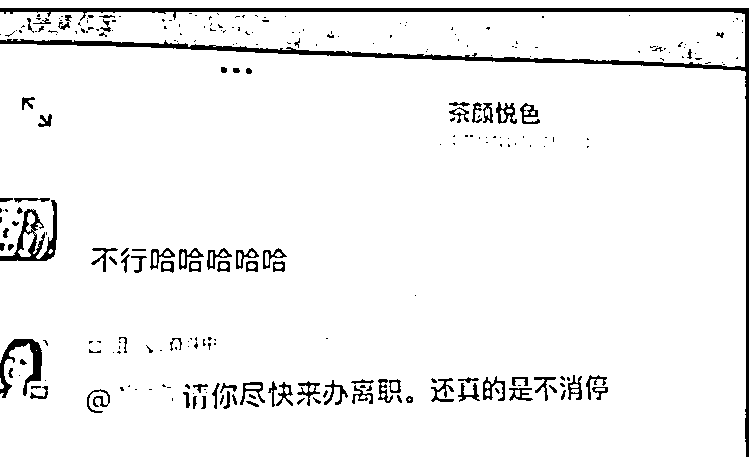

# 茶颜悦色创始人道歉！员工累死累活，到手工资才 2000......

> 原文：[`mp.weixin.qq.com/s?__biz=MzIyMDYwMTk0Mw==&mid=2247526025&idx=3&sn=21df62e25892a4259d6f8fd8f3c016c4&chksm=97cbadb1a0bc24a718c890d357efbba0debca41f5984feb95fdc9cf6e496f3479ed733ed0407&scene=27#wechat_redirect`](http://mp.weixin.qq.com/s?__biz=MzIyMDYwMTk0Mw==&mid=2247526025&idx=3&sn=21df62e25892a4259d6f8fd8f3c016c4&chksm=97cbadb1a0bc24a718c890d357efbba0debca41f5984feb95fdc9cf6e496f3479ed733ed0407&scene=27#wechat_redirect)

网红茶饮店茶颜悦色，17 日上了热搜第一。

背后是员工因为薪资太低，在工作群跟老板吵了起来。

近日网传一份茶颜悦色公司内部群聊记录，其内容显示，**部分长沙员工因疫情减工时、降薪，到手工资由原本的 5000 元左右降低至 2000 元左右。**

**01**

**茶颜悦色工资低**

**老板和员工吵起来了**

17 日了，有茶颜悦色员工在微博、小红书上等爆料称，公司员工人均工时 11 小时，时薪 6-9 元钱，月薪到手不满 3000。据发帖员工称，这次员工的抱怨引发公司内部大战！

有一名武汉区域员工称：**“工作不努力还想拿高工资......德不配位，必有灾殃......你有多大本事拿多少钱”**的发言引爆了口水大战。

茶颜悦色创始人吕良(小葱老师)随后发言称，关于开会时间的问题应向上反馈，**工资虽少但公司是按劳发放，茶颜悦色在疫情期间一个月亏损 2000 多万元。**

让长沙员工不能接受的是**“其实工资发下来能理解，但是看着外区的人拿着 6、7000 一个月来骂我们拿 1、2000 的德不配位......觉得寒心。”**

爆料发帖的员工称，茶颜悦色的创始人后面亲自打电话让他离职，而且员工人数明显减少。**“上午 7800 人的群，晚上只剩 7600 多人。”**

在社交平台上，有茶颜悦色员工表示因工资而辞职，也有部分员工表示是公司让其提交离职申请，其中包括稍早在群内反馈过意见的员工。

而小红书上也有不少员工吐槽茶颜悦色。

# **02**

# **创始人吕良道歉**

今日，#茶颜悦色员工吐槽月薪不超 3000 元#引发广泛讨论，对此，茶颜悦色创始人吕良就内部薪资争吵发道歉信，称：“对不住 8000 位信任公司、一起努力想办法抗住这个冬天的伙伴……事先没有把薪资调整的原因和调整后的薪资计算方式跟大家讲清楚。”

# **03**

# **背后的原因是茶颜悦色集中闭店**

11 月，曾因超长排队时间、高铁跨城代购奶茶等段子被大众所知的茶颜悦色，因大范围闭店登上了热搜。当时茶颜悦色通过微博发表了声明，确认了闭店一事，并表示这是该品牌今年第三次集中临时闭店。**目前，茶颜悦色在长沙有约 500 家店，临时闭店的门店数量占比近 2 成。**

茶颜悦色官方微博于日前发文称，长沙是有七八十家临时闭店了，之前的密集布点在长沙的城市发展中赚到了红利，疫情之下，自然也要承担人流减少带来的结果。**等疫情缓和，人气回暖，临时闭的店就逐步复开了。**

**“临时关闭的店大概会在明年开春逐步复开。”**茶颜悦色相关负责人在接受采访时表示，此次临时关闭的主要是在长沙重要商圈布点过于密集的门店。接下来，公司会到浏阳、株洲、岳阳等城市开设新门店，减少疫情带来的冲击，同时在长沙的一些社区也会正常开新店。“目前公司的策略仍是做好长沙的市场，再慢慢地向长沙周边城市去扩张。”

除了疫情带来的影响，新式茶饮这一赛道近年来吸引了众多入局者，竞争也日趋激烈。其中，定位中高端的有喜茶、奈雪的茶、乐乐茶，中端的有都可 coco、快乐柠檬、一点点、茶百道、古茗等，中低端的则有蜜雪冰城等。**茶颜悦色定价上属于中端，但受众主要集中在长沙及周边部分地区。随着这些品牌纷纷进入长沙市场，茶颜悦色无疑面临更大的市场竞争压力。**

相关行业数据显示，奶茶店的存活率只有 20%左右，且大部分新开奶茶店处于亏损状态。艾媒咨询数据也指出，可持续经营超过一年的奶茶店仅为 18.8%。**天眼查数据显示，截至 2020 年 11 月 30 日，中国茶饮企业总数超 30 万，其中停业、清算、吊销、注销的企业超 13 万，占比高达 43%。**

来源：中国基金报，作者 泰勒 图源网络，昌南大队长

← 向右滑动与灰产圈互动交流 →

