# 涉案金额超 2000 万！宝妈群里备受追捧的“贵妇”，背后真相令人大跌眼镜

> 原文：[`mp.weixin.qq.com/s?__biz=MzIyMDYwMTk0Mw==&mid=2247526025&idx=4&sn=1ad61a1d14e9d2758971291c1304dd3f&chksm=97cbadb1a0bc24a7b6cca28f16787099712f805b87a7ca4575e6515502cc279126e5bba6f9ba&scene=27#wechat_redirect`](http://mp.weixin.qq.com/s?__biz=MzIyMDYwMTk0Mw==&mid=2247526025&idx=4&sn=1ad61a1d14e9d2758971291c1304dd3f&chksm=97cbadb1a0bc24a7b6cca28f16787099712f805b87a7ca4575e6515502cc279126e5bba6f9ba&scene=27#wechat_redirect)

你的朋友圈里

是不是会有这类人

就每天也不需要怎么工作

日常生活就是

逛街 购物 喝下午茶

要不就是带娃到处玩

住的都是高档酒店

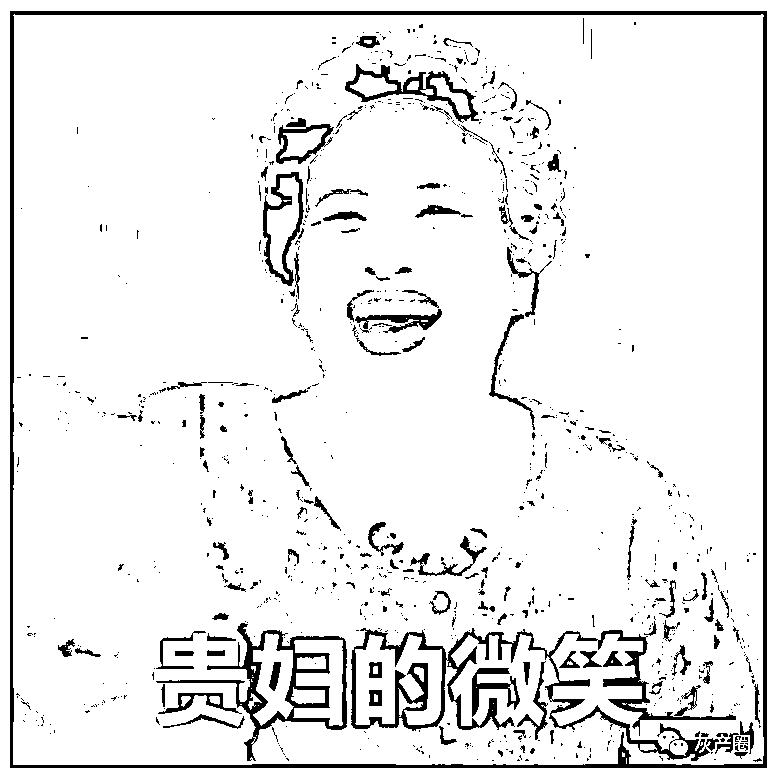

从 2018 年起

上海的一些宝妈圈子里

就活跃着这么一个人

她是众人心中的“卡皇”

因为从她手中可以半价购买

诸如

迪士尼奇梦卡

热门电商储值卡

热门餐饮代金券等

今天的法制节目

就是带你走进

这位“卡皇”的双面人生

**A 面：家境殷实、婚姻美满的“卡皇”**

 “卡皇”名叫许燕萍。在众人眼中在同事们眼中，许燕萍家境殷实、出手阔绰，一直是大姐大一样的存在。

许燕萍有一个正在上初中的儿子，昵称是“少爷”。爱马仕的 T 恤、乐高的玩具、迪士尼的玩偶……只要儿子看中，许燕萍买起来毫不犹豫。

2018 年起，许燕萍做起了半价旅游产品的买卖，涵盖了日韩、港澳台等多处热门路线，狠狠圈了一波粉。

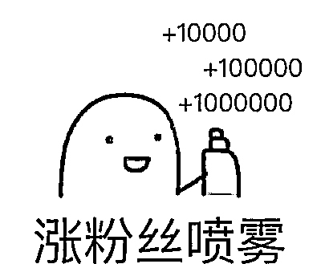

2019 年起，许燕萍陆续推出了半价的迪士尼奇梦卡、热门电商储值卡、餐饮代金券等产品。不过，无论是旅游产品还是之后的卡券，许燕萍都有个规定，购买后半年才能兑付。

不过，粉丝们的担忧很快就随着许燕萍的按时兑付而烟消云散了。由于许燕萍出售的都是热门卡券，很快便积累起了 700 多名忠实粉丝。有些粉丝甚至会主动去问，最近还有什么团购。

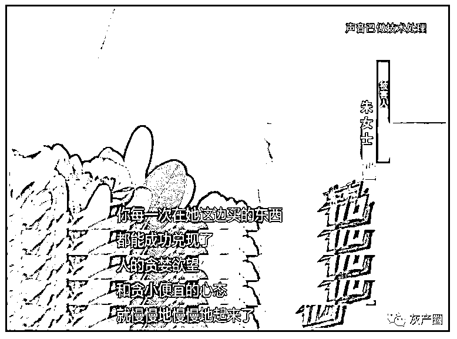

由于许燕萍出售的这些半价卡券，属于日常生活中的“硬通货”，所以群里时常是供不应求的状态，这也引得粉丝开始争相内卷了起来——同事聚餐，从来不让她掏钱；8424 的西瓜，一周送一个上门；用了她的半价旅游套餐出去玩，特产都是一箱一箱往她家寄；她在微信群里发一张自拍，底下全是一阵赞美之词……

而这些粉丝想方设法讨好许燕萍的目的只有一个，就是让她尽快兑付自己购买的优惠卡券。

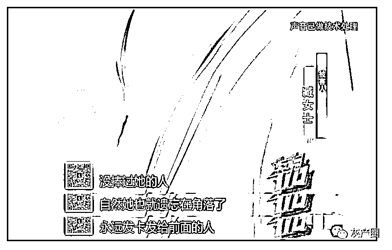

去年 6 月份，许燕萍邀请了 100 名粉丝，包下了迪士尼酒店的 2 楼露台，给她儿子办了场盛大的生日派对。

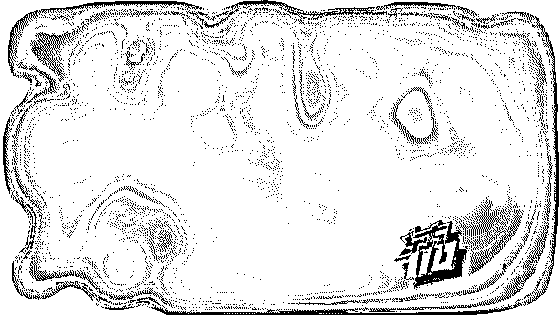

应邀而来的宾客们也都给许燕萍的儿子准备了厚礼。光乐高的灭霸手套就有 5 个，还有耳机、奢侈品 T 恤等，都是价值不菲的东西。

**B 面：家境落魄、夫妻离异的骗子**

随着卡券销售量越来越大，从 2020 年年头开始，粉丝发现卡券兑付有了延迟。今年 8 月 13 日，由于迟迟不能兑付卡券，许燕萍被几名粉丝扭送到了派出所。通过询问，警方得知许燕萍根本没有特殊渠道，所有卡券都是她原价买来、再半价卖出去的。

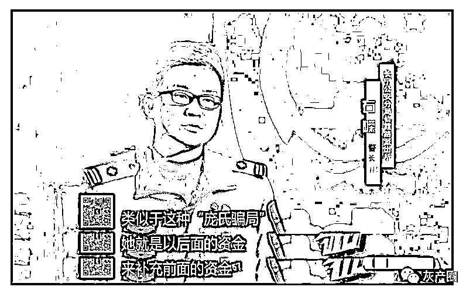

经过粗略统计，不算犯罪嫌疑人许燕萍承诺兑付的卡券金额，她目前拖欠他人款项共计 2000 余万元。

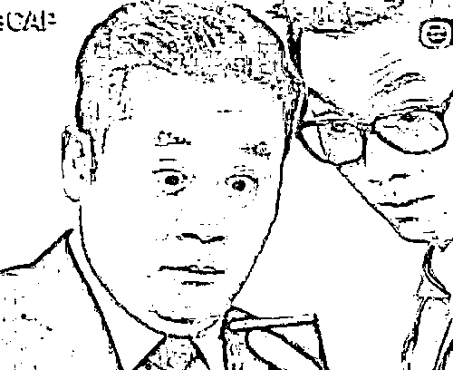

那么，许燕萍为什么要做这个赔本买卖呢？当众人走进许燕萍的家里，一切都有了答案。

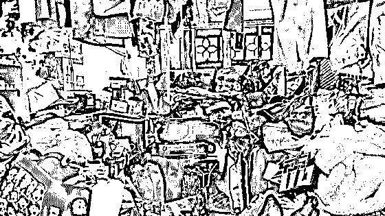

许燕萍家在长宁区的一个老公房的一楼。她家是一室半的格局，房间是上世纪八十年代的原始装修，放眼望去堆满了各种包裹。这也扑灭了被害人最后的幻想。

原来，在外人眼里婚姻美满的许燕萍，早在 2009 年的时候就离婚了。离婚后，许燕萍心里就憋着一口气。

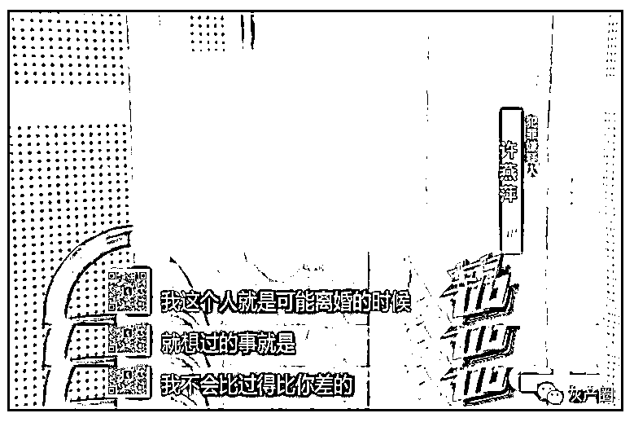

许燕萍的第一份工作是寻呼台客服，之后陆续做过电话销售、网络红娘，月薪能维持在 1 万元左右，但这点工资根本经不起她挥霍。在工作期间，许燕萍发现通过“庞氏骗局”的敛财手法，可以快速积累财富，这也使得她走上了一条不归路。

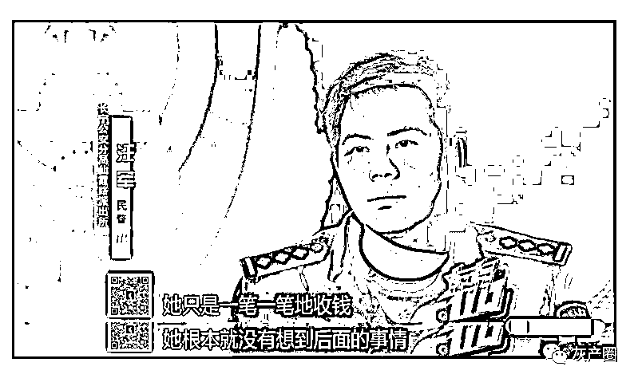

据许燕萍的父亲说，有一段时间许燕萍几乎不回家过夜，不是去日本韩国旅游，就是住在迪士尼酒店。

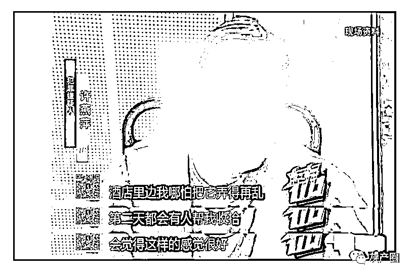

许燕萍是迪士尼的忠实粉丝，最爱的角色是达菲和雪莉玫。童话乐园，也许是她用来暂时逃离现实的手段。

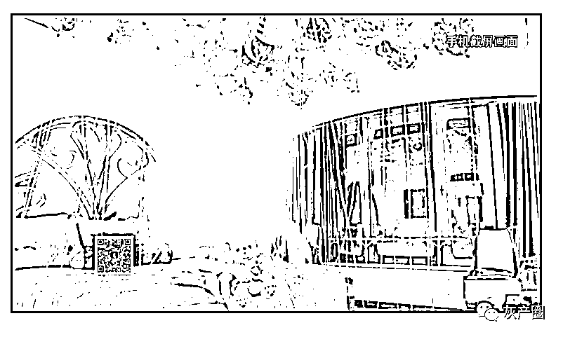

在许燕萍凌乱的家中，有两个特别引人注目的地方。一个是房间里立着的一个展示架，一个是许燕萍床边靠墙摆放的一整排盲盒柜。这两个地方，也许表达着她对美好生活的些许向往。

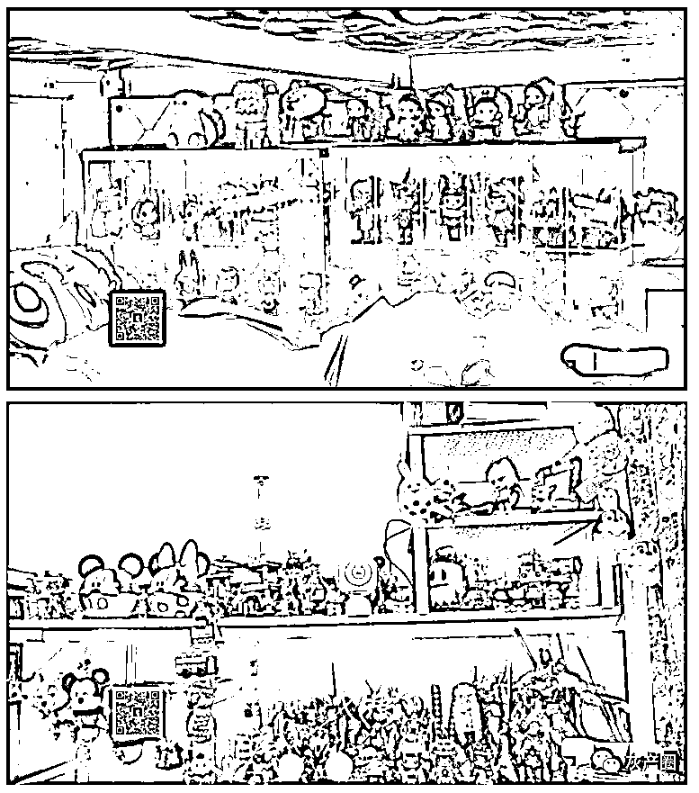

然而，谎言终究无法成为现实。人生就像不断在积累多米诺骨牌一样，许燕萍的每一次说谎，就是给自己竖起了一张牌。由于开头就是谎言，所以许燕萍堆砌的骨牌根本禁不住外力推敲。 

虚荣、要面子、贪图享乐的性格特质，加上粉丝的狂热追捧，使得许燕萍一点点走到了犯罪边缘。时至今日，面对 2000 多万的巨额负债，许燕萍仍然表现得无动于衷。

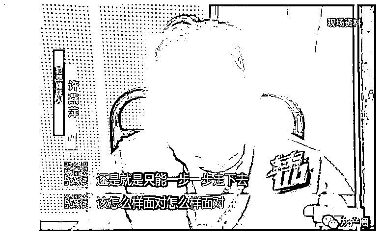

而她这样自私自利、贪图享乐捅下的篓子，给她身边的亲人朋友带来了巨大的伤害。

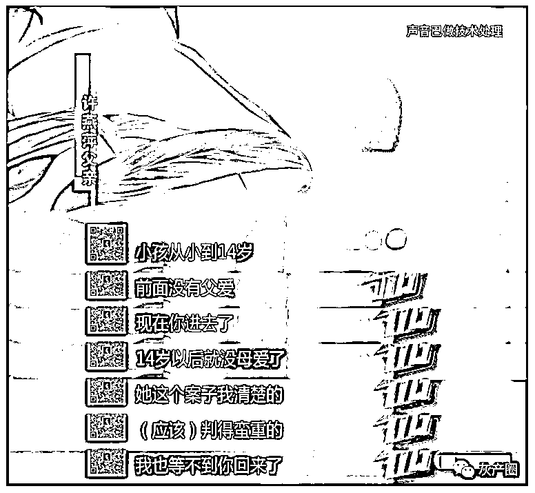

来源：上海广播电视台“案件聚焦”，潇湘晨报

← 向右滑动与灰产圈互动交流 →

