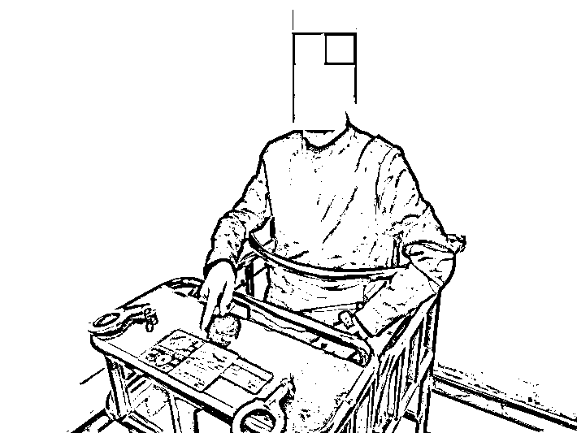
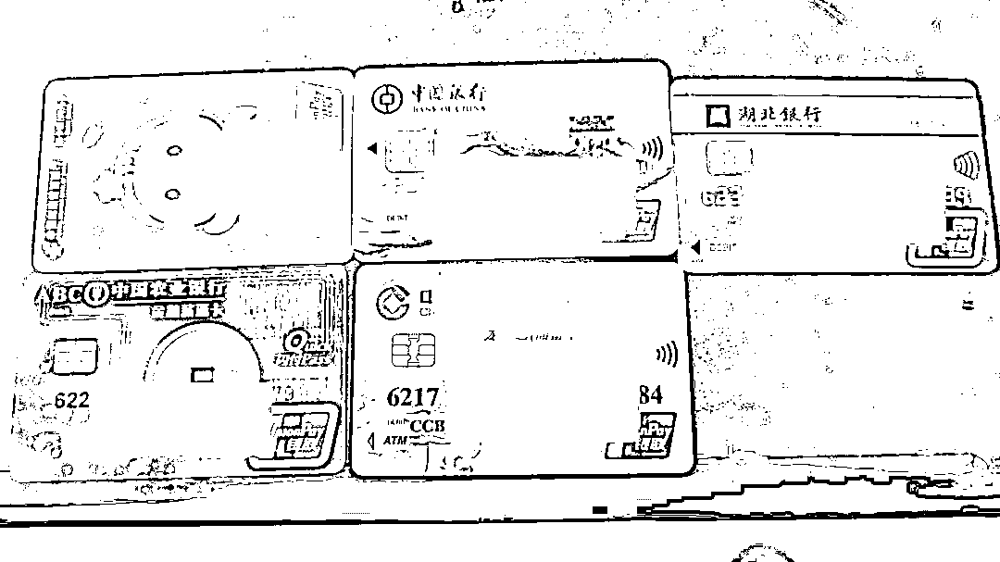
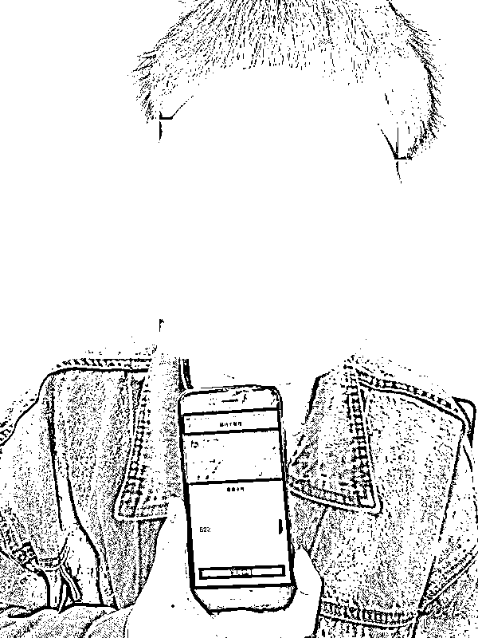
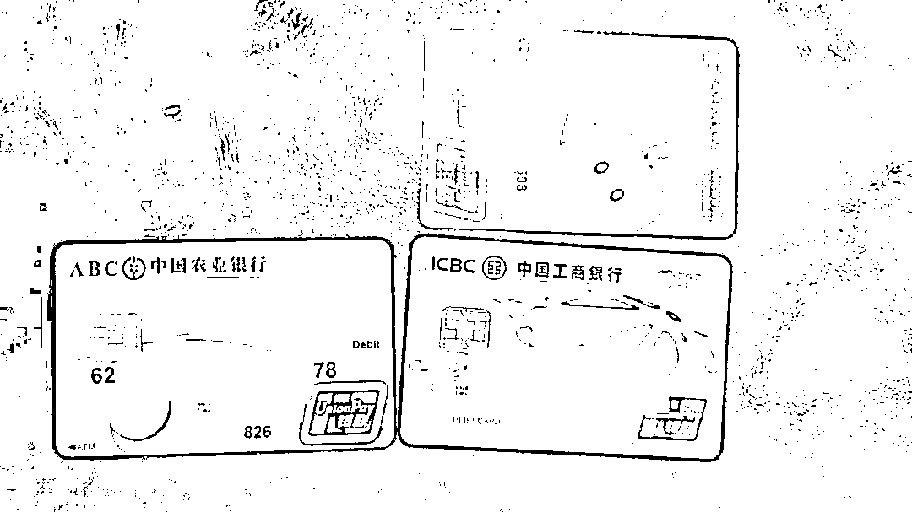

# 受害者变诈骗犯，男子遭电信诈骗后，竟干出这事！

> 原文：[`mp.weixin.qq.com/s?__biz=MzIyMDYwMTk0Mw==&mid=2247526025&idx=5&sn=49117ea0a001f47f7fd1a371ab879fee&chksm=97cbadb1a0bc24a7de86bc150dd9d5f10abcb9503e4498333a6670cca28e906fb1ed382e3a64&scene=27#wechat_redirect`](http://mp.weixin.qq.com/s?__biz=MzIyMDYwMTk0Mw==&mid=2247526025&idx=5&sn=49117ea0a001f47f7fd1a371ab879fee&chksm=97cbadb1a0bc24a7de86bc150dd9d5f10abcb9503e4498333a6670cca28e906fb1ed382e3a64&scene=27#wechat_redirect)

如果遭遇电信网络诈骗

大家第一反映就是快报警！

可十堰一小伙

原本是诈骗的受害者

结果......

湖南女子遭遇“杀猪盘”

被“男友”诈骗 25 万

家住湖南省浏阳市的黄女士今年 28 岁，有一份稳定的工作。今年 9 月初，黄女士在某交友平台认识了一个自称叫“李洋”的男子。互加好友之后，网络那边的“他”帅气阳光，聊起天来善解人意，两人大有相见恨晚之感，彼此感情很快升温。

坠入爱河的黄女士逐渐放松警惕，一个多月后，在“李洋”的不断劝说下，**黄女士开通了一个名为“聚宝”虚拟币投资平台的账号。**

“刚开始只是想试着玩玩看，投的钱也不多。”黄女士说。她先投入了 500 元，没想到立即赚了 40 元。此后，黄女士就有些跃跃欲试，想狠狠地“赚”上一笔。随后，在对方的劝说下，**黄女士在短短一周左右，就陆续将自己的全部积蓄 25 万元充进账户。**

然而这一次，黄女士等来的却是爱情童话与赚钱美梦的同时破灭，**“恋人”在 25 万元到账后消失得无影无踪，平台投资的资金也无法提现。**黄女士这才意识到受骗，于是立即到当地公安机关报警。

银行卡流水 200 万

两男子 “跑分”洗钱被刑拘

接到报警后，当地警方立即成立专案组开展侦查。民警初步推断黄女士是遭遇了“杀猪盘”诈骗。经过对聊天记录、涉案账户、资金流向进行分析研判，**专案组最终查明涉案资金主要转入十堰男子韩某的账户内。**

12 月 9 日，十堰市公安局张湾区公安分局接到湖南省浏阳市警方发来的协查请求，遂立即对韩某展开了调查。通过对韩某的活动轨迹调查，很快锁定其居住在汉江路某小区。

韩某在审讯室内接受民警调查

随后，民警着便衣在小区内侦查，最终在**12 月 11 日凌晨将嫌疑人韩某成功抓获，并在其居住的房屋内查获银行卡 5 张，作案手机 2 部。**通过进一步调查，发现韩某不仅提供自己的银行卡给诈骗团伙洗钱，还将朋友王某拖下了水，两人在短短的一个多月，利用自己的银行账户或微信账户，帮助不法分子进行资金转移，从中非法赚取佣金 6000 余元，8 张涉案的银行卡流水高达 200 余万。

涉案银行卡

12 月 13 日上午，办案民警通过布控蹲守，在车城南路某网吧将另一犯罪嫌疑人王某抓获，当场查获银行卡 2 张，作案手机 1 部。

受害人反成嫌疑人

为追损失沦为诈骗帮凶

犯罪嫌疑人韩某到案后，办案民警发现一件令人惊讶的事情，**韩某原本应是电信诈骗受害人，但他被骗后没有报警求助，反而作出了另一种选择。正是这一念之差，让其走上了犯罪的道路。**

现年 28 岁的韩某在城区某公司上班，工作稳定，平常就喜欢上网打游戏。今年 10 月下旬，他在一个游戏微信群里，看到有人发刷单兼职的广告，一时好奇便添加对方为好友，并按要求下载了一个叫“XX 米”的 APP，后通过对方的指导，在平台内进行刷单充值返现操作。在前期小额刷单时，韩某均能提取本金和佣金。**尝到甜头的韩某认为找到了一个轻松赚钱的好门道，毫无戒备心理的进行大额刷单后，却发现无法提现，共损失 8000 余元。**

事后，韩某意识到自己被骗，但他未选择报警等合法途径挽回被骗损失，反而和“客服”聊了起来，对方表示，现在有另外一个挣钱的门路，**只需要提供自己的银行卡为 APP“跑分”洗钱，每 10000 元钱就能收到 20-40 元的好处费。考虑到自己损失了 8000 余元，韩某稍微犹豫了一下，就同意了。**

韩某的朋友王某 

就这样，在明知资金来源是违法资金的情况下，韩某仍然使用自己的银行卡帮助境外诈骗集团洗白资金，此后，还拉上朋友王某一起“挣大钱”。**截至被抓当日，两人名下的 8 张银行卡涉案流水资金高达 200 万元，获利 6000 余元。**

涉案银行卡 

十堰警方提醒大家保护好账户信息，不外借银行卡、微信、支付宝账户，一旦发现自己被骗，应当第一时间报警，切不可企图将损失转嫁他人，成为诈骗分子的帮凶！

**本是电信诈骗的受害者**

**一念之差**

**竟沦为诈骗团伙帮凶**

**这下既没了钱，还违了法**

**太糊涂！**

来源：天天防诈骗

← 向右滑动与灰产圈互动交流 →

