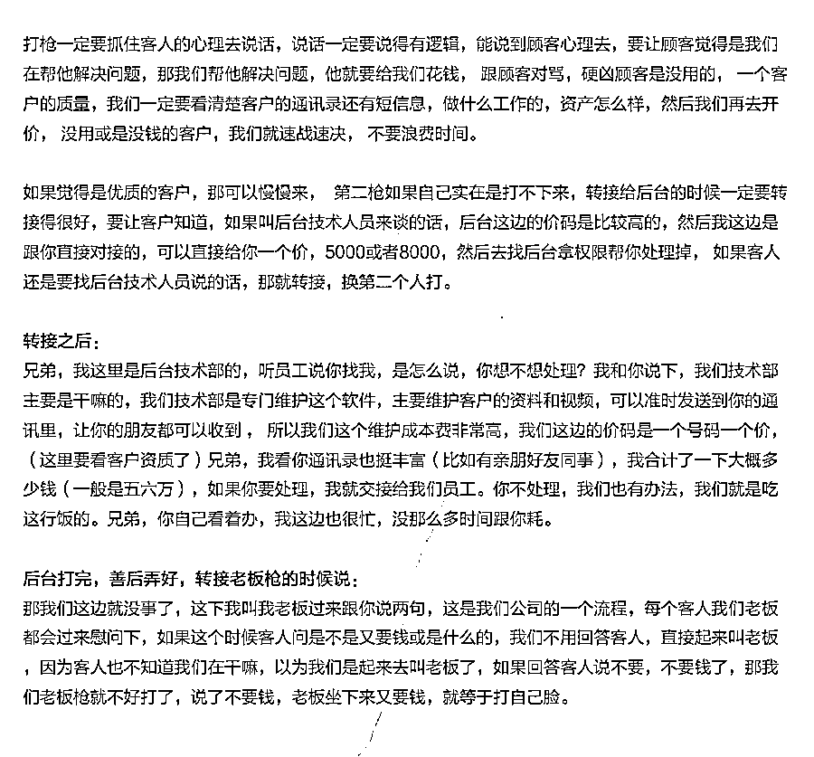

# 裸聊 5 分钟被敲诈 50 万，这些裸聊敲诈话术刷爆朋友圈

> 原文：[`mp.weixin.qq.com/s?__biz=MzIyMDYwMTk0Mw==&mid=2247526079&idx=2&sn=2c59dbf3731a773b7c43487d77b4cb6e&chksm=97cbad87a0bc2491a24e73931d98321b241f0f4f083249ad1a8b038760814c0236a0509e4380&scene=27#wechat_redirect`](http://mp.weixin.qq.com/s?__biz=MzIyMDYwMTk0Mw==&mid=2247526079&idx=2&sn=2c59dbf3731a773b7c43487d77b4cb6e&chksm=97cbad87a0bc2491a24e73931d98321b241f0f4f083249ad1a8b038760814c0236a0509e4380&scene=27#wechat_redirect)

一名年轻的医生， 

果聊被敲诈 50 万，

小编仔细数了数：

不是 5000，

不是 50000，

的确是 500000。 

色情行业一直是互联网的顽疾，**相关黑灰产就有网上招嫖、色情诈骗、裸聊敲诈、裸贷威胁等，**有时明明知道是陷阱，为何还有人“前赴后继”往里跳呢？

**“裸聊敲诈”与其他欺诈手段相比，相对特殊：受害人为了顾及“面子”，让骗子删除自己的不雅视频、避免被“爆”通讯录，往往会“心甘情愿”地任由骗子宰割、被骗子一而再、再而三的敲诈勒索。**

## （裸聊敲诈全过程）

## “裸聊敲诈”手法分析

“裸聊敲诈”的一般流程如下图所示：

*注：部分“裸聊敲诈”手法中，会先诱导裸聊，再引导下载木马 app，与图示流程略有差异

1）骗子通过在网络平台等发布色情诱导信息，**引导添加第三方聊天软件，**如同城交友类软件。

2）通过话术（如“帮我点赞、增加人气”等）**诱导受害者下载木马 app。**这些木马 app 一般打着“直播”、”视频“的幌子，骗取受害者的通讯录、实时位置、短信等内容。

3）诱导受害者进行裸聊，并对受害者的不雅视频**进行偷偷录制。**受害者以为网络情缘一线牵的”美女“实则多为男性。他们通过预先录制准备好的美女裸聊视频或通过美颜、变声等技术手段欺骗受害者。

“裸聊敲诈”骗子热衷于使用女性化网名 

（骗子准备的美女图和道具图）

经研究木马 app 发现，所谓的“裸聊”APP 除了图片，并无任何实质内容，**主要功能就是获取受害者通讯录，短信，位置等基本信息。**“裸聊敲诈”受害者的手机设备名称、手机号、登录时间、登录 IP 等均可在后台一览无遗，并且可以对受害者手机进行定位、查看通讯录/相册/短信、下载通讯录/短信、清空通讯录/短信等操作。

*木马 app 后台代码解析：获取通讯录和实时定位

*“裸聊敲诈”骗子使用的木马 app

*“裸聊敲诈”骗子使用的自动化工具，提升作恶效率

4）当骗子“集齐”受害者的“不雅视频”和“通讯录”后，对面的“美女”会立刻露出真面目，以“爆”受害者通讯录、群发受害者不雅视频为威胁，通过社交软件、短信、电话等进行敲诈勒索。 

*受害者收到的短信威胁

5）裸聊敲诈有三个关键点，一是**录制不雅视频**，二是**盗取通讯录**，三**是用话术敲诈**。业务员“上号”前，团伙头目早已备好“子弹”，如包装帐号、准备美女视频、更新收款码、写敲诈话术、设置木马软件、群发软件等。

（裸聊敲诈链路图）

行骗时，如果临时打字，既浪费精力，成本也高，发挥还不稳定，为了提高效率，骗子做了三件事：

**1、标准化：**总结大量话术，让整个敲诈过程标准化；

**2、系统化：**准备多种预案，系统应对各种突发情况；

**3、流程化：**写出教学计划，流程化培训团伙新成员；

（裸聊敲诈话术）

下面我们来看他们总结的话术。

**01****摊牌枪**

**骗子获得裸聊视频后，第一步就是摊牌。**他们也有策略，先不提通讯录，是为后面继续要钱埋伏笔。如果受害者要报警，骗子利用受害者不敢公开的心理进行恫吓，**甚至“鼓励”受害者去报警。**

（第一枪话术）

如果受害者不拿钱处理，就威胁要发送亲友。到这一步，很多扛不住心理攻势的受害者，只有“乖乖交钱”了。

**02****后台枪**

第一波攻势拿到钱后，骗子就知道受害者已经沦陷。第二波攻势，骗子就说后台已盗取通讯录，**要拿钱给后台才能彻底删除。**

（第二枪话术 1）

这还真不是空穴来风，他们让受害者下载软件裸聊，就是为了盗取手机信息。**一方面利用受害者恐惧心理，甚至夸受害者“态度诚恳”，一方面给受害者“优惠价”，以退为进。**

（第二枪话术 2）

**第二次要钱，**显然不那么容易，骗子也知道这一点，所以分了两步走，先由业务员只要钱，直接给一个 5000 或 8000 的处理价，如果不行，再转接二线，同样是威逼利诱，**抛出两个价格选项，迫使用户选择价格低的去处理。**受害者再次给钱后，就直接转接老板，美其名曰“每个客人，老板都会过来慰问下”。

**03****老板枪**

**第三枪也被称作老板枪，**被骗子标记为重点。被要了 2 次钱后，受害者基本都被掏空了，再要压榨出钱来，就要看老板（可能是高阶骗子，不是真的老板）的水平了。

（第三枪话术）

骗子先套信息，再安抚（在我这里就能彻底解决），再抛出不同职业对应不同价位，**给出选择，受害者很容易就去选最低价，**而不是直接不给钱。而且，骗子还做了很多预案，如要跳楼的、哭穷的，他们都有应对话术。

**04****删除枪**

**第四枪，**这一步就很讲究技巧了，名义上，骗子以“删除聊天记录”要钱，实际不仅要结合受害者资质，**还要保持“突然性”，制造“偶然想起”的假象，**不然之前老板说的“彻底解决”，就要打脸了，所以要制造出是“员工的错误”，还要员工承担一半费用。

（第四枪话术）

**05****回收枪**

**第五枪，**这一步就开始自行发挥了，团伙头目要充分发挥一线员工的“主观能动性”，让下面的骗子充分榨干受害者，这就是骗子最可恨的地方：**毫无底线，不留活路。**

（第五枪话术）

**06****保证枪**

**第六枪，**号码回收了，就要保证金，名义上是防止受害者举报，实际上，骗子就是在编理由要钱，所谓“会原封不动退回”，都是虚假承诺，让受害者感觉“没有掏钱”，实际这个钱，根本就是肉包子打狗。

（第六枪话术）

**07****小妹枪**

**第七枪，**如果受害者付了保证金，骗子也不会就此罢休，还会以“小妹去你家闹、她手机也有你通讯录和视频”威胁，到这里，受害者一般都醒悟过来，不会给钱了。

（第七、八枪话术）

裸聊敲诈是一个成熟的犯罪产业，受害者遭遇敲诈，**最好的办法就是置之不理，直接删黑，及时报警。****否则让他们尝到甜头，便一发不可收拾，他们只会变本加厉地索取更****多。****切记：****不能给钱！****不能给钱！****不能给钱！**

* * *

**直播裸聊莫轻信，美色诱惑多陷阱。**

**陌生软**件勿下载，遭遇敲诈先报警。****

来源：腾讯卫士、防骗每日电讯、阻击诈骗

← 向右滑动与灰产圈互动交流 →

