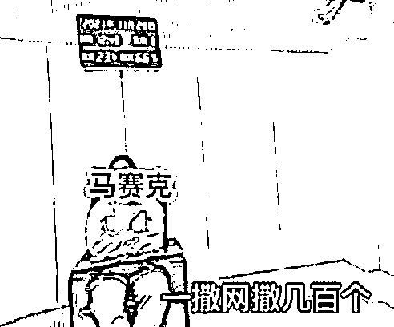
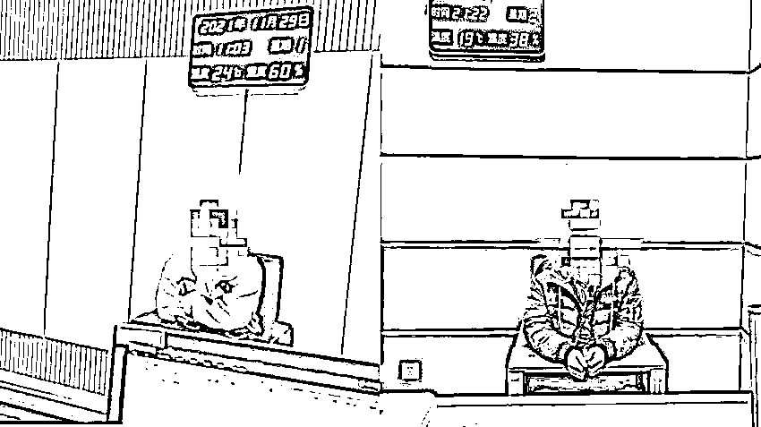

# 已婚大姐装未婚诈骗 20 人养自己老公：他们都想和我走到一起……

> 原文：[`mp.weixin.qq.com/s?__biz=MzIyMDYwMTk0Mw==&mid=2247526079&idx=3&sn=70bc89f6d83f33d5e3efd149ec4404d9&chksm=97cbad87a0bc249153595e46b094b6eb24cd9a5ae2bcceff8e439b2ac360b256004a4766c05d&scene=27#wechat_redirect`](http://mp.weixin.qq.com/s?__biz=MzIyMDYwMTk0Mw==&mid=2247526079&idx=3&sn=70bc89f6d83f33d5e3efd149ec4404d9&chksm=97cbad87a0bc249153595e46b094b6eb24cd9a5ae2bcceff8e439b2ac360b256004a4766c05d&scene=27#wechat_redirect)

明明已经结婚，却冒充单身和一男子谈恋爱，骗取其钱财两万余元。近日，内蒙古包头市固阳县公安局刑侦大队反诈骗中心成功破获一起诈骗案。

[`mp.weixin.qq.com/mp/readtemplate?t=pages/video_player_tmpl&action=mpvideo&auto=0&vid=wxv_2184865551079079947`](https://mp.weixin.qq.com/mp/readtemplate?t=pages/video_player_tmpl&action=mpvideo&auto=0&vid=wxv_2184865551079079947)

10 月 25 日，包头市固阳县公安局辖区居民陈某报警，称其在某直播平台认识了某名主播，熟悉后加微信聊天，聊着两人便有了谈恋爱的想法，于是便很快确定了恋爱关系。恋爱过程中该主播让他以充值买礼物的方式为其“贡献”了 2 万元，但是还不满足，此时的陈某已经囊中羞涩，“女朋友”觉得陈某没钱了便逐渐失去了与他聊天的耐心。直到拉黑了他的微信，陈某这才意识到自己被骗了，遂即选择了向警方报案。 

接到报案后，固阳县警方最终锁定了这位“恋爱对象”杨某，并掌握了她所在的位置信息。

11 月 27 日，刑侦大队选派精干警力前往杨某所在的江苏省某某市，寻找犯罪嫌疑人。在当地公安机关的配合下，侦查人员不放过每一个细节，深入调查，很快锁定嫌疑人杨某并将其成功抓获。

经审讯，杨某对自己隐瞒婚姻状态骗取任某 2 万余元的犯罪行为供认不讳。**截止杨某被抓获时，其微信中至少有 20 名男性求偶者正在被骗。**询问中，杨某称：他们都是想和我走到一起……但**杨某在骗得资金后，将全部所得转移至其丈夫刘某的微信中。**侦查人员又立即对刘某进行传唤，然而反侦查意识极强的刘某已经关机逃逸。

11 月 28 日，刑侦大队紧急派出 3 名民警前往江苏省某某市进行支援。与此同时，固阳县局警务支援大队积极服务该案件的侦破工作。最终侦查人员在张家港市公安机关的配合下于当日顺利将潜逃在此地的刘某抓获。

经审讯，刘某对其明知杨某进行诈骗仍然接受杨某转账的事实供认不讳。 

目前该案正在进一步的侦办中。

**民警提醒：网红主播是个新兴的网络事务，部分网友为追求精神寄托投入大量金钱和感情,却忽略了直播的商业性和虚拟性,为不法分子提供了可以“突破”的空间。在这里提醒大家娱乐过程中,一定要保持清醒,擦亮眼睛,切莫贪图一时之快,造成不必要的损失和伤害。**来源：潇湘晨报

← 向右滑动与灰产圈互动交流 →

