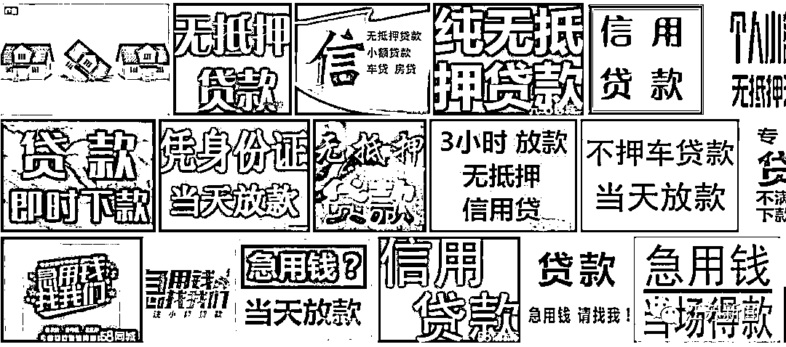

# 贷款诈骗，一个让你永远无法“提现”的骗局！

> 原文：[`mp.weixin.qq.com/s?__biz=MzIyMDYwMTk0Mw==&mid=2247526079&idx=5&sn=405bc70896332944a2c91e6b2aadc90a&chksm=97cbad87a0bc24912920fc8fef6bcc587ac2426e38952745a206451dc071e36ec2e7c85abd57&scene=27#wechat_redirect`](http://mp.weixin.qq.com/s?__biz=MzIyMDYwMTk0Mw==&mid=2247526079&idx=5&sn=405bc70896332944a2c91e6b2aadc90a&chksm=97cbad87a0bc24912920fc8fef6bcc587ac2426e38952745a206451dc071e36ec2e7c85abd57&scene=27#wechat_redirect)

人难免有急着用钱的时候 

但人情债难借难还

银行贷款程序繁琐要审批

有没有什么方便快捷的方法呢

**此时，电脑弹出一堆小广告……** 

但这往往是骗局的开始 

如果不懂网络贷款诈骗的套路

贷款贷不成，反倒越贷越穷

**比如下面这位**

** 1、接到贷款公司电话**

小陈接到一个自称为某贷款平台客服打来的电话，刚好小陈近期急需用钱，在跟对方简单了解后，便添加了对方的 QQ 号。

**2、下载贷款 APP 后填写信息**

加上好友后，对方让小陈下载一款名为“某某贷”的软件，并让其在这个软件上注册帐号，填写相关的基本信息，同时申请 50000 元的额度。

**3、要贷款？先交平台费**

这时，对方告诉小陈，申请的贷款额度没通过。想要通过，必须先交 1600 元的平台费用。小陈立即转账，随后显示审核通过，但他却仍然无法提现。

**4、卡号填写错误？再交解冻费**

对方则称小陈填错银行卡号，导致账户被冻结，所以钱贷不下来，需要再缴纳 2000 元的解冻费……

**5、想提现？再交保险费**

这时总该提现了吧？可小陈被告知，提现还需缴纳 2000 元保险费，并称在交付成功后，可以退还前面缴纳的解冻费和保险费共计 4000 元。小陈觉得反正都可以退回的，就又继续转账了 2000 元的保险费。

**6、信用不良？还要交保证金**

小陈支付成功后还是不能提现，又说他信用存在问题，还需再缴纳 3000 元保证金，才可放贷。直到此时，小陈才意识到自己遇到了骗子，最终选择了报警。

网络贷款诈骗有几个显著的特征

符合以下几点的其中一点

就要高度警惕了！（敲黑板）

01

网络贷款 APP 通常通过网页、私人发的链接或扫二维码图片下载

所谓的“客服”会通过网页、私人发的链接或以扫二维码图片下载的形式诱导您下载 APP。有的骗子会仿冒正规的网络贷款 APP，假的 APP 图标与正规的很相似，名字一样，有以假乱真的效果。

**怎么破？**

*   网络贷款 APP 只在官方应用市场下载，对于不明的链接、二维码一律不点不扫不下载。

02

“无抵押、无担保”“当天放贷”“免押高额低息”等字眼出现

在许多的“网络贷款骗局”中，往往会出现“无抵押、无担保”“当天放贷”“免押高额低息”等极具诱惑性的标语。这些标语极其精准地切中了广大急需资金的企业主及个人的要害。但回头想想，条件这么宽松的贷款，确定就没问题？国家金融监管机构会允许如此随便的放贷吗？

**怎么破？**

*   一律不相信此类贷款机构。对于急需资金的企业或个人，轻易借贷并不能“雪中送炭”，很可能会是“雪上加霜”。

03

放款前会以卡号填错等理由，需要先提交“手续费”、“保证金”、“解冻费”

正规的贷款放款之前是不需要收取费用的。放贷前以各种理由诱导转账的一律是诈骗。

**怎么破？**

*   需要贷款的企业和个人要通过正规渠道去银行等金融机构办理。

* * *

**提醒你**

1、银行、正规贷款公司不会要求借款人支付“保证金”、“手续费”、“服务费”等各种费用；

2、强化自我保护意识，不泄露个人信息和银行卡信息；

3、如不慎被骗或遇可疑情形，请注意保护证据，立即拨打 110 报警或咨询。

来源:天天防诈骗

← 向右滑动与灰产圈互动交流 →

