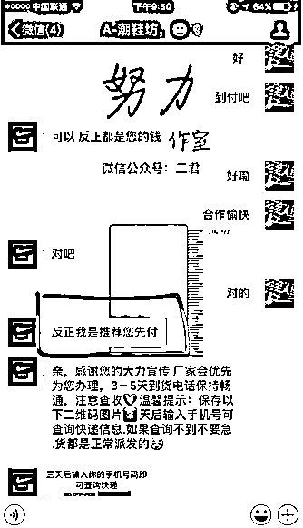

# "免费送"和免费送是两码事！

> 原文：[`mp.weixin.qq.com/s?__biz=MzIyMDYwMTk0Mw==&mid=2247526079&idx=6&sn=954a2bf76557d9b01f7d5dae35973b53&chksm=97cbad87a0bc249121427f020623a5e4a04d656ddcb4c6880f9187cdbde330769e680f70b933&scene=27#wechat_redirect`](http://mp.weixin.qq.com/s?__biz=MzIyMDYwMTk0Mw==&mid=2247526079&idx=6&sn=954a2bf76557d9b01f7d5dae35973b53&chksm=97cbad87a0bc249121427f020623a5e4a04d656ddcb4c6880f9187cdbde330769e680f70b933&scene=27#wechat_redirect)

免费送手机，免费送口红，免费送黄金...你也在朋友圈转发这种“免费送”活动吗？先别急！在动手点转发之前，请先做一个填空题：占小便宜吃 ____，天上不会掉 ____。

无数的案例告诉我们“天上不会掉馅饼”。一些看着诱人的小便宜却是实打实的诈骗制造机。这些“扫一扫，免费送啥啥”的“福利”广告中，大多就是不法分子放出的诱饵。你以为的占便宜其实最后吃的却是大亏。

**1、免费送榴莲、大闸蟹，扫码进群？**

不管内容有多扯，总是有人会先基于相信“好友”这个人的前提下而相信他发的内容。骗子正是利用了人们相信朋友的这种心理，才来攻占你的朋友圈的，你的大意转发，其实已经属于上当受骗，被骗走的是比金钱还珍贵的信任感和靠谱度。

对了顺便提一下，骗子大概率不会去验证你是否真的发圈，真正的目的是接下来的一部——让你进群。

了解了群里的发言人是“托”的身份后，就能明白他们每一句话的用意，一开始的自问自答是暖场和释疑，以便主人尽快进入诈骗主题——兼职刷单。然后托们开始尽职示范，自说自演、自疑自夸。从你被诱惑开始刷第一单起，你就已经陷入了骗局。

**2、免费的产品，飞来的“横财”？**

小王在某二手交易平台上看到有人售卖某品牌耳机，标价是 0.01 元，卖家声称这是某品牌“原装正品”，小王心动了，决定立马拍下。

下单时，小王发现邮费需要 20 元，但在免费耳机的诱惑下，他没管那么多直接付款了。三天后，小王收到了“免费送”的耳机，结果却是无法使用的仿品耳机，小王顿时领悟过来，这是给人骗了“邮费”。

无独有偶，小陈前不久在社交平台上看到一则免费领取行李箱的广告。客服声称只要转发宣传就可以免费赠送小陈一个行李箱。小陈听着介绍动心了，心想“点点手指转发就能白送产品，这当然不能错过。”

转发后，客服很快告知小陈已经获得了领取行李箱的资格，并让他提供收货人信息。不一会儿，对方就称行李箱已经发货，并发来了快递单号。

随后，客服又告诉小陈转发广告可以一折购买原价 499 元的名牌运动鞋。小陈看到对方发来的网页链接上，已经有很多人评价鞋子的质量不错。小陈觉得这很划算，于是直接支付 49.9 元购买了鞋子。

几天后，小陈收到鞋子，但却发现所谓的“名牌运动鞋”其实就是做工粗糙的假冒伪劣产品。而行李箱小陈也一直没有收到，这时的小陈才意识到自己是被“套路”了。

**3、“免费送”生意链，一步步把你骗**

“我已经领了，是真的哦” 、“点赞就能领，亲们赶紧哦”...在一些社交平台上中，你肯定经常看到这样的“免费送”转发。

但你想过没有，巨大诱惑背后隐藏的其实是一个有着完整运行系统的“生意链”👇

**货物选择：小而轻、成本低的物品**

* * *

1000 元的品牌耳机、500 元的复古女表...你以为这些朋友圈“免费送”的商品，都如标题宣传中所言货真价实？

免费送的商品一般都是从电商平台批发而来，成本价通常就几元钱。不法分子将这些廉价商品包装成“名牌商品”、“网红产品”，动辄标价成百上千元，目的就是为了让受骗人心甘情愿地掏出数十元的邮费。甚至网络上可以找到专门为“免费送”、“刷单”服务的代发网站，2-3 元的价格即可包含商品+快递费，不法分子只需在网站上轻轻一点，即可获得不菲的收入。

**营销渠道：社交媒体转发求赞**

* * *

“免费送”活动通常活跃于各大社交网络平台，聊天或者刷动态总会看到一些人“求点赞，求转发，可得某某产品”。“免费送”的宣传页面上既有对产品本身的溢美，也设置了倒计时、假阅读量及点赞量、滚动的领取名单。骗子利用的就是人们“贪小便宜”的心理。看到“免费”两字，以及很容易满足的条件（转发分享、集赞），许多人就心神荡漾，放松了警惕。

**快递送达：邮费到付，付钱才让拆快递**

* * *

当受骗人集赞完成、转发到群聊后，满心欢喜地找到商家“兑奖”时，商家才会告诉受骗人需要缴纳数十元的邮费，此时，受骗人往往不甘心白费了一番功夫辛苦集赞就直接付了快递费坐等收货。

**4、失财失信，欲哭无泪**

在不法分子的重重套路下，受骗者可能遭受以下几大损失：

1、在转发集赞的过程中，受骗人也变成了**帮助骗子宣传的“工具人”**，为了获得领取资格，受骗者通常得配合不法分子进行转发点赞、邀请好友、拉入群组等行为，在无形中为不法分子进行了宣传，扩大了他们的诈骗范围，非自愿地**让热心的亲朋好友上当，成为了骗子的帮凶。**

2、姓名、电话、身份证号、家庭住址等本都是比较重要的个人隐私信息，但在“商品免费赠送”的诱惑下，受骗者往往会将这类信息如实“送给”不法分子。**不法分子向外出售收集到的个人信息，导致无数的受骗者被频繁骚扰。**

3、除了骗取个人信息等手段，一些**“免费送”的群也开始升级骗术，骗子们可能发一些信息诱导你投资、赌博、刷单。**多种混合骗局相比过往单纯的“免费送骗局”诈骗邮费而言，受骗者的损失更为惨重。

明明是想收获一点小福利，奈何却总因小失大，得不偿失。怎样才能辨识“馅饼”与“陷阱”呢？赶紧小本本记好以下几点：

**1**

不要贪便宜，骗子就是抓住你贪便宜的心理，引导你下单，到货不是仿品就是瑕疵品。

**2**

网络购物应当选择有质量保证的正规商家和网购平台，不点击、扫描任何来源不明的链接、二维码。

**3**

谨慎转发各类集赞、换领广告，不要让你的一次轻信，给了骗子伤害身边亲朋的机会。

**4**

只要谨记“天上不会掉馅饼”，提防“占小便宜吃大亏”，擦亮眼睛，网上这些骗人的小伎俩，我们都可以一眼识破，不落入骗子的陷阱。

来源：十堰人民路派出所

← 向右滑动与灰产圈互动交流 →

