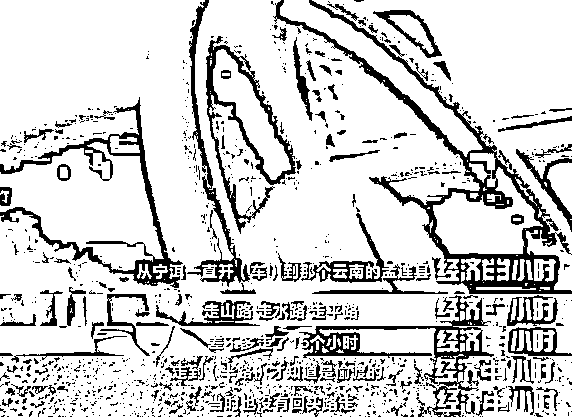
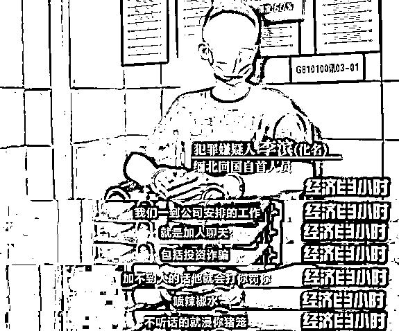
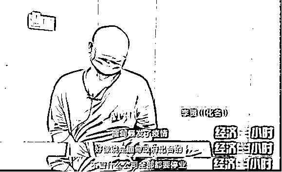
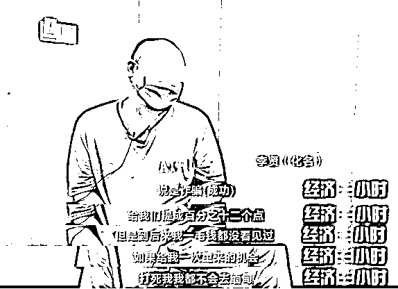
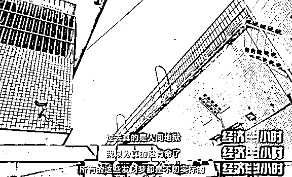

# “连自杀都是奢望”！缅北回国自首人员，死里逃生！自述恐怖经历→

> 原文：[`mp.weixin.qq.com/s?__biz=MzIyMDYwMTk0Mw==&mid=2247526147&idx=4&sn=a000fce7b69465bd3f986d1980eecb5c&chksm=97cbac3ba0bc252dd823e599d46f21d984a3a74ba8cbcee234ff09fc5354f56e8e98c37465f1&scene=27#wechat_redirect`](http://mp.weixin.qq.com/s?__biz=MzIyMDYwMTk0Mw==&mid=2247526147&idx=4&sn=a000fce7b69465bd3f986d1980eecb5c&chksm=97cbac3ba0bc252dd823e599d46f21d984a3a74ba8cbcee234ff09fc5354f56e8e98c37465f1&scene=27#wechat_redirect)

2020 年，网络上出现了一些来自缅甸北部地区的招聘广告：这些招工信息面向中国的年轻人，高薪招聘，轻松月入过万，舒适的办公环境，工作自由自在。只是工作的地点是在国外。听到这样的招工信息，一些年轻人很是心动，有的甚至不顾家人的反对，踏上了所谓的跨国“淘金”之路。但事实果真如此吗？ 

[`mp.weixin.qq.com/mp/readtemplate?t=pages/video_player_tmpl&action=mpvideo&auto=0&vid=wxv_2187811380530053128`](https://mp.weixin.qq.com/mp/readtemplate?t=pages/video_player_tmpl&action=mpvideo&auto=0&vid=wxv_2187811380530053128)

△央视财经《经济半小时》栏目视频

2020 年，李贤（化名）和一名网友聊天，得知去缅北可以有一份不错的工作。当司机每月都有 15000 元的工资。心动的他很快踏上了前往缅甸北部的“淘金”之旅。没想到这竟然是一场噩梦之旅。  

曲折的“淘金”之路让李贤（化名）萌生了一种不安的念头！当到达缅甸北部后，李贤彻底意识到自己已经完全掉进了圈套里。

得知自己想要应聘的高薪工作，竟然是电信诈骗，李贤明确表示拒绝，却立刻遭到了对方的一顿毒打。

来自湛江的嫌疑人张涛（化名）和李滨（化名）等 4 人，也是因为轻信朋友说的高薪招聘信息来到缅北的。  

因为从事的全都是非法勾当，一些人无法承受内心的煎熬，想逃离犯罪窝点。然而在犯罪团伙的严密监视下，这几乎不可能实现。

碰上被暴力虐待后仍不服“管教”的，犯罪分子便会做出一些威胁生命安全的事情，并拍下视频以索要偷渡费用的名义，要挟家属转钱赎人。

在缅北从事电信诈骗的每一天，对于李贤（化名）来说都是一种煎熬。直到 2020 年 11 月，他看到了一丝曙光。

受到新冠肺炎疫情影响，犯罪团伙不得不先解散部分成员。于是业绩不突出的嫌疑人李贤（化名）便成为了被解散的成员之一。身无分文的他，在老乡的帮助下，靠摆摊卖炒饭，攒足了路费才回到国内自首。

而嫌疑人张涛（化名）和李滨（化名）等一行 4 人，在犯罪团伙的暴力威胁下，最终分别联系家人，给犯罪团伙“赔付”了 3 万元到 6 万元不等的偷渡费用，才得以脱离犯罪团伙的魔爪。

截至目前，按照公安部“5.10”专项行动部署要求，为了严厉打击治理电信网络诈骗犯罪，整治中缅边境跨境违法犯罪活动，全力劝返滞留缅甸人员，我国与缅甸相关部门进行了紧密的合作。

陆续出台的劝返政策也让越来越多的犯罪嫌疑人回国投案自首。天上不会掉馅饼，“钱”程似锦的招聘广告背后可能就是陷阱。

**半小时观察：警惕电信诈骗“非法招工”**

今天的节目我们看到，一些从事电信诈骗的不法团伙以在海外高薪工作为名，抛出“糖衣炮弹”，一些人抱着幻想踏上“淘金”路，却陷入了跨境非法组织的圈套，成为诈骗集团帮凶，不但没走上“钱”途，反而丢了前途，迟滞了归途。电信网络诈骗已经成为当前发展最快的刑事犯罪。今年 10 月，《中华人民共和国反电信网络诈骗法（草案）》首次提请全国人大常委会会议审议，立法工作正在稳步推进。警方提醒大家，提高警惕，保护自身权益，既要避免被电信诈骗骗去钱财，也要避免被招工骗局利用，成为诈骗帮凶。

来源：央视财经（ID：cctvyscj）

← 向右滑动与灰产圈互动交流 →

