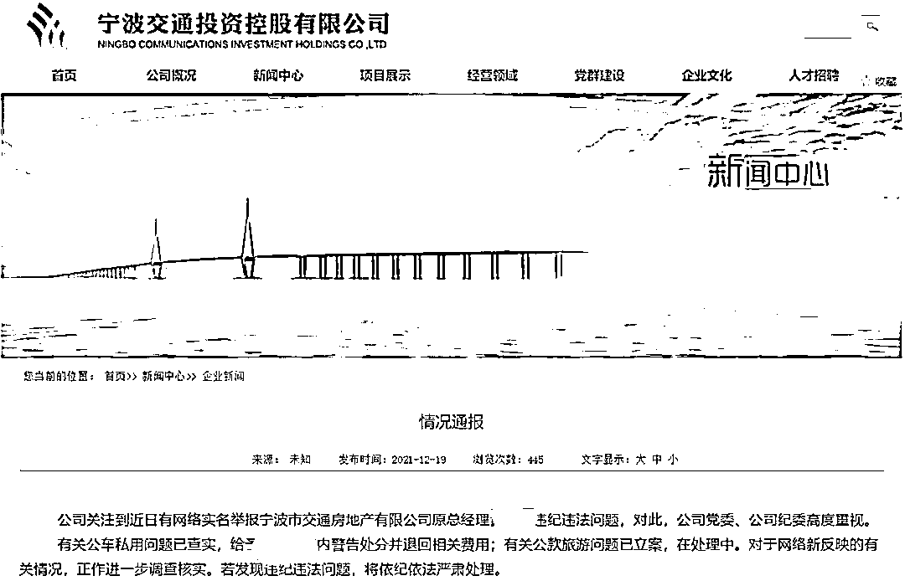
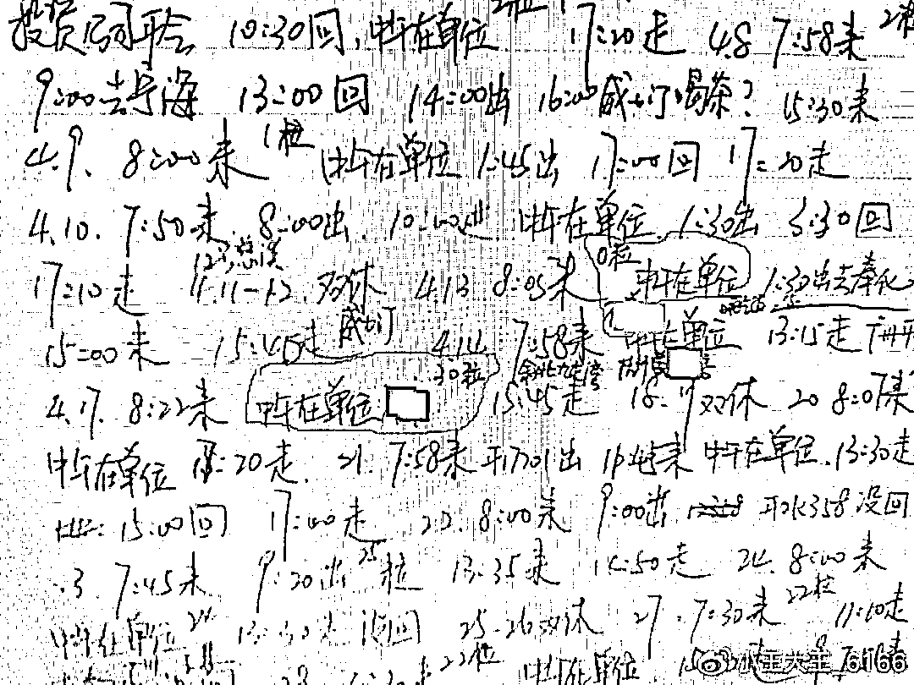
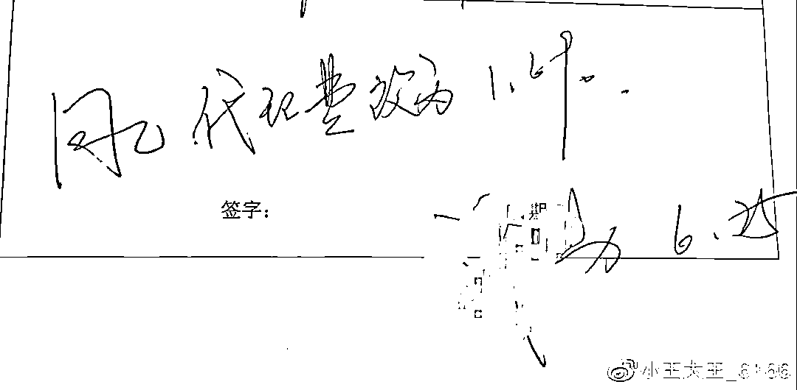
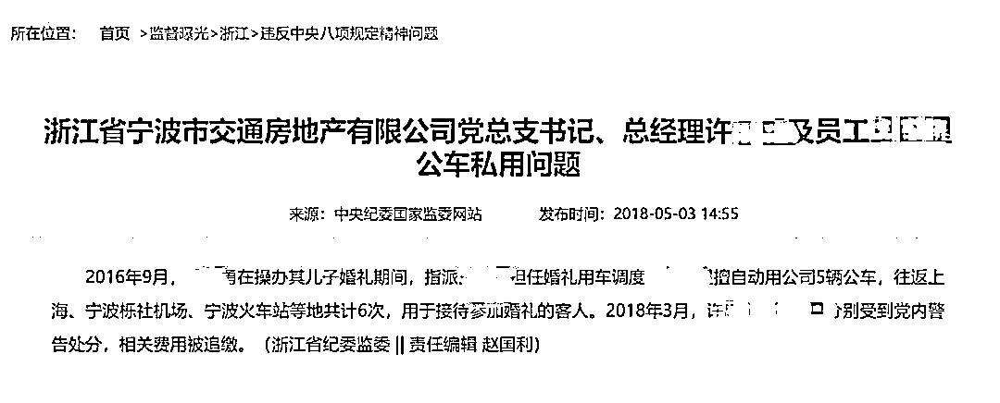

# 国企高管被秘书实名举报，与 20 多名女性有染

> 原文：[`mp.weixin.qq.com/s?__biz=MzIyMDYwMTk0Mw==&mid=2247526147&idx=5&sn=d1a4908e13561178f15828d23deb92ae&chksm=97cbac3ba0bc252d7c182ae5bab4e47b7b82964491f26adac5c107635ac0175cc7520c84ef5e&scene=27#wechat_redirect`](http://mp.weixin.qq.com/s?__biz=MzIyMDYwMTk0Mw==&mid=2247526147&idx=5&sn=d1a4908e13561178f15828d23deb92ae&chksm=97cbac3ba0bc252d7c182ae5bab4e47b7b82964491f26adac5c107635ac0175cc7520c84ef5e&scene=27#wechat_redirect)

本文转自极目新闻

近日，网络上多篇关于实名举报，宁波市交通房地产有限公司（后简称交通房地产公司）原总经理许某某的文章引发广泛关注。

[`mp.weixin.qq.com/mp/readtemplate?t=pages/video_player_tmpl&action=mpvideo&auto=0&vid=wxv_2187803111862403073`](https://mp.weixin.qq.com/mp/readtemplate?t=pages/video_player_tmpl&action=mpvideo&auto=0&vid=wxv_2187803111862403073)

举报材料中，举报人王时敏自称此前系许某某贴身文字秘书，从相关邮件、工作材料等渠道获知许某某违规违纪行为。举报文件中王时敏称，许某某生活腐化堕落，大搞权色交易，与 20 多名女性有不正当关系，存在公车私用，公款旅游等问题。

极目新闻记者注意到，宁波交通房地产有限公司系宁波交投控股有限公司全资子公司，是当地国有控股房地产企业。

12 月 19 日，针对网络举报问题，该公司通报称，公车私用问题已查实，给予许某某党内警告处分并追缴相关费用；有关公款旅游问题已立案，在处理中。对于网络新反映的有关情况，正作进一步调查核实。

**被举报私生活混乱、公款旅游**

极目新闻记者了解到，实名举报上述国企高管的王时敏，此前曾是许某某秘书。举报材料中，王时敏重点提到了许某某公款旅游报销、权色交易、与多名公司女性有不正当关系、公车私用等问题。

王时敏在举报材料中称，从 2006 年开始，他就做许某某的文字秘书，帮助许某某写年度总结报告、董事会报告、述职述廉报告，因许某某不会使用电子邮箱，经常代为收发邮件，因此知晓许某某许多不为人知的内幕。

在举报材料中，王时敏称他之所以得知许某某与公司员工鲍某某的情人关系，是从鲍某某的私人笔记中获悉。文章称，鲍某某因对许某某情妇太多心生妒忌，就偷偷监视许某某，查监控记录他的行踪，还为其堕过胎。王时敏称后来将这本笔记给纪委工作人员看了，并提供了多张该日记细节图片。

鲍某某记录下的日常行踪

关于许某某另一位情妇李某某，系许某某下级，王时敏称是从许某某的邮箱中获得信息。他从二人互通邮件中，看到了李某某为许某某写的情书、工作汇报等内容，并且利用职权为李某某在公司实现职务调动。

李某某给许某某写的情书，图源微博

除此之外，王时敏称与许某某有不正当男女关系的女性达 20 多名，多数是公司内部女性职工。举报材料中还称，2013 年假借公务考察的名义，许某某和李某某等人到南美度假，没有任何审批，并公款报销费用 34 万多元。

许某某和李某某南美度假，图源微博

**公款旅游问题已立案**

除此之外，王时敏还举报许某某与房屋代理公司勾结，提高代理费用。在 BOBO 国际商务楼销售代理过程中，营销部已经和宁波银策销售代理公司商定代理服务费为销售价格的 1.6%，并已经签订协议。许某某却把代理费改为 1.69%，并重新签订协议以执行 1.69%的代理费。举报文件中提供了两张不完整截图，一张截图显示：项目的销售服务费为销售底价的 1.6%，而在其后许某某的领导签字栏处显示，许某某签字同意，并备注将代理费改为 1.69%。

销售协议截图，图源微博

代理费修改签名截图，图源微博

关于许某某公车私用的问题已被查实。极目新闻记者注意到，据中央纪委国家监委网站 2018 年 5 月消息，2016 年 9 月，许某某在操办其儿子婚礼期间，指派王某某担任婚礼用车调度。王某某擅自动用公司 5 辆公车，往返上海、宁波栎社机场、宁波火车站等地共计 6 次，用于接待参加婚礼的客人。2018 年 3 月，许某某、王某某分别受到党内警告处分，相关费用被追缴。

公车私用问题通报截图

在举报中，王时敏称曾举报许某某后，遭到其私下报复，用车撞过他两次。王时敏上述文章发布后，引发广泛关注。不少网友为其实名举报的勇气点赞。极目新闻记者于 12 月 19 日多次联系王时敏，均未取得回复。

对此，12 月 19 日上午，宁波交通投资控股有限公司发布通报称，公司关注到近日有网络实名举报宁波市交通房地产有限公司原总经理许某某违纪违法问题，对此，公司党委、公司纪委高度重视。有关公车私用问题已查实，给予许某某党内警告处分并退回相关费用；有关公款旅游问题已立案，在处理中。对于网络新反映的有关情况，正作进一步调查核实。若发现违纪违法问题，将依纪依法严肃处理。

19 日下午，极目新闻记者从宁波市纪委获悉，市纪委已关注到网络反映的相关问题，按照干部管理权限，上述材料中被举报人并非市管领导干部，只是交投系统内部职工，以交投内部调查为主，市纪委也会派人协助介入调查，具体结论以交投调查结果为主。

← 向右滑动与灰产圈互动交流 →

