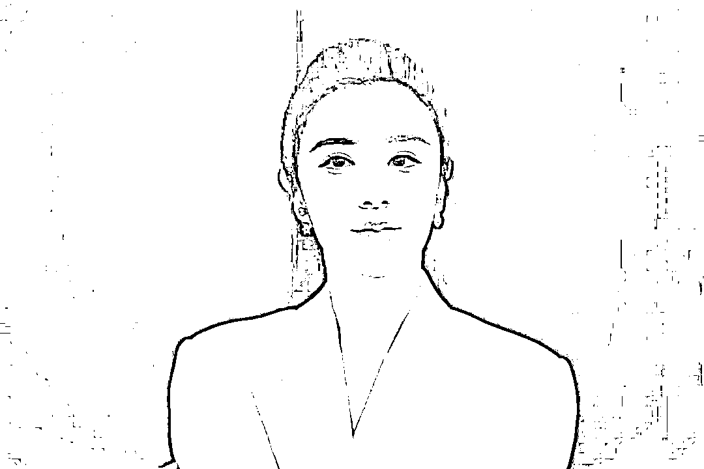

# 薇娅偷逃税被追缴并处罚款 13.41 亿

> 原文：[`mp.weixin.qq.com/s?__biz=MzIyMDYwMTk0Mw==&mid=2247526147&idx=6&sn=ad261e58ed71fb82d9aaccaed2bee047&chksm=97cbac3ba0bc252de3f1373cf0838aa51aaf4f7c401278a61c5c235d7c44a37ad2ed2f001f4b&scene=27#wechat_redirect`](http://mp.weixin.qq.com/s?__biz=MzIyMDYwMTk0Mw==&mid=2247526147&idx=6&sn=ad261e58ed71fb82d9aaccaed2bee047&chksm=97cbac3ba0bc252de3f1373cf0838aa51aaf4f7c401278a61c5c235d7c44a37ad2ed2f001f4b&scene=27#wechat_redirect)

> 对黄薇追缴税款、加收滞纳金并处罚款，共计 13.41 亿元。

浙江省杭州市税务部门依法对黄薇偷逃税案件进行处理。 

近期，浙江省杭州市税务部门经税收大数据分析发现网络主播黄薇（网名：薇娅）涉嫌偷逃税款，在相关税务机关协作配合下，依法对其开展了全面深入的税务检查。

**经查，黄薇在 2019 年至 2020 年期间，通过隐匿个人收入、虚构业务转换收入性质虚假申报等方式偷逃税款 6.43 亿元，其他少缴税款 0.6 亿元。**

在税务调查过程中，黄薇能够配合并主动补缴税款 5 亿元，同时主动报告税务机关尚未掌握的涉税违法行为。

综合考虑上述情况，国家税务总局杭州市税务局稽查局依据《中华人民共和国个人所得税法》《中华人民共和国税收征收管理法》《中华人民共和国行政处罚法》等相关法律法规规定，按照《浙江省税务行政处罚裁量基准》，**对黄薇追缴税款、加收滞纳金并处罚款，共计 13.41 亿元。**

其中，对隐匿收入偷税但主动补缴的 5 亿元和主动报告的少缴税款 0.31 亿元，处 0.6 倍罚款计 3.19 亿元；对隐匿收入偷税但未主动补缴的 0.27 亿元，处 4 倍罚款计 1.09 亿元；对虚构业务转换收入性质偷税少缴的 1.16 亿元，处 1 倍罚款计 1.16 亿元。

日前，杭州市税务局稽查局已依法向黄薇送达税务行政处理处罚决定书。

杭州市税务局有关负责人表示，税务部门将持续加强对网络直播行业从业人员的税收监管，并对协助偷逃税款的相关经纪公司及经纪人、网络平台企业、中介机构等进行联动检查，依法严肃查处涉税违法行为，切实提高税法遵从度，营造法治公平的税收环境。

国家税务总局坚决支持杭州市税务部门依法严肃处理黄薇偷逃税案件。

同时，要求各级税务机关对各种偷逃税行为，坚持依法严查严处，坚决维护国家税法权威，促进社会公平正义；要求认真落实好各项税费优惠政策，持续优化税费服务，促进新经济新业态在发展中规范，在规范中发展。（来源央视新闻）

***税务部门就薇娅偷逃税案件答记者问***

日前，杭州市税务局稽查局对网络主播黄薇（网名：薇娅）涉嫌偷逃税问题进行了查处。该局有关负责人就案件查处情况回答了记者提问。

**1.为什么杭州市税务部门要对黄薇进行检查？**

答：近年来，税务部门一直重视并持续规范网络直播行业税收秩序。我们分析发现部分网络主播存在一定涉税风险，及时开展了风险核查，提示辅导相关网络主播依法纳税。经税收大数据分析评估发现，黄薇存在涉嫌重大偷逃税问题，且经税务机关多次提醒督促仍整改不彻底，遂依法依规对其进行立案并开展了全面深入的税务检查。

**2.黄薇的违法事实有哪些？**

答：2019 年至 2020 年期间，黄薇通过隐匿其从直播平台取得的佣金收入虚假申报偷逃税款；通过设立上海蔚贺企业管理咨询中心、上海独苏企业管理咨询合伙企业等多家个人独资企业、合伙企业虚构业务，将其个人从事直播带货取得的佣金、坑位费等劳务报酬所得转换为企业经营所得进行虚假申报偷逃税款；从事其他生产经营活动取得收入，未依法申报纳税。

我局依据《中华人民共和国个人所得税法》《中华人民共和国税收征收管理法》等规定，依法确认其偷逃税款 6.43 亿元，其他少缴税款 0.6 亿元。

**3.请问本案中的不同罚款倍数是如何确定的？**

答：《中华人民共和国税收征收管理法》第六十三条第一款规定，对纳税人偷税的，由税务机关追缴其不缴或者少缴的税款、滞纳金，并处不缴或者少缴的税款百分之五十以上五倍以下的罚款。

我局坚持依法依规、宽严相济、过罚相当的原则，充分考虑了违法行为的事实、性质、情节和社会危害程度等因素对黄薇进行处罚。

**一方面，对其主动纠错的偷逃税等违法行为依法从轻处理。**黄薇对其隐匿个人收入偷税行为进行自查并到税务机关提交补税申请，能够配合调查主动补缴税款 5 亿元，占查实偷逃税款的 78%，并主动报告税务机关尚未掌握的涉税违法行为，具有主动减轻违法行为危害后果等情节。我局依据《中华人民共和国行政处罚法》第三十二条规定，按照《浙江省税务行政处罚裁量基准》，给予从轻处罚，对黄薇隐匿收入偷税但主动补缴和报告的少缴税款处 0.6 倍罚款。

**另一方面，对其未能纠错的违法行为视危害程度依法严肃处理。**根据《中华人民共和国税收征收管理法》规定，按照《浙江省税务行政处罚裁量基准》，黄薇隐匿收入偷税且未主动补缴部分，性质恶劣，严重危害国家税收安全，扰乱税收征管秩序，对其予以从重处罚，处 4 倍罚款；黄薇虚构业务转换收入性质虚假申报偷税部分，较隐匿收入不申报行为，违法情节和危害程度相对较轻，处 1 倍罚款。

**4.是否会对黄薇追究刑事责任？**

答：《中华人民共和国刑法》第二百零一条规定，纳税人有逃避缴纳税款行为的，经税务机关依法下达追缴通知后，补缴应纳税款，缴纳滞纳金，已受到行政处罚的，不予追究刑事责任；但是，五年内因逃避缴纳税款受过刑事处罚或者被税务机关给予二次以上行政处罚的除外。

本案中，**黄薇首次被税务机关按偷税予以行政处罚且此前未因逃避缴纳税款受过刑事处罚，若其能在规定期限内缴清税款、滞纳金和罚款，则依法不予追究刑事责任；若其在规定期限内未缴清税款、滞纳金和罚款，税务机关将依法移送公安机关处理。**

**5.加强网络主播税收监管将对平台经济发展产生什么影响？**

答：平台经济是经济发展的新业态，在更好满足消费者需求、促进新旧动能转换、推动经济高质量发展等方面发挥了积极作用。在平台经济快速发展过程中，部分网络主播的税收违法行为，扰乱了税收征管秩序，破坏了公平竞争的市场环境。税务部门依法依规对有关网络主播税收违法行为进行查处，有利于平台经济长期规范健康发展。同时，税务部门将认真落实好各项税费优惠政策，持续优化税费服务，为平台经济发展创造良好的税收营商环境。

来源：新华社

← 向右滑动与灰产圈互动交流 →

