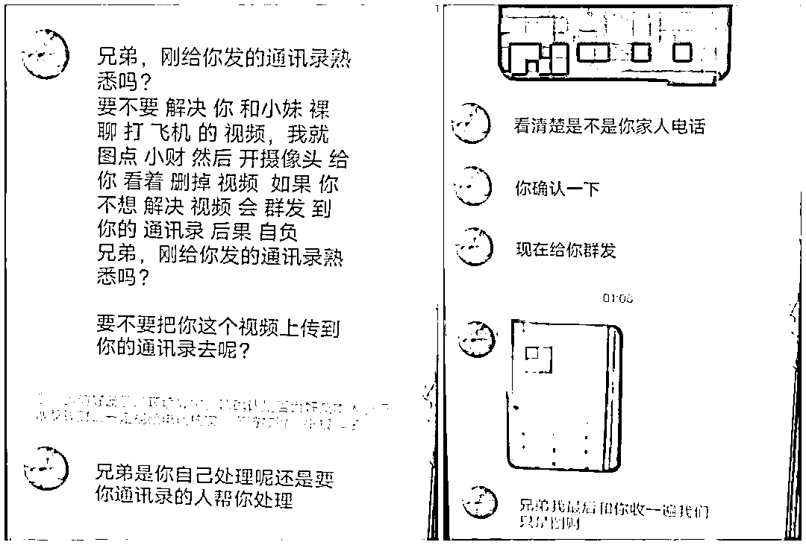
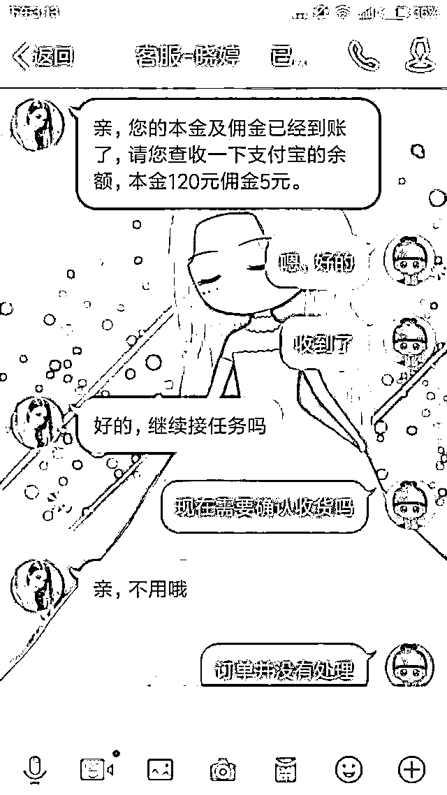
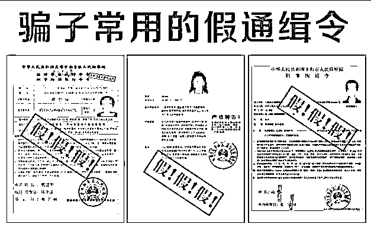

# 网恋前，一定要多问问自己这个问题！

> 原文：[`mp.weixin.qq.com/s?__biz=MzIyMDYwMTk0Mw==&mid=2247526147&idx=7&sn=eaff80afa6ad6abb0d71a4a51063031b&chksm=97cbac3ba0bc252db0927e24706bdc48db96b58df802f0f8f86cb4cc3c2a88215086f658dad8&scene=27#wechat_redirect`](http://mp.weixin.qq.com/s?__biz=MzIyMDYwMTk0Mw==&mid=2247526147&idx=7&sn=eaff80afa6ad6abb0d71a4a51063031b&chksm=97cbac3ba0bc252db0927e24706bdc48db96b58df802f0f8f86cb4cc3c2a88215086f658dad8&scene=27#wechat_redirect)

快到年底了

一些不法分子也在蠢蠢欲动

开始“冲业绩”了

电信诈骗花招不断

对于普通网民来说

应该如何提高警惕，防止被骗呢？

时常灵魂拷问自己下面几个问题

**网恋前多问问自己**

**温柔帅气又有钱的小哥哥
为啥还需要网恋？**

∆“杀猪盘”骗局案例

当你渴望温暖陪伴

想要寻一良人白头偕老

交友软件上

陌生人的消息就会来的刚好

加上好友后发现

对方人帅优秀还开着超跑

从此生日节日送来礼物鲜花

什么星座血型都和你特别的搭

说你是他心中的蒙娜丽莎

想要和你组建幸福温暖的家

**当你以为真爱来到**

**其实一切不过都是骗子的圈套**

套路话本，数据分析

让骗子轻轻松松就能投你所好

当你放下防备，准备投入“真爱”的怀抱

骗子就会露出真面目

**向你推荐赚钱的“特殊渠道”**

**在博彩网站下注赌博**

**在投资 APP 购买股票**

**最初你将信将疑**

**但少量投入就能看到回报**

你以为

找到了财富密码，发现了致富诀窍

其实这些都是骗子在后台操作制造假象

目的就是为了将你牢牢紧套

当你掏光了所有积蓄就会发现

你的股票走势都变成了下行路线

再联系你的“爱人”也已经消失不见

**此时的你终于意识到自己是上当受骗**

**悔不该当初，不如把功课做在前面**

**投资理财前问问自己**

**素不相识的投资大师
为啥要执着于帮你充实腰包？**

∆“投资理财”骗局案例

很多网友都接到过这种电话

向你推荐一支股票

收益超高但是风险不大

有投资大师指导，不怕股市风云变化

如果你感兴趣，微信群可以加入一下

这就是**投资理财诈骗**的常见推广套路

如果没有忍住诱惑加入了投资群

你会发现

这里导师、客服、学员一应俱全

**但是实际上群里除了你都是演员**

无论是导师指导学员轻松赚钱

还是学员对导师称赞连连

都是骗子设计好的情节

**目的就是让你放下防备，然后打款转钱**

一开始你只是小额投入，想尝尝滋味

看着个人账户中的数字不断翻倍

你的心情也变得更加无畏

可是当你投入看病钱买房钱

甚至养老钱后

就会发现登录密码怎么输都不对

接着投资网站也直接崩溃

回头一看导师客服已经全员撤退

**骗子组团忽悠的手段其实并不高**

**遇到这样的套路要学会见招拆招**

**看到“保本高收入“的广告先稳住别飘**

**裸聊前多问问自己**

**自己的身材
是否值得美女与你“坦诚相对”？**

∆“裸聊”骗局案例

突然收到陌生小姐姐的添加好友申请

点开头像看到一个美丽身影

你以为这是“艳遇”从天而降

其实这是以**“裸聊视频”**为媒介

进行敲诈的陷阱

在整个诈骗环节中

添加好友只是第一步

接下来，骗子还会诱导受害人

**点击陌生链接或者下载 APP**

**并通过 APP 中的病毒盗取通讯录**

如果面对裸聊的诱惑你没忍住

骗子就会将这一“精彩瞬间”全程记录

随后他们会**扬言扩散不雅视频**

让你身败名裂

除非支付高额费用

否则就得和平静生活说声再见

残酷的现实直逼你的心理防线

这样的噩耗让你头晕目眩

面对威胁你感到心力憔悴

于是决定破财免灾直接付费

可交了数据费、管理费

会发现还有封口费

持续敲诈只因骗子吃准了

你问心有愧

在这里提醒大家

**遇见裸聊诈骗千万别想着通过给钱来应对**

**保留证据第一时间报警**

才有可能把犯罪团伙击溃

当然，更重要的还是要洁身自好

**刷单前问问自己**

**动动手指就能赚钱的好事
为啥能轮到你？**

∆“刷单”骗局案例

有空闲时间还想要赚点钱来零花

有这些特点的人通常是**学生还有宝妈**

通过 QQ 加上一个电商平台商家

**说自己为了提高商品销量**

**需要招人来把单刷**

对方发来营业执照兼职合同似乎特别正规

如果还有疑虑可以先从小额任务做起

试一试也不亏

一开始小额刷单任务总能顺利领取佣金

其实这只是诱饵为了让你后续听从指挥

之后的你开始不满足于只赚五块十块

接了**金额更大的单**这样赚钱才会更快

但是却总是**因为网络延迟而导致提交失败**

重新刷了几次总有机器故障在阻碍

最后对方要求**扫二维码直接转账**

否则超时没有支付

未来的工作机会就会不在

担心前期投入打水漂的你不敢无动于衷

扫码支付后

对方说佣金返现要等确认支付成功

你还在安慰自己再等一等应该不会落空

等来等去却发现对方已经没了行踪

善意的提醒永远不会迟到

做兼职一定要选择正规渠道

今后看到“刷单”

就拉响自己防范意识的警报

**收到逮捕令时问问自己**

**抓人还要提前通知
警察是不是怕坏人跑得不够快？**

∆冒充“公检法”骗局案例

突然接到自称公检法的电话通报

对方精准说出你的姓名还有身份证号

说你涉嫌贩毒洗钱拐卖还混过黑道

还发来了**“缉捕令”**

如果不及时处理就要冻结你的银行卡

停用你的手机号

飞速发展的剧情让你感到四面楚歌

赶紧解释自己是个好人

从来没有作奸犯科

对方帮你一查

原来是替犯罪分子背了黑锅

慌了阵脚的你赶紧问怎么做

才能把罪名洗脱

于是对方给出了“解决思路”

先把钱先打到一个“安全账户”

承诺查明真相后就会把资金返还原路

一旦你转了钱就中了对方的骗术

这类骗术主要通过恐吓让你心慌手抖

大脑一片空白变成他的提线木偶

不让你挂断电话和你聊得特别久

让你呆在网吧旅馆等封闭环境

不许四处游走

这件事对谁都不要讲

包括警察以及子女配偶

不给你机会冷静思考

堵住你被解救的突破口

请记住

公检法办案需要遵守一定程序

传唤你不会通过电话、QQ 和微信等社交工具

如果对方要求配合调查可以

但是必须到派出所去

最后

如果真的不慎被骗

要立刻报警

并注意保留证据

争取将损失降到最低

天上不会掉馅饼

网络处处是陷阱

各类网络诈骗层出不穷

令人防不胜防

无论何时何地

凡涉及金钱往来一定要

提高警惕，注意防范

不轻信、不透露、不转账

切莫贪图小利而落入犯罪分子的圈套！

来源：青春山东

← 向右滑动与灰产圈互动交流 →

