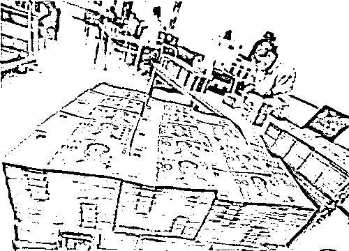
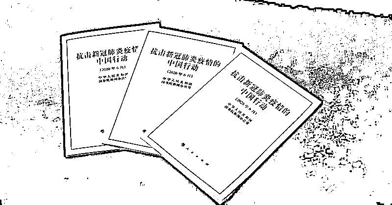
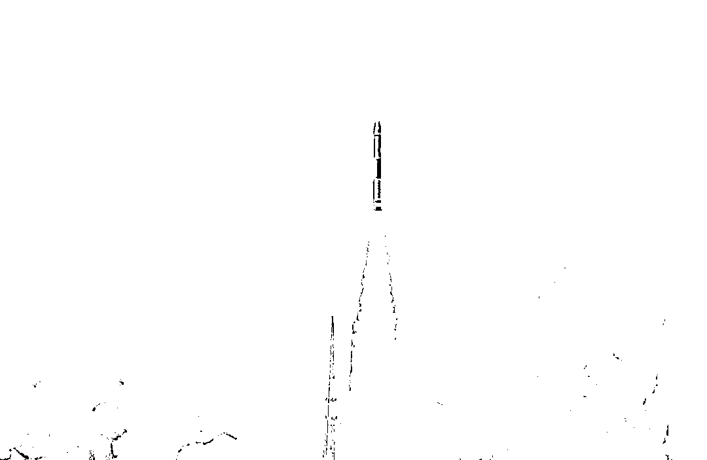
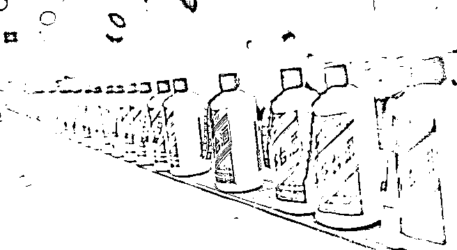
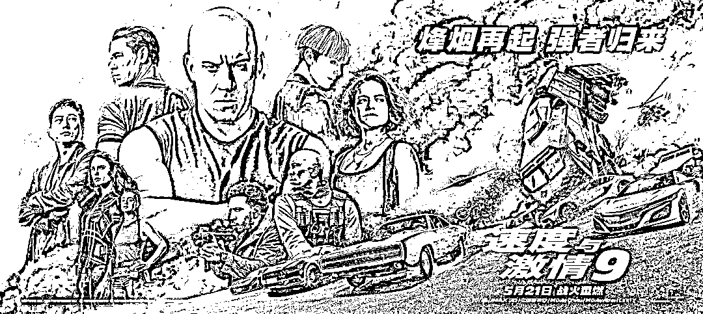
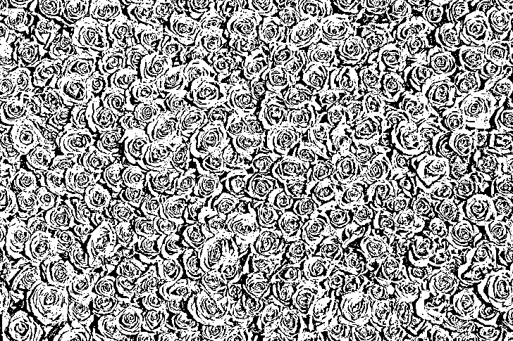
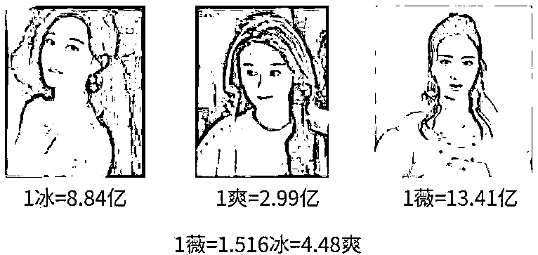
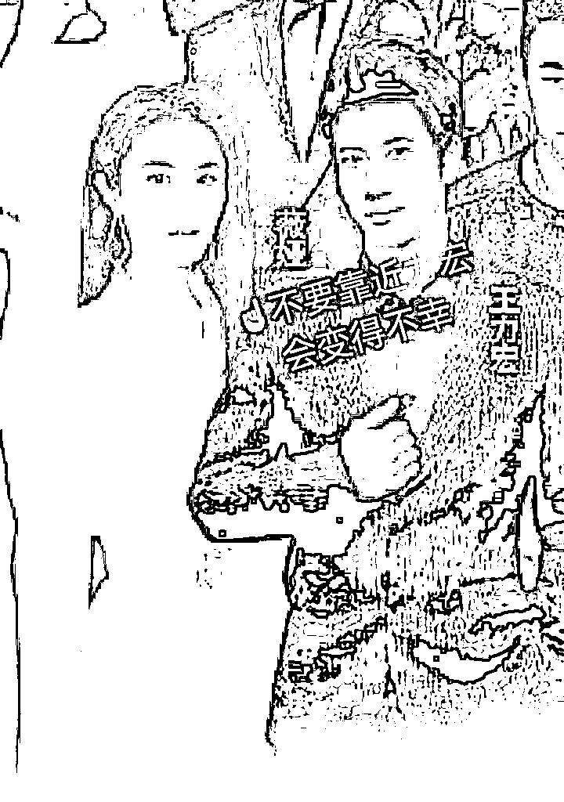

# 闲话：13.41 亿究竟是多大一笔钱？

> 原文：[`mp.weixin.qq.com/s?__biz=MzIyMDYwMTk0Mw==&mid=2247526208&idx=2&sn=4e505dbbbc4ff8bc4b5fff0507640a6d&chksm=97cbac78a0bc256ef6a52d699af877e34630c9253c439058ce78b64821bd1ffd110dae6f6ab6&scene=27#wechat_redirect`](http://mp.weixin.qq.com/s?__biz=MzIyMDYwMTk0Mw==&mid=2247526208&idx=2&sn=4e505dbbbc4ff8bc4b5fff0507640a6d&chksm=97cbac78a0bc256ef6a52d699af877e34630c9253c439058ce78b64821bd1ffd110dae6f6ab6&scene=27#wechat_redirect)

最近年末可以说是非常不“安宁”了。

从上周五开始的「王力宏离婚」连环事件，已经让各位网友变身“瓜地里的猹”了；周一下午，顶流带货主播薇娅又被曝出逃税漏税，补税加上罚款一共被罚 13.41 亿。

**两个外国人在微博上为了 1、2 亿撕了好几天，这时一位中国女性咔一下站出来，丢出十几亿：你们这点小钱，也好意思摆台面上吵吵？**

13.41 亿对于咱们广大的打工人来说可能是没有什么概念，上次见到这么大的数字还是人口普查的时候。

13.41 亿，到底意味着什么？

简单来说，13.41 亿可以做到如下这些事情：

**1.与李靓蕾离婚 9 次**

王力宏微博回应前妻时，透露了双方离婚时的财产分割明细，其中现金部分为 1.5 亿人民币。约合此次罚款的 1/9。

**2.给全国人民每人发一块钱**

根据第七次全国人口普查数据，目前我国人口为 14.11 亿。如果薇娅把罚款分给全国人民，平均每人可分得 0.95 元。

**3.为全国新冠患者支付半年医疗费用**

去年 6 月,国新办发布《抗击新冠疫情的中国行动》,白皮书显示，截至当年 5 月 31 日，全国确诊住院患者结算人数 5.8 万人次，总医疗费用 13.5 亿元。

**4.购买 33 枚火箭**

2020 年 4 月 1 日晚上，薇娅在自己的直播间拍卖了一枚火箭。火箭长 20 米，可以将 300 公斤的物体送到离地球 300 公里高度的轨道上，制造商为航天科工火箭技术有限公司。

这枚火箭最终以 4000 万元成交。 

**5.购买 53 度飞天茅台 894596 瓶**

目前 53 度飞天茅台官方指导价为 1499 元，13.41 亿元可以购买 894596 瓶飞天茅台，约合 447 吨。

不过，你们家里有多喝不完的话，大队长每瓶加 200 给你们收。

**6.拍摄一部《长津湖》**

6 月 24 日，据外媒报道，抗美援朝主题电影《长津湖》将在戛纳电影节面向全球片商销售海外版权，影片耗资 2 亿美元（约合 13 亿人民币）。

**7.包场全国的《速度与激情 9》**

好莱坞超级 ip《速度与激情 9》在中国票房共计 13.92 亿，是今年票房最高的进口片。

**8.与巴菲特吃 42 次午餐**

19 年 5 月，孙宇晨以 4,567,888 美元（约人民币 3200 万元）的价格中标，拍下了与巴菲特共进午餐的机会（后改为晚餐）。

**9.过 102 万次情人节**

几天后就是圣诞节，对情侣来说，1314 红包是少不了的。13.4 亿大约可以发 102 万个 1314 红包，当然你也可以选择只发给一个人，那就可以发 102 万次，约等于永远。

**10.铺满 22 个足球场**

13 亿人民币，如果都是百元钞票，那么它连起来总长度约合 2077km,有 1.07 个青藏公路那么长；叠起来高约 1340 米，超过 2 个上海中心大厦，摊开放可以铺满 22.399 个足球场。

**11.让郑爽连续工作 645 天**

今年 4 月，艺人郑爽前男友张恒爆料，称郑爽通过阴阳合同在《倩女幽魂》(现已更名为《只问今生恋沧溟》)项目中获得收入 1.6 亿元，以 77 个工作日的拍摄时间计算，郑爽日薪超 208 万元。

1 薇=635 爽，郑爽都要干两年。

当然，按照罚款金额还有另外一种算法，如下： 

**12.让月薪 5000 的打工人连续工作 2.2 万年**

以月薪 5000 元计算，需要连续工作 268000 个月才能挣到 13.4 亿，换算成年的话大约是 2.2 万年。

2.2 万年的这个算法，没有减去你生存生活所必要的支出，如果减去的话，可能真的要从猴子开始算起。

根据科学家估算，2 万年前还是山顶洞人生活的年代。

**所以我做错了什么，要打工 2.2 万年？**

薇娅被罚 13.41 亿，我还在为淘宝 2 块钱返现认真写好评……

上面我们也提到了，全国疫情期间确诊和疑似患者的医保才支付了 13.5 亿元。

**13.41 亿，可以覆盖我国嫦娥一号任务的总开支；**

**13.41 亿，可以购买至少 2 架波音 737 飞机；**

**13.41 亿，可以购买两枚长征五号火箭；**

**13.41 亿，可以购买 6 辆 8 编组的高铁列车；**

**13.41 亿，全部换成百元钞票平铺在地面上，总面积有 15.5 平方公里，相当于 2.5 个西湖的面积……**

相信大家小时候都想过，全国每个人给自己 1 元钱的事，没想到有人已经把这想象中的金额交了罚金。

不用再想自己有 13 亿怎么花了，还是继续打工人吧。

**最后说一句，这还只是税，缴税是有比例的，可想而知收入是......**

**冷知识：**

王力宏是杭州旅游形象大使

薇娅是杭州反诈骗形象宣传大使

# 

孔子说，“弃老取幼”，不管人，只在意小孩子，“家之不祥”。现在全世界都不强调孝道，老人很可怜，都在养老院，然后小孩子越来越嚣张，变小皇帝、皇太后了。而且一个家没有孝道承传，这个家铁定要败掉，所以家不吉祥。而很可贵，我们中国通过《老年人权益保障法》强调子女要尽孝道。这在全世界没有这样立法的。从这些征兆可以看得出来，二十一世纪是中国人的世纪。只要不强调孝道，全人类没有前途。为什么？因为孝是爱的原点。人都不懂得爱人的话，他怎么可能人生会幸福？人类怎么可能会有未来？可是爱的原点又是孝，孝是根，德行的根本。百善孝为先，没有孝道，这个家就要败丧下来了。我们中华民族最重要的德行之一就是敬老、爱老、尊老。从夏商周这个传统一直传了几千年，但是现在这一点做得不好。我们要了解，老人对家庭、对社会奉献了一生，不尊重老人叫忘恩负义。没有老人，哪有子孙？没有老人的努力，哪有现代的成就？再来，老人有非常丰富的人生智慧跟经验，所以尊重老人的人，就能承传这些宝贵的智慧跟经验。而且人老是修来的福报，他能修得长寿就值得我们尊重。所以人的福田分三种，都可以教给我们的孩子。恩田、敬田、悲田。我们感恩老人奉献一生，念他的恩。我们尊重老人，再承传他的智慧经验。一个人交的朋友都比他大很多岁甚至大一倍两倍，这样的人一定比同年龄的人成熟，大家可以仔细去观察。所以恭敬心得大福报，傲慢、轻慢老人折福非常大。我们常说，一个家庭就是一棵大树，爷爷奶奶是大树的根，父母是枝叶，孩子是果实。果农都是在根上施肥，在果子上打药！只有在根上施肥，果子才能有足够的营养。在果子上打药，才能防止果子长虫子。我们对老人要多关爱，对子女要多教育。一个人在孝养父母之时，自己的儿女也看在眼里，父母以身作则孝敬尊长，就是孩子成长最好的榜样。孩子是通过父母的行动，懂得孝的。一个家庭里，如果父母孝顺老人，那么孩子就会孝顺父母，一家人就能和和美美。中国人常讲，百善孝为先。孝是善良的第一步，一个人对父母保持感恩，学会去爱他们，在此基础上才能更进一步去爱别人。如果一个人连自己的父母亲人都不爱，那这个人也绝对不会对别人善良。孝道是中华民族的传统美德，它是所有中国人修养品德的第一步，学会善良的第一步。孝是善的原点，是德行的根本，没有孝，这个家庭就离败落不远了。有事此心不乱，无事此心不空。大事心不畏，小事心不慢。人生的悲欢离合，酸甜苦辣，皆系于心，心若安然，又有什么是真正过不去的呢？心如莲花不着水，又如日月不住空。身在红尘之中，事来则应，事过则无。有所为，或有所不为，心态都平和、静定，如莲花一般洁净、淡雅，不为谁开不为谁落，如日月一般自在、光明，平等无碍。过去心不可得，现在心不可得，未来心不可得。静心，用豁达释放纠结的过去，用坦然迎接不可知的未来。让心静下来，你才能读懂自己、随缘安然。静心，是一种修养，更是一种修炼。物随心转，境由心造，烦恼皆由心生。命里有时终须有，命里无时莫强求，不要强求那些不属于自己的东西，学会适时的放弃。生活中，一个好的心态，可以使你乐观豁达；可以使你战胜面临的苦难；可以使你淡泊名利，过上宁静快乐的生活。人往往把自己看得过重才会患得患失，觉得别人必须理解自己。其实，人要看轻自己，少一些自我，多一些换位，才能心生快乐。所谓心有多大，快乐就有多少；包容越多，得到越多别人的嘴我们无法去控制，但我们可以抱一颗淡然的心去看一切纷扰。心静才能听到万物的声音，心清才能看到万物的本质。沉淀自己的心，静观事态变迁。与人相处，需要讲究方式方法。有些事，需忍，勿怒；有些人，需让，勿究。生活不是战场，无需一较高下。生活正是道场，历境修心。人与人之间，多一份理解就会少一些误会；心与心“不要征服对方”这是夫妻最重要的问题！征服，是夫妻之间经常发生的事情，谈论谁是对的，追究谁是错的！讨论谁伤害了谁，谁过分了！这些，都是大忌。好夫妻，永远都在相互装傻，就是护短！能够护短的，才是真爱！爱啊，别为难对方，别挑剔对方，别指责对方！傻傻地一路相伴。傻，是因为已经决定了，认定了，就没有什么需要再了解、再知道，再改进，再完善的！有进步，接受，没有，也接受！爱，就在那里！一辈子，能够有一个人，好好相爱，多美啊！别去破坏，多大的事情都不值得你去破坏。不要在相爱的人身上动小聪明，动你的精明！要就动你的心。永远不对爱人说假话！永远不去做破坏气氛和心情的事！男人有脾气正常，但男人的脾气可以对天发对地发，却不可以对老婆发。因为不管你心情好坏，别人都可以转身离开，却只有爱人要陪着你，陪你度过心灰意冷，度过意气风发。这一生你会得到很多失去很多，而陪你到最后的人却只有一个。天大地大，都不如身边的女人大。每个人只能慢慢领悟去学习，因为没有多少人可以做好，所以别做只会说不会做的人！夫妻同心，黄土变金。家事无对错，只有和不和，家和才能万事兴！家是讲爱的地方，不是讲理的地方。讲理的地方是法庭。家是有根和有魂的，根和魂是由女人掌控。两个人在一起久了难免会吵嘴，女人在气头上往往说出的话句句似刀，而那个肯留下来和你吵架也不想离开你半步的才是真正爱你的男人！世界上最伟大的力量是爱，最强有力的武器是感动！吵不离，骂不散，打不走，才是爱真正的爱。当你嫌弃身边的女人不够漂亮，有没有想过有很多男人都羡慕她对你这份死心塌地的感情。当一个女人把什么都给你了，你该知足，她看上的不是你有多帅、多有钱，而是她已经做好了和你同甘共苦的准备。当你嫌弃身边的男人不够优秀，有没有想过他没天没夜的努力就是为了让身边心爱的你有更优越的生活条件。当一个男人两手空空肯为你去打拼，你该知足，他看上的不是你有多美、多性感，而是他不想苦了跟他的女人。在一起久了慢慢变成依赖，爱情慢慢变成亲情，就算两个人在一起没有当初的激情，那请别忘了还有感情。当你想要放手的时候，有没有想过当初为什么陪她\他走到这里。在一起久了，就算没有当时那么相爱也要选择相守，这些你们对彼此做到了吗？女人懂相守，男人懂感恩，才是一辈子。之间，多一份包容就会少一些纷争。人生，快乐哪里找呢？信仰里有快乐，修行里有快乐，服务里有快乐，静心里有快乐。心无所求，心想他人，快乐就在我们的心里！做人，简单就好，生活，宁静就好。无事此心不空，有事此心不乱，大事心不畏，小事心不慢。古人讲：一代做官九代冤。官做的好，是为子孙积累福报；做不好，把老百姓的东西占为自己，想留给子孙，这些非分的东西都是罪孽，子孙用了，反而损福报。所以一代做官九代冤。又说，如果为自己一家谋，就不要去做官，做官是为百姓谋，这也是天道无亲。天道虽然无亲，但唯亲善人。你只要广积阴德，还是有用的。想要孩子能读书的，就多做慈善，办学校；想要孩子发财的，就要多救济穷人；想要儿孙健康的，就多施药。这就是唯亲善人。再讲到孝顺也一样。很多人很孝顺，给父母买很多补品，买不必要的东西，甚至办酒席祝寿。世人看来是热闹，其实是不孝，因为损了父母的福报。人家过个寿，就要杀生那么多。民国时，有个老人死了，他儿子办宴席三百桌，过几天，老人家就托梦来说，本来我可以去天上好好享福的，但因为你杀孽过重，导致我在地府审判，还出不来。可见，虽然花的是儿女的钱，但却在损掉老人家的福报。父母花很多无谓的钱，也是损孩子的福报，这也是天道无亲。所以不要给小孩庆生日，小孩能读书，父母不要骄傲太早，到处宣扬。要对孩子严格一些，对他成长大有益处。过分浪费钱给孩子都损孩子福报，更何况很多人在公司里头浪费，甚至国家单位里头浪费，都是损福报的。很多人都想着轻松赚钱，却不知道这也是在透支福报，不长久。我们要有自知福德浅薄，无福消受的概念。很多东西，别人给的起，但我们的福报不一定能用的起。明白了这个道理，人生就会少很多痛苦和烦恼！ 《人民日报》曾发文怒斥还在沉睡中的大学生：上课时，不是发呆、睡觉、就是玩手机，课余生活只有吃零食、看剧、沉迷游戏。图书馆里没有你的身影，运动场你更是从不迈进去……职场上，这样的人也同样不在少数。上班时踩着点走进公司大门，下班前一小时就心不在焉。玩玩手机，刷刷微博，手里的工作能拖则拖。实在拖不了就勉强自己加个班，但一定要发条朋友圈，问：“你见过深夜十二点的写字楼吗？”自我感动到不行，却忽略了这本是白天早就应该完成的工作。“工作，不必认真，能应付上司即可；能力，不思进取，不被炒鱿鱼就行；至于工资，只要心怀梦想，总有一天会涨的。”这样的人，不是真“佛系”，而是依然会羡慕别人升职加薪，却拿着 3 千的工资，做着月薪 5 万的梦。拿着父母血汗钱养老的年轻人有些人，二十多岁就开始养老了。一杯咖啡慢悠悠度过一整天，不再学习知识，看着别人加班工作，还要嘲笑一声“傻子”，将安于现状视为“知足常乐”。而可悲的是，有多少月薪三千，就心满意足的人，过着“岁月静好”的生活，却是依靠父母提供经济支持。根据中国老龄科研中心的统计，中国目前有 30%的年轻人依靠“啃老”生活，65%以上的家庭存在着“啃老”的现象。一些成年子女带给父母的经济压力，甚至比他们未成年时更大。今年 7 月，武汉一位 81 岁的老人向社会求助，称自己的儿子已经在家宅了很多年了，不肯工作。他年纪大了，身体也不好，怕哪天离开了，儿子的生活就没着落了。老人说，他每个月有五千多的退休金，自己平日买药和日常开支，也花不了多少，只是因为小儿子的状况，家里日子过得非常紧张。而面对老人的担心，儿子却表现得很反感，甚至指责老人“多管闲事”。本该自立的年纪，不仅没有能力给家人幸福，还要依赖父母才能生活。这些患了“精神癌症的年轻人”，心安理得地“啃老”，却不肯为自己的未来奋斗。可见的绝望未来不久前，一位已是两个孩子母亲的三十七岁女硕士在论坛发帖求职。她毕业于国内顶尖的大学，在外企工作近十年，因为部门关闭被裁员，只能重新找工作。她的要求并不高，短期内月薪三千就可以。她在帖子中这样描述自己的工作经历：做过科研合作管理，但只是“打杂”；本专业的注册证书没考下来；考了个日语 1 级，却不能口头交流；英语还行，但也只是考研时英语成绩过得去很长时间过去了，还是没结果。她说：“我承认我很失败，没有在这么长的职业生涯里磨砺好我的翅膀，所以现在才这么凄惨。”有人评论：“在职场上混日子，迟早让职场把你混了。”不进则退的道理，放之四海而皆准。所有成功的事业都是时间和汗水熬出来的，你偷过的懒，迟早会变成打脸的巴掌。最近，中年危机成了一个热门话题。中国劳动关系学院行政管理教研室主任刘文军认为，中年人容易被淘汰，主要是因为他们知识结构已经基本固定，学习新知识新技能的效率较低，转型太慢。但也不是所有人都在中年危机到来时一筹莫展，那些有一技之长的人，即使遭遇职场危机，也能轻松化解。蔡玉洁是一名一线生产车间的技术员，在不到 40 岁的时候丢了饭碗。但她下决心重新出发，通过自学和参加培训班，考取了会计和计算机相关资格证书。凭借这些新本领，她找到了一份会计工作。待遇甚至比原来还好。在企业从事员工选拔聘用工作的肖成萍说：“社会发展这么快，企业也要不断求新求变。如果平时没有忧患意识，放松学习，不管年龄是大还是小，被淘汰都是必然的。”英国哲学家怀特海曾说：缺乏进取的精神，就意味着堕落。BBC 根据剑桥大学研究者的数据分析了 365 种职业在未来被淘汰的概率，AI 技术越来越发达，“电话推销员”被机器人取代的几率接啊啊孔子说，“弃老而取幼”，不管老人，只在意小孩子，“家之不祥”。现在全世界都不强调孝道，老人很可怜，都在养老院，然后小孩子越来越嚣张，变小皇帝、皇太后了。而且一个家没有孝道承传，这个家铁定要败掉，所以家不吉祥。而很可贵，我们中国通过《老年人权益保障法》强调子女要尽孝道。这在全世界没有这样立法的。从这些征兆可以看得出来，二十一世纪是中国人的世纪。只要不强调孝道，全人类没有前途。为什么？因为孝是爱的原点。人都不懂得爱人的话，他怎么可能人生会幸福？人类怎么可能会有未来？可是爱的原点又是孝，孝是根，德行的根本。百善孝为先，没有孝道，这个家就要败丧下来了。我们中华民族最重要的德行之一就是敬老、爱老、尊老。从夏商周这个传统一直传了几千年，但是现在这一点做得不好。我们要了解，老人对家庭、对社会奉献了一生，不尊重老人叫忘恩负义。没有老人，哪有子孙？没有老人的努力，哪有现代的成就？再来，老人有非常丰富的人生智慧跟经验，所以尊重老人的人，就能承传这些宝贵的智慧跟经验。而且人老是修来的福报，他能修得长寿就值得我们尊重。所以人的福田分三种，都可以教给我们的孩子。恩田、敬田、悲田。我们感恩老人奉献一生，念他的恩。我们尊重老人，再承传他的智慧经验。一个人交的朋友都比他大很多岁甚至大一倍两倍，这样的人一定比同年龄的人成熟，大家可以仔细去观察。所以恭敬心得大福报，傲慢、轻慢老人折福非常大。我们常说，一个家庭就是一棵大树，爷爷奶奶是大树的根，父母是枝叶，孩子是果实。果农都是在根上施肥，在果子上打药！只有在根上施肥，果子才能有足够的营养。在果子上打药，才能防止果子长虫子。我们对老人要多关爱，对子女要多教育。一个人在孝养父母之时，自己的儿女也看在眼里，父母以身作则孝敬尊长，就是孩子成长最好的榜样。孩子是通过父母的行动，懂得孝的。一个家庭里，如果父母孝顺老人，那么孩子就会孝顺父母，一家人就能和和美美。中国人常讲，百善孝为先。孝是善良的第一步，一个人对父母保持感恩，学会去爱他们，在此基础上才能更进一步去爱别人。如果一个人连自己的父母亲人都不爱，那这个人也绝对不会对别人善良。孝道是中华民族的传统美德，它是所有中国人修养品德的第一步，学会善良的第一步。孝是善的原点，是德行的根本，没有孝，这个家庭就离败落不远了。 有事此心不乱，无事此心不空。大事心不畏，小事心不慢。人生的悲欢离合，酸甜苦辣，皆系于心，心若安然，又有什么是真正过不去的呢？心如莲花不着水，又如日月不住空。身在红尘之中，事来则应，事过则无。有所为，或有所不为，心态都平和、静定，如莲花一般洁净、淡雅，不为谁开不为谁落，如日月一般自在、光明，平等无碍。过去心不可得，现在心不可得，未来心不可得。静心，用豁达释放纠结的过去，用坦然迎接不可知的未来。让心静下来，你才能读懂自己、随缘安然。静心，是一种修养，更是一种修炼。物随心转，境由心造，烦恼皆由心生。命里有时终须有，命里无时莫强求，不要强求那些不属于自己的东西，学会适时的放弃。生活中，一个好的心态，可以使你乐观豁达；可以使你战胜面临的苦难；可以使你淡泊名利，过上宁静快乐的生活。人往往把自己看得过重才会患得患失，觉得别人必须理解自己。其实，人要看轻自己，少一些自我，多一些换位，才能心生快乐。所谓心有多大，快乐就有多少；包容越多，得到越多别人的嘴我们无法去控制，但我们可以抱一颗淡然的心去看一切纷扰。心静才能听到万物的声音，心清才能看到万物的本质。沉淀自己的心，静观事态变迁。与人相处，需要讲究方式方法。有些事，需忍，勿怒；有些人，需让，勿究。生活不是战场，无需一较高下。生活正是道场，历境修心。人与人之间，多一份理解就会少一些误会；心与心“不要征服对方”这是夫妻最重要的问题！征服，是夫妻之间经常发生的事情，谈论谁是对的，追究谁是错的！讨论谁伤害了谁，谁过分了！这些，都是大忌。 好夫妻，永远都在相互装傻，就是护短！能够护短的，才是真爱！爱啊，别为难对方，别挑剔对方，别指责对方！傻傻地一路相伴。傻，是因为已经决定了，认定了，就没有什么需要再了解、再知道，再改进，再完善的！有进步，接受，没有，也接受！爱，就在那里！一辈子，能够有一个人，好好相爱，多美啊！别去破坏，多大的事情都不值得你去破坏。不要在相爱的人身上动小聪明，动你的精明！要就动你的心。永远不对爱人说假话！永远不去做破坏气氛和心情的事！男人有脾气正常，但男人的脾气可以对天发对地发，却不可以对老婆发。因为不管你心情好坏，别人都可以转身离开，却只有爱人要陪着你，陪你度过心灰意冷，度过意气风发。这一生你会得到很多失去很多，而陪你到最后的人却只有一个。天大地大，都不如身边的女人大。每个人只能慢慢领悟去学习，因为没有多少人可以做好，所以别做只会说不会做的人！夫妻同心，黄土变金。家事无对错，只有和不和，家和才能万事兴！家是讲爱的地方，不是讲理的地方。讲理的地方是法庭。家是有根和有魂的，根和魂是由女人掌控。两个人在一起久了难免会吵嘴，女人在气头上往往说出的话句句似刀，而那个肯留下来和你吵架也不想离开你半步的才是真正爱你的男人！世界上最伟大的力量是爱，最强有力的武器是感动！吵不离，骂不散，打不走，才是爱真正的爱。当你嫌弃身边的女人不够漂亮，有没有想过有很多男人都羡慕她对你这份死心塌地的感情。当一个女人把什么都给你了，你该知足，她看上的不是你有多帅、多有钱，而是她已经做好了和你同甘共苦的准备。当你嫌弃身边的男人不够优秀，有没有想过他没天没夜的努力就是为了让身边心爱的你有更优越的生活条件。当一个男人两手空空肯为你去打拼，你该知足，他看上的不是你有多美、多性感，而是他不想苦了跟他的女人。在一起久了慢慢变成依赖，爱情慢慢变成亲情，就算两个人在一起没有当初的激情，那请别忘了还有感情。当你想要放手的时候，有没有想过当初为什么陪她\他走到这里。在一起久了，就算没有当时那么相爱也要选择相守，这些你们对彼此做到了吗？女人懂相守，男人懂感恩，才是一辈子。之间，多一份包容就会少一些纷争。人生，快乐哪里找呢？信仰里有快乐，修行里有快乐，服务里有快乐，静心里有快乐。心无所求，心想他人，快乐就在我们的心里！做人，简单就好，生活，宁静就好。无事此心不空，有事此心不乱，大事心不畏，小事心不慢。 古人讲：一代做官九代冤。官做的好，是为子孙积累福报；做不好，把老百姓的东西占为自己，想留给子孙，这些非分的东西都是罪孽，子孙用了，反而损福报。所以一代做官九代冤。又说，如果为自己一家谋，就不要去做官，做官是为百姓谋，这也是天道无亲。天道虽然无亲，但唯亲善人。你只要广积阴德，还是有用的。想要孩子能读书的，就多做慈善，办学校；想要孩子发财的，就要多救济穷人；想要儿孙健康的，就多施药。这就是唯亲善人。再讲到孝顺也一样。很多人很孝顺，给父母买很多补品，买不必要的东西，甚至办酒席祝寿。世人看来是热闹，其实是不孝，因为损了父母的福报。人家过个寿，就要杀生那么多。民国时，有个老人死了，他儿子办宴席三百桌，过几天，老人家就托梦来说，本来我可以去天上好好享福的，但因为你杀孽过重，导致我在地府审判，还出不来。可见，虽然花的是儿女的钱，但却在损掉老人家的福报。父母花很多无谓的钱，也是损孩子的福报，这也是天道无亲。所以不要给小孩庆生日，小孩能读书，父母不要骄傲太早，到处宣扬。要对孩子严格一些，对他成长大有益处。过分浪费钱给孩子都损孩子福报，更何况很多人在公司里头浪费，甚至国家单位里头浪费，都是损福报的。很多人都想着轻松赚钱，却不知道这也是在透支福报，不长久。我们要有自知福德浅薄，无福消受的概念。很多东西，别人给的起，但我们的福报不一定能用的起。明白了这个道理，人生就会少很多痛苦和烦恼！ 《人民日报》曾发文怒斥还在沉睡中的大学生：上课时，不是发呆、睡觉、就是玩手机，课余生活只有吃零食、看剧、沉迷游戏。图书馆里没有你的身影，运动场你更是从不迈进去⋯⋯职场上，这样的人也同样不在少数。上班时踩着点走进公司大门，下班前一小时就心不在焉。玩玩手机，刷刷微博，手里的工作能拖则拖。实在拖不了就勉强自己加个班，但一定要发条朋友圈，问：“你见过深夜十二点的写字楼吗？”自我感动到不行，却忽略了这本是白天早就应该完成的工作。“工作，不必认真，能应付上司即可；能力，不思进取，不被炒鱿鱼就行；至于工资，只要心怀梦想，总有一天会涨的。”这样的人，不是真“佛系”，而是依然会羡慕别人升职加薪，却拿着 3 千的工资，做着月薪 5 万的梦。拿着父母血汗钱养老的年轻人有些人，二十多岁就开始养老了。一杯咖啡慢悠悠度过一整天，不再学习知识，看着别人加班工作，还要嘲笑一声“傻子”，将安于现状视为“知足常乐”。而可悲的是，有多少月薪三千，就心满意足的人，过着“岁月静好”的生活，却是依靠父母提供经济支持。根据中国老龄科研中心的统计，中国目前有 30%的年轻人依靠“啃老”生活，65%以上的家庭存在着“啃老”的现象。一些成年子女带给父母的经济压力，甚至比他们未成年时更大。今年 7 月，武汉一位 81 岁的老人向社会求助，称自己的儿子已经在家宅了很多年了，不肯工作。他年纪大了，身体也不好，怕哪天离开了，儿子的生活就没着落了。老人说，他每个月有五千多的退休金，自己平日买药和日常开支，也花不了多少，只是因为小儿子的状况，家里日子过得非常紧张。而面对老人的担心，儿子却表现得很反感，甚至指责老人“多管闲事”。本该自立的年纪，不仅没有能力给家人幸福，还要依赖父母才能生活。这些患了“精神癌症的年轻人”，心安理得地“啃老”，却不肯为自己的未来奋斗。可见的绝望未来不久前，一位已是两个孩子母亲的三十七岁女硕士在论坛发帖求职。她毕业于国内顶尖的大学，在外企工作近十年，因为部门关闭被裁员，只能重新找工作。她的要求并不高，短期内月薪三千就可以。她在帖子中这样描述自己的工作经历：做过科研合作管理，但只是“打杂”；本专业的注册证书没考下来；考了个日语 1 级，却不能口头交流；英语还行，但也只是考研时英语成绩过得去很长时间过去了，还是没结果。她说：“我承认我很失败，没有在这么长的职业生涯里磨砺好我的翅膀，所以现在才这么凄惨。”有人评论：“在职场上混日子，迟早让职场把你混了。”不进则退的道理，放之四海而皆准。所有成功的事业都是时间和汗水熬出来的，你偷过的懒，迟早会变成打脸的巴掌。最近，中年危机成了一个热门话题。中国劳动关系学院行政管理教研室主任刘文军认为，中年人容易被淘汰，主要是因为他们知识结构已经基本固定，学习新知识新技能的效率较低，转型太慢。但也不是所有人都在中年危机到来时一筹莫展，那些有一技之长的人，即使遭遇职场危机，也能轻松化解。蔡玉洁是一名一线改革开放以来，我国不仅在经济体制和政治体制改革上取得了显著成果，在文化建设上也先后提出了“精神文明建设”“三个代表”重要思想及“文化强国”战略等内容。文化是民族之魂，在综合国力竞争中发挥着重要作用。受到全球一体化发展的影响，多种文化相互交融，对我国优秀传统文化产生了一定的冲击。大学生是社会发展的主力军，提高大学生的文化自信是高校思想政治教育的重要内容。将文化自信融入思想政治教育，能够实现以德育人和以文化人的结合。面对当前部分大学生文化自信缺失现象，高校应以马克思主义为根本，以社会主义核心价值观为指导，充分利用课堂、校园活动及网络等路径将文化自信教育融入思想政治教育中。一、文化自信的内涵及其价值        文化自信是一个民族、一个国家以及一个政党对自身所禀赋和拥有的文化价值的充分肯定和积极践行，并对其文化的生命力保持坚定的信心和发展的希望。从本质上看，文化自信是对文化的作用及其生命力、创造力、影响力的深度认同和执着信念，是个人对所属国家和民族文化的积极肯定。在经济全球化的今天，世界各国不仅在经济、政治上相互影响，在文化领域也有着冲突和碰撞。因此，文化自信是抵御西方文化渗透的关键。其次，中华优秀传统文化是中华民族的共有精神家园，其有助于形成民族凝聚力，增强民族自尊心、自信心和自豪感，而文化自信正是其集中表达。因此，文化自信不仅能够增强中华民族文化的凝聚力，也是实现中华民族伟大复兴的精神支撑。二、当代大学生文化自信缺失的表现及其原因        随着经济全球化的推进和互联网的发展，大学生所能接触到的信息和观念越来越多，其中不乏落后的文化，这使得大学生有时难以在众多信息中分辨出糟粕，做出正确选择，从而不利于大学生树立文化自信。（1）大学生对我国优秀传统文化缺少认同感。不同文化的相互碰撞，使得一些大学生缺乏对我国优秀传统文化的认同感。对于传统思想，一些大学生缺乏学习与深入了解，虽然知道《论语》《庄子》《中庸》等著作，但是缺乏深层次的理解；对于传统节日，一些大学生对节日本身的意义及习俗没有深刻的理解；对于优秀传统美德，一些大学生认为已经过时，不屑于遵从。这些现象，都反映出大学生对我国优秀传统文化缺乏理解与认知。（2）高校思想政治教育不重视以文化人。思想政治教育包括以德育人和以文化人两方面，然而当前高校思想政治教育更重视大学生政治素养的培养，对人文精神方面的教育则有些忽视，使以德育人和以文化人相分离。随着网络的发展、多元文化的交织，大学生对信息的良莠不能很好地进行分辨，而文化自信能为大学生提供信仰及信念上的支撑。因此，高校思想政治教育一定要将以德育人和以文化人有机结合起来。（3）大学生对社会主义先进文化缺少关注。作为国家的未来、民族的希望的大学生，要认真学习社会主义先进文化并武装自己。然而，当今社会存在一些包含消极因素的非主流文化，影响着大学生正确的世界观、人生观和价值观的形成，使大学生无法树立文化自信。三、文化自信融入思想政治教育的路径        （1）鼓励大学生学习优秀传统文化，加强对传统文化的理解。要提高大学生的文化自信，就要使大学生深入了解中华优秀传统文化，使中华优秀传统文化植根于大学生心中，坚定大学生的文化认同感。首先，要将传统文化融入课堂，开设相关课程，增强大学生对传统文化的兴趣，提高大学生对传统文化的认识。其次，要开展社会实践活动，使大学生亲身体会传统文化，如走进敬老院，在实践中感受传统文化，并自觉弘扬传统文化。第三，要加大传统文化在网络上的宣传力度，拓展网络传播的平台和媒介，改进网络传播的手段，运用多种方式彰显中华优秀传统文化的魅力。（2）坚持马克思主义在文化自信融入思想政治教育中的指导地位。要加强大学生的文化自信，就要从根本上坚持马克思主义的指导地位，用马克思主义的立场、观点和方法来分析问题及解决问题，使大学生能够抵制错误的、腐朽的思想观念，坚持和巩固马克思主义在社会意识形态领域的地位，从而促进大学生全面发展，建立文化自信。（3）弘扬社会主义核心价值观，加强社会主义先进文化的引导。首先，要坚持社会主义核心价值观的现实指导作用，弘扬民族精神和时代精神。其次，要充分运用社会主义先进文化来充实大学生，提高大学生明辨是非的能力，帮助大学生树立文化自信。综上所述，文化自信是继道路自信、理论自信和制度自信之后，中国特色社会主义的“第四个自信”。文化自信是一个国家，一个民族发展中更基本、更深沉、更持久的力量。将文化自信与思想政治教育相融合，不仅有利于促进大学生的发展和文化自信的树立，也有利于高校思想政治教育实效性的增强，更关乎中国特色社会主义事业的发展。生产车间的技术员，在不到 40 岁的时候丢了饭碗。但她下决心重新出发，通过自学和参加培训班，考取了会计和计算机相关资格证书。凭借这些新本领，她找到了一份会计工作。待遇甚至比原来还好。在企业从事员工选拔聘用工作的肖成萍说：“社会发展这么快，企业也要不断求新求变。如果平时没有忧患意识，放松学习，不管年龄是大还是小，被淘汰都是必然的。”英国哲学家怀特海曾说：缺乏进取的精神，就意味着堕落。BBC 根据剑桥大学研究者的数据分析了 365 种职业在未来被淘汰的概率，AI 技术越来越发达，“电话推销员”被机器人取代的几率接啊啊啊啊啊啊啊啊啊啊啊啊啊啊啊由于煤炭企业的员工具有多种身份，所以企业往往难以对其开展思想政治工作，特别是当前煤炭企业正处于改革的阶段，思想政治工作更加难以落实。在我国经济快速发展的背景下，煤炭企业应当对市场以及产业展开分析，并且进行不断的探索，找到思想政治工作的新突破口，只有这样才能为思想政治工作的落实提供保障，从而实现企业的长远发展[1]。一、煤炭企业发展新形势下思想政治工作面对的主要问题    （一）缺乏对于思想政治工作的正确认识    煤炭企业未能将思想政治工作落实到位的主要原因为意识的缺乏。他们认为，思想政治工作对于企业的发展无关紧要，所以他们在开展相关工作时，往往属于走过场，这就使得思想政治工作难以得到有效的展开。煤炭企业应当明确思想政治工作的重要性，并且将其视为企业发展的根本动力，员工积极性的调动剂，只有这样才能保证思想政治工作的落实[2]。（二）未参与到特色社会主义建设中    随着我国的改革开放，煤炭企业的观念也逐渐发生了变化。煤炭企业的市场意识在加强的同时，他们对于利益的关注也越来越高，部分煤炭企业逐渐产生了“利益至上”的思想，这就使得思想政治的学习逐步沦为了表面，员工无法获得思想政治水平的提升。若是员工缺乏思想政治意识，那么特色社会主义的建设也就无法实现，不利于我国的发展[3]。二、新形势下媒体企业提升思想政治工作水平的有效途径    （一）重新树立对于思想政治工作的正确认识    煤炭企业若是想要实现自身的长远发展，那么就应当为员工树立较为明确的行动纲领以及思想方针，这就对思想政治工作提出了较高的要求。煤炭企业肩负着宣传党使命以及政策的重要任务，所以煤炭企业应当加强对思想政治工作的关注，并且将之落实在实际中，只有这样才能让员工的工作具有思想上的动力，从而促进工作效率。煤炭企业在开展思想政治工作时，还应当保证自身知识水平的先进性，然后再传授给内部员工，只有这样才能让员工学习到与时俱进的思想政治知识，从而促进自身的思想水平[4]。同时，煤炭企业还应当注重充分发挥党的作用，确保党能够为自身的思想政治工作提供较高支持，这不仅是思想政治工作的需要，更是煤炭企业员工的需要。为了能够实现更高水平的思想政治工作，煤炭企业还应当组织员工参与到思想政治的建设中，确保员工能够为完成思想政治工作而拼搏奋斗。煤炭企业思想政治工作的有效展开不是一朝一夕之事，也不是管理人员单方面的事，而是需要广大员工共同参与，长久奋斗的结果。因此，煤炭企业的工作人员应当找准切入点，并且将思想政治工作贯彻在整个流程之中，只有这样才能促进煤炭企业的发展，实现思想政治工作的落实。（二）健全煤炭企业管理体系，为思想政治工作提供保障    煤炭企业若是想要保证思想政治工作能够得到全面的落实，那么还应当对管理体系进行完善。对于煤炭企业而言，良好的管理体系能够促进其工作的规范与可靠，所以煤炭企业管理人员应当明确制度的重要性，并且针对现有制度进行总结与归纳，完善其不足之处。管理制度不仅应当包括企业的生产运行，而且还应当包括思想政治工作有效性的监督。首先，管理人员应当制定有关思想政治工作的工作目标以及方针策略，从宏观上形成对于思想政治工作的总体把握；其次，管理人员还应当建立竞争机制与激励机制，从而打造具备较高素质的思想政治工作人員，这样能够帮助思想政治工作更好的展开。此外，煤炭企业还应当将以人为本的理念贯彻在实际工作中。由于思想政治工作涉及到员工个人的思想，所以煤炭企业应当注重对员工的人文关怀，通过细节感化员工，从而让员工在思想政治工作中更加投入，实现思想政治工作的高效展开。结束语：综上所述，思想政治工作对于煤炭企业的发展具有不可替代的价值，为了推进思想政治工作的有效展开，煤炭企业应当结合实际情况，改进自己的不足之处，加强对思想政治工作的关注。煤炭企业还应当注重以人为本观念的贯彻，只有这样才能实现员工的全身心投入，促进思想政治工作的有效性啊啊啊啊啊啊啊啊啊啊啊啊

来源：昌南大队长综合世界知识局（sjzhishiju）

← 向右滑动与灰产圈互动交流 →

