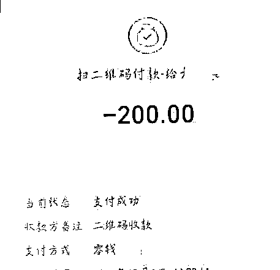
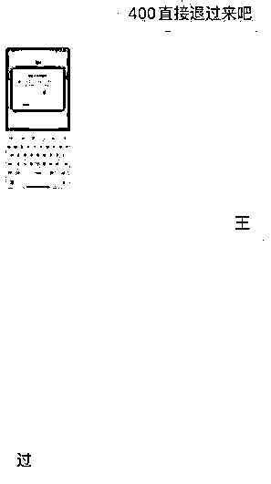

# 骗子崩溃了：我要报警！

> 原文：[`mp.weixin.qq.com/s?__biz=MzIyMDYwMTk0Mw==&mid=2247526208&idx=3&sn=f2e7b95437d5876b383ad81192d00a0c&chksm=97cbac78a0bc256ec79206be3b672ce0033d1a91ac4be41b6d13ea811f477e0b7e2cef29f237&scene=27#wechat_redirect`](http://mp.weixin.qq.com/s?__biz=MzIyMDYwMTk0Mw==&mid=2247526208&idx=3&sn=f2e7b95437d5876b383ad81192d00a0c&chksm=97cbac78a0bc256ec79206be3b672ce0033d1a91ac4be41b6d13ea811f477e0b7e2cef29f237&scene=27#wechat_redirect)

**“信不信我联系公安局，** 

**说你是我的同伙！”**

近日，大学毕业生小焦接到骗子电话后，经过一番不按套路的对话，彻底让骗子心态崩溃，对方不但开始骂人，一度还发出上述威胁。小焦对此表示：“我正准备考研，压力比较大，接完这个电话后把我逗够呛，感觉压力都减轻了。”

[`v.qq.com/iframe/preview.html?width=500&height=375&auto=0&vid=f3314khujof`](https://v.qq.com/iframe/preview.html?width=500&height=375&auto=0&vid=f3314khujof)

大学毕业生接到骗子电话

小焦在大连交通大学读完四年本科，目前正准备考研。12 月 16 日下午，小焦突然接到了一个来电显示为香港的电话，对方是一名男子，小焦感觉这个电话很可疑。

“首先这个电话是从香港打过来的，本身就很可疑，另外对方自称是支付宝的客服，大公司的客服人员怎么会连普通话都说不好，所以我感觉这是个骗子。”小焦说，当时他随手摁下了手机录音键，将整个通话过程录了下来。

打电话男子准确报出了小焦的个人及学校信息，并询问他大学期间是否开通支付宝账户，得到肯定的答案后，男子表示根据有关规定，当前支付宝学生账户已经禁止使用，必须要改为成人账户，否则会影响小焦的个人征信。

意识到对方是骗子后，小焦决定通过不按套路的说话方式，打乱骗子的节奏，让对方不耐烦，从而主动暴露一些问题。于是小焦没有正面回应骗子，而是反问对方，**“电话为什么是从香港打来的？”**

对此男子表示，“我们用的是网络插播电话，定位是随机的，你那边显示的是香港是吧？”“对，我这边显示是香港。”“好，先生，这个很正常，可以理解吗？”**“我不明白，蚂蚁金服的总部是设在香港还是设在哪里？”**小焦表示，他这么说完全是在戏弄对方。

**骗子：**

**“信不信我联系公安局，** 

**说你是我同伙”**

随后小焦又提出新的问题：“如果我不将支付宝学生账号撤销会怎么样呢？会耽误使用吗？”男子当即表示，如果不进行转换，会导致小焦的支付宝账户冻结，小焦当即表示：**“冻结太好了，我花呗还没有还完呢，冻结了是不是就不用还花呗了？”**

骗子一再强调不转换的严重性，但小焦不为所动，反而一个劲地追问对方：**“这样我的花呗是不是不用还了？”“会对我的征信有一些影响，会记录在哪里呢？”“我现在是学生账户，如果我考上研究生是否还是属于学生账户？”**

小焦的追问彻底让骗子不耐烦起来，他竟然开始说脏话“***（脏话），“你一天天问我这些，我要跟你怎么说，我也不知道，你***少说两句好不好。”此时骗子的心态彻底崩了，他开始破口大骂起来，说话也没有任何逻辑可言。

见对方语气开始歇斯底里，小焦不慌不忙地又给对方撒了一把盐，**“我就想问一下，你什么态度啊！”**心态已经崩溃的骗子竟然开始威胁小焦：**“你信不信我现在联系公安局，说你是我同伙，你信不信？”**随后小焦还和对方对飙了几句粤语，小焦说他是丹东人，根本不会粤语，当时配合骗子胡乱说了几句。之后在骗子的破口大骂声中，小焦结束了这次通话。

小焦表示，他最近正准备考研，压力特别大，没想到和骗子的一番对话将他逗得够呛，“感觉身上的压力都减轻了，想不到这种在段子里才可能出现的事情，竟然真的发生在我身上。”小焦说，他希望通过自己的经历给其他在校生或毕业生提个醒，以免再有人上当受骗，**“就想给大伙儿提个醒，即便电话那头说出了很多个人信息，大家也要多留个心眼儿，别轻易给电话那头的陌生人转账，其实有些骗术并不高明，大伙儿多加警觉就不会上当。”**

**近两年来**

****不少学生成为骗子的诈骗目标****

****遇到诈骗，请及时报警！****

**同学生活费被诈骗** 

**民警霸气喊话：“必须退！”**

****

**“我是睢宁县公安局反诈民警，**

**跟你讲，这个钱必须退了，**

**要不立马去找你！”**

**近日，江苏省徐州市睢宁县公安局李集派出所民警与骗子隔空喊话，硬核反诈，吓得骗子当天将诈骗款如数退还。**

 **[`mp.weixin.qq.com/mp/readtemplate?t=pages/video_player_tmpl&action=mpvideo&auto=0&vid=wxv_2183264572860628997`](https://mp.weixin.qq.com/mp/readtemplate?t=pages/video_player_tmpl&action=mpvideo&auto=0&vid=wxv_2183264572860628997)** 

**原来，一名学生好心借“同学”钱，没想到竟落入骗子圈套。**

**学生小王收到“同学”的一条 QQ 消息，对方表示想向其借钱，小王看到对方 QQ 头像、名字都与自己同学的一致，没有多想，就把微信里仅有的 200 元借给了对方。**

****

**▲受害者转账截图** 

**接着，对方又以需要密保为由要了小王的 QQ 账号、密码。殊不知，这个时候，小王的账号已经被盗取。**

**“叮叮”，小王的另一个不常用的 QQ 号收到了一条借款信息，借钱的不是别人，竟然是自己常用的那个 QQ 号。小王这才意识到自己的号被盗了，正被骗子用来诈骗，随即来到派出所报警。**

**通过大量工作，民警锁定诈骗分子身份，并向其喊话，成功将小王及另一名同学被骗的一共 400 元人民币，于当天追回。**

****

**目前，案件还在进一步办理中。**

**** 警方提醒 ****

****电信网络诈骗套路多****

****凡是涉及转账汇款的****

****千万注意留个心眼！****

****0****1********不轻信********遇有亲友使用邮件、信息、QQ、微信等网络社交方式求助的，无论不法分子使用什么花言巧语，都不要轻易相信，不给不法分子可乘之机，避免被进一步布设圈套。********0****2********不转账********绝不向陌生人汇款、转账。确实遇有特殊、紧急情况需要汇款的，在转账前要通过电话、语音、视频通话等方式，再三核实对方身份及转账账户，避免受骗。********0****3********速报警********万一上当受骗，请立即向公安机关报案。请保存好联系方式、聊天记录、转账记录等证据。****

**来源：中国警察网，昆明反电信网络诈骗中心**

****

**← 向右滑动与灰产圈互动交流 →**

****