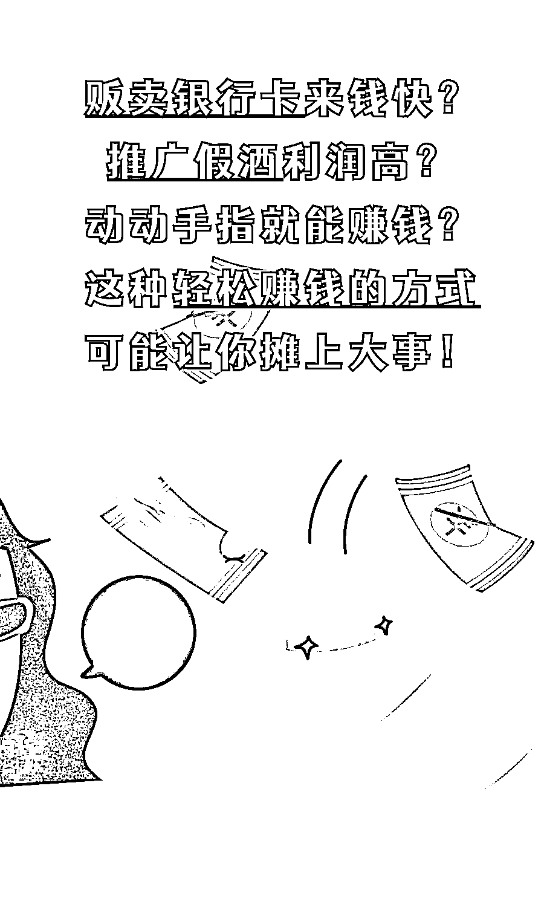
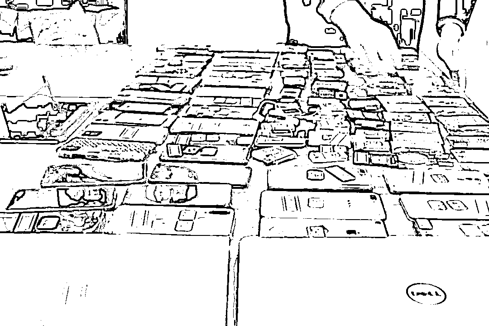
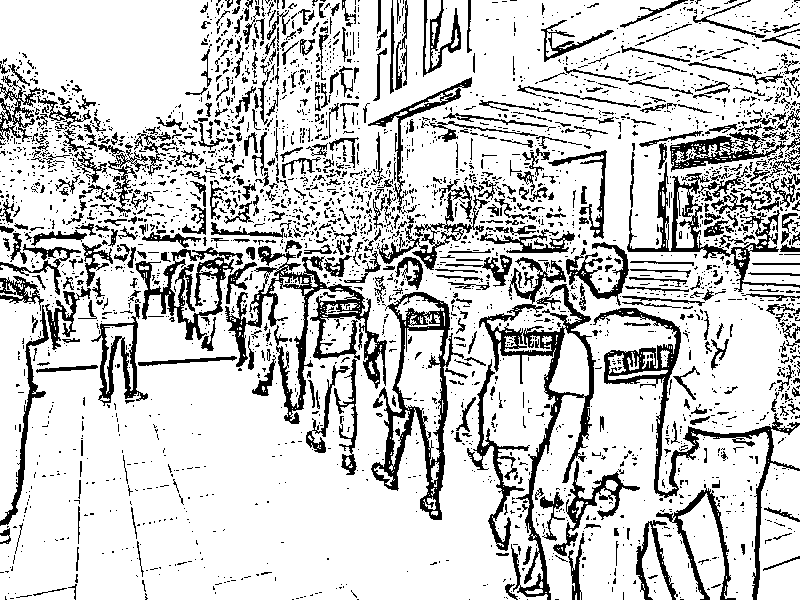
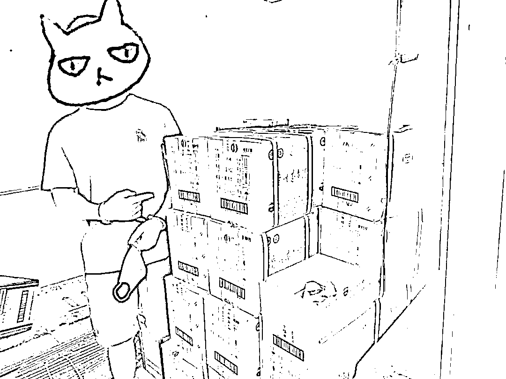
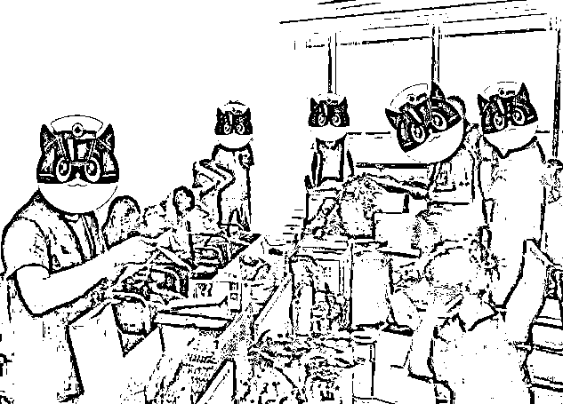
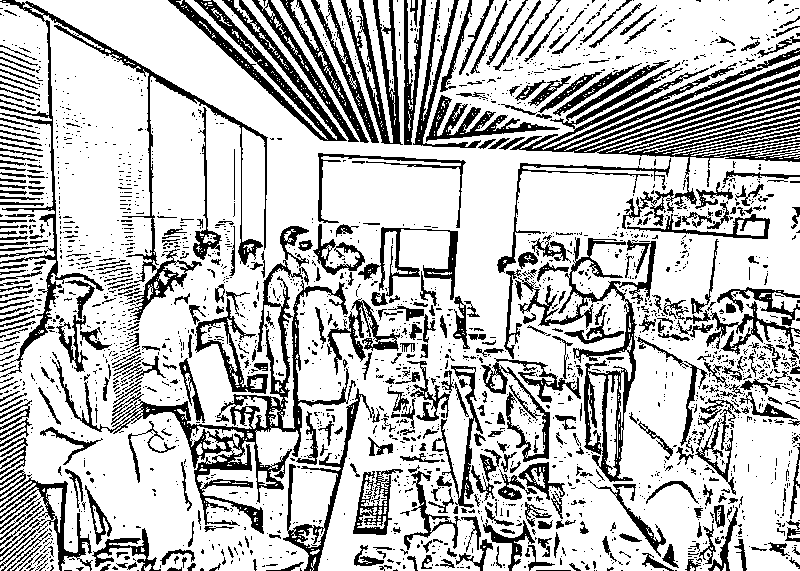
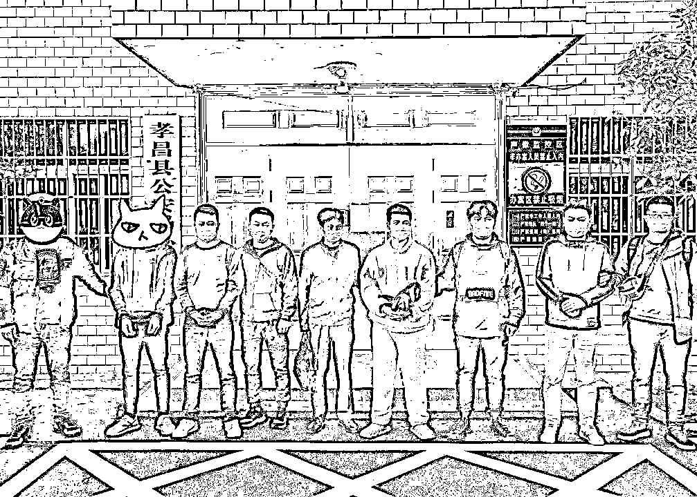
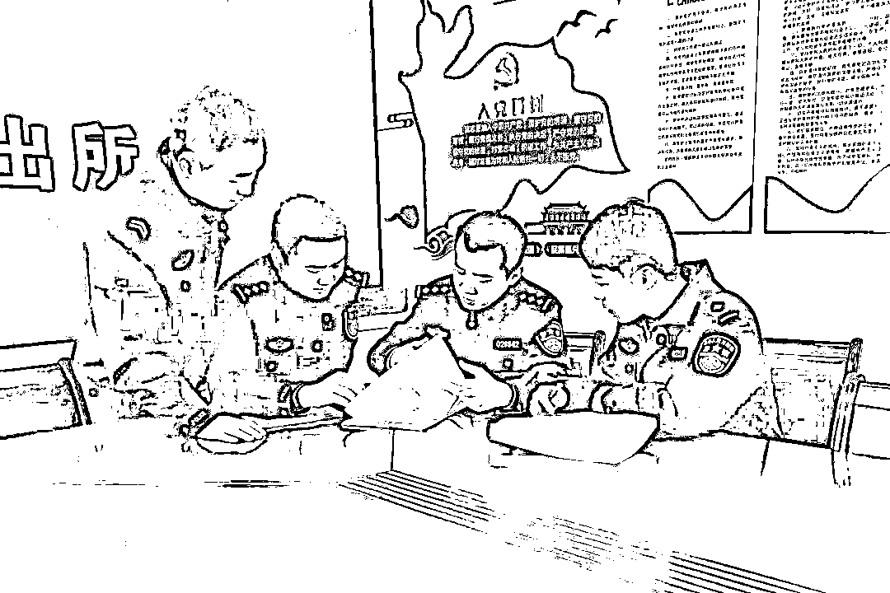
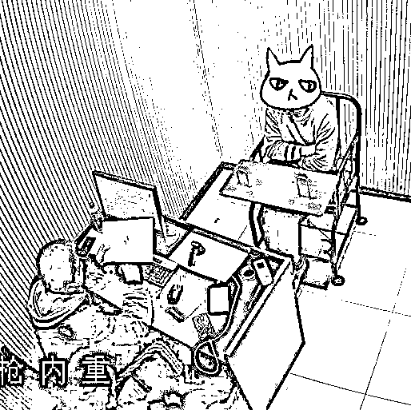

# 2 个月“爆刷”300000000……

> 原文：[`mp.weixin.qq.com/s?__biz=MzIyMDYwMTk0Mw==&mid=2247526208&idx=5&sn=2d0247f67637ead3a1f25d7197d11228&chksm=97cbac78a0bc256e2849a711103201590bc2c429f95c453963a49c33337c9fb68e41edc1e788&scene=27#wechat_redirect`](http://mp.weixin.qq.com/s?__biz=MzIyMDYwMTk0Mw==&mid=2247526208&idx=5&sn=2d0247f67637ead3a1f25d7197d11228&chksm=97cbac78a0bc256e2849a711103201590bc2c429f95c453963a49c33337c9fb68e41edc1e788&scene=27#wechat_redirect)

案例一

**涉案 3 亿元**

**28 人“跑分”团伙被抓**

2021 年 2 月，无锡新吴警方在日常接处警工作中，发现万某**银行卡账户资金流动异常**，且**银行卡使用人与卡主并不一致**。这背后极有可能隐藏着一个**“黑灰产”**犯罪集团。

[`mp.weixin.qq.com/mp/readtemplate?t=pages/video_player_tmpl&action=mpvideo&auto=0&vid=wxv_2187673464382226442`](https://mp.weixin.qq.com/mp/readtemplate?t=pages/video_player_tmpl&action=mpvideo&auto=0&vid=wxv_2187673464382226442)

经细致摸排、缜密侦查，一个专门为**境外电信网络诈骗和网络赌博犯罪分子****“跑分”**洗钱的团伙逐渐浮出水面。3 月 24 日下午，无锡新吴警方雷霆出击，在梁溪区某大厦内抓获孙某松等 8 名犯罪嫌疑人。随后，办案人员又进一步拓展线索、巡线追查，理清了一条**收卡、“跑分”的黑色产业链**，并远赴云南、广州等地抓获 20 余名收卖卡人员。

经审查，孙某交代，2021 年 1 月以来，其召集华某、潘某等人在网上发布信息，以支付酬金为诱饵，招揽低收入群体人员出售**本人银行卡、U 盾**等，再通过**聊天软件接受“跑分”洗钱任务**，通过手中的银行卡将**非法资金转入上游犯罪分子**的指定账户，从而赚取佣金。

民警对犯罪团伙使用的大量银行账目进行仔细梳理，发现单日资金流水金额约**300 万元**，总涉案金额高达**3 亿元**。目前，28 人均因涉嫌帮助信息网络犯罪活动被依法采取刑事强制措施。

案例二

**给假酒做推广**

**背后犯罪网络被一网打尽**

2021 年 4 月，无锡市公安局网安支队民警在网上巡查时发现，某门户**网站上推广的飞天茅台酒价格与市场上销售价明显不符**，有销售伪劣产品的嫌疑。经初步调查，该账户销售的茅台酒确为假酒，而其背后很可能是由多个犯罪团伙组成的犯罪网络，遂组成专案组对此线索开展侦查。

经 3 个月深度经营、循线追踪，专案组基本摸清了该犯罪网络的组织架构和人员构成，其中包括**制售假茅台酒团伙**和为其**提供广告推广**等服务的黑产推广团伙。7 月 31 日，警方陆续出动 60 多名警力，在湖北孝感、河南信阳、广东广州等 11 个省市，先后抓获何某、欧某等制售假团伙成员 14 人，毛某、钱某等黑产推广团伙成员 21 人。

经过调查，该黑产推广团伙先后在国内多个门户网站开设**100 余个账户**，在明知销售的商品为假冒伪劣产品的情况下，仍然帮助他人进行推广，涉案价值数百万元。目前，何某等人因涉嫌生产、销售假冒伪劣产品，毛某等人因涉嫌帮助信息网络犯罪活动均被依法采取刑事强制措施。

案例三

**网友带你“赚大钱”
结果成了诈骗的帮凶**

2021 年 11 月 25 日，无锡滨湖公安分局溪南派出所根据线索，在滨湖区、梁溪区等地先后抓获涉嫌帮助信息网络犯罪活动嫌疑人陈某、王某、杨某。

经审查，嫌疑人陈某供述，其在游戏中与网友张某结识，在一次聊天过程中，张某提出可以带他“赚大钱”，只需要将银行卡租借给对方，就可以得到佣金。陈某明知这是违法犯罪行为，但仍心存侥幸，将自己的银行卡租给了张某，同时在张某的教唆下，陈某又将朋友王某、田某拉入伙，3 人分别办理了共 10 余张银行卡，以每个月 600 元至 1200 元不等的价格租给张某。

经过研判，民警锁定了张某的真实身份，并于 11 月 29 日，在新吴区某小区门口将其抓获，当场查获银行卡**20 余张**。经调查，今年 6 月至 11 月期间，嫌疑人张某大量收购银行卡为境外诈骗团伙转移赃款，涉案金额数**十万元**。

目前，张某、陈某等 4 人均因涉嫌帮助信息网络犯罪活动被依法采取刑事强制措施。

友情提醒

帮助信息网络犯罪活动罪是指，**明知他人利用信息网络实施犯罪，为其犯罪提供互联网接入、服务器托管、网络存储、通讯传输等技术支持，或者提供广告推广、支付结算等帮助，**情节严重的，处三年以下有期徒刑或者拘役，并处或者单处罚金。

来源：无锡网警、江苏网警，巴蜀反诈

← 向右滑动与灰产圈互动交流 →

