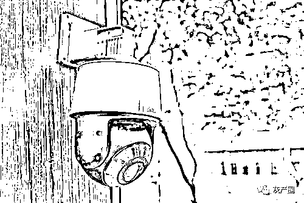

# 家里有摄像头的要小心！你可能正在被“现场直播”→

> 原文：[`mp.weixin.qq.com/s?__biz=MzIyMDYwMTk0Mw==&mid=2247526208&idx=6&sn=7cc8ca72bc01ecdfe0f4d8e0bf72cc6b&chksm=97cbac78a0bc256eca736864fe3237b29819a49248f592ff8989faec72d36efd37c4879f01be&scene=27#wechat_redirect`](http://mp.weixin.qq.com/s?__biz=MzIyMDYwMTk0Mw==&mid=2247526208&idx=6&sn=7cc8ca72bc01ecdfe0f4d8e0bf72cc6b&chksm=97cbac78a0bc256eca736864fe3237b29819a49248f592ff8989faec72d36efd37c4879f01be&scene=27#wechat_redirect)

花上一两百块钱就能获得几十个摄像头的 ID 并收看这些摄像头所录制的内容。记者调查发现，一些社交媒体群组竟然把家庭摄像头记录的隐私视频广泛传播，并以此牟利。近日，多地警方破获黑客非法控制家用摄像头案件。那么，装在家里的摄像头是怎么被人控制的？这些非法破解摄像头的偷窥黑产又该如何铲除和防范呢？

隐私视频被广泛传播多地警方破获黑客非法控制摄像头案件

一款普通的家用摄像头背后，可能隐藏的是非法入侵家用摄像头并传播、售卖隐私视频的黑色产业链。这些隐私视频已经在互联网平台广泛传播，而这些被偷拍的人却毫不知情。除了视频成品，家用摄像头的控制权限也被公开售卖。

四川省射洪市警方近日通报了一起案件，从 2021 年 10 月起，嫌疑人张某某先后两次**购买了 100 多个摄像头控制权限，经常在夜晚登录偷窥**。警方在其手机里发现非法下载存储的公民隐私视频 40 多条。张某某所控制的摄像头涉及范围广泛，**包含家庭、公司、茶楼、手机店、美容院等多类场所**。目前案件正在进一步办理当中。

江苏泰州警方近日也破获了一起非法控制计算机信息系统案，抓获犯罪嫌疑人 34 名，查获**非法控制的网络摄像头账号 8600 多个**。泰州市公安局民警徐广军介绍，经侦查，犯罪嫌疑人使用几款非法软件，分析出了很多安全级别不高的摄像头、设备号、用户名和密码。

网络安全业内人士向记者介绍，智能摄像头通过联网实现远程监控的功能，**当摄像头的 ID 和密码信息被泄漏，也就意味着摄像头的控制权已经交给了别人**。“很多摄像头在出厂的时候，默认密码比较简单，所以很多黑客或者是黑产从业者，他知道默认的密码，就会尝试在网络上连接这些摄像头。”

购买他人摄像头使用权限的行为是否违法?如何避免摄像头被非法偷窥？

摄像头偷窥黑产各环节人员，为逃避监管打击，经常运用虚假账号、跳板 IP 地址、他人电话卡银行卡等方式隐匿身份。目前，这些行为都已得到有效遏制。

2021 年以来，中央网信办会同工信部、公安部、市场监管总局深入推进摄像头偷窥等黑产集中治理工作，对非法利用摄像头偷窥个人隐私画面、交易隐私视频、传授偷窥偷拍技术等侵害公民个人隐私行为进行集中治理。中央网信办指导各地各平台共处置涉摄像头偷窥黑产有害信息 3 万余条，处置涉违法交易、传播有害内容的账号 5600 余个；督促下架“隐秘相机”“隐形拍拍”等偷窥偷拍类 App；约谈电商平台督促其下架微型摄像头等偷窥设备。

售卖家用摄像头 ID、售卖偷拍视频显然是违法的，那么一些人抱有侥幸心理，购买他人家庭摄像头使用权限的行为是否违法呢？

北京康达律师事务所律师韩骁分析，购买者购买摄像头破解程序、摄像头权限并使用，侵犯他人个人隐私的，将受到民事处罚，情节严重的，可能涉嫌触犯侵犯公民个人信息罪和非法控制计算机信息系统罪。

个人应当如何避免摄像头被非法偷窥？国家互联网应急中心高级工程师刘中金建议：

一是通过正规渠道，购买大品牌、通过网络安全认证的摄像头，避免被植入后门；

二是购买的摄像头不要朝向敏感区域；

三是对摄像头的默认口令进行修改，修改成复杂口令，换成强密码；

四是对摄像头的固件以及 App 保持常态化更新。

来源：央视新闻，长沙晚报

← 向右滑动与灰产圈互动交流 →

