# “你把毒药喝了，我就道歉”

> 原文：[`mp.weixin.qq.com/s?__biz=MzIyMDYwMTk0Mw==&mid=2247526266&idx=1&sn=7e303ad5be01907545ecb45266ccc6d6&chksm=97cbac42a0bc255452ba659b8ffbc900ef89509a8e8f243ef0448a075ee0c1cd327469496709&scene=27#wechat_redirect`](http://mp.weixin.qq.com/s?__biz=MzIyMDYwMTk0Mw==&mid=2247526266&idx=1&sn=7e303ad5be01907545ecb45266ccc6d6&chksm=97cbac42a0bc255452ba659b8ffbc900ef89509a8e8f243ef0448a075ee0c1cd327469496709&scene=27#wechat_redirect)

近日，陕西西安。大三学生程橙（化名）的母亲告诉澎湃新闻，女儿多次讨要租房押金未果，12 月 12 日，在出租屋喝农药身亡，此前诊断出双向障碍。其母称，事发后，房东仍发送短信给程橙。

[`mp.weixin.qq.com/mp/readtemplate?t=pages/video_player_tmpl&action=mpvideo&auto=0&vid=wxv_2190169763815964674`](https://mp.weixin.qq.com/mp/readtemplate?t=pages/video_player_tmpl&action=mpvideo&auto=0&vid=wxv_2190169763815964674)

澎湃新闻记者：高亮 编辑：唐燕丽 素材来源：相关人士 责任编辑：周琦 校对：张艳

近日 

大三女生程橙（化名）

多次讨要租房押金未果

在出租屋喝农药身亡

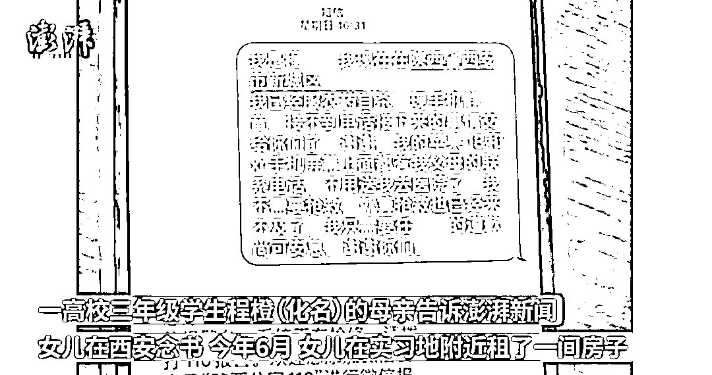

其母亲告诉澎湃新闻 

程橙在西安读书

今年 6 月 

程橙在实习地租了间房

10 月底 

因女儿情绪不佳

便将她接回家中

医院诊断为轻度抑郁症

 等程橙再次前往租住房子时

发现房东已将房间租给第三者

程橙遂要求房东退回押金 3000 元

但房东拒绝退还押金 

还辱骂程橙

“骂的难听得很”

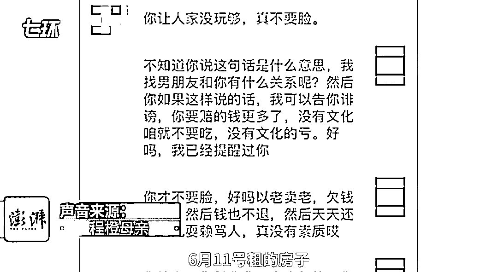

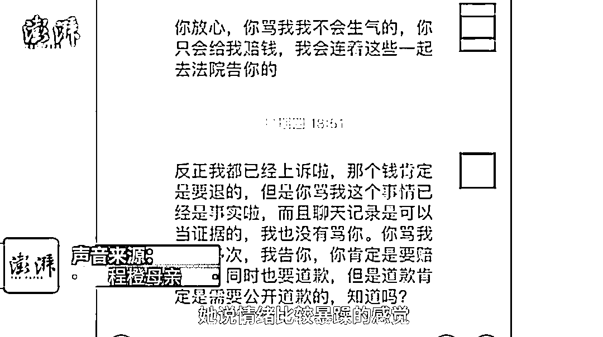

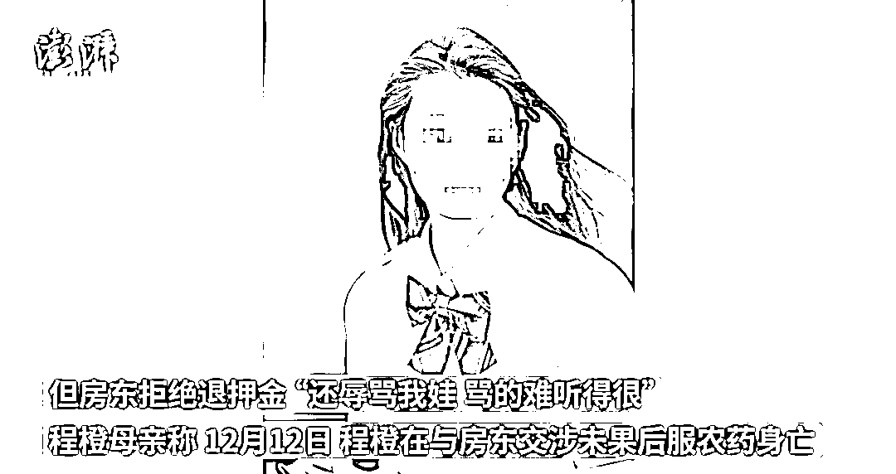

其母亲称 

12 月 12 日 

程橙在与房东交涉未果后

服农药身亡

还告诉记者 

“房东一直没有出面 

打电话他都拉黑了” 

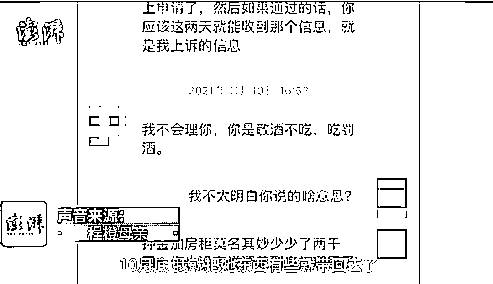

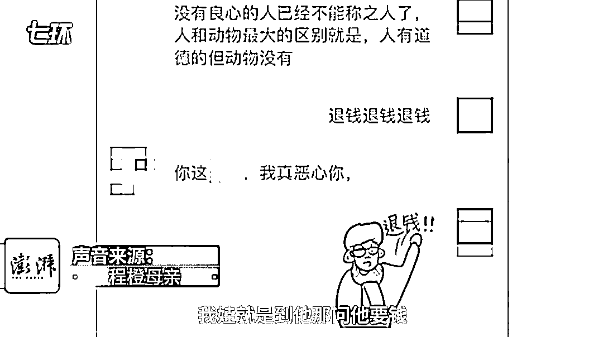

还补充

房东一直在侮辱骂程橙 

程橙就带着农药直接到他家去

房东没有理会她 

并对她说 

“你把药喝了 

就跟你道歉”

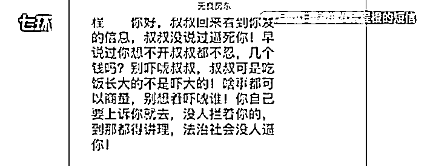

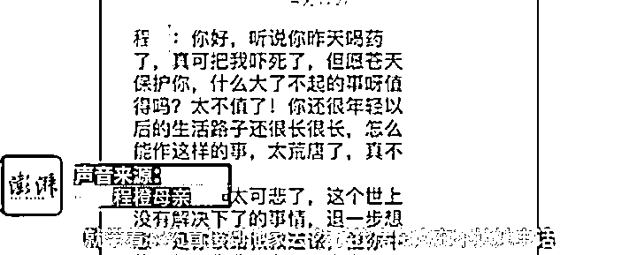

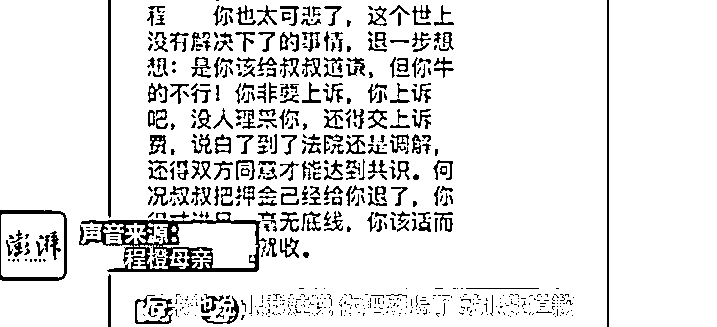

程橙母亲称

她女儿喝完了一瓶药

“我娃都死了 

房东还在给我娃发消息”

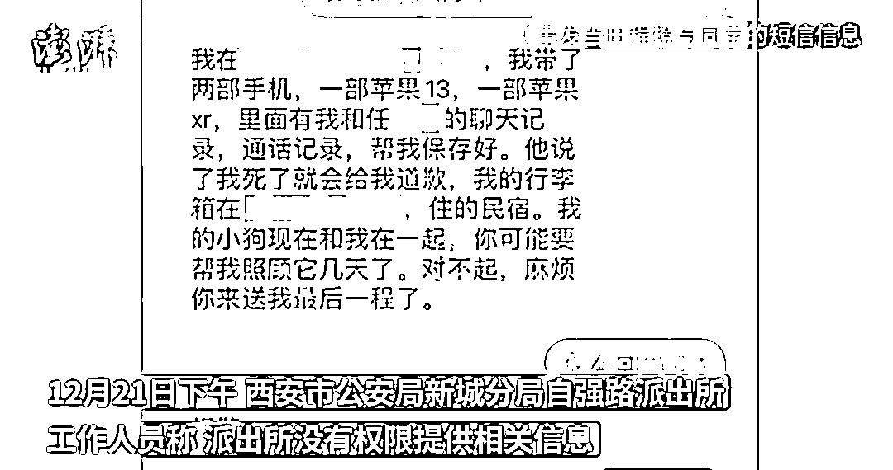

21 日下午 

当地派出所工作人员称 

他们没有权限提供相关信息 

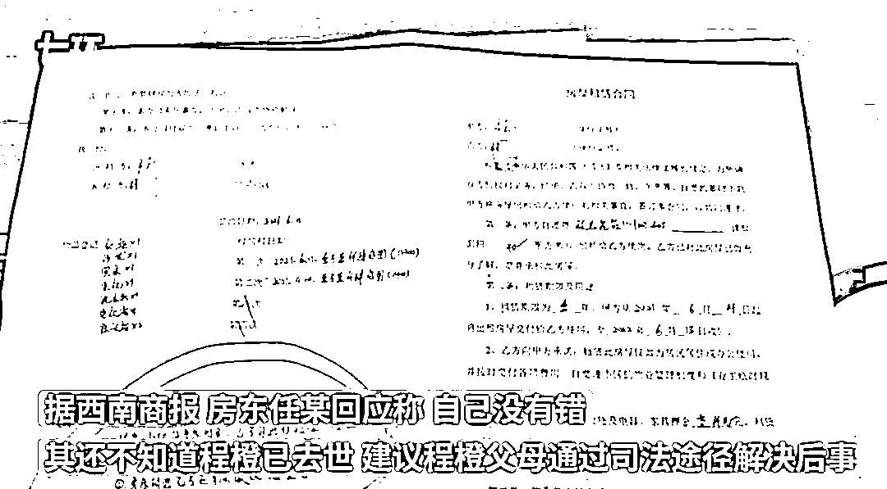

据西南商报 

房东回应称： 

自己没有错

不知道程橙已去世 

建议其父母通过司法途径解决后事

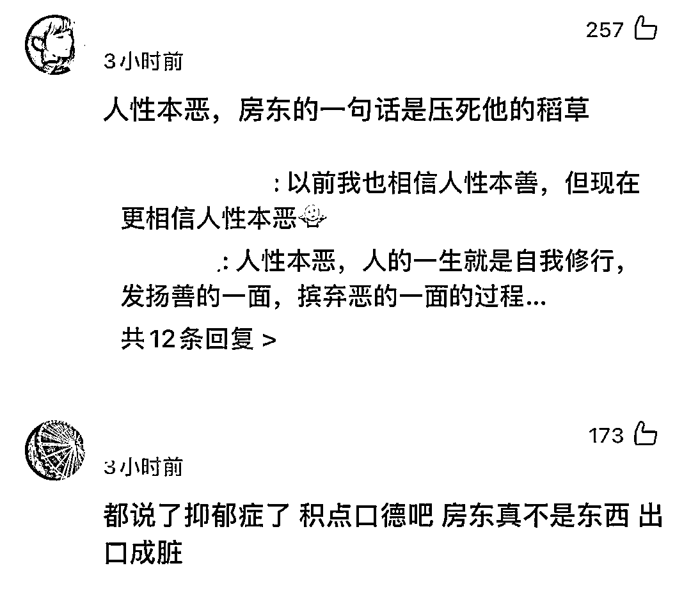

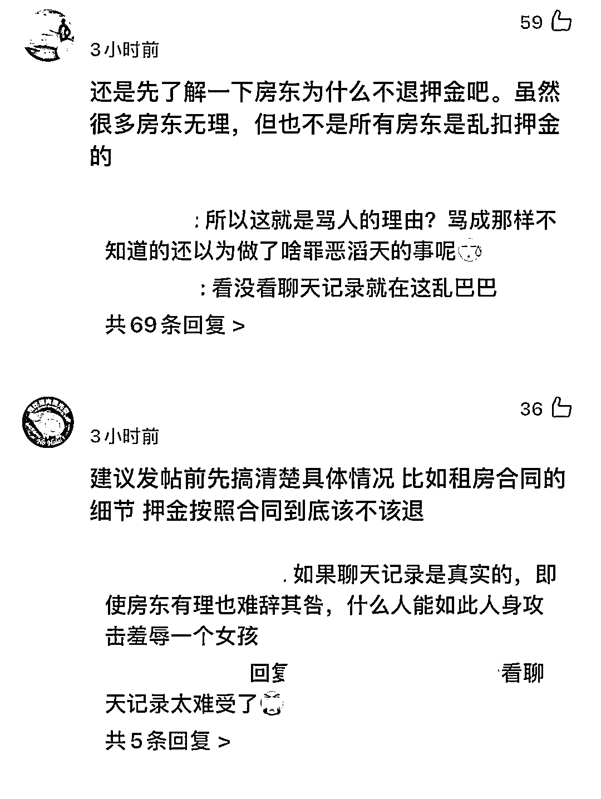

来源:综合高亮/澎湃新闻、西南商报、网友评论等

← 向右滑动与灰产圈互动交流 →

