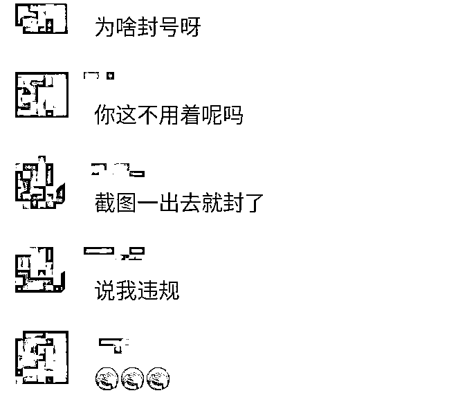

# 在柬华人微信实名也大面积被封！该如何“避雷”？

> 原文：[`mp.weixin.qq.com/s?__biz=MzIyMDYwMTk0Mw==&mid=2247526266&idx=2&sn=cbb40fe2807f501b92455ed923cb6e3e&chksm=97cbac42a0bc2554fe076635a56b7da71e9baa657e5f1f03059c6be1a7d3688b5530c85d8032&scene=27#wechat_redirect`](http://mp.weixin.qq.com/s?__biz=MzIyMDYwMTk0Mw==&mid=2247526266&idx=2&sn=cbb40fe2807f501b92455ed923cb6e3e&chksm=97cbac42a0bc2554fe076635a56b7da71e9baa657e5f1f03059c6be1a7d3688b5530c85d8032&scene=27#wechat_redirect)

在柬埔寨没搞电信诈骗、网络赌博，正常使用的实名制微信号也被封，你们遇到这种情况吗？ 

最近，有网友陆续向柬埔寨头条反馈，正常使用多年的实名制微信号突然莫名其妙被封，时长有一天，也有十五天。

一些人被封号后只能查看消息、无法回复对方，连微信朋友圈都发不了，而且解封流程十分麻烦， 给生活、工作带来巨大的困扰。

**在柬华人实名制微信号大面积被封**

一名朋友说，近来身边有七八位朋友接连被封号，他们的微信号都是使用多年的老号，而且都是实名制的。

平常也只是通过微信与家人朋友联系、偶尔与同事进行工作交流，并非一些营销微信号，也没有发表任何不当言论，然而刚被拉进微信群就被封了。

”被封号后，虽然仍然可以私聊好友，但是不能参与群聊、不能发朋友圈；自己以前发布的朋友圈内容也处于对全部好友屏蔽的状态，这样很容易误导好友以为我把他们屏蔽、删了或拉黑了，如果不及时告诉好友真相，很容易被微信这波骚操作分裂感情。

最重要的是，被限制群聊功能，对工作群、客户对接、生活也带来诸多不便”，朋友补充道。

值得注意的是，此前柬埔寨一些没有实名制的微信号经常被封号，近期即便是实名制的微信号也遇到这种情况，而且封号原因五花八门。

**进群或拉人进群被封**

有网友称，他两个微信号经常被封，有时被好友拉进微信群、或者拉人进去微信群就立即被封了。

另外一人自曝也是因为进群，被微信平台检查到随后被封号半个月，简直有毒。一旦被封，恢复群聊功还得需要一段时间。

**群内发表言论无故被封**

目前，微信对于在群内发表言论控制也越来越严格，可能一句你觉得并不存在任何不当思想或诱导性的话，也会遭无辜封号。

由于微信管控严格，一位群友遭封号 1 天，导致群里其他人都不敢随意讨论，尤其是与政治、宗教相关的话题，生怕“踩雷”，被腾讯关“小黑屋”。

**发截图被封、发二维码被警告**

另一名群友指出，此前他在群里发布一个截图后，微信就被封了。

其他群友表示，在群里发布二维码也会收到平台警告，QQ 和邮箱均被关闭，吓得他再也不敢随意分享图片和在群里发红包。

从网友们微信被封的几种情况不难看出，最近不少在柬埔寨的中国人经常被封号，微信群使用限制不断增加，即便是实名制的微信号，如系统检测到你的账号稍稍有点问题也会被封，原因也越来越“离谱”。

身在柬埔寨，无论在生活还是工作方面，微信群都起着重要作用。它不仅方便企业及员工更好的进行工作，也为所有在柬同胞提供了一个信息共享、沟通交流、消遣时间，拉近彼此距离的窗口，如果不小心被封号半个月甚至一个月，对大家的工作生活将带来许多影响。

微信被封，轻则警告，重则升级惩罚永久封号。避免大家被“永久关闭小黑屋”，小编总结微信被封的几个原因，在柬同胞可以了解一些，以便在使用微信时尽量注意“避雷”。

**微信被封的原因有哪些？**

**同胞如何“避雷"?**

自下半年来，在柬中国人的微信频繁被封，该现象与国内一些整顿措施紧密关联。

一方面，“净网行动”促使微信管控越来越严格。据全国“扫黄打非”工作小组 6 月份消息，为促进网络环境更加积极健康发展，该工作小组作出安排，中央宣传部、中央网信办、工业和信息化部、公安部、文化和旅游部、国家广播电视总局等多部门开展“净网集中行动”，专项整治网上有害信息和不良内容，弘扬网络正能量。

涉黄涉非、涉低俗、涉历史虚无主义等有害信息为重点整治对象，此外深度清理有悖社会主义核心价值观的网络内容，以营造良好的网络环境。

基于严格的管控，即便是普通用户，若在微信群里发布敏感言论、图片也容易遭举报，被列为不良内容，一旦被发现蛛丝马迹就很容易被封微信。

此外，账户间频繁切换登陆、频繁加好友、在群里频繁拉人和发布链接，刷屏等也容易被列为诱导、骚扰、虚假营销、欺诈等违规行为。

其次，东南亚电信诈骗重灾区之一，身处柬埔寨的境外人员属于自然也成为重点监控的对象。特别是境外登陆异常、没有实名制的微信账户会很容易死翘翘。

对于普通用户很难判断微信一些使用规范，所以要更加小心翼翼，使用微信的时候一定要注意，避免违规面临永久封号风险。

据微信被封的网友表示，解封是个麻烦事儿。如果不小心被封，也只能根据微信平台提供的解决方案或咨询客服，进行操作解封，还得花很长时间等待平台审核。

来源：柬埔寨头条

← 向右滑动与灰产圈互动交流 →

